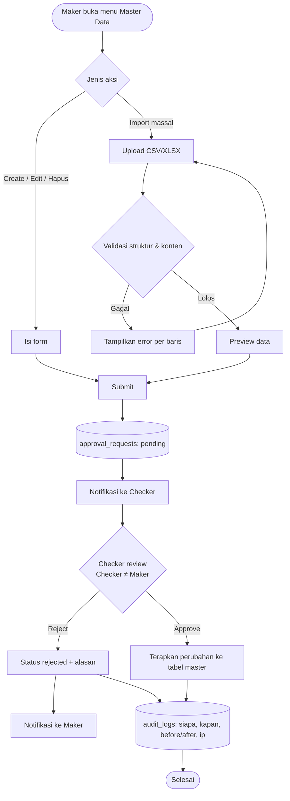
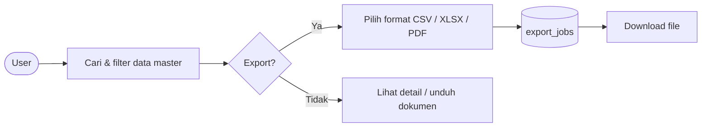

# Feature Flow — Manajemen Vendor & Master Data

Sumber: URS v0.3 Phase 1 · To-be §1 "Manajemen Vendor & Master Data"
Modul: `internal/vendor`, `internal/vendorpic`, `internal/vault`, `internal/location`, `internal/atm`, `internal/assignment`, `internal/approval`, `internal/audit`, `internal/export`

## Cakupan data
- **Vendor**: identitas legal, status aktif/non-aktif, NPWP, kontak notifikasi (PIC)
- **Vault vendor**: alamat, koordinat (opsional), jam operasional, kapasitas, kategori (ATM / Cash)
- **PIC vendor**: nama, jabatan, no. kontak, email
- **Kelolaan**: vendor → mesin ATM dan/atau cabang/nasabah (lokasi, kapasitas)

## Flow: perubahan master data (maker-checker)

## Flow: pencarian & export

## Catatan / open questions
- Hapus = soft-delete (`is_active=false` + `deleted_at`), sesuai pola admin CRUD yang sudah ada.
- Field kelolaan cabang/nasabah belum ada di tabel `vendor_assignments` — perlu dicek.
