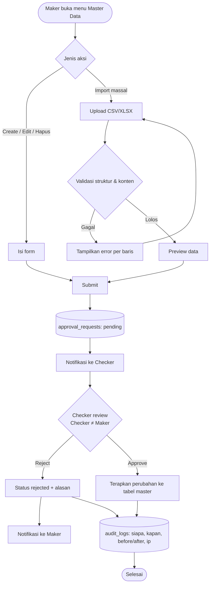
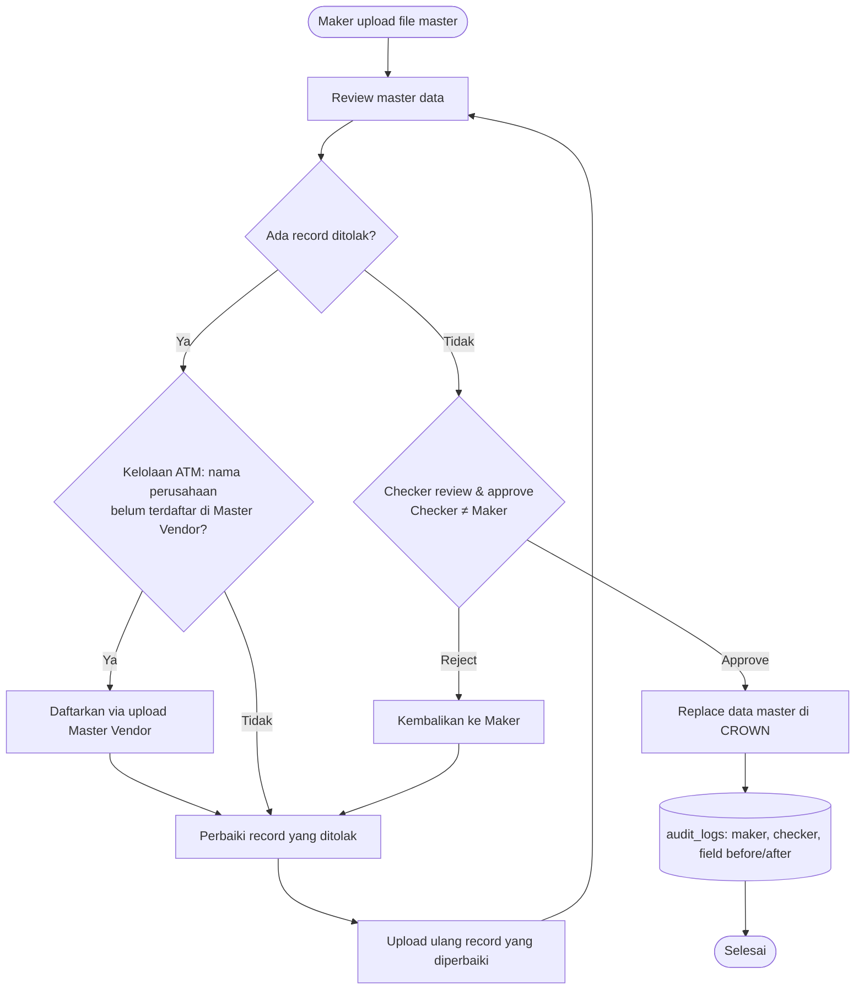
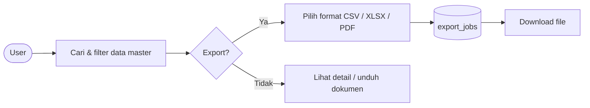

# Feature Flow — Manajemen Vendor & Master Data

Sumber: URS v0.3 Phase 1 · To-be §1 "Manajemen Vendor & Master Data"
Modul: `internal/vendor`, `internal/vendorpic`, `internal/vault`, `internal/location`, `internal/atm`, `internal/assignment`, `internal/approval`, `internal/audit`, `internal/export`

## Cakupan data
- **Vendor**: identitas legal, status aktif/non-aktif, NPWP, kontak notifikasi (PIC)
- **Vault vendor**: alamat, koordinat (opsional), jam operasional, kapasitas, kategori (ATM / Cash)
- **PIC vendor**: nama, jabatan, no. kontak, email
- **Kelolaan**: vendor → mesin ATM dan/atau cabang/nasabah (lokasi, kapasitas)

## Flow: perubahan master data (maker-checker)

```mermaid
flowchart TD
    A([Maker buka menu Master Data]) --> B{Jenis aksi}
    B -->|Create / Edit / Hapus| C[Isi form]
    B -->|Import massal| D[Upload CSV/XLSX]
    D --> E{Validasi struktur & konten}
    E -->|Gagal| E1[Tampilkan error per baris] --> D
    E -->|Lolos| F[Preview data]
    C --> G[Submit]
    F --> G
    G --> H[(approval_requests: pending)]
    H --> I[Notifikasi ke Checker]
    I --> J{Checker review<br/>Checker ≠ Maker}
    J -->|Reject| K[Status rejected + alasan] --> L[Notifikasi ke Maker]
    J -->|Approve| M[Terapkan perubahan ke tabel master]
    M --> N[(audit_logs: siapa, kapan, before/after, ip)]
    K --> N
    N --> O([Selesai])
```

## Flow: upload master (FSD v1.0 — target, belum diimplementasi)

Sumber: FSD "DSR End To End Cash Management" v1.0 — Upload Master Vendor & Master Kelolaan ATM (diputuskan 2026-10-01). Upload **mengganti** seluruh data master lama (bukan upsert). Kode saat ini masih upsert + all-or-nothing (CLAUDE.md Sec 12 D1/D2).

```mermaid
flowchart TD
    A([Maker upload file master]) --> B[Review master data]
    B --> C{Ada record ditolak?}
    C -->|Ya| D{Kelolaan ATM: nama perusahaan<br/>belum terdaftar di Master Vendor?}
    D -->|Ya| D1[Daftarkan via upload Master Vendor] --> E
    D -->|Tidak| E[Perbaiki record yang ditolak]
    E --> F[Upload ulang record yang diperbaiki] --> B
    C -->|Tidak| G{Checker review & approve<br/>Checker ≠ Maker}
    G -->|Reject| H[Kembalikan ke Maker] --> E
    G -->|Approve| I[Replace data master di CROWN]
    I --> J[(audit_logs: maker, checker, field before/after)]
    J --> K([Selesai])
```

Open questions: nasib baris yang tidak ada di file (soft-disable? bagaimana jika masih direferensikan assignment aktif); record perbaikan digabung ke batch pending atau batch baru.

## Flow: pencarian & export

```mermaid
flowchart LR
    A([User]) --> B[Cari & filter data master]
    B --> C{Export?}
    C -->|Ya| D[Pilih format CSV / XLSX / PDF]
    D --> E[(export_jobs)] --> F[Download file]
    C -->|Tidak| G[Lihat detail / unduh dokumen]
```

## Catatan / open questions
- Hapus = soft-delete (`is_active=false` + `deleted_at`), sesuai pola admin CRUD yang sudah ada.
- Field kelolaan cabang/nasabah belum ada di tabel `vendor_assignments` — perlu dicek.
