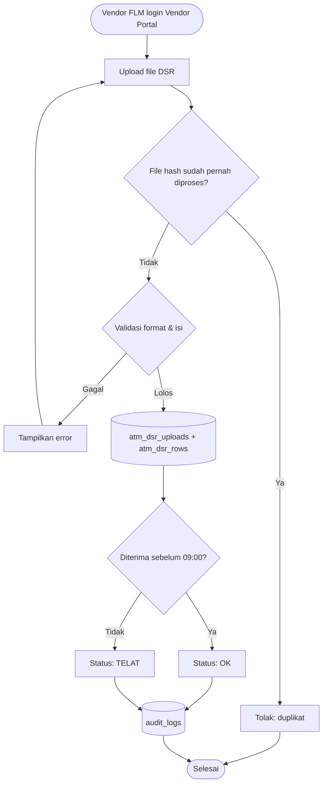
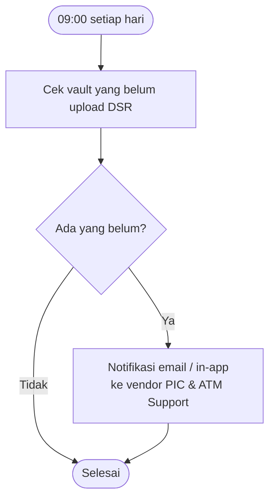
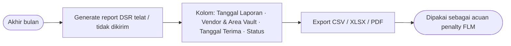

# Feature Flow — Upload DSR Harian & Rekap Keterlambatan

Sumber: URS v0.3 Phase 1 · ATM Cash Forecasting §2 "Pengelolaan Data Pendukung" · FNC 001, FNC 003
Modul: `internal/dsr`, `internal/notification`, `internal/export`

## Aturan
- DSR = laporan saldo fisik di vault/kantor FLM, wajib upload **setiap hari sebelum 09:00**.
- Upload idempotent per file hash (`import_jobs`).
- Target NFR: upload ≤ 30 detik/dokumen.
- Akhir bulan: report DSR telat/tidak dikirim per vendor → dasar penalty FLM.

## Flow: upload DSR harian

## Flow: monitoring & notifikasi keterlambatan

## Flow: rekap bulanan (dasar penalty)

## Catatan / open questions
- "Tanggal Laporan" = tanggal posisi DSR, bukan tanggal kirim.
- Apakah hari libur/weekend mengubah deadline 09:00? (contoh URS: laporan Jumat diterima Sabtu 08:28 = OK, diterima Senin 13:03 = TELAT)
