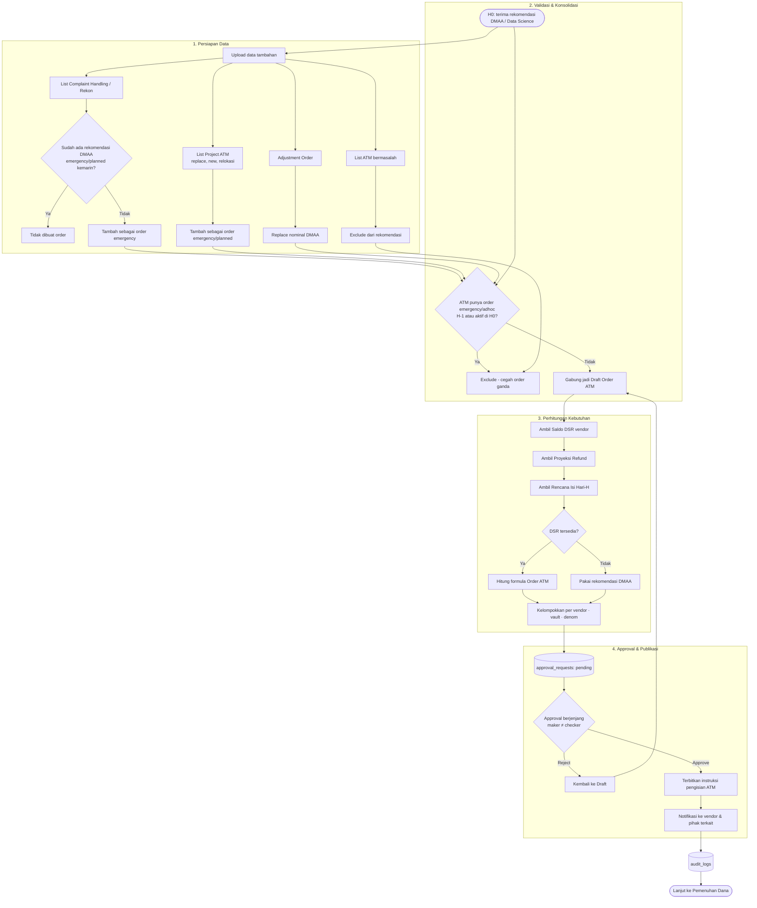

# Feature Flow — ATM Cash Forecasting Harian (Order ATM)

Sumber: URS v0.3 Phase 1 · To-be "ATM Cash Forecasting Harian" · FNC 001
Modul: `internal/forecast`, `internal/replenishment`, `internal/dsr`, `internal/approval`, `internal/notification`

## Formula
```
Order ATM = (Saldo DSR + Proyeksi Refund) − (Rekomendasi DMAA + Rencana Isi Hari-H)
```
- Proyeksi Refund per ID = opening balance H − transaksi prediksi H & H+1
- Rencana Isi Hari-H = order hari sebelumnya yang diisi pada hari H (pengurang saldo fisik FLM)
- DSR tidak ada tapi ada rekomendasi DMAA → hitung dari rekomendasi DMAA saja
- ⚠️ URS masih bertanya: "apakah rumus ini masih valid?" — perlu konfirmasi bisnis

## Flow: end-to-end



## Catatan / open questions
- Berapa level "approval berjenjang"? (URS hanya menyebut berjenjang)
- Uang disimpan sebagai numeric/minor unit, IDR eksplisit.
