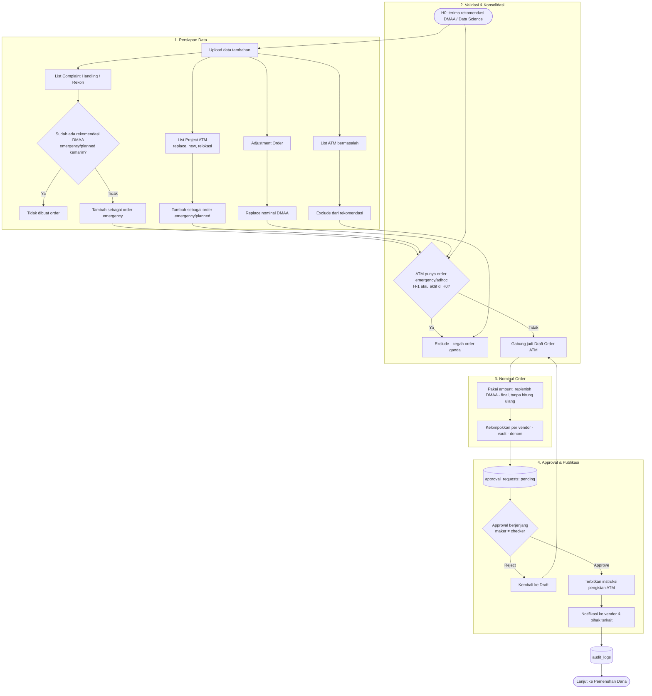

# Feature Flow — ATM Cash Forecasting Harian (Order ATM)

Sumber: URS v0.3 Phase 1 · To-be "ATM Cash Forecasting Harian" · FNC 001
Modul: `backend_python/dmaa/dmaa_etl.py` (ingest DMAA), vendor request / `internal/replenishment`, `internal/dsr`, `internal/approval`, `internal/notification`

## Order amount (diputuskan 2026-10-08)
- **CROWN tidak menghitung forecast.** Angka order = `amount_replenish` dari file DMAA (`Order_All_*.xlsx` → `dmaa_etl.py` → `dmaa_atm_forecast`), **sudah final**.
- Rumus FSD `Forecast Amount − Saldo DSR + Forecast Refund` (2026-10-01) **tidak dipakai** di CROWN.
- Refund: dikirim DMAA nanti; sampai itu `amount_refund = 0`.
- Exclude ATM bermasalah + list input FSD (complaint/project/problem/adjustment) tetap tugas CROWN (Phase 2.4, belum dibangun).

## Flow: end-to-end

```mermaid
flowchart TD
    A([H0: terima rekomendasi DMAA / Data Science]) --> B[Upload data tambahan]

    subgraph PREP[1. Persiapan Data]
        B --> B1[List Complaint Handling / Rekon]
        B --> B2[List Project ATM<br/>replace, new, relokasi]
        B --> B3[List ATM bermasalah]
        B --> B4[Adjustment Order]
        B1 --> C1{Sudah ada rekomendasi DMAA<br/>emergency/planned kemarin?}
        C1 -->|Ya| C1a[Tidak dibuat order]
        C1 -->|Tidak| C1b[Tambah sebagai order emergency]
        B2 --> C2[Tambah sebagai order emergency/planned]
        B3 --> C3[Exclude dari rekomendasi]
        B4 --> C4[Replace nominal DMAA]
    end

    subgraph VAL[2. Validasi & Konsolidasi]
        C1b --> D{ATM punya order emergency/adhoc<br/>H-1 atau aktif di H0?}
        C2 --> D
        C4 --> D
        A --> D
        D -->|Ya| D1[Exclude - cegah order ganda]
        D -->|Tidak| E[Gabung jadi Draft Order ATM]
        C3 --> D1
    end

    subgraph CALC[3. Nominal Order]
        E --> J[Pakai amount_replenish DMAA - final, tanpa hitung ulang]
        J --> L[Kelompokkan per vendor · vault · denom]
    end

    subgraph APPR[4. Approval & Publikasi]
        L --> M[(approval_requests: pending)]
        M --> N{Approval berjenjang<br/>maker ≠ checker}
        N -->|Reject| N1[Kembali ke Draft] --> E
        N -->|Approve| O[Terbitkan instruksi pengisian ATM]
        O --> P[Notifikasi ke vendor & pihak terkait]
    end

    P --> Q[(audit_logs)]
    Q --> R([Lanjut ke Pemenuhan Dana])
```

## Catatan / open questions
- Berapa level "approval berjenjang"? (URS hanya menyebut berjenjang)
- Uang disimpan sebagai numeric/minor unit, IDR eksplisit.
