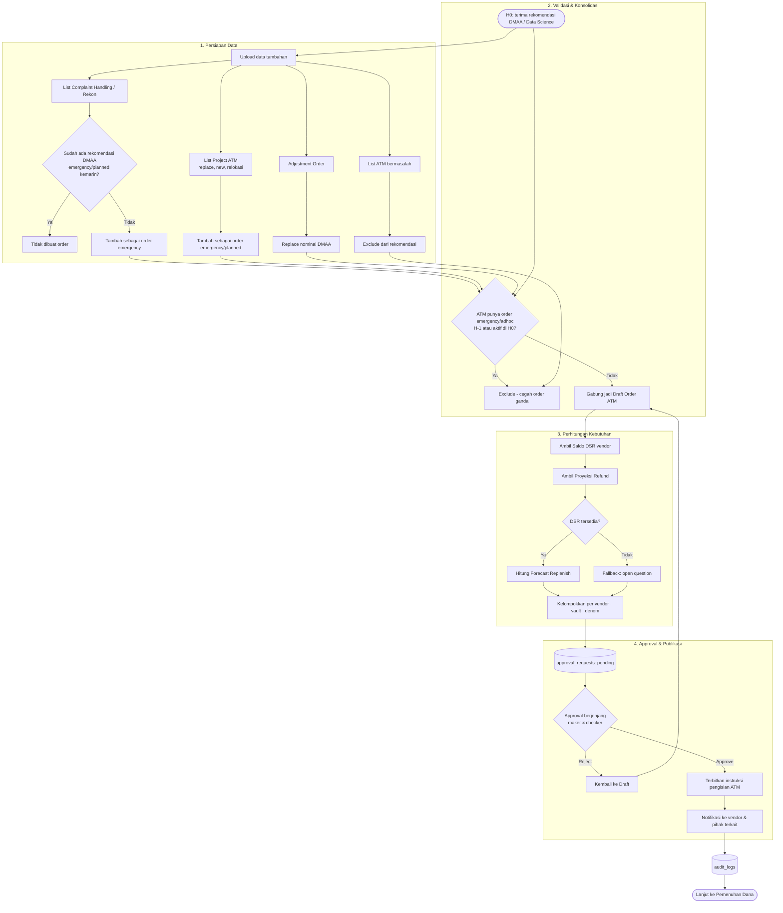

# Feature Flow — ATM Cash Forecasting Harian (Order ATM)

Sumber: URS v0.3 Phase 1 · To-be "ATM Cash Forecasting Harian" · FNC 001
Modul: `internal/forecast`, `internal/replenishment`, `internal/dsr`, `internal/approval`, `internal/notification`

## Formula
```
Forecast Replenish = Forecast Amount − Saldo DSR + Forecast Refund
```
- Sumber: FSD "DSR End To End Cash Management" v1.0 — menggantikan rumus URS (diputuskan 2026-10-01)
- Forecast Amount = hasil forecast EDP/DMAA (siap 06:00); Saldo DSR = upload vendor 06:30–09:00; hitung 09:30–10:00
- Forecast Refund per ID = opening balance H − transaksi prediksi H & H+1
- Rencana Isi Hari-H tidak lagi dipakai di rumus
- ⚠️ Open question: fallback jika DSR tidak ada/telat belum didefinisikan FSD

## Flow: end-to-end


```mermaid
flowchart TD
    A([H0: terima rekomendasi DMAA / Data Science]) --> B[Upload data tambahan]

    subgraph PREP[1. Persiapan Data]
        B --> B1[List Complaint Handling / Rekon]
        B --> B2[List Project ATM<br/>replace, new, relokasi]
        B --> B3[List ATM bermasalah]
        B --> B4[Adjustment Order]
        B1 --> C1{Sudah ada rekomendasi DMAA<br/>emergency/planned kemarin?}
        C1 -->|Ya| C1a[Tidak dibuat order]
        C1 -->|Tidak| C1b[Tambah sebagai order emergency]
        B2 --> C2[Tambah sebagai order emergency/planned]
        B3 --> C3[Exclude dari rekomendasi]
        B4 --> C4[Replace nominal DMAA]
    end

    subgraph VAL[2. Validasi & Konsolidasi]
        C1b --> D{ATM punya order emergency/adhoc<br/>H-1 atau aktif di H0?}
        C2 --> D
        C4 --> D
        A --> D
        D -->|Ya| D1[Exclude - cegah order ganda]
        D -->|Tidak| E[Gabung jadi Draft Order ATM]
        C3 --> D1
    end

    subgraph CALC[3. Perhitungan Kebutuhan]
        E --> F[Ambil Saldo DSR vendor]
        F --> G[Ambil Proyeksi Refund]
        G --> I{DSR tersedia?}
        I -->|Ya| J[Hitung Forecast Replenish]
        I -->|Tidak| K[Fallback: open question]
        J --> L[Kelompokkan per vendor · vault · denom]
        K --> L
    end

    subgraph APPR[4. Approval & Publikasi]
        L --> M[(approval_requests: pending)]
        M --> N{Approval berjenjang<br/>maker ≠ checker}
        N -->|Reject| N1[Kembali ke Draft] --> E
        N -->|Approve| O[Terbitkan instruksi pengisian ATM]
        O --> P[Notifikasi ke vendor & pihak terkait]
    end

    P --> Q[(audit_logs)]
    Q --> R([Lanjut ke Pemenuhan Dana])
```

## Catatan / open questions
- Berapa level "approval berjenjang"? (URS hanya menyebut berjenjang)
- Uang disimpan sebagai numeric/minor unit, IDR eksplisit.
