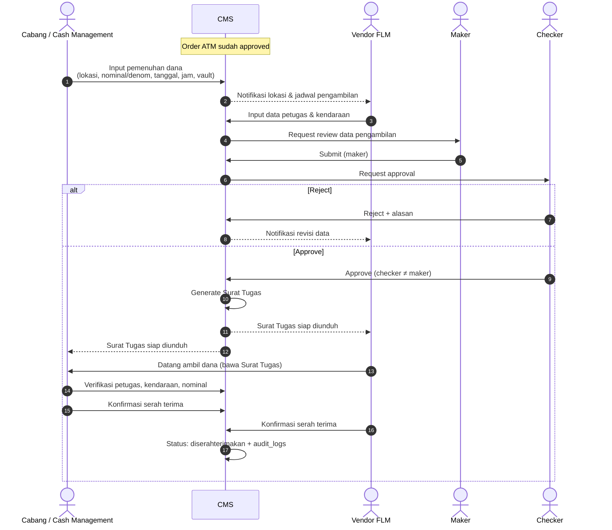

# Feature Flow — Pemenuhan Dana, Pengambilan Dana & Serah Terima

Sumber: URS v0.3 Phase 1 · ATM Cash Forecasting "Pemenuhan Dana", "Pengambilan Dana", "Surat Tugas dan Serah Terima"
Modul: `internal/replenishment`, `internal/approval`, `internal/document`, `internal/notification`

## Data
- **Pemenuhan dana** (Cabang / Cash Management): lokasi pengambilan, nominal per denom, tanggal, jam, vault penyedia dana
- **Pengambilan dana** (Vendor FLM): nama petugas, no. KTP, no. NIP, nama perusahaan, keperluan, nominal, nominal per denom, jumlah lembar, no. kendaraan, tanggal

## Flow

## Catatan / open questions
- Maker & Checker di sini dari pihak bank atau vendor? URS: "harus mendapatkan persetujuan Maker dan Checker".
- No. KTP = data pribadi petugas vendor → masuk cakupan DGCC/TPRA (lihat CLAUDE.md §3a).
- Serah terima perlu e-sign atau cukup konfirmasi in-app?
