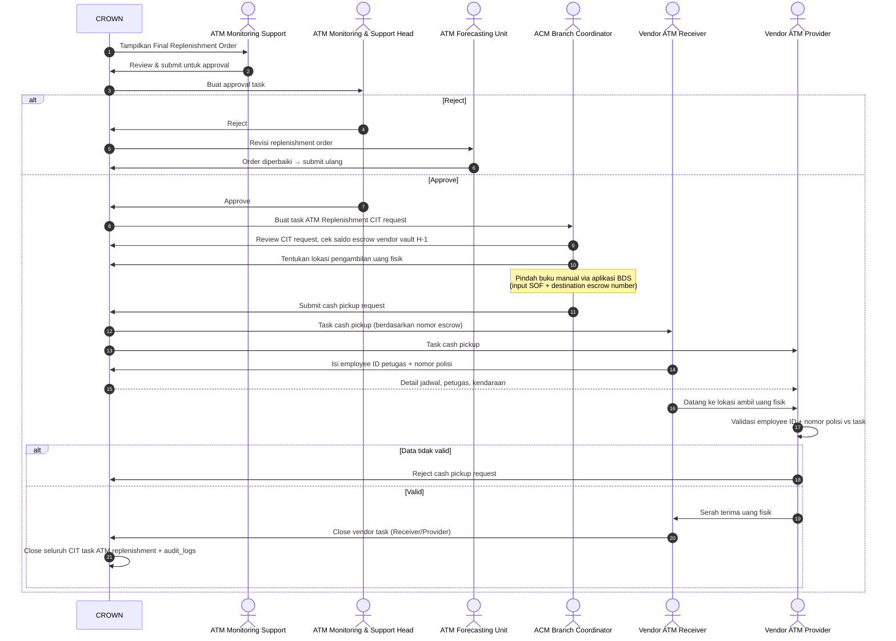

# Feature Flow — Pemenuhan Order ATM Replenish (Approval + CIT Cash Pickup)

Sumber: FSD "DSR End To End Cash Management" v1.0 · "Pemenuhan Order ATM Replenish" — menggantikan alur URS v0.3 (pemenuhan/pengambilan dana + surat tugas), diputuskan 2026-10-01.
Modul: `internal/replenishment`, `internal/approval`, `internal/notification` (+ CIT task)

## Data
- **Final Replenishment Order** (12:30): summary per vendor vault area per denominasi + detail per ATM ID
- **Cash pickup request** (ACM Branch Coordinator): lokasi pengambilan uang fisik, SOF (source of fund) + destination escrow number
- **Data petugas** (Vendor ATM Receiver): employee ID petugas, nomor polisi kendaraan

## Flow

```mermaid
sequenceDiagram
    autonumber
    participant SYS as CROWN
    actor MS as ATM Monitoring Support
    actor MSH as ATM Monitoring & Support Head
    actor FU as ATM Forecasting Unit
    actor ACM as ACM Branch Coordinator
    actor RCV as Vendor ATM Receiver
    actor PRV as Vendor ATM Provider

    SYS->>MS: Tampilkan Final Replenishment Order
    MS->>SYS: Review & submit untuk approval
    SYS->>MSH: Buat approval task
    alt Reject
        MSH->>SYS: Reject
        SYS->>FU: Revisi replenishment order
        FU->>SYS: Order diperbaiki → submit ulang
    else Approve
        MSH->>SYS: Approve
        SYS->>ACM: Buat task ATM Replenishment CIT request
        ACM->>SYS: Review CIT request, cek saldo escrow vendor vault H-1
        ACM->>SYS: Tentukan lokasi pengambilan uang fisik
        Note over ACM: Pindah buku manual via aplikasi BDS<br/>(input SOF + destination escrow number)
        ACM->>SYS: Submit cash pickup request
        SYS->>RCV: Task cash pickup (berdasarkan nomor escrow)
        SYS->>PRV: Task cash pickup
        RCV->>SYS: Isi employee ID petugas + nomor polisi
        SYS-->>PRV: Detail jadwal, petugas, kendaraan
        RCV->>PRV: Datang ke lokasi ambil uang fisik
        PRV->>PRV: Validasi employee ID + nomor polisi vs task
        alt Data tidak valid
            PRV->>SYS: Reject cash pickup request
        else Valid
            PRV->>RCV: Serah terima uang fisik
            RCV->>SYS: Close vendor task (Receiver/Provider)
            SYS->>SYS: Close seluruh CIT task ATM replenishment + audit_logs
        end
    end
```

## Perubahan vs URS
- Tidak ada lagi Surat Tugas dan maker-checker atas data petugas; validasi petugas dilakukan Vendor Provider di lokasi (employee ID + nopol).
- Data KTP/NIP/jumlah lembar tidak lagi diminta.
- Pindah buku dilakukan **manual di BDS**, di luar CROWN — CROWN hanya mencatat SOF + destination escrow number.

## Catatan / open questions
- Mapping peran FSD → role CMS: ATM Monitoring Support (maker), Head (checker), ATM Forecasting Unit, ACM Branch Coordinator, Vendor Provider vs Receiver (keduanya vendor? Provider = vendor pemegang vault/escrow sumber?).
- Setelah reject pickup oleh Provider: apa langkah berikutnya (Receiver isi ulang data? ACM buat request baru?).
- Cek saldo escrow H-1: sumber data dari mana (escrow batch file Corebanking?).
- Approval Head satu level saja, atau berjenjang?
