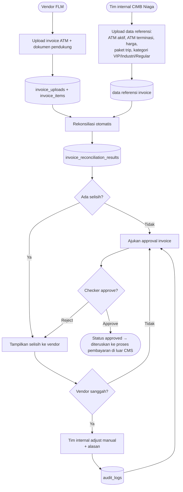

# Feature Flow — Rekonsiliasi Invoice Vendor FLM

Sumber: URS v0.3 Phase 1 · ATM Cash Forecasting §2 "Pembayaran invoice vendor FLM"
Modul: `internal/invoice`, `internal/reconciliation`, `internal/approval`

## Aturan
- CMS hanya **validasi & approve**, TIDAK mengeksekusi pembayaran.
- Upload idempotent per file hash.

## Flow

## Catatan / open questions
- Tabel data referensi (harga, paket trip, kategori) belum ada di table map — perlu proposal.
- Periode invoice: bulanan?
