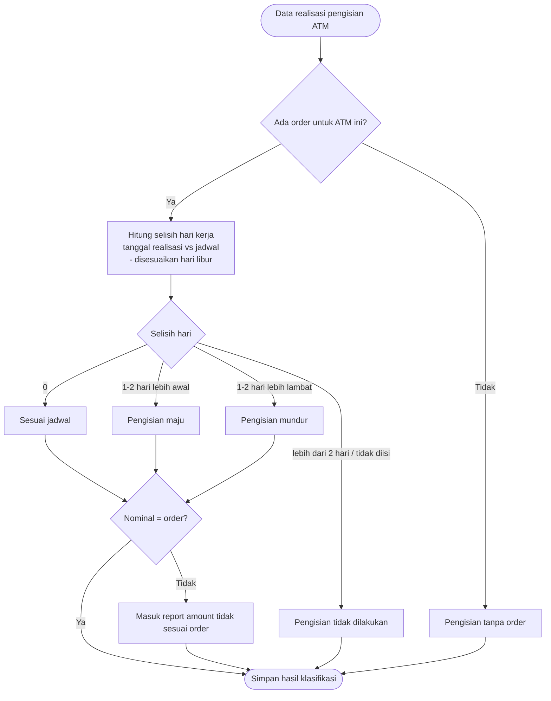
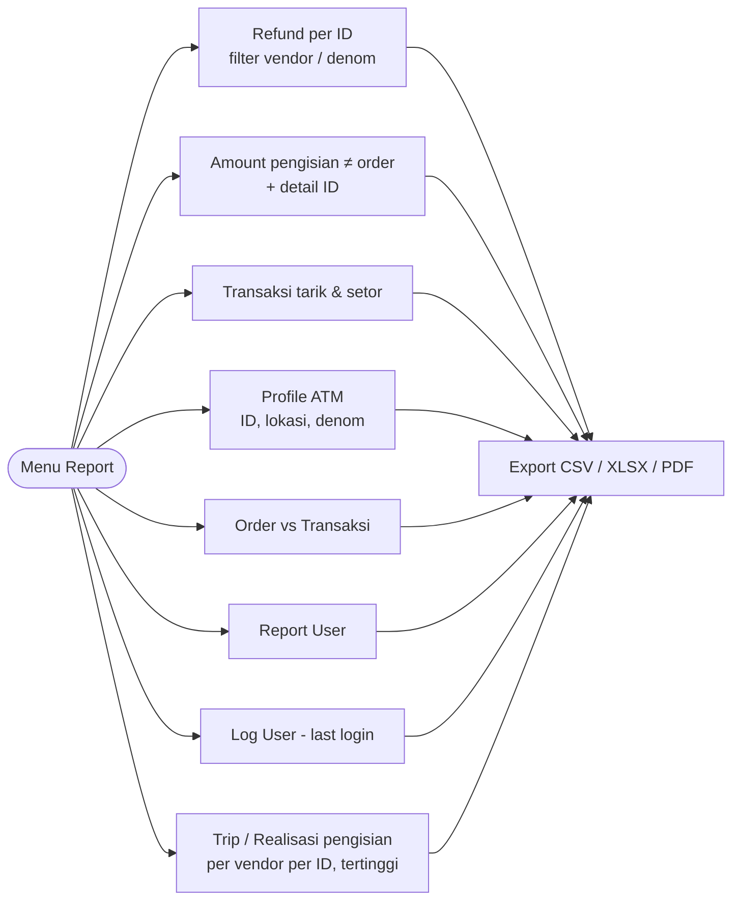

# Feature Flow — Validasi Realisasi Replenishment & Report

Sumber: URS v0.3 Phase 1 · Business Rules ATM Cash Forecasting
Modul: `internal/replenishment`, `internal/export`

## Flow: klasifikasi realisasi vs order

## Daftar report

## Catatan / open questions
- Sumber data realisasi (transaksi mesin / journal) dari mana — Corebanking, switching, atau DSR?
- Report dibaca dari read replica.
