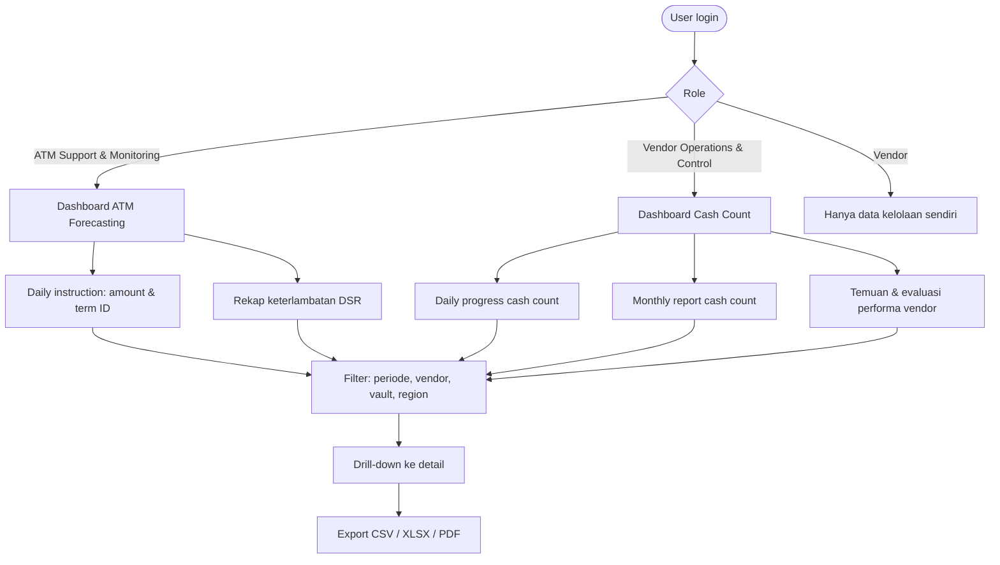

# Feature Flow — Dashboard & Pelaporan

Sumber: URS v0.3 Phase 1 · To-be "Dashboard & Pelaporan" · FNC 003
Modul: dashboard read-only di atas `internal/forecast`, `internal/replenishment`, `internal/dsr`, `internal/cashcount`, `internal/export`

## Konten (FNC 003)
- **ATM Forecasting**: daily instruction (amount & term ID), rekap keterlambatan DSR
- **Cash Count**: daily progress pelaksanaan, monthly report
- Umum: status, aging, SLA, tren historis, indikator exception

## Flow

## NFR
- Load dashboard ≤ 3 detik (p95), data dari **read replica**.
- Responsive (bisa dipakai di mobile).

## Catatan / open questions
- REP.001 "Delivery Status Reporting" di URS menyebut "RFP transactions" — kemungkinan sisa template, perlu konfirmasi.
