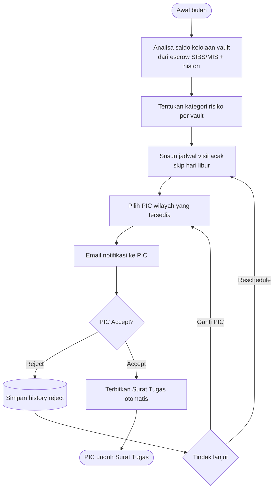
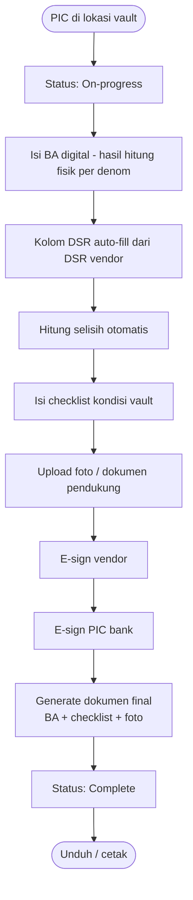
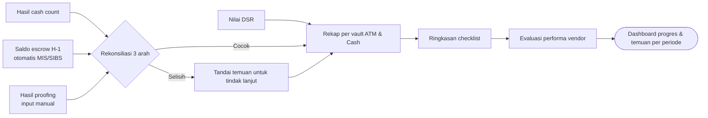

# Feature Flow — Cash Count Vault Vendor

Sumber: URS v0.3 Phase 1 · To-be "Cash count Vault vendor" · FNC 002
Modul: `internal/cashcount` (proposal, belum approved) + `internal/notification`, `internal/document`, `internal/corebanking`

## Aturan
- Bulanan. Jadwal **acak / tidak berpola**, abaikan tanggal merah & hari libur, pertimbangkan ketersediaan PIC wilayah.
- Kategori risiko dari analisa saldo kelolaan + histori (escrow SIBS/MIS).
- Template BA: Vault ATM, Vault Cash, Valas + checklist parameter.
- Status per escrow: Complete · On-progress · Not Complete.

## Flow: penjadwalan & penugasan

## Flow: pelaksanaan & e-sign

## Flow: rekap & rekonsiliasi 3 arah

## Catatan / open questions
- E-sign tersertifikasi opsional (NFR) — vendor e-sign apa?
- Tabel `cash_count_schedules`, `cash_count_evidences` masih proposal (CLAUDE.md §3).
- Formula kategori risiko belum didefinisikan di URS.
