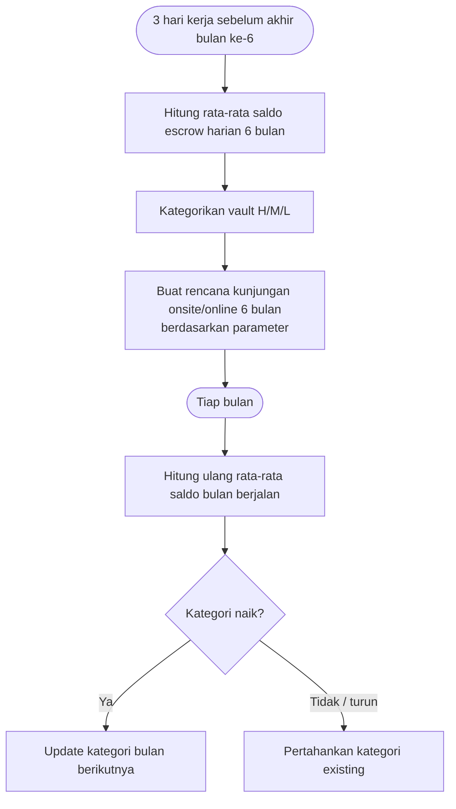
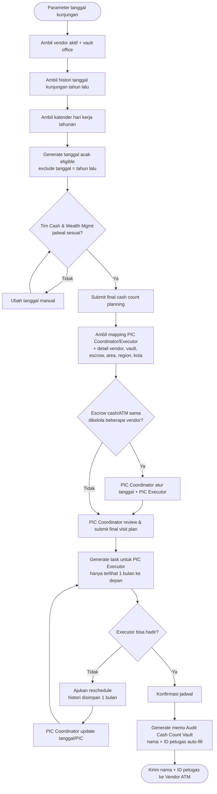
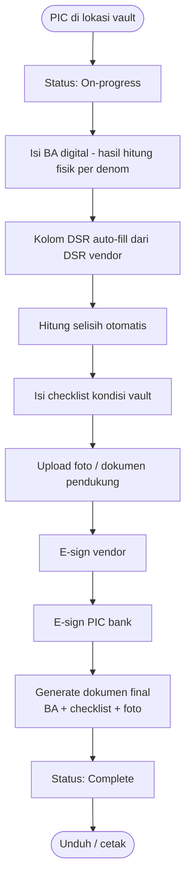
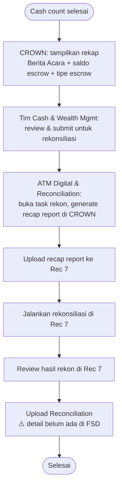

# Feature Flow — Cash Count Vault Vendor

Sumber: FSD "DSR End To End Cash Management" v1.0 (penjadwalan + rekonsiliasi, 2026-10-01) · URS v0.3 Phase 1 FNC 002 (pelaksanaan & e-sign)
Modul: `internal/cashcount` (proposal, belum approved) + `internal/notification`, `internal/document`, `internal/corebanking`

## Aturan (FSD v1.0 — menggantikan aturan URS "bulanan, abaikan hari libur", diputuskan 2026-10-01)
- **Kategori vault H/M/L** dari rata-rata saldo escrow harian (Cash + ATM) 6 bulan sebelumnya, dihitung 3 hari kerja sebelum akhir bulan ke-6. Rentang nominal per kategori = parameter (Tim Cash & Wealth Management).
- **Frekuensi onsite per 6 bulan**: High 3×, Medium 2×, Low 1×; sisanya virtual/online. Periode onsite ditentukan **acak** oleh sistem, berganti tiap 6 bulan.
- **Re-kategori bulanan**: rata-rata saldo harian bulan berjalan dihitung ulang; kategori **hanya boleh naik** (naik → update kategori bulan berikutnya; turun → abaikan, pertahankan kategori lama).
- **Tanggal kunjungan**: dari kalender **hari kerja** tahunan; tanggal yang sama dengan kunjungan tahun sebelumnya dikecualikan; tim Cash & Wealth Mgmt review, boleh ubah manual, lalu submit final planning.
- **PIC**: PIC Coordinator per region, PIC Executor per area — master data upload (replace-all) + maker-checker + audit. Mapping region/area/city harus sama dengan master kelolaan ATM & master ATM (ESQ).
- PIC Executor hanya melihat jadwal **1 bulan ke depan**.
- Template BA: Vault ATM/MDM, Vault Cash + checklist Vault Vendor PJPUR. DSR H-1 auto-fill ke BA.
- Status per escrow: Complete · On-progress · Not Complete.
- Perubahan parameter tercatat di audit trail (maker, checker, field before/after).

## Flow: kategori vault (bulanan)

```mermaid
flowchart TD
    A([3 hari kerja sebelum akhir bulan ke-6]) --> B[Hitung rata-rata saldo escrow harian 6 bulan]
    B --> C[Kategorikan vault H/M/L]
    C --> D[Buat rencana kunjungan onsite/online 6 bulan<br/>berdasarkan parameter]
    D --> E([Tiap bulan]) --> F[Hitung ulang rata-rata saldo bulan berjalan]
    F --> G{Kategori naik?}
    G -->|Ya| H[Update kategori bulan berikutnya]
    G -->|Tidak / turun| I[Pertahankan kategori existing]
```

## Flow: penjadwalan & penugasan

```mermaid
flowchart TD
    A([Parameter tanggal kunjungan]) --> B[Ambil vendor aktif + vault office]
    B --> C[Ambil histori tanggal kunjungan tahun lalu]
    C --> D[Ambil kalender hari kerja tahunan]
    D --> E[Generate tanggal acak eligible<br/>exclude tanggal = tahun lalu]
    E --> F{Tim Cash & Wealth Mgmt:<br/>jadwal sesuai?}
    F -->|Tidak| F1[Ubah tanggal manual] --> F
    F -->|Ya| G[Submit final cash count planning]
    G --> H[Ambil mapping PIC Coordinator/Executor<br/>+ detail vendor, vault, escrow, area, region, kota]
    H --> I{Escrow cash/ATM sama<br/>dikelola beberapa vendor?}
    I -->|Ya| I1[PIC Coordinator atur tanggal + PIC Executor] --> J
    I -->|Tidak| J[PIC Coordinator review & submit final visit plan]
    J --> K[Generate task untuk PIC Executor<br/>hanya terlihat 1 bulan ke depan]
    K --> L{Executor bisa hadir?}
    L -->|Tidak| L1[Ajukan reschedule<br/>histori disimpan 1 bulan] --> L2[PIC Coordinator update tanggal/PIC] --> K
    L -->|Ya| M[Konfirmasi jadwal]
    M --> N[Generate memo Audit Cash Count Vault<br/>nama + ID petugas auto-fill]
    N --> O([Kirim nama + ID petugas ke Vendor ATM])
```

## Flow: pelaksanaan & e-sign

```mermaid
flowchart TD
    A([PIC di lokasi vault]) --> B[Status: On-progress]
    B --> C[Isi BA digital - hasil hitung fisik per denom]
    C --> D[Kolom DSR auto-fill dari DSR vendor]
    D --> E[Hitung selisih otomatis]
    E --> F[Isi checklist kondisi vault]
    F --> G[Upload foto / dokumen pendukung]
    G --> H[E-sign vendor]
    H --> I[E-sign PIC bank]
    I --> J[Generate dokumen final<br/>BA + checklist + foto]
    J --> K[Status: Complete]
    K --> L([Unduh / cetak])
```

## Flow: rekap & rekonsiliasi (via Rec 7)

Sumber: FSD "DSR End To End Cash Management" v1.0 — menggantikan rekonsiliasi 3 arah in-system dari URS (diputuskan 2026-10-01). Rekonsiliasi dijalankan di aplikasi eksternal **Rec 7**, bukan dihitung di CROWN.

```mermaid
flowchart TD
    A([Cash count selesai]) --> B[CROWN: tampilkan rekap<br/>Berita Acara + saldo escrow + tipe escrow]
    B --> C[Tim Cash & Wealth Mgmt:<br/>review & submit untuk rekonsiliasi]
    C --> D[ATM Digital & Reconciliation:<br/>buka task rekon, generate recap report di CROWN]
    D --> E[Upload recap report ke Rec 7]
    E --> F[Jalankan rekonsiliasi di Rec 7]
    F --> G[Review hasil rekon di Rec 7]
    G --> H[Upload Reconciliation<br/>⚠️ detail belum ada di FSD]
    H --> I([Selesai])
```

## Catatan / open questions
- E-sign tersertifikasi opsional (NFR) — vendor e-sign apa?
- Tabel `cash_count_schedules`, `cash_count_evidences` masih proposal (CLAUDE.md §3).
- Kategori H/M/L: rentang nominal per kategori belum ada angkanya (parameter, isi user).
- FSD tidak konsisten: langkah 7 menulis "Med to Low: Update to Low", langkah 8 "Med to Low: maintain Med" — diasumsikan **hanya naik** (langkah 8); konfirmasi BA.
- FSD memakai "onsite" dan "online/virtual" bergantian — pastikan: frekuensi H3/M2/L1 = kunjungan onsite, sisanya online?
- Jadwal tahunan (parameter tanggal) vs rencana 6 bulanan (kategori) — bagaimana keduanya digabung?
- Email accept/reject PIC dan Surat Tugas (URS) diganti konfirmasi/reschedule in-app + memo audit (FSD).
- Rec 7: langkah 7 "Upload Reconciliation" kosong di FSD — apakah hasil Rec 7 di-upload balik ke CROWN? Format recap report untuk Rec 7?
- Input manual "proofing" dan evaluasi performa vendor (URS) tidak ada di FSD — masih in-scope?
