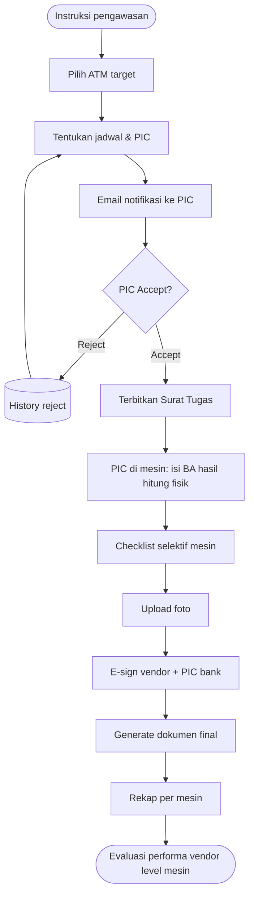

# Feature Flow — Cash Count Selektif Mesin

Sumber: URS v0.3 Phase 1 · To-be "Cash count selektif Mesin" · FNC 002
Modul: `internal/cashcount` (proposal, belum approved)

## Aturan
- Dipicu oleh **instruksi pengawasan** untuk mesin ATM tertentu (bukan jadwal acak bulanan).
- Mekanisme sama dengan cash count vault: surat tugas → BA → checklist → foto → e-sign → dokumen final.
- Rekap untuk evaluasi performa vendor **level mesin**.

## Flow

## Catatan / open questions
- Siapa yang berhak membuat instruksi pengawasan (role)?
- Apakah perlu rekonsiliasi terhadap saldo mesin (journal/switching), atau cukup BA vs DSR?
