# Feature Flow — Siklus Lengkap Order ATM (Forecast → Approval → CIT Pickup → Realisasi)

Sumber: URS v0.3 Phase 1 · FNC 001 · FSD "DSR End To End Cash Management" v1.0
Modul: `internal/forecast`, `internal/replenishment`, `internal/dsr`, `internal/approval`, `internal/audit`, `internal/notification`, `backend-cit/internal/cit`

> Flow lintas-fase ini merangkai empat tahap jadi satu siklus end-to-end order ATM:
> (1) persiapan & forecast order, (2) approval maker-checker, (3) CIT cash pickup, (4) realisasi & klasifikasi.
> Detail per-tahap ada di `03-atm-cash-forecasting`, `04-pemenuhan-pengambilan-dana`, dan `06-replenishment-validation-reports`.

## Timeline H0
- 06:00 — Rekomendasi DMAA / Data Science siap
- 06:30–09:00 — Vendor upload Saldo DSR (deadline 09:00)
- 09:30–10:00 — Hitung forecast
- 12:30 — Final Replenishment Order terbit

## Formula
```
Forecast Replenish = Forecast Amount − Saldo DSR + Forecast Refund
```
- Sumber: FSD v1.0 — menggantikan rumus URS (diputuskan 2026-10-01)
- Forecast Refund per ID = opening balance H − transaksi prediksi H & H+1
- Uang disimpan numeric / minor unit, IDR eksplisit, tidak pernah float
- ⚠️ Open question: fallback jika DSR tidak ada / telat belum didefinisikan FSD

## Aturan non-negosiasi
- Setiap state-change tulis `audit_logs` (who, what, before/after, when, ip)
- Maker ≠ checker; efek order baru aktif setelah `approved`
- Reads untuk Reports + Dashboard dari **read replica**; writes ke primary
- Cegah order ganda: ATM dengan order emergency/adhoc H-1 atau aktif H0 di-exclude

## Flow: end-to-end

```mermaid
flowchart TD
    START([H0: Rekomendasi DMAA / Data Science siap 06:00]) --> UP

    subgraph F1[1 - Persiapan & Forecast Order ATM]
        UP[Upload data tambahan oleh ATM Forecasting Unit]
        UP --> UP1[List Complaint Handling / Rekon]
        UP --> UP2[List Project ATM: replace / new / relokasi]
        UP --> UP3[List ATM bermasalah]
        UP --> UP4[Adjustment Order]
        UP1 --> M1{DMAA sudah rekomendasi<br/>emergency/planned kemarin?}
        M1 -->|Ya| M1a[Tidak dibuat order]
        M1 -->|Tidak| M1b[Tambah order emergency]
        UP2 --> M2[Tambah order emergency / planned]
        UP3 --> M3[Exclude dari rekomendasi]
        UP4 --> M4[Replace nominal DMAA]
        M1b --> DUP{ATM punya order emergency/adhoc<br/>H-1 atau aktif H0?}
        M2 --> DUP
        M4 --> DUP
        M3 --> DUPX[Exclude - cegah order ganda]
        DUP -->|Ya| DUPX
        DUP -->|Tidak| DRAFT[Draft Order ATM]
        DRAFT --> CALC[Hitung: Forecast Replenish =<br/>Forecast Amount - Saldo DSR + Forecast Refund]
        CALC --> GROUP[Kelompokkan per vendor / vault / denominasi]
    end

    GROUP --> FINAL[Final Replenishment Order - 12:30<br/>summary per vendor vault + detail per ATM ID]

    subgraph F2[2 - Approval Maker-Checker]
        FINAL --> SUBMIT[ATM Monitoring Support review & submit]
        SUBMIT --> REQ[(approval_requests: pending)]
        REQ --> CHECK{ATM Monitoring & Support Head}
        CHECK -->|Reject| REV[ATM Forecasting Unit revisi order]
        REV --> DRAFT
        CHECK -->|Approve| PUBLISH[Terbitkan instruksi pengisian +<br/>audit_logs]
    end

    PUBLISH --> F3START

    subgraph F3[3 - CIT Cash Pickup]
        F3START[Task ATM Replenishment CIT request ke ACM Branch Coordinator]
        F3START --> ESCROW[ACM cek saldo escrow vendor vault H-1]
        ESCROW --> LOC[Tentukan lokasi pengambilan uang fisik]
        LOC --> BDS[Pindah buku manual via BDS<br/>CROWN catat SOF + destination escrow number]
        BDS --> PICKREQ[Submit cash pickup request]
        PICKREQ --> TASKS[Task ke Vendor Receiver & Vendor Provider]
        TASKS --> RCVIN[Receiver isi employee ID petugas + nomor polisi]
        RCVIN --> COME[Petugas datang ke lokasi]
        COME --> VALID{Provider validasi<br/>employee ID + nopol vs task}
        VALID -->|Tidak valid| REJ[Reject cash pickup request]
        VALID -->|Valid| HAND[Serah terima uang fisik]
        HAND --> CLOSE[Close vendor task + seluruh CIT task +<br/>audit_logs]
    end

    CLOSE --> F4START

    subgraph F4[4 - Realisasi & Klasifikasi]
        F4START([Data realisasi pengisian ATM]) --> HASORDER{Ada order untuk ATM ini?}
        HASORDER -->|Tidak| NOORDER[Pengisian tanpa order]
        HASORDER -->|Ya| DIFF[Hitung selisih hari kerja<br/>realisasi vs jadwal - disesuaikan hari libur]
        DIFF --> DAYS{Selisih hari}
        DAYS -->|0| D0[Sesuai jadwal]
        DAYS -->|1-2 hari lebih awal| DE[Pengisian maju]
        DAYS -->|1-2 hari lebih lambat| DL[Pengisian mundur]
        DAYS -->|lebih dari 2 hari / tidak diisi| DN[Pengisian tidak dilakukan]
        D0 --> AMT{Nominal = order?}
        DE --> AMT
        DL --> AMT
        AMT -->|Tidak| AMTX[Report amount tidak sesuai order]
        AMT -->|Ya| RESULT([Simpan hasil klasifikasi])
        AMTX --> RESULT
        DN --> RESULT
        NOORDER --> RESULT
    end

    RESULT --> REPORTS([Reports + Dashboard<br/>dibaca dari read replica])
```



## Pemetaan status (business vs processing)
- **Order (business):** `draft` → `pending_approval` → `approved` / `rejected` → `published`
- **CIT task (processing):** `pickup_requested` → `assigned` → `validated` / `rejected` → `handed_over` → `closed`
- **Realisasi (klasifikasi):** sesuai jadwal · maju · mundur · tidak dilakukan · tanpa order; flag `amount_mismatch` terpisah

## Catatan / open questions
- Berapa level approval berjenjang pada tahap 2? (URS hanya menyebut "berjenjang")
- Fallback forecast saat DSR telat/absen belum didefinisikan FSD
- CIT backend (`backend-cit`) masih skeleton — tahap 3 dibangun di fase CIT (lihat development-plan)
