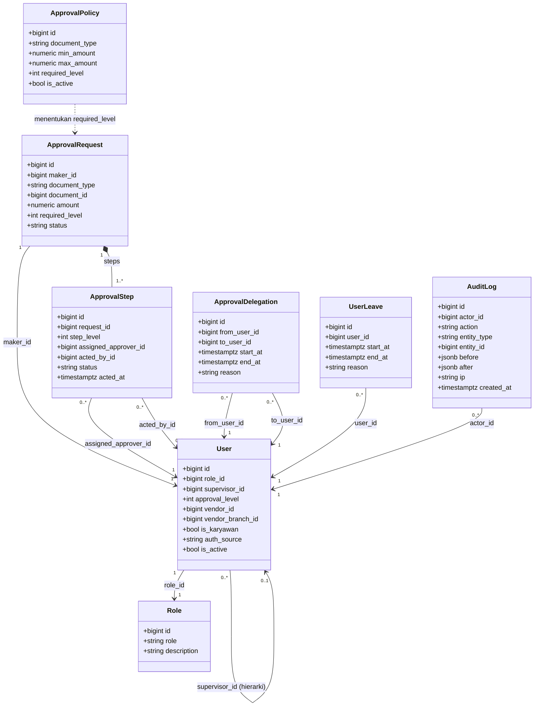
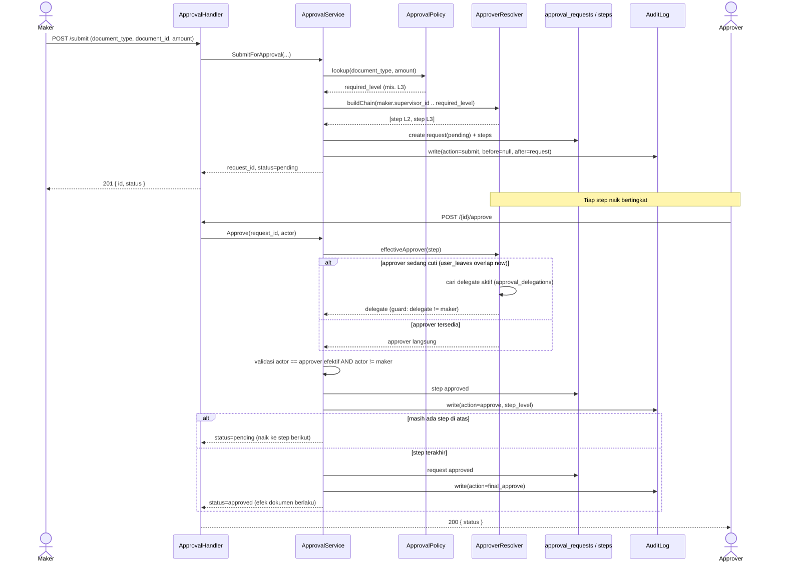
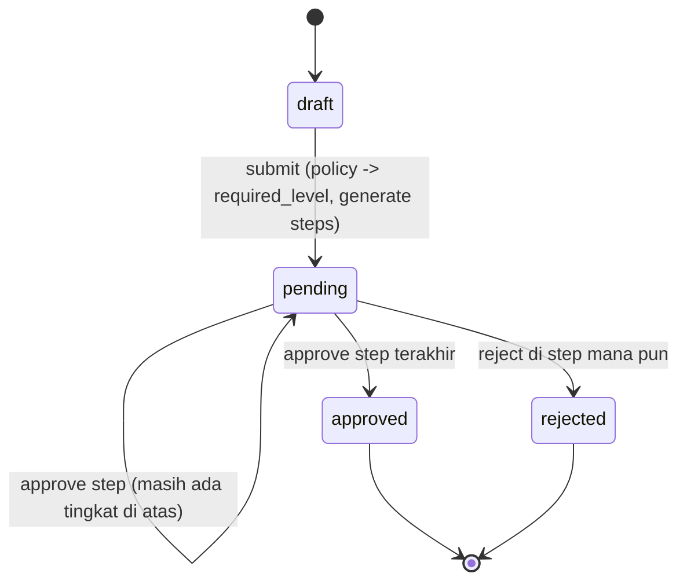

# RBAC Design Diagrams — Hierarki & Multi-Layer Approval (Internal)

> Diagram UML (format Mermaid, kompatibel mermaid.live) untuk desain RBAC + hierarki + approval maker-checker.
> Companion `task.md` di folder yang sama. Scope: internal CIMB dulu.
>
> Cara pakai di mermaid.live: copy isi satu blok kode (tanpa pagar ```` ``` ````) ke editor.

---

## 1. Class Diagram — Struktur RBAC, Hierarki & Approval



---

## 2. Sequence Diagram — Alur Approval Bertingkat (dengan fallback cuti)



---

## 3. State Diagram — Lifecycle ApprovalRequest



---

## Catatan Desain

- **Role vs Hierarki**: `Role` menentukan kapabilitas (apa yang boleh dilakukan); `supervisor_id` + `approval_level` menentukan struktur pelaporan (siapa lapor ke siapa). Dua konsep terpisah.
- **Pohon murni**: satu user punya paling banyak satu atasan langsung (`supervisor_id`). Multi-atasan (matriks) di luar scope.
- **Threshold**: `ApprovalPolicy` memetakan `(document_type, rentang nilai) -> required_level`, configurable admin.
- **Fallback block leave**: approver cuti (`UserLeave` overlap sekarang) dialihkan ke delegate aktif (`ApprovalDelegation`), dengan guard `delegate != maker`.
- **Non-negosiable**: maker != checker, tiap transisi tulis `AuditLog` (who/what/before/after/ip), write ke primary, idempotent per `(document_type, document_id)`.
