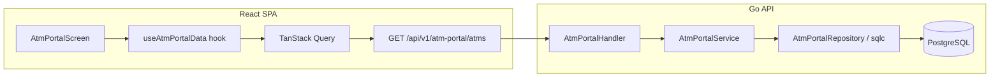

# Design Document: ATM Portal

## Overview

The ATM Portal is a monitoring feature that gives operations teams real-time visibility into ATM cash positions and replenishment needs. It joins ATM master data with the latest transactional records from `itm_cashpos` to compute a replenishment status per terminal, then renders the results in a filterable, sortable, paginated table.

The feature is a classic read-heavy, server-driven table pattern — no state machine or long-running workflow. The backend performs a single query with lateral join, computes status in SQL, and returns paginated results. The frontend renders with TanStack Table and Query.

### Key Design Decisions

1. **Server-side pagination, sorting, and filtering** — the ATM fleet can grow to thousands of records; client-side processing is not viable.
2. **Status computed in SQL** — the replenishment flag logic uses a `CASE` expression in the query rather than post-processing in Go, keeping the response pipeline lean.
3. **Lateral join for latest cashpos** — `LATERAL (SELECT ... ORDER BY replenish_date DESC, replenish_time DESC LIMIT 1)` avoids window-function overhead and is index-friendly on `(terminal_id, replenish_date)`.
4. ~~Schema gap: `brand` and `deployment_type`~~ — **superseded.** Verified live against `backend/migrations/008_seed_atms.sql` and the running `cms` database: `atms.brand` and `atms.deployment_type` already exist and are seeded. No migration is needed; Brand and Deployment Type filters ship in the same wave as the others.
5. ~~Column name mapping~~ — **superseded.** The threshold columns are already named `low_threshold_amount` / `critical_threshold_amount`, matching `requirements.md` exactly. No mapping needed in the service layer.
6. **Location and region require a join, not flat columns on `atms`** — `atms` only carries `location_id` (FK). `location_name`, `address`, and `region` (as referenced by the Response example and the `region` filter param) live on `locations` (`name`, `address_line1`, `address_line2`, `region_id`) and `regions` (`region`), reached via `atms.location_id → locations.id → locations.region_id → regions.id`. The query design below joins both tables. `address` uses `locations.address_line1` only — `address_line2` is not included in the response (decision confirmed; revisit if the UI later needs it).

---

## Architecture



### Data Flow

1. User navigates to `/atm-portal` → TanStack Router renders `AtmPortalScreen`
2. `useAtmPortalData` hook fires TanStack Query with current filter/sort/page state
3. Query key includes all params → automatic refetch on any param change
4. Go handler parses query params, validates, delegates to service
5. Service calls repository which executes the lateral-join query
6. Response includes paginated ATM rows + global summary counts + last_updated
7. Frontend renders table, summary cards, freshness indicator

---

## Components and Interfaces

### Backend

#### Handler: `AtmPortalHandler`

```go
// backend/internal/handler/atm_portal_handler.go

type AtmPortalHandler struct {
    service AtmPortalServicer
}

func NewAtmPortalHandler(service AtmPortalServicer) *AtmPortalHandler

func (h *AtmPortalHandler) Routes() chi.Router
// GET /atms → h.ListATMs
```

#### Service Interface

```go
// backend/internal/service/atm_portal.go

type AtmPortalServicer interface {
    ListATMs(ctx context.Context, params ListATMsParams) (*ListATMsResult, error)
}

type AtmPortalService struct {
    repo AtmPortalRepository
}
```

#### Repository Interface (sqlc-generated)

```go
// backend/internal/repository/atm_portal.go (generated by sqlc)

type AtmPortalRepository interface {
    ListATMs(ctx context.Context, arg ListATMsParams) ([]AtmWithCashPos, error)
    CountATMs(ctx context.Context, arg CountATMsParams) (int64, error)
    GetATMSummary(ctx context.Context) (ATMSummary, error)
    GetLastUpdated(ctx context.Context) (*time.Time, error)
}
```

### Frontend Component Hierarchy

```
AtmPortalScreen
├── PageHeader (title + description)
├── DataFreshnessIndicator
├── SummaryCardsGrid
│   ├── SummaryCard (Total)
│   ├── SummaryCard (Critical)
│   ├── SummaryCard (Low)
│   └── SummaryCard (Normal)
├── FilterBar
│   ├── SearchInput (debounced, 300ms)
│   ├── StatusMultiSelect
│   ├── MachineTypeMultiSelect
│   ├── BrandMultiSelect
│   ├── DeploymentTypeSelect
│   └── ClearAllButton + ActiveFilterCount
├── AtmTable (TanStack Table)
│   ├── TableHeader (sortable columns with aria-sort)
│   ├── TableBody
│   │   └── AtmRow (per ATM)
│   │       ├── TerminalIdCell (monospace)
│   │       ├── LocationCell
│   │       ├── MachineTypeCell
│   │       ├── BrandCell
│   │       ├── DeploymentTypeCell
│   │       ├── LastReplenishDateCell (formatted)
│   │       ├── RefundTotalCell (Rupiah, right-aligned, tabular-nums)
│   │       ├── ThresholdCell (Rupiah, right-aligned, tabular-nums)
│   │       └── StatusBadge (icon + label)
│   └── EmptyState / ErrorState
├── PaginationControls (page, total pages, page size selector)
└── AriaLiveRegion (state announcements)
```

### File Structure

```
frontend/CompanyPortal-Vite/src/features/atm-portal/
├── index.ts                    # barrel export
├── AtmPortalScreen.tsx         # page component
├── useAtmPortalData.ts         # TanStack Query hook
├── types.ts                    # shared interfaces
├── constants.ts                # query keys, stale time, status config
├── components/
│   ├── SummaryCardsGrid.tsx
│   ├── FilterBar.tsx
│   ├── AtmTable.tsx
│   ├── StatusBadge.tsx
│   ├── PaginationControls.tsx
│   └── DataFreshnessIndicator.tsx
├── lib/
│   └── formatters.ts           # Rupiah formatter, date formatter
└── __tests__/
    ├── useAtmPortalData.test.ts
    ├── formatters.test.ts
    └── AtmPortalScreen.test.tsx

backend/internal/handler/atm_portal_handler.go
backend/internal/service/atm_portal.go
backend/queries/atm_portal.sql
```

---

## Data Models

### API Contract

#### Request: `GET /api/v1/atm-portal/atms`

| Parameter | Type | Default | Validation |
|-----------|------|---------|------------|
| `page` | int | 1 | >= 1 |
| `page_size` | int | 25 | 1–100 |
| `search` | string | "" | max 100 chars |
| `status` | string | "all" | all, low, critical, normal, unconfigured, no_data |
| `machine_type` | string | "" | ATM, CRM (comma-separated for multi) |
| `brand` | string | "" | Hyosung, Wincor, Diebold (comma-separated) |
| `deployment_type` | string | "" | ONSITE, OFFSITE |
| `region` | string | "" | free text |
| `sort_by` | string | "terminal_id" | terminal_id, location, last_replenish_date, refund_total, status |
| `sort_order` | string | "asc" | asc, desc |

#### Response: `200 OK`

```json
{
  "data": [
    {
      "terminal_id": "ATM-00417",
      "location_name": "KCP Sudirman",
      "address": "Jl. Sudirman No. 10",
      "machine_type": "ATM",
      "brand": "Hyosung",
      "deployment_type": "ONSITE",
      "low_threshold": 50000000,
      "critical_threshold": 20000000,
      "last_replenish_date": "2026-07-15",
      "last_replenish_time": "14:30:00",
      "refund_total": 45000000,
      "replenish_total": 100000000,
      "escrow": 5000000,
      "status": "normal"
    }
  ],
  "summary": {
    "total": 150,
    "critical": 12,
    "low": 28,
    "normal": 95,
    "unconfigured": 10,
    "no_data": 5
  },
  "total": 150,
  "page": 1,
  "page_size": 25,
  "last_updated": "2026-07-15T14:30:00+07:00"
}
```

#### Response: `400 Bad Request`

```json
{
  "error": "bad_request",
  "message": "page_size harus antara 1 dan 100"
}
```

### TypeScript Types

```typescript
// frontend/CompanyPortal-Vite/src/features/atm-portal/types.ts

export type ReplenishmentStatus =
  | "critical"
  | "low"
  | "normal"
  | "unconfigured"
  | "no_data";

export interface AtmRecord {
  readonly terminal_id: string;
  readonly location_name: string;
  readonly address: string | null;
  readonly machine_type: "ATM" | "CRM";
  readonly brand: string | null;
  readonly deployment_type: string | null;
  readonly low_threshold: number | null;
  readonly critical_threshold: number | null;
  readonly last_replenish_date: string | null;
  readonly last_replenish_time: string | null;
  readonly refund_total: number | null;
  readonly replenish_total: number | null;
  readonly escrow: number | null;
  readonly status: ReplenishmentStatus;
}

export interface AtmSummary {
  readonly total: number;
  readonly critical: number;
  readonly low: number;
  readonly normal: number;
  readonly unconfigured: number;
  readonly no_data: number;
}

export interface AtmPortalResponse {
  readonly data: readonly AtmRecord[];
  readonly summary: AtmSummary;
  readonly total: number;
  readonly page: number;
  readonly page_size: number;
  readonly last_updated: string | null;
}

export interface AtmPortalParams {
  readonly page: number;
  readonly page_size: number;
  readonly search: string;
  readonly status: string;
  readonly machine_type: string;
  readonly brand: string;
  readonly deployment_type: string;
  readonly region: string;
  readonly sort_by: string;
  readonly sort_order: "asc" | "desc";
}
```

### Go Structs

```go
// backend/internal/service/atm_portal.go

type ListATMsParams struct {
    Page           int    `validate:"gte=1"`
    PageSize       int    `validate:"gte=1,lte=100"`
    Search         string `validate:"max=100"`
    Status         string `validate:"omitempty,oneof=all low critical normal unconfigured no_data"`
    MachineType    string // comma-separated
    Brand          string // comma-separated
    DeploymentType string
    Region         string
    SortBy         string `validate:"omitempty,oneof=terminal_id location last_replenish_date refund_total status"`
    SortOrder      string `validate:"omitempty,oneof=asc desc"`
}

type AtmWithCashPos struct {
    TerminalID        string
    LocationName      string
    Address           *string
    MachineType       string
    Brand             *string
    DeploymentType    *string
    LowThreshold      *float64
    CriticalThreshold *float64
    LastReplenishDate *time.Time
    LastReplenishTime *string
    RefundTotal       *float64
    ReplenishTotal    *float64
    Escrow            *float64
    Status            string // computed in SQL CASE
}

type ATMSummary struct {
    Total        int64
    Critical     int64
    Low          int64
    Normal       int64
    Unconfigured int64
    NoData       int64
}

type ListATMsResult struct {
    Data        []AtmWithCashPos
    Summary     ATMSummary
    Total       int64
    Page        int
    PageSize    int
    LastUpdated *time.Time
}
```

### SQL Query Design

The main query uses `LEFT JOIN LATERAL` to fetch the latest cashpos per terminal efficiently. The `(terminal_id, replenish_date)` index on `itm_cashpos` supports this pattern well.

**Correction:** `location_name`, `address`, and `region` are NOT columns on `atms` — verified live against the `cms` database. They require joining `locations` (via `atms.location_id`) and `regions` (via `locations.region_id`). Both joins are `INNER JOIN`, not `LEFT`, since `atms.location_id` and `locations.region_id` are both `NOT NULL` under current constraints. Threshold column names are `low_threshold_amount` / `critical_threshold_amount`, matching `atms` as-is. `address` maps to `locations.address_line1` only (confirmed — `address_line2` is not surfaced).

```sql
-- backend/queries/atm_portal.sql

-- name: ListATMsWithCashPos :many
SELECT
    a.terminal_id,
    l.name AS location_name,
    l.address_line1 AS address,
    a.machine_type,
    a.brand,
    a.deployment_type,
    r.region,
    a.low_threshold_amount,
    a.critical_threshold_amount,
    lcp.replenish_date  AS last_replenish_date,
    lcp.replenish_time  AS last_replenish_time,
    lcp.refund_total,
    lcp.replenish_total,
    lcp.escrow,
    CASE
        WHEN a.low_threshold_amount IS NULL THEN 'unconfigured'
        WHEN lcp.refund_total IS NULL THEN 'no_data'
        WHEN a.critical_threshold_amount IS NOT NULL
             AND lcp.refund_total <= a.critical_threshold_amount THEN 'critical'
        WHEN lcp.refund_total <= a.low_threshold_amount THEN 'low'
        ELSE 'normal'
    END AS status
FROM atms a
JOIN locations l ON l.id = a.location_id
JOIN regions r ON r.id = l.region_id
LEFT JOIN LATERAL (
    SELECT
        cp.replenish_date,
        cp.replenish_time,
        cp.refund_total,
        cp.replenish_total,
        cp.escrow
    FROM itm_cashpos cp
    WHERE cp.terminal_id = a.terminal_id
    ORDER BY cp.replenish_date DESC, cp.replenish_time DESC
    LIMIT 1
) lcp ON true
WHERE a.is_active = true
  AND a.deleted_at IS NULL
ORDER BY a.terminal_id ASC
LIMIT @page_size OFFSET (@page - 1) * @page_size;

-- name: CountATMsWithCashPos :one
SELECT COUNT(*)
FROM atms a
JOIN locations l ON l.id = a.location_id
JOIN regions r ON r.id = l.region_id
LEFT JOIN LATERAL (
    SELECT
        cp.replenish_date,
        cp.replenish_time,
        cp.refund_total
    FROM itm_cashpos cp
    WHERE cp.terminal_id = a.terminal_id
    ORDER BY cp.replenish_date DESC, cp.replenish_time DESC
    LIMIT 1
) lcp ON true
WHERE a.is_active = true
  AND a.deleted_at IS NULL;
```

**`CountATMsWithCashPos` note:** mirrors `ListATMsWithCashPos`'s `FROM`/`JOIN`/`WHERE` clauses exactly (plus whatever dynamic filter predicates apply — search, status, machine_type, brand, deployment_type, region) so the count matches the filtered result set for pagination math (Property 6). It keeps the `locations`/`regions` joins (unlike `GetATMSummary` below) because the `region` filter predicate needs `r.region` to bind against, and because the lateral join is required if any filter or status computation depends on `lcp.refund_total`. No `ORDER BY`/`LIMIT`/`OFFSET`.

**Note:** The actual implementation will use dynamic query building in Go for filters and sorting (sqlc supports dynamic queries via `sqlc.arg` and conditional clauses, or the service layer builds the query string). The CASE expression is duplicated in the summary query to compute global counts. The summary query does not need the `locations`/`regions` joins since it only aggregates status counts.

```sql
-- name: GetATMSummary :one
SELECT
    COUNT(*) AS total,
    COUNT(*) FILTER (WHERE sub.status = 'critical') AS critical,
    COUNT(*) FILTER (WHERE sub.status = 'low') AS low,
    COUNT(*) FILTER (WHERE sub.status = 'normal') AS normal,
    COUNT(*) FILTER (WHERE sub.status = 'unconfigured') AS unconfigured,
    COUNT(*) FILTER (WHERE sub.status = 'no_data') AS no_data
FROM (
    SELECT
        CASE
            WHEN a.low_threshold_amount IS NULL THEN 'unconfigured'
            WHEN lcp.refund_total IS NULL THEN 'no_data'
            WHEN a.critical_threshold_amount IS NOT NULL
                 AND lcp.refund_total <= a.critical_threshold_amount THEN 'critical'
            WHEN lcp.refund_total <= a.low_threshold_amount THEN 'low'
            ELSE 'normal'
        END AS status
    FROM atms a
    LEFT JOIN LATERAL (
        SELECT cp.refund_total
        FROM itm_cashpos cp
        WHERE cp.terminal_id = a.terminal_id
        ORDER BY cp.replenish_date DESC, cp.replenish_time DESC
        LIMIT 1
    ) lcp ON true
    WHERE a.is_active = true
      AND a.deleted_at IS NULL
) sub;

-- name: GetLastUpdated :one
SELECT
    replenish_date + replenish_time AS last_updated
FROM itm_cashpos
ORDER BY replenish_date DESC, replenish_time DESC
LIMIT 1;
```

### Schema Gap: Superseded — No Migration Required

**This section is stale and no longer applies.** Verified live against the running `cms` database and `backend/migrations/008_seed_atms.sql`: `atms.brand` and `atms.deployment_type` already exist and are seeded. No migration is needed, and no columns are conditionally hidden — Brand and Deployment Type filters ship in the same wave as Status and Machine Type. See Task 1 in `tasks.md` for the verification step that replaces this migration task.

### Navigation Integration

Add a `"monitoring"` group to the navigation system:

```typescript
// src/lib/config/navigation.ts — changes required

// 1. Extend NavGroup type
export type NavGroup = "general" | "monitoring" | "forecasting" | "invoice" | "cash-count";

// 2. Add to GROUP_LABELS
monitoring: "Monitoring",

// 3. Add nav item to NAV_CONFIG
{
  id: "atm-portal",
  label: "ATM Portal",
  icon: Monitor,  // import { Monitor } from "lucide-react"
  href: "/atm-portal",
  roles: ["ATM-USER", "ATM-SPV"],
  group: "monitoring",
}

// 4. GROUP_ORDER implicit from type definition order:
// general → monitoring → forecasting → invoice → cash-count
```

The Sidebar component already renders groups in order — adding "monitoring" after "general" in the type union and GROUP_LABELS ensures correct positioning.

---

## State Management

### TanStack Query Configuration

```typescript
// constants.ts
export const ATM_PORTAL_QUERY_KEY = ["atm-portal", "list"] as const;
export const ATM_PORTAL_STALE_TIME = 2 * 60 * 1000; // 2 minutes
```

**Query Key Strategy:**

```typescript
// Full query key includes all params for automatic cache isolation:
queryKey: [
  "atm-portal",
  "list",
  { page, page_size, search, status, machine_type, brand, deployment_type, region, sort_by, sort_order }
]
```

- Each unique filter/sort/page combination gets its own cache entry
- `staleTime: 2min` — cashpos data updates via batch file ingest (not real-time)
- `placeholderData: keepPreviousData` — smooth page/filter transitions without flicker
- `refetchOnWindowFocus: true` — ensures fresh data when user returns to tab

### URL State Sync

Filter/sort/page state lives in URL search params via TanStack Router's `useSearch()`:

- Enables shareable filtered views (copy-paste URL)
- Browser back/forward navigates filter history
- Default values are omitted from URL for clean URLs
- `search` param is debounced 300ms before URL update

---

## Correctness Properties

*A property is a characteristic or behavior that should hold true across all valid executions of a system — essentially, a formal statement about what the system should do. Properties serve as the bridge between human-readable specifications and machine-verifiable correctness guarantees.*

### Property 1: Replenishment status classification

*For any* ATM with a given `low_threshold`, `critical_threshold`, and latest `refund_total`, the computed status SHALL satisfy:
- If `low_threshold` is NULL → status is `"unconfigured"`
- If no cashpos record exists → status is `"no_data"`
- If `critical_threshold` is not NULL and `refund_total <= critical_threshold` → status is `"critical"`
- If `refund_total <= low_threshold` (and not critical) → status is `"low"`
- Otherwise → status is `"normal"`

When `critical_threshold` is NULL but `low_threshold` is set, only the binary low/normal classification applies.

**Validates: Requirements 2.1, 2.2, 2.3, 2.4, 2.5, 2.6, 2.8**

### Property 2: Latest record selection

*For any* terminal with multiple `itm_cashpos` records, the system SHALL use exclusively the record with the maximum `(replenish_date, replenish_time)` tuple for status computation. The `refund_total` used SHALL equal that single most recent record's value.

**Validates: Requirements 2.7**

### Property 3: Search filter correctness

*For any* non-empty search term and any ATM present in the response `data` array, that ATM's `terminal_id` or `location_name` SHALL contain the search term as a case-insensitive substring.

**Validates: Requirements 1.3**

### Property 4: Status filter correctness

*For any* status filter value other than `"all"`, every ATM in the response `data` array SHALL have a computed replenishment status equal to the requested filter value.

**Validates: Requirements 1.4**

### Property 5: Active-only invariant

*For any* valid request parameters, every ATM appearing in any response SHALL have `is_active = true` and `deleted_at IS NULL`. No inactive or soft-deleted ATM shall ever be returned.

**Validates: Requirements 1.9**

### Property 6: Pagination correctness

*For any* valid `page` (P) and `page_size` (S), given a total count T of matching records: the response `data` array length SHALL equal `min(S, max(0, T - (P-1)*S))`, and the `total` field SHALL equal the count of all matching records regardless of pagination.

**Validates: Requirements 1.2**

### Property 7: Sort order correctness

*For any* valid `sort_by` column and `sort_order` direction, for all consecutive pairs `(data[i], data[i+1])` in the response, the sort column value of `data[i]` SHALL be ≤ (ascending) or ≥ (descending) the sort column value of `data[i+1]`.

**Validates: Requirements 1.6**

### Property 8: Currency formatting

*For any* numeric value ≥ 0 (including zero and values up to 10^12), the Rupiah formatter SHALL produce a string matching the pattern `"Rp X.XXX.XXX"` (dot-separated thousands, no decimal fraction). *For any* null input, the formatter SHALL return `"—"` (em-dash).

**Validates: Requirements 4.3, 4.4**

### Property 9: Date formatting

*For any* valid Date input, the Indonesian locale formatter SHALL produce a string matching `"dd MMM yyyy"` (e.g., "15 Jul 2026"). *For any* null input, the formatter SHALL return `"—"`.

**Validates: Requirements 4.6, 7.2**

### Property 10: Summary independence from filters

*For any* two requests that differ only in filter parameters (search, status, machine_type, etc.), the `summary` object in both responses SHALL be identical. Summary counts are computed across all active ATMs regardless of active filters.

**Validates: Requirements 3.4, 7.3**

### Property 11: URL-filter synchronization (round-trip)

*For any* valid filter state object, serializing it to URL search params and then parsing those URL search params back into a filter state object SHALL produce a value equal to the original. The URL encoding is lossless.

**Validates: Requirements 5.4**

---

## Error Handling

| Scenario | Backend Response | Frontend Behavior |
|----------|-----------------|-------------------|
| Invalid pagination params | 400 + descriptive message | Should not occur with UI controls; displays inline error if direct URL |
| Invalid sort_by value | 400 + descriptive message | Toast notification |
| Database connection failure | 500 + generic message | Error state with retry button |
| No ATMs match filters | 200 + empty `data` array | Empty state: "Tidak ada ATM yang sesuai filter" |
| No `itm_cashpos` records globally | 200 + `last_updated: null` | "Data terakhir: belum tersedia" |
| Request timeout (network) | — | TanStack Query retries (3 attempts, exponential backoff), then error state |
| ATM has no cashpos record | 200 + null cash fields, status `"no_data"` | Dashes in cashpos columns, "No Data" badge |

### Backend Error Response Format

Follows existing `ErrorResponse` struct:

```go
type ErrorResponse struct {
    Error   string       `json:"error"`
    Message string       `json:"message"`
    Details []FieldError `json:"details,omitempty"`
}
```

### Frontend Error Resilience

- TanStack Query handles retry (3 retries, exponential backoff)
- Error state preserves current filter selections (user can retry without re-entering filters)
- `placeholderData: keepPreviousData` keeps stale data visible during background refetch
- Retry action: `queryClient.refetchQueries({ queryKey: [...] })`
- Network errors display generic "Gagal memuat data ATM" with "Coba Lagi" button

---

## Testing Strategy

### Unit Tests (Example-Based)

| Test | Validates |
|------|-----------|
| Renders PageHeader with correct title/description | Req 3.2 |
| Summary cards appear in order: Total, Critical, Low, Normal | Req 3.3 |
| Status badges render correct icon + label per status variant | Req 4.5 |
| Loading state shows 4 skeleton cards + 5 skeleton rows | Req 8.1 |
| Error state shows error icon, message, retry button | Req 8.2 |
| Retry click triggers refetch | Req 8.3 |
| Empty state shows "Tidak ada ATM yang sesuai filter" | Req 8.4 |
| Pagination controls show page size options [10, 25, 50, 100] | Req 4.8 |
| Sidebar renders "Monitoring" group after "Umum" | Req 6.1 |
| "ATM Portal" link with Monitor icon navigates to /atm-portal | Req 6.2, 6.3 |
| Table uses semantic HTML (table/thead/tbody/th/td) | Req 11.1 |
| Summary cards have aria-label with metric + value | Req 11.3 |
| Search input has correct aria-label | Req 11.5 |
| Sort interaction updates aria-sort attribute | Req 11.7 |
| State transition announces via aria-live region | Req 11.8 |

### Property-Based Tests

**Library:** `fast-check` (TypeScript) for frontend formatters and URL sync; `pgregory.net/rapid` (Go) for backend status logic and query correctness.

**Configuration:** Minimum 100 iterations per property test.

| Property Test | Tag |
|---------------|-----|
| Status classification logic | Feature: atm-portal, Property 1: Replenishment status classification |
| Latest record selection | Feature: atm-portal, Property 2: Latest record selection |
| Search filter invariant | Feature: atm-portal, Property 3: Search filter correctness |
| Status filter correctness | Feature: atm-portal, Property 4: Status filter correctness |
| Active-only invariant | Feature: atm-portal, Property 5: Active-only invariant |
| Pagination math | Feature: atm-portal, Property 6: Pagination correctness |
| Sort order | Feature: atm-portal, Property 7: Sort order correctness |
| Currency formatting | Feature: atm-portal, Property 8: Currency formatting |
| Date formatting | Feature: atm-portal, Property 9: Date formatting |
| Summary independence | Feature: atm-portal, Property 10: Summary independence from filters |
| URL-filter round-trip | Feature: atm-portal, Property 11: URL-filter synchronization |

### Integration Tests

| Test | Scope |
|------|-------|
| Full API round-trip with test DB | Handler → Service → Repository → PostgreSQL |
| Lateral join returns correct latest record per terminal | SQL correctness with multiple cashpos per ATM |
| Pagination + total count consistency | Verify OFFSET/LIMIT + COUNT produce consistent results |
| Status CASE expression edge cases | NULL thresholds, NULL refund_total, boundary values |
| Brand/deployment_type filters after migration | New column filtering with indexed queries |
