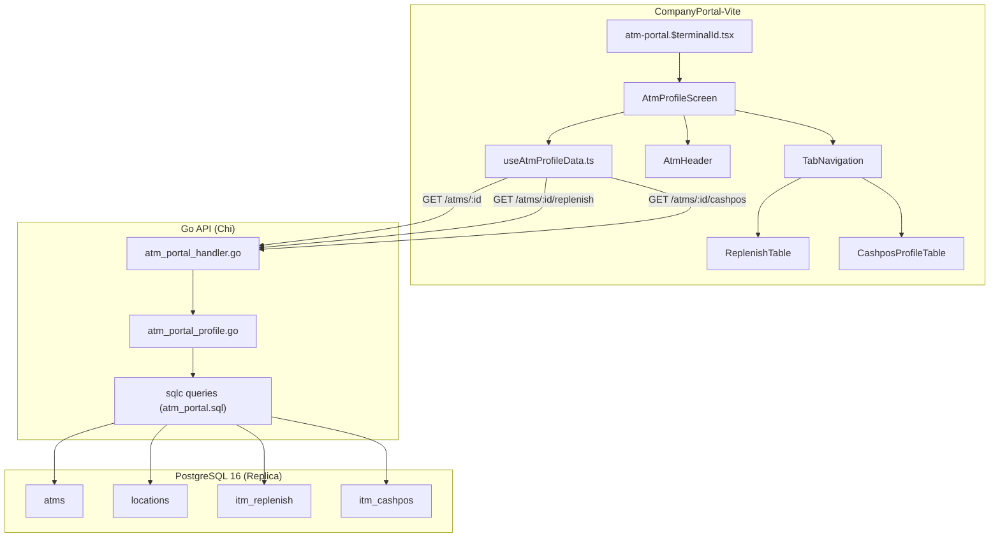

# Design Document: ATM Profile

## Overview

The ATM Profile feature adds a single-ATM detail view to the existing ATM Portal module. When an operations manager clicks a terminal ID in the ATM Portal list, they navigate to `/atm-portal/$terminalId` — a read-only page consolidating:

1. **ATM Header** — master data fields (location, machine type, thresholds, status badge)
2. **Replenishment History** — paginated table of `itm_replenish` records for that terminal
3. **Cash Position History** — paginated table of `itm_cashpos` snapshots for that terminal

The feature is purely read-only (no mutations). All data queries hit the **read replica** pool. It reuses existing auth/RBAC middleware, the `pkg/response` envelope, and the established frontend patterns (TanStack Router/Query/Table, PageHeader, StatusBadge).

### Design Decisions

| Decision | Rationale |
|----------|-----------|
| Add endpoints to existing `atm_portal_handler.go` | Same domain, avoids handler proliferation. Sub-routes `:terminalId`, `:terminalId/replenish`, `:terminalId/cashpos` nest naturally under the existing `/api/v1/atm-portal/atms` group. |
| Frontend lives in `src/features/atm-portal/` | Requirement 10 mandates co-location. The profile is a drill-down within the same feature module. |
| Use read replica for all queries | Read-only feature, no write-after-read concern. Offloads primary. |
| Status computation in SQL (reuse existing CASE) | Same precedence logic already in `ListATMsWithCashPos`. Extract to a reusable pattern in the new query. |
| Monetary fields as decimal strings in JSON | Matches existing `cashposRow` pattern in the handler — avoids float precision loss. |
| Tab state in URL query param (`?tab=replenish`) | Enables shareable deep-links and browser back/forward history. |
| Default date filter: last 30 days | Prevents unbounded queries on large histories; user can override. |
| Separate service file `atm_portal_profile.go` | Keeps profile logic isolated from the list logic while sharing the same interface. |

---

## Architecture



### Request Flow

1. User clicks terminal ID link in ATM Portal list → TanStack Router navigates to `/atm-portal/$terminalId`
2. `AtmProfileScreen` mounts → triggers TanStack Query hooks:
   - `useAtmMasterData(terminalId)` → `GET /api/v1/atm-portal/atms/:terminalId`
   - `useAtmReplenishHistory(terminalId, params)` → `GET /api/v1/atm-portal/atms/:terminalId/replenish` (when replenish tab active)
   - `useAtmCashposHistory(terminalId, params)` → `GET /api/v1/atm-portal/atms/:terminalId/cashpos` (when cashpos tab active)
3. Backend handler parses path/query params → validates → delegates to service
4. Service queries read replica → returns result
5. Handler serializes to JSON envelope → responds
6. Frontend renders header + active tab table

---

## Components and Interfaces

### Backend

#### New Endpoints (added to existing `AtmPortalHandler.Routes()`)

| Method | Path | Handler | Description |
|--------|------|---------|-------------|
| GET | `/atms/{terminalId}` | `GetATMProfile` | ATM master data + computed status |
| GET | `/atms/{terminalId}/replenish` | `ListATMReplenish` | Paginated replenishment history |
| GET | `/atms/{terminalId}/cashpos` | `ListATMCashpos` | Paginated cash position history |

#### Router Registration

```go
// In AtmPortalHandler.Routes()
r.Get("/atms/{terminalId}", h.GetATMProfile)
r.Get("/atms/{terminalId}/replenish", h.ListATMReplenish)
r.Get("/atms/{terminalId}/cashpos", h.ListATMCashpos)
```

#### Service Interface Extension

```go
// Added to AtmPortalServicer interface
type AtmPortalServicer interface {
    // existing
    ListATMs(ctx context.Context, params ListATMsParams) (*ListATMsResult, error)
    ListCashpos(ctx context.Context, params ListCashposParams) (*ListCashposResult, error)
    // new - ATM Profile
    GetATMProfile(ctx context.Context, terminalID string) (*ATMProfileResult, error)
    ListATMReplenish(ctx context.Context, params ListATMReplenishParams) (*ListATMReplenishResult, error)
    ListATMCashpos(ctx context.Context, params ListATMCashposParams) (*ListATMCashposResult, error)
}
```

#### Repository Interface (new queries)

```go
type AtmPortalProfileRepository interface {
    GetATMByTerminalID(ctx context.Context, terminalID string) (db.GetATMByTerminalIDRow, error)
    GetLatestReplenishForTerminal(ctx context.Context, terminalID string) (db.GetLatestReplenishForTerminalRow, error)
    ListReplenishByTerminal(ctx context.Context, arg db.ListReplenishByTerminalParams) ([]db.ListReplenishByTerminalRow, error)
    CountReplenishByTerminal(ctx context.Context, arg db.CountReplenishByTerminalParams) (int64, error)
    ListCashposByTerminal(ctx context.Context, arg db.ListCashposByTerminalParams) ([]db.ListCashposByTerminalRow, error)
    CountCashposByTerminal(ctx context.Context, arg db.CountCashposByTerminalParams) (int64, error)
}
```

### Frontend

#### New Files

| File | Export | Purpose |
|------|--------|---------|
| `src/routes/atm-portal.$terminalId.tsx` | `atmProfileRoute` | TanStack Router route definition with `terminalId` param |
| `src/features/atm-portal/AtmProfileScreen.tsx` | `AtmProfileScreen` | Page entry point |
| `src/features/atm-portal/useAtmProfileData.ts` | `useAtmMasterData`, `useAtmReplenishHistory`, `useAtmCashposHistory` | Data hooks |
| `src/features/atm-portal/components/AtmHeader.tsx` | `AtmHeader` | Master data display grid with status badge |
| `src/features/atm-portal/components/TabNavigation.tsx` | `TabNavigation` | Accessible tab switcher (WAI-ARIA tabs pattern) |
| `src/features/atm-portal/components/ReplenishTable.tsx` | `ReplenishTable` | Replenish history table with date filter + pagination |
| `src/features/atm-portal/components/CashposProfileTable.tsx` | `CashposProfileTable` | Cashpos history table with date filter + pagination |

#### Component Tree

```
AtmProfileScreen
├── nav[aria-label="Breadcrumb"] > ol > li (ATM Portal link + terminal ID)
├── PageHeader (eyebrow="ATM Portal", title=terminalId, description=locationName)
├── AtmHeader (master data grid + StatusBadge)
│   └── 3-col / 2-col / 1-col responsive grid of field pairs
├── TabNavigation [role="tablist"]
│   ├── [role="tab"] "Replenish"
│   └── [role="tab"] "Cashpos"
├── [role="tabpanel"]
│   ├── ReplenishTable (when tab=replenish)
│   │   ├── DateRangeFilter
│   │   ├── DataTable (TanStack Table)
│   │   └── PaginationControls
│   └── CashposProfileTable (when tab=cashpos)
│       ├── DateRangeFilter
│       ├── DataTable (TanStack Table, horizontal scroll)
│       └── PaginationControls
└── div[aria-live="polite"][aria-atomic="true"] (state announcements)
```

---

## Data Models

### Database Schema (existing tables, read-only)

#### `atms` (relevant columns)

| Column | Type | Nullable | Notes |
|--------|------|----------|-------|
| terminal_id | text | NOT NULL | Unique, URL param + join key |
| location_id | bigint | NOT NULL | FK → locations |
| machine_type | text | NOT NULL | ATM50K, ATM100K, CRM, CDM |
| brand | text | NOT NULL | e.g., NCR, Diebold |
| model | text | NOT NULL | e.g., SelfServ 84 |
| operation_hours | text | NOT NULL | "24_HOURS", "BUSINESS_HOURS" |
| deployment_type | text | NOT NULL | ONSITE, OFFSITE |
| capacity_amount | numeric(20,2) | NULL | |
| low_threshold_amount | numeric(20,2) | NULL | |
| critical_threshold_amount | numeric(20,2) | NULL | |
| is_active | boolean | NOT NULL | |
| deleted_at | timestamptz | NULL | Soft delete |

#### `itm_replenish` (relevant columns)

| Column | Type | Nullable | Notes |
|--------|------|----------|-------|
| replenish_date | date | NOT NULL | |
| replenish_time | time | NOT NULL | |
| terminal_id | text | NOT NULL | Join key |
| machine_type | text | NOT NULL | |
| teller_id | text | NOT NULL | |
| branch_code | text | NOT NULL | |
| escrow | numeric(20,2) | NOT NULL | |
| refund_denom_10k | numeric(20,2) | NOT NULL | |
| refund_denom_20k | numeric(20,2) | NOT NULL | |
| refund_denom_50k | numeric(20,2) | NOT NULL | |
| refund_denom_100k | numeric(20,2) | NOT NULL | |
| refund_total | numeric(20,2) | NOT NULL | |
| replenish_denom_10k | numeric(20,2) | NOT NULL | |
| replenish_denom_20k | numeric(20,2) | NOT NULL | |
| replenish_denom_50k | numeric(20,2) | NOT NULL | |
| replenish_denom_100k | numeric(20,2) | NOT NULL | |
| replenish_total | numeric(20,2) | NOT NULL | |

#### `itm_cashpos` (relevant columns)

| Column | Type | Nullable | Notes |
|--------|------|----------|-------|
| id | bigint | NOT NULL | PK |
| file_id | bigint | NOT NULL | FK → itm_cashpos_files |
| cashpos_date | date | NOT NULL | |
| terminal_id | text | NOT NULL | Join key |
| machine_type | text | NOT NULL | |
| teller_id | text | NOT NULL | |
| branch_code | text | NOT NULL | |
| starting_cash_{10k,20k,50k,100k} | numeric(20,2) | NOT NULL | 4 columns |
| cash_in_{10k,20k,50k,100k} | numeric(20,2) | NOT NULL | 4 columns |
| cash_out_{10k,20k,50k,100k} | numeric(20,2) | NOT NULL | 4 columns |
| cash_position_{10k,20k,50k,100k} | numeric(20,2) | NOT NULL | 4 columns |
| position_source | text | NOT NULL | |
| created_at | timestamptz | NOT NULL | |

### Backend Types

#### `ATMProfileResult`

```go
type ATMProfileResult struct {
    TerminalID              string
    LocationName            string
    Address                 string
    MachineType             string
    Brand                   string
    Model                   string
    DeploymentType          string
    OperationHours          string
    CapacityAmount          *string  // decimal string, nil = NULL
    LowThresholdAmount      *string  // decimal string, nil = NULL
    CriticalThresholdAmount *string  // decimal string, nil = NULL
    IsActive                bool
    ReplenishmentStatus     string   // "critical"|"low"|"normal"|"unconfigured"|"no_data"
}
```

#### `ListATMReplenishParams`

```go
type ListATMReplenishParams struct {
    TerminalID string
    Page       int
    PageSize   int
    DateFrom   string // YYYY-MM-DD or ""
    DateTo     string // YYYY-MM-DD or ""
}
```

#### `ListATMReplenishResult`

```go
type ListATMReplenishResult struct {
    Data     []ReplenishRecord
    Total    int64
    Page     int
    PageSize int
}

type ReplenishRecord struct {
    ReplenishDate      string // YYYY-MM-DD
    ReplenishTime      string // HH:MM:SS
    TerminalID         string
    MachineType        string
    TellerID           string
    BranchCode         string
    Escrow             string // decimal string
    RefundDenom10k     string
    RefundDenom20k     string
    RefundDenom50k     string
    RefundDenom100k    string
    RefundTotal        string
    ReplenishDenom10k  string
    ReplenishDenom20k  string
    ReplenishDenom50k  string
    ReplenishDenom100k string
    ReplenishTotal     string
}
```

#### `ListATMCashposParams`

```go
type ListATMCashposParams struct {
    TerminalID string
    Page       int
    PageSize   int
    DateFrom   string // YYYY-MM-DD or ""
    DateTo     string // YYYY-MM-DD or ""
}
```

#### `ListATMCashposResult`

```go
type ListATMCashposResult struct {
    Data     []CashposRecord
    Total    int64
    Page     int
    PageSize int
}

type CashposRecord struct {
    ID               int64
    FileID           int64
    CashposDate      string // YYYY-MM-DD
    TerminalID       string
    MachineType      string
    TellerID         string
    BranchCode       string
    StartingCash10k  string
    CashIn10k        string
    CashOut10k       string
    CashPosition10k  string
    StartingCash20k  string
    CashIn20k        string
    CashOut20k       string
    CashPosition20k  string
    StartingCash50k  string
    CashIn50k        string
    CashOut50k       string
    CashPosition50k  string
    StartingCash100k string
    CashIn100k       string
    CashOut100k      string
    CashPosition100k string
    PositionSource   string
    CreatedAt        string // RFC3339
}
```

### Frontend Types (added to `types.ts`)

```typescript
/** ATM master data from GET /api/v1/atm-portal/atms/:terminalId */
export interface AtmProfileMasterData {
  readonly terminal_id: string;
  readonly location_name: string;
  readonly address: string;
  readonly machine_type: string;
  readonly brand: string;
  readonly model: string;
  readonly deployment_type: string;
  readonly operation_hours: string;
  readonly capacity_amount: string | null;
  readonly low_threshold_amount: string | null;
  readonly critical_threshold_amount: string | null;
  readonly is_active: boolean;
  readonly replenishment_status: ReplenishmentStatus;
}

/** Single replenishment record */
export interface AtmReplenishRecord {
  readonly replenish_date: string;
  readonly replenish_time: string;
  readonly terminal_id: string;
  readonly machine_type: string;
  readonly teller_id: string;
  readonly branch_code: string;
  readonly escrow: string;
  readonly refund_denom_10k: string;
  readonly refund_denom_20k: string;
  readonly refund_denom_50k: string;
  readonly refund_denom_100k: string;
  readonly refund_total: string;
  readonly replenish_denom_10k: string;
  readonly replenish_denom_20k: string;
  readonly replenish_denom_50k: string;
  readonly replenish_denom_100k: string;
  readonly replenish_total: string;
}

/** Paginated replenish response */
export interface AtmReplenishResponse {
  readonly data: readonly AtmReplenishRecord[];
  readonly total: number;
  readonly page: number;
  readonly page_size: number;
}

/** Paginated cashpos response for ATM Profile */
export interface AtmCashposProfileResponse {
  readonly data: readonly AtmCashposRecord[];
  readonly total: number;
  readonly page: number;
  readonly page_size: number;
}

/** Tab identifiers for ATM Profile */
export type AtmProfileTab = "replenish" | "cashpos";
```

### SQL Queries (new, added to `atm_portal.sql`)

#### GetATMByTerminalID

```sql
-- name: GetATMByTerminalID :one
-- Returns ATM master data for the profile header. Only active, non-deleted ATMs.
SELECT
    a.terminal_id,
    l.name AS location_name,
    l.address_line1 AS address,
    a.machine_type,
    a.brand,
    a.model,
    a.deployment_type,
    a.operation_hours,
    a.capacity_amount,
    a.low_threshold_amount,
    a.critical_threshold_amount,
    a.is_active
FROM atms a
JOIN locations l ON l.id = a.location_id
WHERE a.terminal_id = sqlc.arg('terminal_id')::text
  AND a.is_active = true
  AND a.deleted_at IS NULL;
```

#### GetLatestReplenishForTerminal

```sql
-- name: GetLatestReplenishForTerminal :one
-- Fetches the latest replenish record's refund_total for status computation.
-- Returns pgx.ErrNoRows when no replenish data exists (status = "no_data").
SELECT refund_total
FROM itm_replenish
WHERE terminal_id = sqlc.arg('terminal_id')::text
ORDER BY replenish_date DESC, replenish_time DESC
LIMIT 1;
```

#### ListReplenishByTerminal

```sql
-- name: ListReplenishByTerminal :many
-- Paginated replenishment history for a single ATM with optional date filtering.
SELECT
    replenish_date, replenish_time, terminal_id, machine_type,
    teller_id, branch_code, escrow,
    refund_denom_10k, refund_denom_20k, refund_denom_50k, refund_denom_100k, refund_total,
    replenish_denom_10k, replenish_denom_20k, replenish_denom_50k, replenish_denom_100k, replenish_total
FROM itm_replenish
WHERE terminal_id = sqlc.arg('terminal_id')::text
  AND (sqlc.arg('date_from')::text = '' OR replenish_date >= sqlc.arg('date_from')::date)
  AND (sqlc.arg('date_to')::text = '' OR replenish_date <= sqlc.arg('date_to')::date)
ORDER BY replenish_date DESC, replenish_time DESC
LIMIT sqlc.arg('page_size')::int
OFFSET (sqlc.arg('page')::int - 1) * sqlc.arg('page_size')::int;
```

#### CountReplenishByTerminal

```sql
-- name: CountReplenishByTerminal :one
-- Count matching replenish records (mirrors ListReplenishByTerminal filters).
SELECT COUNT(*)
FROM itm_replenish
WHERE terminal_id = sqlc.arg('terminal_id')::text
  AND (sqlc.arg('date_from')::text = '' OR replenish_date >= sqlc.arg('date_from')::date)
  AND (sqlc.arg('date_to')::text = '' OR replenish_date <= sqlc.arg('date_to')::date);
```

#### ListCashposByTerminal

```sql
-- name: ListCashposByTerminal :many
-- Paginated cash position history for a single ATM with optional date filtering.
SELECT
    id, file_id, cashpos_date, terminal_id, machine_type, teller_id, branch_code,
    starting_cash_10k, cash_in_10k, cash_out_10k, cash_position_10k,
    starting_cash_20k, cash_in_20k, cash_out_20k, cash_position_20k,
    starting_cash_50k, cash_in_50k, cash_out_50k, cash_position_50k,
    starting_cash_100k, cash_in_100k, cash_out_100k, cash_position_100k,
    position_source, created_at
FROM itm_cashpos
WHERE terminal_id = sqlc.arg('terminal_id')::text
  AND (sqlc.arg('date_from')::text = '' OR cashpos_date >= sqlc.arg('date_from')::date)
  AND (sqlc.arg('date_to')::text = '' OR cashpos_date <= sqlc.arg('date_to')::date)
ORDER BY cashpos_date DESC, id DESC
LIMIT sqlc.arg('page_size')::int
OFFSET (sqlc.arg('page')::int - 1) * sqlc.arg('page_size')::int;
```

#### CountCashposByTerminal

```sql
-- name: CountCashposByTerminal :one
-- Count matching cashpos records (mirrors ListCashposByTerminal filters).
SELECT COUNT(*)
FROM itm_cashpos
WHERE terminal_id = sqlc.arg('terminal_id')::text
  AND (sqlc.arg('date_from')::text = '' OR cashpos_date >= sqlc.arg('date_from')::date)
  AND (sqlc.arg('date_to')::text = '' OR cashpos_date <= sqlc.arg('date_to')::date);
```

### API Response Examples

#### GET /api/v1/atm-portal/atms/T001234 → 200

```json
{
  "terminal_id": "T001234",
  "location_name": "KCP Sudirman",
  "address": "Jl. Jend. Sudirman No. 1",
  "machine_type": "CRM",
  "brand": "NCR",
  "model": "SelfServ 84",
  "deployment_type": "ONSITE",
  "operation_hours": "24_HOURS",
  "capacity_amount": "500000000.00",
  "low_threshold_amount": "50000000.00",
  "critical_threshold_amount": "25000000.00",
  "is_active": true,
  "replenishment_status": "normal"
}
```

#### GET /api/v1/atm-portal/atms/INVALID → 404

```json
{
  "error": "not_found",
  "message": "ATM tidak ditemukan"
}
```

#### GET /api/v1/atm-portal/atms/T001234/replenish?page=1&page_size=25 → 200

```json
{
  "data": [
    {
      "replenish_date": "2025-06-28",
      "replenish_time": "14:30:00",
      "terminal_id": "T001234",
      "machine_type": "CRM",
      "teller_id": "TLR001",
      "branch_code": "0391",
      "escrow": "5000000.00",
      "refund_denom_10k": "0.00",
      "refund_denom_20k": "0.00",
      "refund_denom_50k": "25000000.00",
      "refund_denom_100k": "50000000.00",
      "refund_total": "75000000.00",
      "replenish_denom_10k": "0.00",
      "replenish_denom_20k": "0.00",
      "replenish_denom_50k": "100000000.00",
      "replenish_denom_100k": "200000000.00",
      "replenish_total": "300000000.00"
    }
  ],
  "total": 42,
  "page": 1,
  "page_size": 25
}
```

#### GET /api/v1/atm-portal/atms/T001234/cashpos?page=1&page_size=25 → 200

```json
{
  "data": [
    {
      "id": 15032,
      "file_id": 45,
      "cashpos_date": "2025-06-28",
      "terminal_id": "T001234",
      "machine_type": "CRM",
      "teller_id": "TLR001",
      "branch_code": "0391",
      "starting_cash_10k": "0.00",
      "cash_in_10k": "0.00",
      "cash_out_10k": "0.00",
      "cash_position_10k": "0.00",
      "starting_cash_20k": "0.00",
      "cash_in_20k": "0.00",
      "cash_out_20k": "0.00",
      "cash_position_20k": "0.00",
      "starting_cash_50k": "150000000.00",
      "cash_in_50k": "50000000.00",
      "cash_out_50k": "25000000.00",
      "cash_position_50k": "175000000.00",
      "starting_cash_100k": "200000000.00",
      "cash_in_100k": "100000000.00",
      "cash_out_100k": "50000000.00",
      "cash_position_100k": "250000000.00",
      "position_source": "CURRENT",
      "created_at": "2025-06-28T07:00:00Z"
    }
  ],
  "total": 30,
  "page": 1,
  "page_size": 25
}
```

---


## Correctness Properties

*A property is a characteristic or behavior that should hold true across all valid executions of a system — essentially, a formal statement about what the system should do. Properties serve as the bridge between human-readable specifications and machine-verifiable correctness guarantees.*

### Property 1: Rupiah Currency Formatting

*For any* valid numeric string (including zero, large values, and values with decimal places), the `formatRupiah` function SHALL produce output matching the pattern `Rp X.XXX.XXX` with dot-separated thousands, "Rp " prefix, and no decimal places for display; and *for any* null input, the function SHALL return "—" (em dash).

**Validates: Requirements 2.2, 2.3, 7.3**

### Property 2: Indonesian Date Formatting

*For any* valid ISO date string (YYYY-MM-DD), the `formatDateIndonesian` function SHALL produce output matching the pattern "dd MMM yyyy" using Indonesian month abbreviations (Jan, Feb, Mar, Apr, Mei, Jun, Jul, Agu, Sep, Okt, Nov, Des), and the output SHALL be parseable back to the same calendar date.

**Validates: Requirements 7.2, 8.2**

### Property 3: Whole Number Formatting with Dot Separators

*For any* valid numeric string representing a monetary amount, the `formatWholeNumber` function SHALL produce output with dot-separated thousands, no decimal places, and right-alignment suitability (no leading/trailing spaces); and the numeric value of the formatted output (ignoring dots) SHALL equal the integer part of the input.

**Validates: Requirements 8.3**

### Property 4: Replenishment Status Computation Precedence

*For any* combination of `low_threshold_amount` (nullable), `critical_threshold_amount` (nullable), and `refund_total` from the latest `itm_replenish` record (nullable — no record exists), the computed `replenishment_status` SHALL follow strict precedence: (1) "unconfigured" when `low_threshold_amount` IS NULL, (2) "no_data" when no itm_replenish record exists, (3) "critical" when `critical_threshold_amount` IS NOT NULL AND `refund_total` <= `critical_threshold_amount`, (4) "low" when `refund_total` <= `low_threshold_amount`, (5) "normal" otherwise. No two precedence levels shall produce the same output for different inputs that should map to different statuses.

**Validates: Requirements 2.5, 3.3**

### Property 5: Replenish Query Result Invariants

*For any* valid `ListATMReplenish` request with a terminal_id, optional date_from, and optional date_to: (a) every record in the response `data` array SHALL have `terminal_id` equal to the requested terminal_id, (b) every record's `replenish_date` SHALL fall within the inclusive [date_from, date_to] range when those filters are provided, and (c) records SHALL be ordered by `replenish_date` descending then `replenish_time` descending (each record's date/time is >= the next record's date/time).

**Validates: Requirements 4.1, 4.4, 4.7**

### Property 6: Cashpos Query Result Invariants

*For any* valid `ListATMCashpos` request with a terminal_id, optional date_from, and optional date_to: (a) every record in the response `data` array SHALL have `terminal_id` equal to the requested terminal_id, (b) every record's `cashpos_date` SHALL fall within the inclusive [date_from, date_to] range when those filters are provided, and (c) records SHALL be ordered by `cashpos_date` descending (each record's date is >= the next record's date).

**Validates: Requirements 5.1, 5.3**

### Property 7: Tab State URL Round-Trip

*For any* valid tab value ("replenish" or "cashpos"), setting the active tab SHALL update the URL query parameter `tab` to that value; and *for any* URL loaded with a valid `tab` query parameter, the active tab SHALL correspond to that parameter value. The round-trip `setTab(t) → readTabFromURL() === t` SHALL hold.

**Validates: Requirements 6.8**

### Property 8: ATM Profile Response Completeness

*For any* active, non-deleted ATM record in the database, the `GetATMProfile` endpoint response SHALL include all required fields (terminal_id, location_name, address, machine_type, brand, model, deployment_type, operation_hours, capacity_amount, low_threshold_amount, critical_threshold_amount, is_active, replenishment_status) with monetary fields as decimal strings or JSON null, and `replenishment_status` as one of the five valid status values.

**Validates: Requirements 3.1**

### Property 9: Pagination Total Consistency

*For any* paginated list request (replenish or cashpos), the `total` field in the response SHALL equal the count of all records matching the filter criteria (terminal_id + date range), regardless of page/page_size values. Specifically: `total >= len(data)`, and when `total <= page_size`, `len(data) == total`.

**Validates: Requirements 4.8, 5.4**

### Property 10: ARIA Live Region State Announcements

*For any* state transition in the data tables (loading → loaded, loading → error, loading → empty), the ARIA live region SHALL contain a non-empty announcement string distinct from the previous state's announcement, using the documented patterns: "Memuat data [dataset]…" for loading, "Gagal memuat data [dataset]" for error, "Tidak ada data [dataset] yang sesuai filter" for empty, and "Menampilkan [count] baris [dataset]" for loaded.

**Validates: Requirements 12.6**

---

## Error Handling

### Backend Error Matrix

| Condition | HTTP Status | Error Code | Message | Handler Action |
|-----------|-------------|------------|---------|----------------|
| terminalId empty/whitespace | 400 | bad_request | "Terminal ID wajib diisi" | Return immediately |
| terminalId not in `atms` table | 404 | not_found | "ATM tidak ditemukan" | Return after DB lookup |
| ATM is_active=false or deleted_at IS NOT NULL | 404 | not_found | "ATM tidak ditemukan" | Same query excludes these |
| Invalid page (< 1) | 400 | bad_request | "page harus lebih besar atau sama dengan 1" | Validation before query |
| Invalid page_size (< 1 or > 100) | 400 | bad_request | "page_size harus antara 1 dan 100" | Validation before query |
| Invalid date_from/date_to format | 400 | bad_request | "date_from harus berformat YYYY-MM-DD" | Validation before query |
| date_from > date_to (replenish) | — | — | Return empty data, total=0 | Per Req 4.6 |
| date_from > date_to (cashpos) | 400 | bad_request | "date_from tidak boleh lebih besar dari date_to" | Per Req 5.8 |
| Database connection failure | 500 | internal_error | "Terjadi kesalahan internal" | Log error, generic response |
| No replenish records found | 200 | — | `{"data":[],"total":0,...}` | Normal empty response |
| No cashpos records found | 200 | — | `{"data":[],"total":0,...}` | Normal empty response |

### Frontend Error Handling

| Scenario | UI Response |
|----------|-------------|
| Master data 404 | Full-page not-found state: "ATM tidak ditemukan" + link to /atm-portal |
| Master data 5xx / network error | Full-page error state: AlertCircle icon (--danger-fg) + "Gagal memuat data ATM" + "Coba Lagi" button |
| Table data API error | Inline error within table area: AlertCircle + message + "Coba Lagi" button. Header remains visible. |
| Request timeout (30s) | Treated as network error → same error state |
| Retry button clicked | Show loading skeleton for failed section → refetch via TanStack Query refetch |

### TanStack Query Configuration

```typescript
// useAtmMasterData
{
  queryKey: ["atm-profile", "master", terminalId],
  retry: 1,
  staleTime: 5 * 60 * 1000, // 5 min - master data changes infrequently
  gcTime: 10 * 60 * 1000,
}

// useAtmReplenishHistory / useAtmCashposHistory
{
  queryKey: ["atm-profile", "replenish"|"cashpos", terminalId, params],
  retry: 1,
  staleTime: 2 * 60 * 1000, // 2 min
  placeholderData: keepPreviousData, // smooth pagination transitions
  enabled: isActiveTab, // only fetch when tab is active
}
```

---

## Testing Strategy

### Unit Tests (Example-Based)

**Backend (Go):**
- Handler: test param parsing, error responses for invalid inputs (empty terminalId, bad page, invalid dates)
- Service: test status computation with known threshold/refund combinations
- Integration: verify route registration, middleware application

**Frontend (Vitest + React Testing Library):**
- AtmHeader: renders all fields, handles null monetary values (em dash), shows correct status badge
- TabNavigation: correct ARIA attributes, keyboard navigation (ArrowLeft/Right, Enter, Space, Home, End)
- ReplenishTable/CashposTable: renders column headers, shows empty state, shows error state with retry
- Breadcrumb: correct structure, aria-current on active item
- Loading states: correct number of skeleton rows

### Property-Based Tests

**Library:** [fast-check](https://github.com/dubzzz/fast-check) for TypeScript, [rapid](https://pkg.go.dev/pgregory.net/rapid) for Go

**Configuration:**
- Minimum 100 iterations per property test
- Each test tagged with comment: `Feature: atm-profile, Property {N}: {title}`

**Frontend Properties (fast-check + Vitest):**
- Property 1: Rupiah formatting — generate random numeric strings, verify pattern
- Property 2: Indonesian date formatting — generate random valid dates, verify round-trip
- Property 3: Whole number formatting — generate random amounts, verify dot separators
- Property 7: Tab state URL round-trip — generate tab values, verify sync
- Property 10: ARIA live region announcements — generate state transitions, verify distinct text

**Backend Properties (rapid + Go test):**
- Property 4: Status computation precedence — generate random threshold/refund combinations
- Property 5: Replenish query invariants — generate test records + query params, verify against mock repo
- Property 6: Cashpos query invariants — same approach
- Property 8: Profile response completeness — generate random ATM records, verify all fields present
- Property 9: Pagination total consistency — generate varying page sizes + record counts

### Integration Tests

- API endpoints return correct status codes for valid/invalid inputs
- RequireAuth middleware blocks unauthenticated requests
- Navigation flow: ATM Portal list → click terminal ID → ATM Profile loads

### Test File Locations

| Test | Path |
|------|------|
| Backend handler unit tests | `backend/internal/handler/atm_portal_profile_test.go` |
| Backend service property tests | `backend/internal/service/atm_portal_profile_property_test.go` |
| Frontend component tests | `frontend/CompanyPortal-Vite/src/features/atm-portal/__tests__/AtmProfileScreen.test.tsx` |
| Frontend property tests | `frontend/CompanyPortal-Vite/src/features/atm-portal/__tests__/atm-profile.property.test.ts` |
| Frontend formatting properties | `frontend/CompanyPortal-Vite/src/features/atm-portal/__tests__/formatters.property.test.ts` |
