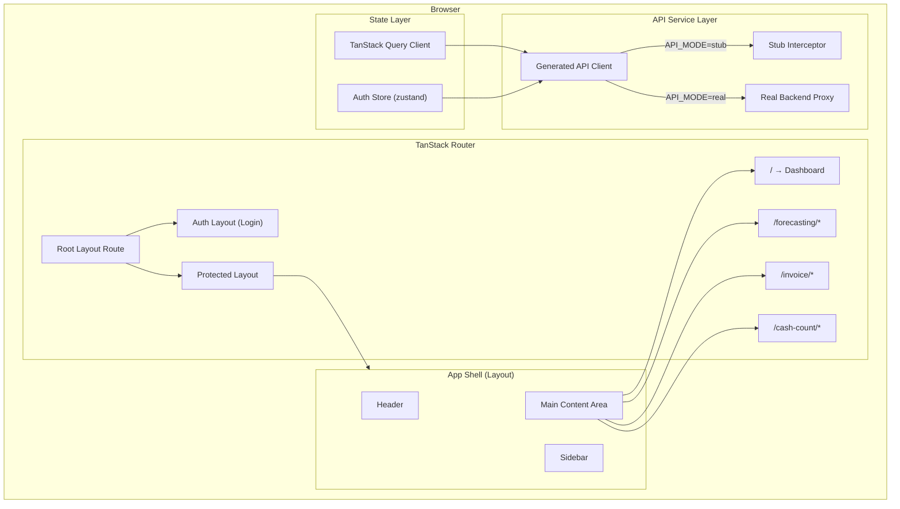
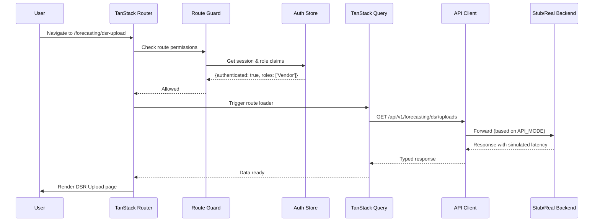
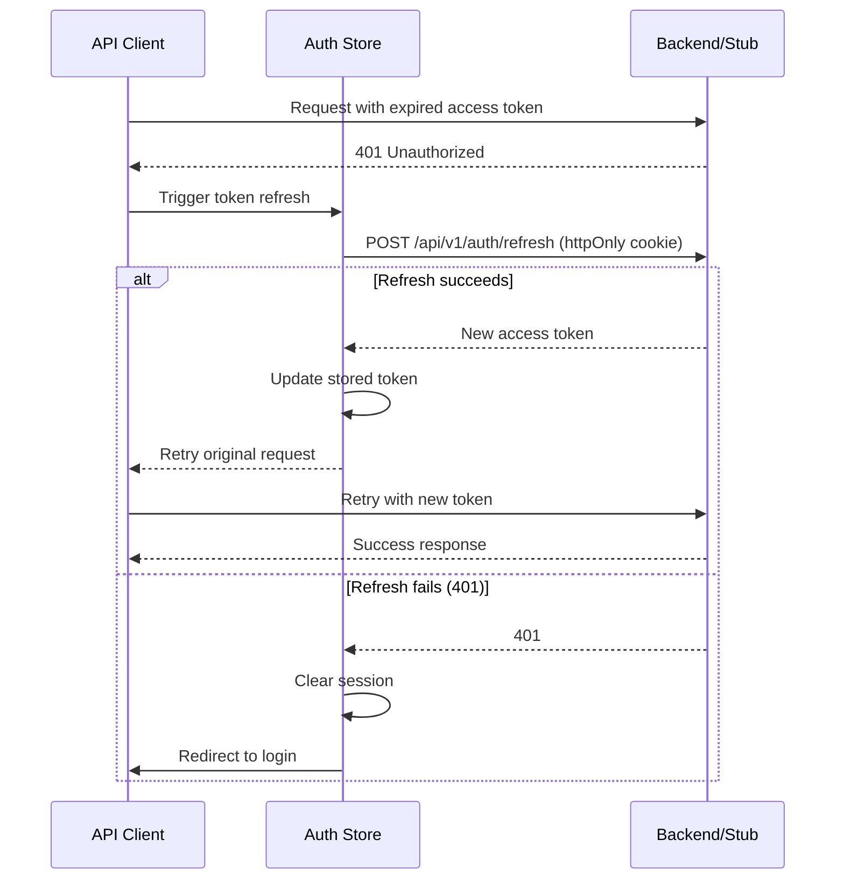
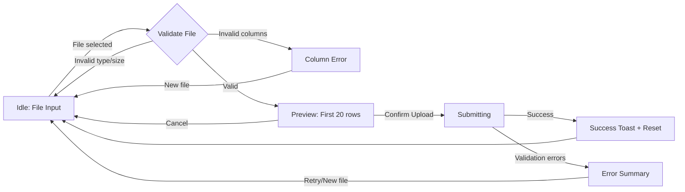
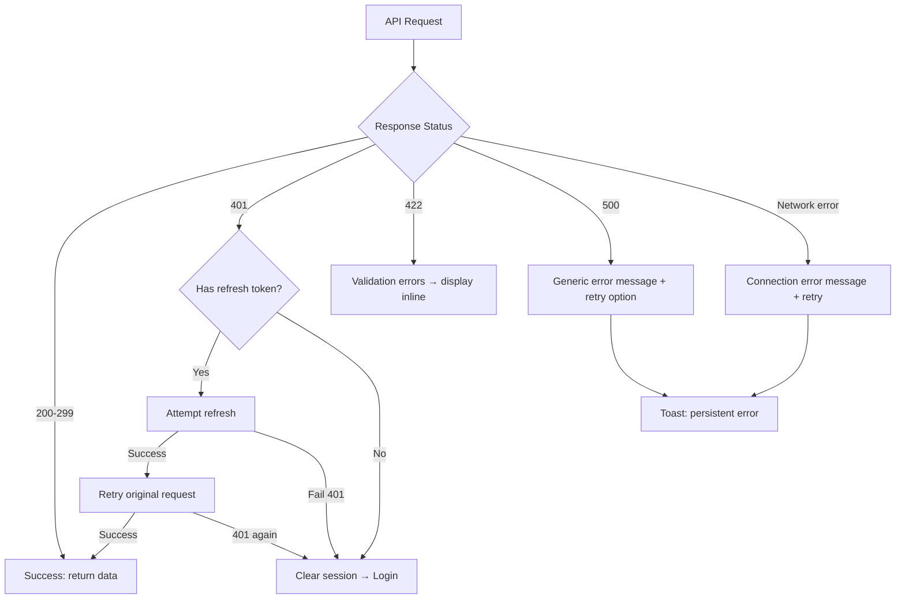

# Design Document: CMS App Foundation

## Overview

The CMS App Foundation establishes the structural UI shell for the End-to-End Cash Management System. It delivers a fully navigable, authenticated single-page application with one complete end-to-end flow (DSR Upload) running against a stub API layer.

The architecture follows an **outside-in** strategy:

1. Build the visual shell (layout, routing, design tokens)
2. Wire authentication and RBAC gating
3. Implement stub-backed pages (dashboard, module landings)
4. Deliver one real data flow (DSR Upload) end-to-end
5. Swap stubs for real backends via configuration toggle

This approach enables demo-ready UI within days while backend services mature independently.

### Key Design Decisions

| Decision | Rationale |
|----------|-----------|
| TanStack Router file-based routing | Type-safe route params, automatic code-splitting, loader-based data fetching |
| Auth tokens in memory (not localStorage) | XSS-resistant; refresh token in httpOnly cookie handles persistence |
| Stub API via service layer toggle | Single `API_MODE` env var switches all endpoints; no conditional logic in components |
| Client-side Excel parsing for preview | Immediate user feedback; final validation still happens server-side on submit |
| OKLCH CSS custom properties | Native to Tailwind 4; single source of truth for brand tokens |
| Feature-based directory organization | Co-locates route, components, hooks, and types per domain |
| Zustand for auth state | Lightweight, no provider wrappers, works outside React tree (interceptors) |
| TanStack Query for server state | Automatic cache invalidation, background refetch, optimistic updates |

## Architecture

### High-Level Component Architecture



### Request Flow (Authenticated Page Load)



### Token Refresh Flow



### DSR Upload Flow

```mermaid
statechart
```



### Frontend Directory Structure

```
frontend/src/
├── components/              # Shared UI primitives
│   ├── ui/                  # Button, Badge, Card, Toast, Skeleton, Input
│   ├── layout/              # AppShell, Sidebar, Header
│   └── feedback/            # ErrorBoundary, LoadingStates, EmptyState
├── features/
│   ├── auth/                # Login page, AuthProvider, useAuth hook
│   ├── dashboard/           # Dashboard page, MetricCard, ActivityFeed
│   ├── forecasting/         # Module landing, DSR upload flow
│   │   ├── components/      # DSRUploadForm, DSRPreviewTable, UploadHistory
│   │   ├── hooks/           # useDSRUpload, useDSRHistory
│   │   └── utils/           # Excel parser, column validator
│   ├── invoice/             # Module landing (stub cards)
│   └── cash-count/          # Module landing (stub cards)
├── lib/
│   ├── api/                 # Generated client, stub interceptor, config
│   │   ├── client.ts        # Axios/fetch wrapper with auth header injection
│   │   ├── stubs/           # Mock data factories per endpoint
│   │   └── config.ts        # API_MODE resolution
│   ├── auth/                # Token storage, refresh logic, role utils
│   ├── hooks/               # useToast, useMediaQuery, useKeyboardNav
│   └── utils/               # formatIDR, formatDate, cn() class merge
├── routes/                  # TanStack Router file-based route tree
│   ├── __root.tsx           # Root layout (QueryClientProvider, ToastProvider)
│   ├── _auth.tsx            # Auth layout (centered card)
│   ├── _protected.tsx       # Protected layout (AppShell wrapper + guard)
│   ├── _protected/
│   │   ├── index.tsx        # Dashboard
│   │   ├── forecasting/
│   │   │   ├── index.tsx    # Forecasting module landing
│   │   │   └── dsr-upload.tsx
│   │   ├── invoice/
│   │   │   └── index.tsx    # Invoice module landing
│   │   ├── cash-count/
│   │   │   └── index.tsx    # Cash Count module landing
│   │   └── settings/
│   │       └── index.tsx
│   └── _auth/
│       └── login.tsx
├── styles/
│   ├── tokens.css           # OKLCH custom properties (full design system)
│   └── index.css            # Tailwind directives + base styles
└── main.tsx                 # Entry: createRouter, render
```

## Components and Interfaces

### Core Layout Components

#### AppShell

```typescript
interface AppShellProps {
  children: React.ReactNode;
}

// Renders: fixed Sidebar (left) + fixed Header (top) + scrollable <main>
// Responsibilities:
// - CSS Grid layout: sidebar column + header row + main area
// - Responsive: sidebar collapses to icon-only at < 1024px
// - Manages sidebar expanded/collapsed state via local state
// - Provides sidebar toggle context to Header (mobile hamburger)
```

#### Sidebar

```typescript
interface SidebarProps {
  collapsed: boolean;
  onToggle: () => void;
}

interface NavItem {
  id: string;
  label: string;          // Bahasa Indonesia
  icon: LucideIcon;
  href: string;
  roles: Role[];          // Which roles can see this item ('*' = all)
  group: 'general' | 'forecasting' | 'invoice' | 'cash-count';
  disabled?: boolean;     // "Segera Hadir" state
}

// Behaviors:
// - Filters items by current user roles before rendering
// - Highlights active route via Router match (brand accent --red-500)
// - Keyboard navigable: arrow keys traverse, Enter/Space activate
// - Groups rendered with section headers (uppercase, --n-500)
// - Collapse transition: 200ms ease-out, icon-only with tooltip on hover
```

#### Header

```typescript
interface HeaderProps {
  user: AuthUser;
  onLogout: () => void;
  onSidebarToggle: () => void;
  sidebarCollapsed: boolean;
}

// Renders: user full name + role badge + logout button
// Mobile: adds hamburger menu button for sidebar toggle
// All labels in Bahasa Indonesia
```

### Auth Interfaces

```typescript
type Role =
  | 'Admin'
  | 'ATM_Support'
  | 'Cash_Management'
  | 'Vendor'
  | 'WMO'
  | 'Finance'
  | 'Cash_Count_PIC'
  | 'Cash_Count_Lead'
  | 'Branch'
  | 'Approver';

interface AuthUser {
  id: string;
  fullName: string;
  email: string;
  roles: Role[];
  primaryRole: Role;   // Displayed in header badge
}

interface AuthState {
  user: AuthUser | null;
  accessToken: string | null;
  isAuthenticated: boolean;
  isLoading: boolean;
}

interface AuthActions {
  login: (credentials: LoginCredentials) => Promise<LoginResult>;
  logout: () => void;
  refreshToken: () => Promise<boolean>;
  initialize: () => Promise<void>;  // Check existing session on app boot
}

interface LoginCredentials {
  email: string;
  password: string;
}

type LoginResult =
  | { success: true; user: AuthUser }
  | { success: false; error: string };

// Role-permission mapping for navigation visibility
const ROLE_NAV_PERMISSIONS: Record<Role, string[]> = {
  Admin: ['*'],  // Sees everything including Settings
  ATM_Support: ['dashboard', 'forecasting/*'],
  Cash_Management: ['dashboard', 'forecasting/*'],
  Vendor: ['dashboard', 'dsr-upload', 'fill-instruction-download', 'invoice-upload'],
  WMO: ['dashboard', 'invoice/*'],
  Finance: ['dashboard', 'invoice/*'],
  Cash_Count_PIC: ['dashboard', 'cash-count/*'],
  Cash_Count_Lead: ['dashboard', 'cash-count/*'],
  Branch: ['dashboard', 'forecasting/h2-projection'],
  Approver: ['dashboard', 'forecasting/*', 'invoice/*', 'cash-count/*'],
};
```

### Route Guard

```typescript
// Implemented in _protected.tsx layout route
// beforeLoad hook checks:
// 1. Is user authenticated? If not → redirect /login
// 2. Does user have required role for this route? If not → render Unauthorized page

interface RouteGuardContext {
  auth: AuthState;
  requiredRoles?: Role[];  // From route meta
}

// Unauthorized page shows:
// - "Akses Tidak Diizinkan" heading
// - Explanation text
// - "Kembali ke Beranda" link → /
```

### API Client Interfaces

```typescript
interface APIClientConfig {
  mode: 'stub' | 'real';
  baseURL: string;
  stubLatency: { min: number; max: number };  // 200-800ms
}

// The client is a thin wrapper around fetch/axios.
// Auth header injection happens in a request interceptor.
// 401 handling with refresh retry happens in a response interceptor.

interface RequestInterceptor {
  onRequest: (config: RequestConfig) => RequestConfig;
}

interface ResponseInterceptor {
  onResponse: (response: Response) => Response;
  onError: (error: APIError) => Promise<Response>;  // 401 retry logic
}
```

### DSR Upload Interfaces

```typescript
// Excel parsing result (client-side)
interface ParsedDSR {
  headers: string[];
  rows: DSRRow[];
  totalRows: number;
  filename: string;
  fileSize: number;
}

interface DSRRow {
  rowNumber: number;       // Original Excel row number
  terminalId: string;
  vaultBalance: number;
  vendorFillPlan: number;
  reconciliationResult: string;
  shortageClaim: number;
}

// Column mapping validation
const REQUIRED_DSR_COLUMNS = [
  'terminal_id',
  'vault_balance',
  'vendor_fill_plan',
  'reconciliation_result',
  'shortage_claim',
] as const;

// Upload request/response
interface DSRUploadRequest {
  rows: DSRRow[];
  filename: string;
  uploadDate: string;  // ISO 8601
}

interface DSRUploadResponse {
  id: string;
  timestamp: string;
  rowCount: number;
  status: 'accepted' | 'rejected';
  errors?: ValidationError[];
}

interface ValidationError {
  row: number;
  field: string;
  message: string;
}

// Upload history
interface DSRUploadRecord {
  id: string;
  date: string;
  filename: string;
  rowCount: number;
  status: 'accepted' | 'rejected' | 'processing';
}

// Page state machine
type DSRUploadStep = 'idle' | 'preview' | 'submitting' | 'success' | 'error';
```

### Toast System

```typescript
type ToastVariant = 'success' | 'error' | 'warning' | 'info';

interface Toast {
  id: string;
  variant: ToastVariant;
  title: string;
  description?: string;
  persistent: boolean;  // error toasts persist; success auto-dismiss after 5s
}

// Toast container uses aria-live="polite" for screen reader announcements
// Positioned top-right, stacks vertically
```

### Error Boundary

```typescript
interface ErrorBoundaryProps {
  children: React.ReactNode;
  fallback?: React.ComponentType<ErrorFallbackProps>;
}

interface ErrorFallbackProps {
  error: Error;
  resetErrorBoundary: () => void;  // Triggers page reload
}

// Default fallback shows:
// - "Terjadi Kesalahan" heading
// - Generic message (no technical details)
// - "Muat Ulang Halaman" button
```

## Data Models

### Navigation Configuration

```typescript
const NAV_CONFIG: NavItem[] = [
  // General
  { id: 'dashboard', label: 'Beranda', icon: LayoutDashboard, href: '/', roles: ['*'], group: 'general' },
  { id: 'settings', label: 'Pengaturan', icon: Settings, href: '/settings', roles: ['Admin'], group: 'general' },

  // Forecasting
  { id: 'dsr-upload', label: 'Unggah DSR', icon: Upload, href: '/forecasting/dsr-upload', roles: ['Vendor', 'ATM_Support'], group: 'forecasting' },
  { id: 'fill-instruction', label: 'Instruksi Pengisian', icon: FileText, href: '/forecasting/fill-instruction', roles: ['ATM_Support', 'Cash_Management', 'Vendor'], group: 'forecasting', disabled: true },
  { id: 'fill-validation', label: 'Validasi Pengisian', icon: CheckCircle, href: '/forecasting/fill-validation', roles: ['ATM_Support', 'Cash_Management'], group: 'forecasting', disabled: true },
  { id: 'cash-supply', label: 'Cash Supply', icon: Calculator, href: '/forecasting/cash-supply', roles: ['ATM_Support', 'Cash_Management'], group: 'forecasting', disabled: true },
  { id: 'h2-projection', label: 'Proyeksi H+2', icon: TrendingUp, href: '/forecasting/h2-projection', roles: ['ATM_Support', 'Cash_Management', 'Branch'], group: 'forecasting', disabled: true },
  { id: 'holiday-calendar', label: 'Kalender Libur', icon: Calendar, href: '/forecasting/holiday-calendar', roles: ['ATM_Support', 'Cash_Management'], group: 'forecasting', disabled: true },

  // Invoice
  { id: 'invoice-upload', label: 'Unggah Invoice', icon: Receipt, href: '/invoice/upload', roles: ['Vendor', 'WMO'], group: 'invoice', disabled: true },
  { id: 'reconciliation', label: 'Rekonsiliasi', icon: GitCompare, href: '/invoice/reconciliation', roles: ['WMO', 'Finance'], group: 'invoice', disabled: true },
  { id: 'charge-calc', label: 'Perhitungan Beban', icon: Calculator, href: '/invoice/charge-calculation', roles: ['WMO', 'Finance'], group: 'invoice', disabled: true },
  { id: 'doc-gen', label: 'Pembuatan Dokumen', icon: FileOutput, href: '/invoice/documents', roles: ['WMO', 'Finance'], group: 'invoice', disabled: true },

  // Cash Count
  { id: 'scheduling', label: 'Penjadwalan', icon: CalendarDays, href: '/cash-count/scheduling', roles: ['Cash_Count_Lead', 'Cash_Count_PIC'], group: 'cash-count', disabled: true },
  { id: 'tier-analysis', label: 'Analisis Tier Saldo', icon: BarChart3, href: '/cash-count/tier-analysis', roles: ['Cash_Count_Lead'], group: 'cash-count', disabled: true },
  { id: 'execution', label: 'Pelaksanaan (BA)', icon: ClipboardCheck, href: '/cash-count/execution', roles: ['Cash_Count_PIC'], group: 'cash-count', disabled: true },
  { id: 'checklists', label: 'Checklist', icon: ListChecks, href: '/cash-count/checklists', roles: ['Cash_Count_PIC'], group: 'cash-count', disabled: true },
  { id: 'cc-reconciliation', label: 'Rekonsiliasi', icon: Scale, href: '/cash-count/reconciliation', roles: ['Cash_Count_Lead', 'Cash_Count_PIC'], group: 'cash-count', disabled: true },
  { id: 'recapitulation', label: 'Rekapitulasi', icon: Table, href: '/cash-count/recapitulation', roles: ['Cash_Count_Lead'], group: 'cash-count', disabled: true },
];
```

### Dashboard Data

```typescript
interface DashboardMetrics {
  activeMachines: number;
  pendingFillInstructions: number;
  openReconciliationItems: number;
  pendingApprovals: number;
}

interface ActivityEvent {
  id: string;
  type: 'upload' | 'approval' | 'reconciliation' | 'generation';
  description: string;    // Bahasa Indonesia
  timestamp: string;      // ISO 8601
  actor: string;          // User full name
}

// Dashboard fetches:
// GET /api/v1/dashboard/metrics → DashboardMetrics
// GET /api/v1/dashboard/activity?limit=10 → ActivityEvent[]
```

### Module Landing Pages

```typescript
interface ModuleCard {
  id: string;
  title: string;          // Bahasa Indonesia
  description: string;    // Bahasa Indonesia
  href: string;
  icon: LucideIcon;
  disabled: boolean;      // Shows "Segera Hadir" badge when true
}

// Each module landing page renders a grid of ModuleCards
// Disabled cards have reduced opacity, no click handler, and a badge overlay
```

### API Configuration

```typescript
// Environment-driven, resolved at build time
const config = {
  API_MODE: import.meta.env.VITE_API_MODE ?? 'stub',
  API_BASE_URL: import.meta.env.VITE_API_BASE_URL ?? '/api/v1',
  STUB_LATENCY_MIN: 200,
  STUB_LATENCY_MAX: 800,
} as const;

// Stub interceptor pattern:
// 1. API client makes request normally
// 2. If API_MODE === 'stub', a middleware intercepts before network
// 3. Middleware returns mock data after random delay (200-800ms)
// 4. Switching API_MODE to 'real' removes the interceptor entirely
```

### Design Token System (CSS Custom Properties)

```css
:root {
  /* Brand Red (hue 29) — full 10-shade scale */
  --red-50: oklch(0.965 0.018 29);
  --red-100: oklch(0.925 0.045 29);
  --red-200: oklch(0.855 0.090 29);
  --red-300: oklch(0.745 0.140 29);
  --red-400: oklch(0.640 0.185 29);
  --red-500: oklch(0.552 0.205 29);
  --red-600: oklch(0.485 0.193 29);
  --red-700: oklch(0.410 0.162 29);
  --red-800: oklch(0.325 0.120 29);
  --red-900: oklch(0.250 0.082 29);

  /* Neutrals (hue 29, whisper chroma) */
  --n-0: oklch(0.992 0.003 29);
  --n-50: oklch(0.975 0.004 29);
  --n-100: oklch(0.952 0.005 29);
  --n-200: oklch(0.908 0.006 29);
  --n-300: oklch(0.845 0.007 29);
  --n-400: oklch(0.700 0.008 29);
  --n-500: oklch(0.560 0.009 29);
  --n-600: oklch(0.448 0.008 29);
  --n-700: oklch(0.352 0.007 29);
  --n-800: oklch(0.258 0.006 29);
  --n-900: oklch(0.178 0.005 29);

  /* Semantic colors */
  --success-bg: oklch(0.955 0.03 155);
  --success-fg: oklch(0.480 0.115 155);
  --success-solid: oklch(0.560 0.130 155);
  --warning-bg: oklch(0.960 0.055 78);
  --warning-fg: oklch(0.520 0.115 78);
  --warning-solid: oklch(0.760 0.150 78);
  --danger-bg: oklch(0.955 0.035 12);
  --danger-fg: oklch(0.500 0.195 12);
  --danger-500: oklch(0.545 0.205 12);
  --info-bg: oklch(0.955 0.03 245);
  --info-fg: oklch(0.480 0.110 245);
  --info-solid: oklch(0.580 0.120 245);

  /* Spacing (4pt scale) */
  --space-1: 4px;
  --space-2: 8px;
  --space-3: 12px;
  --space-4: 16px;
  --space-6: 24px;
  --space-8: 32px;
  --space-12: 48px;
  --space-18: 72px;

  /* Radius */
  --radius-sm: 4px;
  --radius-md: 6px;
  --radius-lg: 10px;

  /* Shadows (brand-tinted) */
  --shadow-sm: 0 1px 2px oklch(0.25 0.02 29 / 0.06);
  --shadow-md: 0 4px 12px oklch(0.25 0.02 29 / 0.08);

  /* Typography */
  --font-sans: -apple-system, BlinkMacSystemFont, "Segoe UI", system-ui, sans-serif;
}
```


## Correctness Properties

*A property is a characteristic or behavior that should hold true across all valid executions of a system — essentially, a formal statement about what the system should do. Properties serve as the bridge between human-readable specifications and machine-verifiable correctness guarantees.*

### Property 1: RBAC Navigation Filtering

*For any* user with a given set of roles, the navigation filter function SHALL return only those nav items whose `roles` array intersects with the user's roles (or contains the wildcard `'*'`). No item outside the user's role permissions should ever appear, and no permitted item should ever be omitted.

**Validates: Requirements 3.1, 3.2, 3.3, 3.4, 3.5, 3.7**

### Property 2: Active Route Highlighting

*For any* valid route path from the navigation configuration, the active-item-matching function SHALL return exactly one nav item whose `href` matches the current route. No route should match zero items (when the route is a known nav route) and no route should match more than one item.

**Validates: Requirements 1.5**

### Property 3: Unauthenticated Route Protection

*For any* route in the protected route set, when the auth state indicates the user is not authenticated, the route guard SHALL produce a redirect to the `/login` path. No protected route should ever render content for an unauthenticated user.

**Validates: Requirements 2.1**

### Property 4: Unauthorized Route Blocking

*For any* (role, route) pair where the role does NOT have permission to access that route, the route guard SHALL produce an unauthorized response (render the "Akses Tidak Diizinkan" page). No unauthorized role should ever access a restricted route's content.

**Validates: Requirements 3.6**

### Property 5: Login Error Message Safety

*For any* failed login attempt, the displayed error message SHALL NOT contain field-specific identifiers (such as "email", "password", "kata sandi", or "surel") that would reveal which credential was incorrect. The message must be generic.

**Validates: Requirements 2.4**

### Property 6: IDR Currency Formatting

*For any* non-negative integer value, the `formatIDR` function SHALL produce a string that begins with "Rp" followed by the number formatted with dot-separated thousands (Indonesian locale). The output must use `tabular-nums` font variant class and right-alignment. `formatIDR(0)` = "Rp0", `formatIDR(1000)` = "Rp1.000", etc.

**Validates: Requirements 4.3, 7.6**

### Property 7: Dashboard Metrics Completeness

*For any* valid `DashboardMetrics` object (where all four fields are non-negative integers), rendering the MetricCards component SHALL produce output containing all four metric values (activeMachines, pendingFillInstructions, openReconciliationItems, pendingApprovals) as formatted strings.

**Validates: Requirements 4.2**

### Property 8: Header User Info Display

*For any* valid `AuthUser` object with a non-empty `fullName` and a valid `primaryRole`, rendering the Header component SHALL produce output containing the user's `fullName` text and the `primaryRole` badge text.

**Validates: Requirements 1.7**

### Property 9: Module Landing Card Rendering

*For any* array of `ModuleCard` objects, rendering the module landing page SHALL produce exactly one card element per entry in the array, and each card SHALL contain the card's `title` text.

**Validates: Requirements 5.2**

### Property 10: Disabled Card "Segera Hadir" Label

*For any* `ModuleCard` with `disabled: true`, rendering that card SHALL produce output containing the text "Segera Hadir" and the card SHALL NOT have a functional click/navigation handler.

**Validates: Requirements 5.6**

### Property 11: DSR File Size Validation

*For any* file with a valid extension (.xlsx or .xls), the file validation function SHALL accept the file if its size is ≤ 10,485,760 bytes (10MB) and SHALL reject the file with a descriptive error if its size exceeds 10,485,760 bytes.

**Validates: Requirements 6.2**

### Property 12: DSR Column Validation

*For any* set of column headers extracted from an Excel file, the column validation function SHALL return valid if and only if the set is a superset of `REQUIRED_DSR_COLUMNS` (terminal_id, vault_balance, vendor_fill_plan, reconciliation_result, shortage_claim). Missing columns SHALL be identified in the rejection message.

**Validates: Requirements 6.8**

### Property 13: DSR Preview Row Limit

*For any* parsed DSR data containing N rows (where N ≥ 1), the preview function SHALL return exactly `min(N, 20)` rows, taken from the beginning of the dataset.

**Validates: Requirements 6.3**

### Property 14: DSR Upload Success Toast Content

*For any* `DSRUploadResponse` with `status: 'accepted'`, the success handler SHALL produce a toast notification containing both the `timestamp` value and the `rowCount` value from the response.

**Validates: Requirements 6.6**

### Property 15: DSR Validation Error Display Completeness

*For any* non-empty array of `ValidationError` objects (each having `row` and `field`), the error summary renderer SHALL produce output containing every error's `row` number and `field` name. No error from the array should be omitted.

**Validates: Requirements 6.7**

### Property 16: DSR Upload History Limit

*For any* list of `DSRUploadRecord` objects of length N, the history display function SHALL show exactly `min(N, 30)` records, ordered by most recent date first.

**Validates: Requirements 6.9**

### Property 17: Stub API Latency Range

*For any* request intercepted by the Stub API, the simulated delay SHALL be a value in the inclusive range [200ms, 800ms].

**Validates: Requirements 8.2**

### Property 18: Auth Header Injection

*For any* outgoing request to a protected API endpoint when a non-null access token exists in the auth store, the request interceptor SHALL add an `Authorization: Bearer {token}` header. The token value in the header SHALL exactly match the stored access token.

**Validates: Requirements 8.4**

### Property 19: Server Error Message Sanitization

*For any* HTTP 500 error response (regardless of the response body content — which may contain stack traces, SQL errors, or internal messages), the error handler SHALL produce only a fixed generic user-facing message that does not contain any substring from the original error response body.

**Validates: Requirements 9.3**

### Property 20: Icon Button Accessibility Labels

*For any* Button component rendered in icon-only mode (no visible text content), the rendered element SHALL have a non-empty `aria-label` attribute.

**Validates: Requirements 10.3**

### Property 21: Design System Contrast Compliance

*For any* (text-color-token, background-color-token) pair used in the design system, the computed OKLCH contrast ratio SHALL be ≥ 4.5:1 for normal text sizes (< 18px or < 14px bold) and ≥ 3:1 for large text sizes (≥ 18px or ≥ 14px bold).

**Validates: Requirements 10.4**

## Error Handling

### Strategy Overview

Error handling follows a layered approach: component-level → page-level → app-level.

| Layer | Mechanism | Behavior |
|-------|-----------|----------|
| Network errors | API client response interceptor | Distinguishes connection errors from server errors |
| 401 responses | Auth interceptor | Automatic token refresh + retry (once) |
| 500 responses | Error state in TanStack Query | Generic message, no technical details exposed |
| Component crashes | React Error Boundary | Fallback UI with reload option |
| Validation errors | Form-level (Zod) + API response | Inline field errors + summary |
| User notifications | Toast system | Success = auto-dismiss 5s, Error = persistent |

### Error Flow



### Error States by Component

| Component | Error Condition | Display |
|-----------|----------------|---------|
| Dashboard metrics | API fetch fails | Hide metrics section, show retry button + error message |
| Activity feed | API fetch fails | "Gagal memuat aktivitas" with retry |
| DSR file upload | Invalid file type/size | Inline error below file input |
| DSR preview | Invalid columns | Error card identifying missing columns |
| DSR submit | Backend validation errors | Error summary table (row + field + message) |
| Any page | Unhandled component error | Error boundary fallback with reload |
| Any mutation | Success | Success toast, auto-dismiss 5s |
| Any mutation | Failure | Error toast, persistent until dismissed |

### Toast Behavior Rules

- **Success toasts**: auto-dismiss after 5 seconds, `aria-live="polite"` announcement
- **Error toasts**: persist until user clicks dismiss, `aria-live="polite"` announcement
- **Toast stacking**: max 5 visible at once, newest at top
- **Toast content**: title (required) + description (optional), icon matches variant
- **Screen reader**: toast container is an `aria-live="polite"` region; visual display is independent of SR announcement success

## Testing Strategy

### Testing Pyramid

```
         ┌─────────┐
         │  E2E    │  Playwright: critical paths (login → DSR upload → success)
         ├─────────┤
         │  Integ  │  Component integration: route guards, API interceptors, auth flow
         ├─────────┤
         │Property │  fast-check: 21 properties, 100+ iterations each
         ├─────────┤
         │  Unit   │  Vitest: formatIDR, validators, parsers, pure logic
         └─────────┘
```

### Property-Based Testing

**Library:** [fast-check](https://github.com/dubzzz/fast-check) (TypeScript-native PBT library)

**Configuration:**
- Minimum 100 iterations per property
- Each property test tagged with: `Feature: cms-app-foundation, Property {N}: {title}`
- Properties organized in `__tests__/properties/` directories co-located with features

**Property Test Files:**

| File | Properties Covered |
|------|-------------------|
| `lib/auth/__tests__/properties/auth.property.test.ts` | P3, P4, P5, P18 |
| `lib/utils/__tests__/properties/format.property.test.ts` | P6 |
| `components/layout/__tests__/properties/navigation.property.test.ts` | P1, P2, P8 |
| `features/dashboard/__tests__/properties/dashboard.property.test.ts` | P7 |
| `features/forecasting/__tests__/properties/dsr-upload.property.test.ts` | P11, P12, P13, P14, P15, P16 |
| `components/ui/__tests__/properties/module-cards.property.test.ts` | P9, P10 |
| `lib/api/__tests__/properties/api-client.property.test.ts` | P17, P19 |
| `components/ui/__tests__/properties/accessibility.property.test.ts` | P20 |
| `styles/__tests__/properties/contrast.property.test.ts` | P21 |

### Unit Tests (Example-Based)

Focus areas for example-based unit tests:
- Specific role → nav items mappings (ATM_Support sees Forecasting, Vendor sees only 3 items)
- Login form rendering and submission
- Logout clears state and redirects
- Dashboard error/loading states
- Module landing page exact card counts (6 for Forecasting, 4 for Invoice, 6 for Cash Count)
- Toast auto-dismiss timing (5s for success)
- Responsive sidebar collapse at 1024px breakpoint
- File input accept attribute (.xlsx, .xls)
- Document lang="id" attribute
- Skeleton loading state rendering

### Integration Tests

- Route guard redirect flow (unauthenticated → /login)
- Token refresh interceptor (401 → refresh → retry → success)
- Double 401 → session clear → redirect to login
- API_MODE switch (stub → real routing)
- DSR upload flow (file select → parse → preview → submit → toast)
- Error boundary catch and fallback render
- Keyboard navigation in sidebar (arrow keys, Enter/Space)

### E2E Tests (Playwright)

Critical user journeys:
1. Login → Dashboard → Verify metrics visible
2. Login as Vendor → Navigate to DSR Upload → Upload valid file → Preview → Submit → Success toast
3. Login as ATM_Support → Verify Forecasting nav visible, Invoice nav hidden
4. Attempt direct URL access to unauthorized route → Verify "Akses Tidak Diizinkan" page
5. Session expiry simulation → Verify redirect to login with "Sesi berakhir" notification
6. Full keyboard-only navigation: Tab to sidebar → Arrow keys → Enter to navigate

### Test Infrastructure

- **Runner:** Vitest (unit + property + integration)
- **Component testing:** @testing-library/react
- **PBT:** fast-check
- **E2E:** Playwright
- **Coverage target:** 80%+ for `lib/` and `features/` directories
- **CI integration:** `pnpm test` runs unit + property + integration; `pnpm test:e2e` runs Playwright separately
