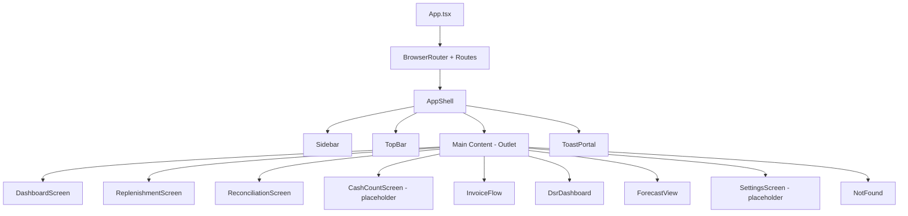
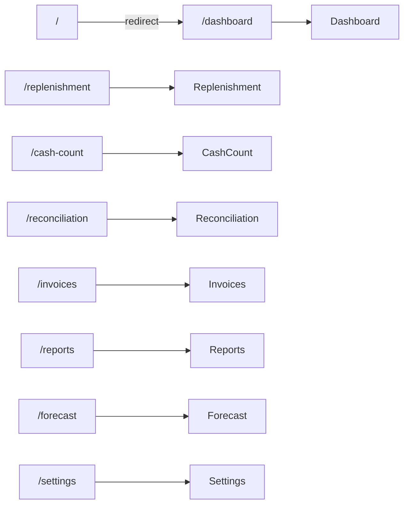
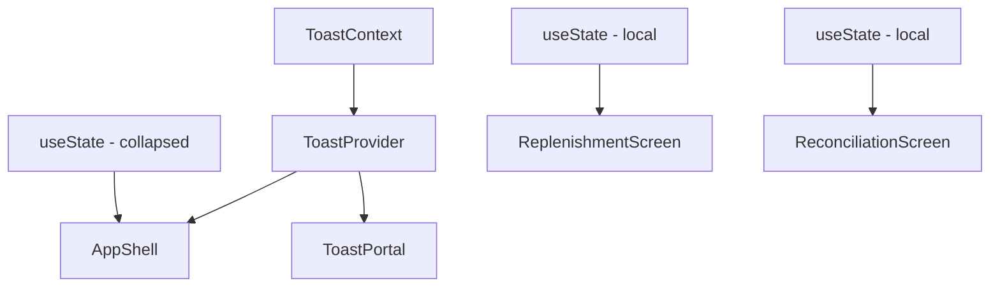

# Design Document: CMS Dashboard Redesign

## Overview

This design transforms the existing four-screen CMS prototype (DSR Dashboard, Forecast View, CIT Tracker, Invoice Flow) into a dashboard-centric operational interface matching the HTML reference (`cms-atm-internal-prototype.html`). The redesign introduces:

- A new **Dashboard** landing page with greeting, KPI metric strip, replenishment summary, and attention panel
- A **Replenishment Schedules** screen replacing the CIT Tracker with vendor route tracking and filters
- A **Reconciliation** screen for comparing counted cash against Corebanking escrow
- Restructured **sidebar navigation** with two groups (Operations, Control) and brand identity
- An enhanced **top bar** with global search, notifications, and profile section
- A **toast notification** system for action feedback
- Updated **design tokens** (OKLCH color space) and **responsive layouts**

The prototype remains fully static — no backend, no API calls. All data comes from local JSON files loaded synchronously.

### Key Design Decisions

1. **React Router DOM retained** — The current app uses `react-router-dom` v7. We keep it rather than migrating to TanStack Router mid-redesign to minimize risk. Route structure changes only.
2. **Feature-based module structure** — New screens (dashboard, replenishment, reconciliation) become new feature folders. Existing features (dsr, forecast, invoice) are retained but moved under "Control" navigation.
3. **Toast via React Context** — A lightweight context + portal approach avoids external dependencies for a simple notification system.
4. **CSS custom properties for tokens** — Design tokens defined in a root stylesheet, consumed via Tailwind's arbitrary value syntax (`[var(--token)]`) for consistency with the HTML reference.
5. **No TanStack Query for static data** — Since all data is local JSON, we use simple hook wrappers with direct imports rather than query caching.

---

## Architecture

### High-Level Component Tree



### Navigation Flow



### State Architecture



The app has minimal global state:
- **Toast context**: Provides `showToast(message, icon?)` to any component
- **Sidebar collapse**: Local state in AppShell, responsive to viewport width
- **Screen-level filters**: Local `useState` within each screen component (no URL params needed for prototype)

---

## Components and Interfaces

### Layout Components

#### AppShell (refactored)
```typescript
// src/app/AppShell.tsx
interface AppShellProps {
  // No props — uses context and internal state
}

// Manages sidebar collapse state, viewport responsiveness, and toast context
// Grid layout: sidebar | workspace (topbar + content)
```

#### Sidebar (redesigned)
```typescript
// src/components/layout/Sidebar.tsx
interface SidebarProps {
  collapsed: boolean;
  onToggle: () => void;
  mobileOpen: boolean;
  onMobileClose: () => void;
}

interface NavGroup {
  label: string;           // "Operations" | "Control"
  items: NavItem[];
}

interface NavItem {
  path: string;
  label: string;
  icon: LucideIcon;
  badge?: number;          // Pending count, undefined = no badge
}
```

#### TopBar (redesigned)
```typescript
// src/components/layout/TopBar.tsx
interface TopBarProps {
  onMenuClick: () => void; // Mobile hamburger handler
}

// Contains: search input, notification button, profile section
// Keyboard shortcut: Cmd+K / Ctrl+K focuses search
```

### New Screen Components

#### DashboardScreen
```typescript
// src/features/dashboard/DashboardScreen.tsx
// Sections: Greeting, MetricStrip, DashboardGrid (ReplenishmentTable + AttentionPanel)

interface MetricData {
  label: string;
  icon: LucideIcon;
  value: string;           // Formatted display value
  meta: string;            // Subtitle text
  metaHighlight?: string;  // Colored portion of meta
  variant?: 'success' | 'attention';
}
```

#### MetricStrip
```typescript
// src/features/dashboard/MetricStrip.tsx
interface MetricStripProps {
  metrics: MetricData[];   // Exactly 4 items
}
```

#### AttentionPanel
```typescript
// src/features/dashboard/AttentionPanel.tsx
interface AttentionItem {
  id: string;
  category: 'danger' | 'warning' | 'info';
  icon: string;            // Lucide icon name
  title: string;
  description: string;
  time: string;            // Relative timestamp
}

interface AttentionPanelProps {
  items: AttentionItem[];
}
```

#### ReplenishmentScreen
```typescript
// src/features/replenishment/ReplenishmentScreen.tsx
// Contains: PageHeader, Toolbar (filters), DataTable, EmptyState

interface ReplenishmentSchedule {
  id: string;              // e.g., "SCH-260721-041"
  routeCode: string;       // e.g., "JKT-S-041"
  region: string;
  vendor: string;
  windowStart: string;     // HH:mm
  windowEnd: string;       // HH:mm
  machineCount: number;
  completionCount: number;
  status: 'completed' | 'in-transit' | 'scheduled' | 'delayed' | 'pending-vendor';
  cashValue: number;       // Raw IDR integer
}
```

#### ReconciliationScreen
```typescript
// src/features/reconciliation/ReconciliationScreen.tsx
// Contains: PageHeader, NoticeBanner, Toolbar (filters), DataTable, EmptyState

interface ReconciliationException {
  id: string;
  atmId: string;
  lastCountTime: string;   // ISO 8601
  location: string;
  countedAmount: number;   // IDR integer
  escrowAmount: number;    // IDR integer
  difference: number;      // counted - escrow
  severity: 'high' | 'medium';
  owner: string | null;    // null = "Unassigned"
}
```

### Shared UI Components

#### ProgressBar (new)
```typescript
// src/components/ui/ProgressBar.tsx
interface ProgressBarProps {
  completed: number;
  total: number;
  status: 'in-transit' | 'completed' | 'delayed';
}
// Fill color derived from status:
// in-transit → --red-500, completed → success solid, delayed → warning solid
```

#### Toast (new)
```typescript
// src/components/ui/Toast.tsx
interface ToastMessage {
  id: string;
  text: string;
  icon?: 'success' | 'info' | 'warning';
}

// ToastContext provides:
interface ToastContextValue {
  showToast: (text: string, icon?: ToastMessage['icon']) => void;
}
```

#### PageHeader (new)
```typescript
// src/components/ui/PageHeader.tsx
interface PageHeaderProps {
  eyebrow: string;
  title: string;
  description?: string;
  actions?: React.ReactNode;
}
```

#### NoticeBanner (new)
```typescript
// src/components/ui/NoticeBanner.tsx
interface NoticeBannerProps {
  icon: LucideIcon;
  title: string;
  description: string;
  variant?: 'warning' | 'danger' | 'info';
}
```

---

## Data Models

### Mock Data Files

All mock data lives in `src/data/` as JSON files imported directly.

#### dashboard-kpi.json
```json
{
  "managedCash": 18420000000000,
  "managedCashDisplay": "IDR 18.42T",
  "managedCashChange": 2.4,
  "atmAvailability": 98.7,
  "atmOnline": 4812,
  "atmTotal": 4875,
  "todayRoutes": 184,
  "routesCompleted": 142,
  "routesActive": 42,
  "exceptions": 7,
  "exceptionsHigh": 3,
  "exceptionsCutoffHour": 14
}
```

#### replenishment-schedules.json
```json
[
  {
    "id": "SCH-260721-041",
    "routeCode": "JKT-S-041",
    "region": "South Jakarta",
    "vendor": "TAG",
    "windowStart": "08:00",
    "windowEnd": "12:00",
    "machineCount": 18,
    "completionCount": 15,
    "status": "in-transit",
    "cashValue": 12800000000
  }
]
```

#### reconciliation-exceptions.json
```json
[
  {
    "id": "REC-001",
    "atmId": "ATM-JKT-008",
    "lastCountTime": "2026-07-21T08:42:00+07:00",
    "location": "Menara Sentraya",
    "countedAmount": 1875000000,
    "escrowAmount": 2000000000,
    "difference": -125000000,
    "severity": "high",
    "owner": "R. Sanjaya"
  }
]
```

#### attention-items.json
```json
[
  {
    "id": "ATT-001",
    "category": "danger",
    "icon": "triangle-alert",
    "title": "Escrow mismatch",
    "description": "ATM 00874 differs by IDR 125,000,000.",
    "time": "8m"
  }
]
```

### Data Referential Integrity Constraints

- `reconciliation-exceptions[].atmId` must reference a valid ATM ID in `atms.json`
- `replenishment-schedules[].vendor` must reference a valid vendor name in `vendors.json`
- `dashboard-kpi.atmOnline` ≤ `dashboard-kpi.atmTotal`
- `replenishment-schedules[].completionCount` ≤ `replenishment-schedules[].machineCount`
- `reconciliation-exceptions[].difference` = `countedAmount - escrowAmount`

### Utility Functions

```typescript
// src/lib/formatters.ts

/** Format IDR amount with abbreviation: T (trillion), B (billion), M (million) */
export function formatIDR(value: number): string;

/** Format IDR amount with dot-separated thousands */
export function formatIDRFull(value: number): string;

/** Get time-of-day greeting */
export function getGreeting(hour: number): 'Good morning' | 'Good afternoon' | 'Good evening';

/** Format date as full weekday string */
export function formatFullDate(date: Date): string;

/** Calculate progress percentage */
export function progressPercent(completed: number, total: number): number;
```

---


## Correctness Properties

*A property is a characteristic or behavior that should hold true across all valid executions of a system — essentially, a formal statement about what the system should do. Properties serve as the bridge between human-readable specifications and machine-verifiable correctness guarantees.*

### Property 1: Badge count display formatting

*For any* non-negative integer count, the badge display function SHALL return: no badge when count is 0, the count as a string when count is 1–99, and "99+" when count exceeds 99.

**Validates: Requirements 1.6**

### Property 2: Avatar initials extraction

*For any* non-empty user name string containing a first name and last name, the initials function SHALL return exactly 2 characters consisting of the uppercase first letter of the first name and the uppercase first letter of the last name.

**Validates: Requirements 2.5**

### Property 3: Time-of-day greeting

*For any* integer hour in the range 0–23, the greeting function SHALL return "Good morning" for hours 0–11, "Good afternoon" for hours 12–17, and "Good evening" for hours 18–23.

**Validates: Requirements 3.1**

### Property 4: Progress bar calculation

*For any* pair (completed, total) where 0 ≤ completed ≤ total and total > 0, the progress percentage SHALL equal Math.round(completed / total × 100), and the progress label SHALL be the string "{completed} of {total}".

**Validates: Requirements 4.3**

### Property 5: Status-priority sort ordering

*For any* array of replenishment records with mixed statuses, after applying status-priority sort, all "delayed" records SHALL precede all "in-transit" records, which SHALL precede all "completed" records.

**Validates: Requirements 4.7**

### Property 6: Replenishment combined filter correctness

*For any* array of replenishment schedules and any combination of region and vendor filter values, every record in the filtered result SHALL match the selected region (if not "All") AND match the selected vendor (if not "All"), and the result count SHALL equal the length of the filtered array.

**Validates: Requirements 6.5, 6.6, 6.7**

### Property 7: Filter clear restores full dataset

*For any* array of replenishment schedules, applying any filter and then clearing all filters back to "All" SHALL produce a result set identical to the original unfiltered array.

**Validates: Requirements 6.8**

### Property 8: Difference sign formatting

*For any* non-zero numeric difference value, the formatting function SHALL return a string with "- " prefix and danger color class when the value is negative, and "+ " prefix and success color class when the value is positive.

**Validates: Requirements 7.5**

### Property 9: Reconciliation filter correctness

*For any* array of reconciliation exception records and any combination of severity filter and exception type filter values, every record in the filtered result SHALL satisfy both filter predicates simultaneously, and the result count SHALL equal the filtered array length.

**Validates: Requirements 7.7, 7.8**

### Property 10: Mock data referential integrity

*For any* ATM ID referenced in reconciliation-exceptions.json, that ID SHALL exist in atms.json. *For any* vendor name in replenishment-schedules.json, that name SHALL exist in vendors.json. The dashboard KPI atmOnline value SHALL not exceed atmTotal.

**Validates: Requirements 11.5**

---

## Error Handling

Since this is a static frontend prototype with no backend, error handling is minimal:

| Scenario | Handling |
|----------|----------|
| Unknown route | Render `NotFound` component with link to `/dashboard` |
| Missing mock data import | Build-time TypeScript error (imports are static) |
| Empty filter results | Render `EmptyState` component with helpful hint text |
| Toast overflow | Replace current toast with new one, restart auto-dismiss timer |
| Invalid badge count (negative) | Treat as 0, show no badge |
| Division by zero in progress | Guard with `total > 0` check, default to 0% |

No network errors, authentication failures, or server errors exist in this prototype scope.

---

## Testing Strategy

### Unit Tests (Vitest + React Testing Library)

Focus areas:
- **Formatter functions** (`formatIDR`, `getGreeting`, `formatFullDate`, `progressPercent`, `formatBadgeCount`, `getInitials`, `formatDifference`): Pure functions with concrete examples
- **Filter logic** (replenishment and reconciliation): Verify filtering produces correct subsets
- **Sort logic** (status-priority): Verify ordering invariant
- **Component rendering**: Key structural assertions (PageHeader, MetricStrip, AttentionPanel, Toast)
- **Keyboard shortcuts**: Cmd+K focus behavior
- **Toast context**: `showToast` triggers toast render, auto-dismiss timing, replacement behavior

### Property-Based Tests (fast-check)

The project already uses `fast-check` (installed in devDependencies). Each correctness property above becomes a property-based test with minimum 100 iterations.

**Library**: fast-check v4
**Configuration**: 100+ runs per property, seed-based reproducibility
**Tag format**: `Feature: cms-dashboard-redesign, Property {N}: {title}`

Property tests target the pure logic layer:
- `formatBadgeCount(count)` — Property 1
- `getInitials(name)` — Property 2
- `getGreeting(hour)` — Property 3
- `progressPercent(completed, total)` + label — Property 4
- `sortByStatusPriority(records)` — Property 5
- `filterSchedules(records, region, vendor)` — Properties 6, 7
- `formatDifference(value)` — Property 8
- `filterExceptions(records, severity, type)` — Property 9
- Referential integrity check across JSON files — Property 10

### E2E Tests (Playwright)

Existing Playwright suite extended for:
- Navigation structure (sidebar groups, active states)
- Mobile responsive behavior (hamburger, scrim, stacking)
- Toast appearance on button clicks
- Filter interactions on Replenishment and Reconciliation screens
- Route transitions and page-enter animations

### What is NOT Property-Tested

- CSS styling assertions (use visual regression or manual review)
- Responsive breakpoint behavior (Playwright viewport tests)
- Animation timing (visual/manual verification)
- Accessibility compliance (manual audit + axe-core in E2E)
- Static rendering structure (example-based unit tests sufficient)
