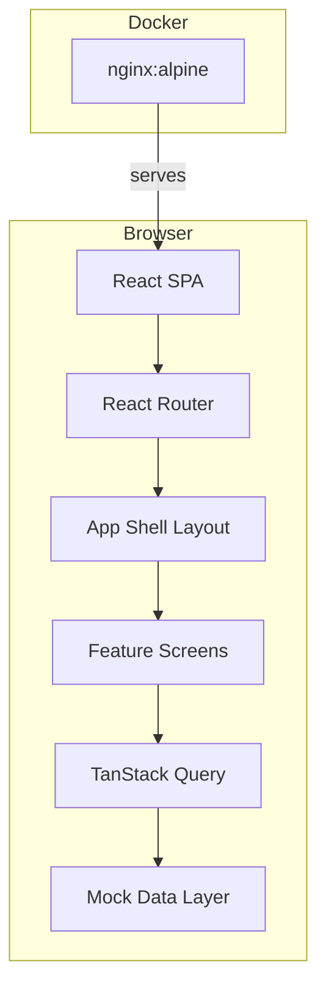
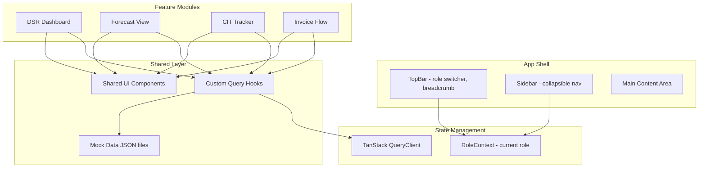
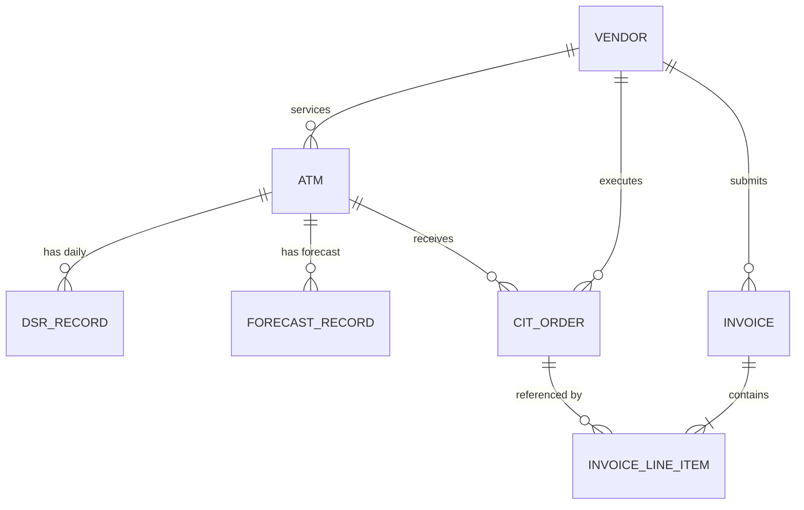

# Design Document: CMS Frontend Prototype

## Overview

This design describes a frontend-only stakeholder demo for the CIMB Niaga Cash Management System. The prototype is a single Vite + React + TypeScript SPA that renders four operational screens (DSR Dashboard, Forecast View, CIT Tracker, Invoice Flow) powered entirely by static JSON mock data. No backend exists — all state lives in-memory via React state and TanStack Query's cache seeded from local JSON imports.

The app provides a role switcher (Admin, Operator, Manager, Vendor) that controls navigation visibility and action permissions. It ships inside a single Docker container (nginx:alpine serving the Vite production build).

**Key Design Decisions:**
- React Router (not TanStack Router) for speed — migration to TanStack Router deferred to production phase.
- TanStack Query wraps mock data access to simulate real async patterns so the upgrade to a live API is a one-line change per query.
- TanStack Table v8 (headless) drives all data tables with sorting, filtering, and formatting built-in.
- Tailwind CSS 4 with OKLCH tokens from the design system steering doc.
- Feature-based folder structure under `frontend/src/features/`.

---

## Architecture

### High-Level Architecture



**Data Flow:**
1. User navigates → React Router resolves route → renders feature screen component
2. Feature screen uses TanStack Query hooks → query functions import static JSON
3. TanStack Query caches the data → components render via TanStack Table or custom UI
4. Role context (React Context) gates navigation items and action buttons

### Low-Level Architecture



### State Management Strategy

| State Type | Solution | Scope |
|------------|----------|-------|
| Server/mock data | TanStack Query | Global cache, per-feature hooks |
| Current role | React Context | App-wide |
| Sidebar collapsed | `useState` in AppShell | Layout-local |
| Table sorting/filtering | TanStack Table state | Per-table instance |
| Selected invoice | `useState` in InvoiceFlow | Feature-local |
| Selected date (DSR) | `useState` in DsrDashboard | Feature-local |

### TanStack Query Pattern for Mock Data

```typescript
// Pattern: wrap JSON import in a query function
// This makes migration to real API trivial — swap the queryFn only
import dsrData from '@/data/dsr.json';

export function useDsrData(date: string) {
  return useQuery({
    queryKey: ['dsr', date],
    queryFn: () => {
      // Simulate async — in production this becomes fetch('/api/dsr?date=...')
      const filtered = dsrData.filter(r => r.date === date);
      return Promise.resolve(filtered);
    },
    staleTime: Infinity, // mock data never goes stale
  });
}
```

---

## Components and Interfaces

### Folder Structure

```
frontend/
├── src/
│   ├── app/
│   │   ├── App.tsx                 # Router + providers
│   │   ├── AppShell.tsx            # Layout: sidebar + topbar + outlet
│   │   └── routes.tsx              # Route definitions
│   ├── components/
│   │   ├── ui/
│   │   │   ├── Badge.tsx           # Semantic badge (icon + label)
│   │   │   ├── Button.tsx          # Primary, secondary, ghost, danger
│   │   │   ├── Card.tsx            # Summary card wrapper
│   │   │   ├── DataTable.tsx       # Generic TanStack Table wrapper
│   │   │   ├── DatePicker.tsx      # Simple date selector
│   │   │   ├── EmptyState.tsx      # No-data message component
│   │   │   ├── FilterSelect.tsx    # Dropdown filter control
│   │   │   ├── SummaryCard.tsx     # Metric card with label + value
│   │   │   └── WorkflowSteps.tsx   # Step indicator (Invoice flow)
│   │   ├── layout/
│   │   │   ├── Sidebar.tsx         # Collapsible sidebar
│   │   │   ├── TopBar.tsx          # Top bar with role switcher
│   │   │   └── RoleSwitcher.tsx    # Role dropdown component
│   │   └── NotFound.tsx            # 404 page
│   ├── features/
│   │   ├── dsr/
│   │   │   ├── DsrDashboard.tsx    # Main DSR page
│   │   │   ├── DsrTable.tsx        # DSR data table
│   │   │   ├── DsrSummary.tsx      # Summary cards
│   │   │   ├── useDsrData.ts       # TanStack Query hook
│   │   │   └── dsr.types.ts        # TypeScript interfaces
│   │   ├── forecast/
│   │   │   ├── ForecastView.tsx    # Main Forecast page
│   │   │   ├── ForecastTable.tsx   # Forecast data table
│   │   │   ├── ScheduleList.tsx    # Replenishment schedule
│   │   │   ├── useForecastData.ts  # TanStack Query hook
│   │   │   └── forecast.types.ts   # TypeScript interfaces
│   │   ├── cit/
│   │   │   ├── CitTracker.tsx      # Main CIT page
│   │   │   ├── CitTable.tsx        # CIT order table
│   │   │   ├── CitSummary.tsx      # Status count cards
│   │   │   ├── useCitData.ts       # TanStack Query hook
│   │   │   └── cit.types.ts        # TypeScript interfaces
│   │   └── invoice/
│   │       ├── InvoiceFlow.tsx     # Main Invoice page
│   │       ├── InvoiceList.tsx     # Invoice list table
│   │       ├── InvoiceDetail.tsx   # Detail panel with line items
│   │       ├── useInvoiceData.ts   # TanStack Query hook
│   │       └── invoice.types.ts    # TypeScript interfaces
│   ├── context/
│   │   └── RoleContext.tsx         # Role state + provider
│   ├── data/
│   │   ├── atms.json              # ATM master data
│   │   ├── dsr.json               # DSR records (7 days × 20+ ATMs)
│   │   ├── forecast.json          # Forecast records
│   │   ├── cit-orders.json        # CIT order records
│   │   ├── invoices.json          # Invoice records with line items
│   │   └── vendors.json           # Vendor master data
│   ├── lib/
│   │   ├── formatCurrency.ts      # IDR formatting utility
│   │   ├── queryClient.ts         # TanStack Query client config
│   │   └── constants.ts           # Shared constants (roles, statuses)
│   ├── styles/
│   │   └── index.css              # Tailwind directives + CSS tokens
│   └── main.tsx                    # Entry point
├── public/
├── index.html
├── package.json
├── tsconfig.json
├── vite.config.ts
├── tailwind.config.ts
└── .dockerignore
```

### Component Interfaces

#### App Shell

```typescript
// RoleContext
type Role = 'Admin' | 'Operator' | 'Manager' | 'Vendor';

interface RoleContextValue {
  role: Role;
  setRole: (role: Role) => void;
  isInternal: boolean; // true for Admin | Operator | Manager
}
```

#### Sidebar

```typescript
interface NavItem {
  path: string;
  label: string;
  icon: LucideIcon;
  internalOnly: boolean; // hidden when role === 'Vendor'
}

interface SidebarProps {
  collapsed: boolean;
  onToggle: () => void;
  items: NavItem[];
}
```

#### DataTable (Generic TanStack Table Wrapper)

```typescript
interface DataTableProps<T> {
  data: T[];
  columns: ColumnDef<T>[];
  defaultSorting?: SortingState;
  emptyMessage?: string;
}
```

#### Badge

```typescript
type BadgeVariant = 'success' | 'warning' | 'danger' | 'info' | 'neutral';

interface BadgeProps {
  variant: BadgeVariant;
  icon?: LucideIcon;
  label: string;
}
```

#### SummaryCard

```typescript
interface SummaryCardProps {
  label: string;
  value: string | number;
  format?: 'currency' | 'number' | 'text';
}
```

#### WorkflowSteps

```typescript
interface WorkflowStep {
  label: string;
  status: 'completed' | 'current' | 'upcoming';
}

interface WorkflowStepsProps {
  steps: WorkflowStep[];
}
```

#### FilterSelect

```typescript
interface FilterSelectProps {
  label: string;
  options: { value: string; label: string }[];
  value: string | null;
  onChange: (value: string | null) => void;
  placeholder?: string;
}
```

---

## Data Models

### Mock Data Schemas

#### ATM Master

```typescript
interface Atm {
  id: string;           // e.g., "ATM-JKT-001"
  location: string;     // e.g., "Sudirman Tower, Jakarta"
  region: string;       // e.g., "JKT", "BDG", "SBY"
  vendorId: string;     // references Vendor.id
}
```

#### Vendor

```typescript
interface Vendor {
  id: string;
  name: string;         // e.g., "PT Gardanet", "PT SSI", "PT G4S"
}
```

#### DSR Record

```typescript
interface DsrRecord {
  id: string;
  atmId: string;        // references Atm.id
  date: string;         // ISO date "2024-01-15"
  beginningBalance: number;  // IDR integer
  cashIn: number;
  cashOut: number;
  endingBalance: number;
  status: 'Critical' | 'Low' | 'Normal'; // derived from endingBalance
}
```

**Status derivation logic:**
- `endingBalance < 50_000_000` → `"Critical"`
- `50_000_000 <= endingBalance <= 150_000_000` → `"Low"`
- `endingBalance > 150_000_000` → `"Normal"`

#### Forecast Record

```typescript
interface ForecastRecord {
  id: string;
  atmId: string;
  currentBalance: number;
  predictedUsageH1: number;
  predictedUsageH2: number;
  recommendedReplenishment: number;
  priority: 'High' | 'Medium' | 'Low';
}
```

#### CIT Order

```typescript
interface CitOrder {
  id: string;           // e.g., "CIT-20240115-001"
  atmId: string;
  vendorId: string;
  orderDate: string;    // ISO date
  scheduledDate: string;
  amount: number;       // IDR
  status: 'Scheduled' | 'In Transit' | 'Completed' | 'Failed';
  evidenceUrl: string | null;
}
```

#### Invoice

```typescript
interface Invoice {
  id: string;           // e.g., "INV-2024-001"
  vendorId: string;
  period: string;       // e.g., "Jan 2024"
  totalAmount: number;
  lineItemsCount: number;
  validationStatus: 'Uploaded' | 'Validated' | 'Approved' | 'Mismatch Detected';
  validatorName: string | null;
  approverName: string | null;
  approvedAt: string | null;
  lineItems: InvoiceLineItem[];
}

interface InvoiceLineItem {
  id: string;
  description: string;
  invoicedAmount: number;
  matchedOrderRef: string | null;  // references CitOrder.id
  expectedAmount: number;
  variance: number;
  matchStatus: 'Matched' | 'Mismatch' | 'Pending Review';
}
```

### Mock Data Constraints

| Entity | Min Records | Key Constraints |
|--------|-------------|-----------------|
| ATMs | 20 | 3+ region prefixes (JKT, BDG, SBY) |
| Vendors | 3 | Realistic Indonesian CIT companies |
| DSR | 140+ | 7 days × 20 ATMs |
| Forecast | 15 | All priority levels represented |
| CIT Orders | 15 | 3+ vendors, all 4 statuses |
| Invoices | 8 | All 4 validation states |

### Referential Integrity



### Currency Formatting

```typescript
// formatCurrency.ts
function formatIDR(amount: number): string {
  return new Intl.NumberFormat('id-ID', {
    style: 'decimal',
    minimumFractionDigits: 0,
    maximumFractionDigits: 0,
  }).format(amount);
}
// Output: "1.250.000" (dot-separated thousands, Indonesian locale)
```

### Routing Map

| Path | Component | Roles |
|------|-----------|-------|
| `/` | Redirect → `/dsr` | All |
| `/dsr` | DsrDashboard | Admin, Operator, Manager |
| `/forecast` | ForecastView | Admin, Operator, Manager |
| `/cit` | CitTracker | All |
| `/invoice` | InvoiceFlow | All |
| `*` | NotFound (→ /dsr link) | All |

### Role-Based Navigation Visibility

| Role | DSR | Forecast | CIT | Invoice |
|------|-----|----------|-----|---------|
| Admin | ✓ | ✓ | ✓ | ✓ |
| Operator | ✓ | ✓ | ✓ | ✓ |
| Manager | ✓ | ✓ | ✓ | ✓ |
| Vendor | ✗ | ✗ | ✓ | ✓ |


---

## Correctness Properties

*A property is a characteristic or behavior that should hold true across all valid executions of a system — essentially, a formal statement about what the system should do. Properties serve as the bridge between human-readable specifications and machine-verifiable correctness guarantees.*

### Property 1: Role-based navigation visibility

*For any* set of navigation items (each with an `internalOnly` flag) and *for any* role, a navigation item is visible if and only if the role is internal (Admin, Operator, Manager) OR the item's `internalOnly` is false. When role is Vendor, only items with `internalOnly === false` appear.

**Validates: Requirements 2.4, 2.5**

### Property 2: Currency formatting consistency

*For any* non-negative integer amount, `formatIDR(amount)` shall produce a string that uses dot-separated thousands grouping (Indonesian locale), contains no decimal places, and `parseIDR(formatIDR(amount))` round-trips back to the original integer value.

**Validates: Requirements 3.3, 4.1**

### Property 3: Status derivation from ending balance thresholds

*For any* non-negative integer `endingBalance`, the derived status shall be:
- `"Critical"` when `endingBalance < 50_000_000`
- `"Low"` when `50_000_000 <= endingBalance <= 150_000_000`
- `"Normal"` when `endingBalance > 150_000_000`

And the derivation function is total (always returns exactly one of these three values).

**Validates: Requirements 3.4**

### Property 4: Single-filter state management

*For any* array of records and *for any* filter value, applying the filter returns only records matching that value (no false positives), includes all records matching that value (no false negatives), and clearing the filter restores the original unfiltered array in its entirety.

**Validates: Requirements 4.6, 4.7, 4.9**

### Property 5: Compound-filter correctness

*For any* array of CIT orders and *for any* combination of status filter and vendor filter (including null/unset), the filtered result contains exactly those records satisfying ALL active filter criteria simultaneously. The summary counts per status category equal the actual counts in the filtered result set.

**Validates: Requirements 5.4, 5.5, 5.6, 5.7**

### Property 6: Mock data referential integrity

*For every* record in the mock data layer that contains a foreign key reference (CIT order → ATM ID, CIT order → Vendor ID, Invoice → Vendor ID, Invoice line item → CIT Order ID, Forecast → ATM ID, DSR → ATM ID), the referenced entity shall exist in its corresponding master data set.

**Validates: Requirements 7.5**

---

## Error Handling

### 404 / Unknown Routes

- When a user navigates to an undefined route, the app renders a `NotFound` component displaying a friendly message and a link back to `/dsr`.
- Nginx config uses `try_files $uri $uri/ /index.html` so direct URL access never returns a server 404 — React Router handles all unknown paths client-side.

### Empty States (Filters with No Results)

- **Forecast View:** When the priority filter matches zero records, the table area renders an `EmptyState` component with message "No ATMs match the selected priority" and the summary card displays zero.
- **CIT Tracker:** When the status + vendor filter combination yields zero orders, the table renders an `EmptyState` with message "No orders match the current filters" and all status category counts show zero.
- **DSR Dashboard:** When no records exist for the selected date, an `EmptyState` displays "No DSR data available for this date."

### Missing or Malformed Mock Data

- TanStack Query hooks wrap mock data access in `Promise.resolve()`. If a JSON import fails to parse or is missing, the query enters error state.
- Each feature screen checks `isError` from the query hook and renders a generic error card ("Unable to load data. Please check mock data files.") instead of crashing.
- `queryFn` implementations use defensive access — missing fields default to `0` for numbers and `""` for strings rather than throwing.

### Role Context Fallback

- If `RoleContext` is consumed outside its Provider (a developer error), the context returns a fallback value of `{ role: 'Admin', isInternal: true }` and logs a console warning in development mode.

### Table Rendering Safety

- `DataTable` component handles `data = []` gracefully by rendering the `emptyMessage` prop (defaults to "No data available").
- Column accessors use optional chaining to prevent crashes on unexpected `null`/`undefined` field values.

---

## Testing Strategy

### Testing Stack

| Layer | Tool | Purpose |
|-------|------|---------|
| Unit tests | Vitest | Pure logic functions, utility testing |
| Component tests | Vitest + React Testing Library | Component rendering, interactions |
| Property-based tests | Vitest + fast-check | Universal property verification (100+ iterations) |
| E2E tests | Playwright | Full user flows, navigation, role switching |

### Unit Tests (Vitest)

Focus on pure functions with clear inputs/outputs:

- **`formatCurrency.ts`** — verify IDR formatting for range of values (0, small, large, boundary)
- **`deriveStatus(endingBalance)`** — verify threshold logic at boundaries (49,999,999 / 50,000,000 / 150,000,000 / 150,000,001)
- **Role filtering logic** — verify `filterNavByRole(items, role)` returns correct subset
- **Filter functions** — verify single and compound filter behavior for CIT and Forecast
- **Summary aggregation** — verify sum computation across record arrays

### Property-Based Tests (Vitest + fast-check)

Each correctness property maps to a single property-based test with minimum 100 iterations:

| Test | Property | Tag |
|------|----------|-----|
| Role nav visibility | Property 1 | `Feature: cms-frontend-prototype, Property 1: Role-based navigation visibility` |
| Currency round-trip | Property 2 | `Feature: cms-frontend-prototype, Property 2: Currency formatting consistency` |
| Status derivation totality | Property 3 | `Feature: cms-frontend-prototype, Property 3: Status derivation from ending balance thresholds` |
| Single-filter correctness | Property 4 | `Feature: cms-frontend-prototype, Property 4: Single-filter state management` |
| Compound-filter correctness | Property 5 | `Feature: cms-frontend-prototype, Property 5: Compound-filter correctness` |
| Mock data FK integrity | Property 6 | `Feature: cms-frontend-prototype, Property 6: Mock data referential integrity` |

**Configuration:** Each property test runs with `{ numRuns: 100 }` in fast-check.

### Component Tests (React Testing Library)

- **AppShell** — renders sidebar, topbar, role switcher; toggle collapses sidebar
- **RoleSwitcher** — changing role updates context and nav visibility
- **DataTable** — renders columns, sorts on header click, shows empty state
- **DsrDashboard** — renders summary cards with correct totals, date picker changes data
- **ForecastView** — priority filter shows/hides rows, empty state on no match
- **CitTracker** — compound filters work, status counts update
- **InvoiceFlow** — row click shows detail, Approve button visible only for Manager + Validated

### E2E Tests (Playwright)

Critical user flows:

1. **Navigation flow** — sidebar links route to correct screens without reload
2. **Role switching** — switching to Vendor hides DSR/Forecast; switching back restores them
3. **DSR date selection** — selecting different date updates table content
4. **CIT filtering** — applying status + vendor filters narrows results; clearing restores
5. **Invoice approval** — Manager selects Validated invoice → Approve → status updates
6. **404 handling** — navigating to unknown path shows NotFound with link to /dsr
7. **Responsive sidebar** — at < 1024px viewport, sidebar collapses to icon-only

### Test Organization

```
frontend/
├── src/
│   ├── lib/
│   │   └── __tests__/
│   │       ├── formatCurrency.test.ts
│   │       ├── formatCurrency.property.test.ts
│   │       └── deriveStatus.property.test.ts
│   ├── context/
│   │   └── __tests__/
│   │       └── RoleContext.test.tsx
│   ├── features/
│   │   ├── dsr/__tests__/
│   │   ├── forecast/__tests__/
│   │   ├── cit/__tests__/
│   │   └── invoice/__tests__/
│   ├── components/__tests__/
│   │   └── DataTable.test.tsx
│   └── data/
│       └── __tests__/
│           └── referentialIntegrity.property.test.ts
└── e2e/
    ├── navigation.spec.ts
    ├── role-switching.spec.ts
    ├── dsr.spec.ts
    ├── cit-filters.spec.ts
    ├── invoice-approval.spec.ts
    └── not-found.spec.ts
```

### Coverage Targets

- Unit + property tests: 80%+ line coverage on `lib/` and filter/derivation logic
- Component tests: all feature screens render without error, key interactions work
- E2E: all 7 critical flows pass on Chromium
