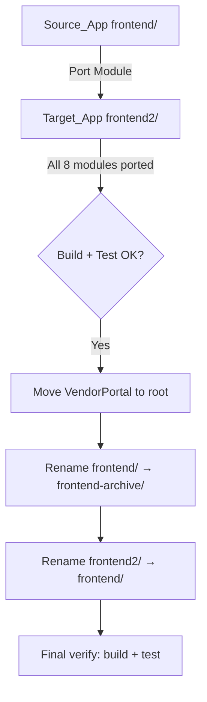
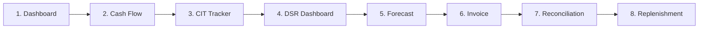
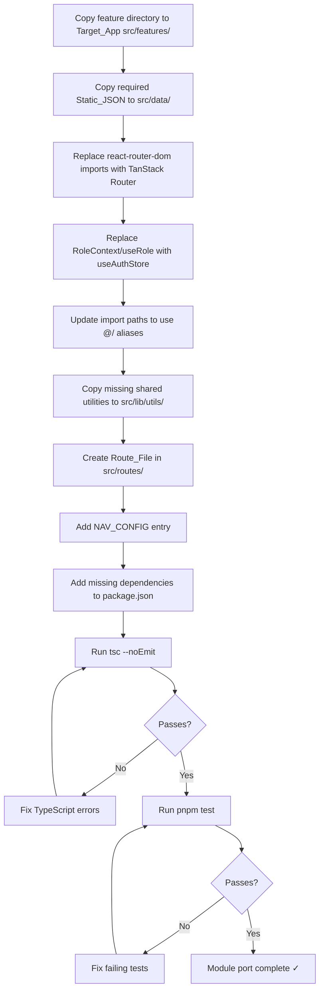

# Design Document: Frontend Consolidation

## Overview

Dokumen ini menjelaskan desain teknis untuk konsolidasi dua codebase frontend (`frontend/` sebagai Source_App dan `frontend2/` sebagai Target_App) menjadi satu aplikasi kanonik. Target_App sudah memiliki arsitektur modern (TanStack Router file-based, Zustand auth, RBAC, OKLCH tokens, error boundary, toast system) sehingga menjadi basis konsolidasi. Delapan modul fitur dari Source_App akan di-port satu per satu ke Target_App.

### Design Decisions

1. **Incremental porting** — Setiap modul di-port satu per satu dan diverifikasi (`tsc --noEmit` + `pnpm test`) sebelum melanjutkan ke modul berikutnya. Ini mengisolasi risiko regresi.
2. **Replace, don't wrap** — `react-router-dom` dan `RoleContext` di-replace langsung dengan TanStack Router dan `useAuthStore`, bukan di-wrap dengan adapter layer. Adapter menambah kompleksitas tanpa manfaat jangka panjang.
3. **Static JSON preserved as-is** — File data JSON di-copy tanpa modifikasi struktur. Migrasi ke real API terjadi terpisah nanti.
4. **NAV_CONFIG as single source of truth** — Semua navigasi didefinisikan di `src/lib/config/navigation.ts`. Modul baru hanya menambah entry, tidak mengubah mekanisme rendering.
5. **Feature-based organization** — Setiap modul hidup di `src/features/{name}/` dengan komponen, hooks, types, dan utils co-located.

---

## Architecture

### High-Level Migration Flow



### Module Port Sequence



Dashboard di-port pertama karena menjadi landing page dan memvalidasi integrasi dasar (auth, layout, static data). Cash Flow kedua karena memperkenalkan dependency baru (`recharts`). Sisanya mengikuti urutan kompleksitas dan dependency.

### Target Architecture (Post-Consolidation)

```
frontend2/src/
├── components/          # Shared UI (layout, feedback, ui)
├── features/
│   ├── dashboard/       # MetricStrip, AttentionPanel, ReplenishmentSummary
│   ├── cash-flow/       # StatsCardGrid, AtmLevelTable, VendorBarChart
│   ├── cit/             # CitSummary, CitTable, CitTracker
│   ├── dsr/             # DsrSummary, DsrTable, DsrDashboard
│   ├── forecast/        # ForecastTable, ScheduleList, ForecastView
│   ├── invoice/         # InvoiceFlow, InvoiceDetail
│   ├── reconciliation/  # ReconciliationScreen, reconciliation.utils
│   ├── replenishment/   # ReplenishmentScreen, replenishment.utils
│   └── forecasting/     # (existing: DSR upload)
├── data/                # 10 static JSON files
├── lib/
│   ├── api/             # API client + stubs
│   ├── auth/            # Zustand auth store
│   ├── config/          # NAV_CONFIG, app config
│   ├── hooks/           # Shared hooks
│   └── utils/           # formatCurrency, formatters, filters, deriveStatus
├── routes/
│   ├── _protected.tsx           # Auth guard layout
│   ├── index.tsx                # Dashboard (/)
│   ├── cash-flow.tsx            # /cash-flow
│   ├── cit.tsx                  # /cit
│   ├── replenishment.tsx        # /replenishment
│   ├── forecasting/
│   │   ├── dsr-upload.tsx       # (existing)
│   │   ├── dsr-dashboard.tsx    # /forecasting/dsr-dashboard
│   │   └── forecast.tsx         # /forecasting/forecast
│   └── invoice/
│       ├── list.tsx             # /invoice/list
│       └── reconciliation.tsx   # /invoice/reconciliation
├── styles/
│   ├── tokens.css       # OKLCH design tokens
│   └── index.css        # Tailwind + global styles
└── test/                # Test setup, utilities
```

---

## Components and Interfaces

### Router API Replacement Map

| Source_App (react-router-dom) | Target_App (TanStack Router) |
|------|------|
| `useNavigate()` | `useNavigate()` from `@tanstack/react-router` |
| `useLocation()` | `useRouterState({ select: s => s.location })` |
| `useParams()` | `useParams({ from: routeId })` |
| `useSearchParams()` | `useSearch({ from: routeId })` |
| `<Link to="...">` | `<Link to="..." from={routeId}>` |
| `<NavLink>` | `<Link>` with `activeProps` |
| `<Outlet />` | `<Outlet />` from `@tanstack/react-router` |
| `<Navigate to="...">` | `<Navigate to="...">` or `redirect()` in `beforeLoad` |

### Auth Context Replacement Map

| Source_App (RoleContext) | Target_App (Zustand) |
|------|------|
| `useRole()` → `{ role, setRole, isInternal }` | `useAuthStore(s => s.user)` → `{ roles, primaryRole }` |
| `RoleProvider` wrapper | No wrapper needed (global store) |
| `DevRoleSwitcher` component | Target_App's own DevToolbar (dev mode) |
| `INTERNAL_ROLES` check | `ROLE_NAV_PERMISSIONS` + `filterNavByRoles()` |

### NAV_CONFIG Updates

Entries to add or update in `src/lib/config/navigation.ts`:

```typescript
// New entries to add
{ id: "cash-flow", label: "Cash Flow Monitoring", icon: Activity, href: "/cash-flow",
  roles: ["ATM_Support", "Cash_Management"], group: "general" },
{ id: "cit", label: "CIT Tracker", icon: Truck, href: "/cit",
  roles: ["ATM_Support", "Cash_Management"], group: "general" },
{ id: "dsr-dashboard", label: "DSR Dashboard", icon: BarChart3, href: "/forecasting/dsr-dashboard",
  roles: ["ATM_Support", "Cash_Management", "Vendor"], group: "forecasting" },
{ id: "forecast", label: "Forecasting", icon: TrendingUp, href: "/forecasting/forecast",
  roles: ["ATM_Support", "Cash_Management"], group: "forecasting" },
{ id: "invoice-list", label: "Daftar Invoice", icon: FileText, href: "/invoice/list",
  roles: ["WMO", "Finance", "Vendor"], group: "invoice" },
{ id: "replenishment", label: "Pengisian Ulang", icon: Truck, href: "/replenishment",
  roles: ["ATM_Support", "Cash_Management"], group: "general" },

// Existing entry to enable (set disabled: false)
{ id: "reconciliation", disabled: false }
```

### Shared Utilities to Port

From `frontend/src/lib/` to `frontend2/src/lib/utils/`:

| File | Purpose | Action |
|------|---------|--------|
| `formatCurrency.ts` | IDR formatting with `tabular-nums` | Copy if not exists in Target_App |
| `formatters.ts` | Date, number, percentage formatters | Copy if not exists |
| `filters.ts` | Generic array filter utilities | Copy if not exists |
| `deriveStatus.ts` | Status derivation from data | Copy |
| `constants.ts` | Type definitions (CitStatus, DsrStatus, etc.) | Merge types into feature-local type files |

### Feature Module Interface Pattern

Each ported module follows this interface contract:

```typescript
// src/features/{module-name}/index.ts — barrel export
export { ModuleScreen } from './ModuleScreen';

// src/routes/{route-path}.tsx — route file (TanStack Router file-based)
import { createFileRoute } from '@tanstack/react-router';
import { ModuleScreen } from '@/features/{module-name}';

export const Route = createFileRoute('/_protected/{route-path}')({
  component: ModuleScreen,
});
```

### Port Process per Module (Standard Steps)



---

## Data Models

### Static JSON Files (src/data/)

| File | Shape | Consumer |
|------|-------|----------|
| `dashboard-kpi.json` | `Array<{ id, label, value, meta }>` | `MetricStrip` |
| `attention-items.json` | `Array<{ id, category, title, description, timestamp }>` | `AttentionPanel` |
| `replenishment-schedules.json` | `Array<{ id, routeCode, region, vendor, machineCount, completionCount, status, value }>` | `ReplenishmentSummary`, `ReplenishmentScreen` |
| `atms.json` | `Array<{ id, atmId, location, vendor, cashLevel, status, ... }>` | `CashFlowScreen` |
| `cit-orders.json` | `Array<{ orderId, atmId, vendor, orderDate, scheduledDate, amount, status, evidence }>` | `CitTracker` |
| `dsr.json` | `Array<{ atmId, location, vendor, beginningBalance, cashIn, cashOut, endingBalance, status }>` | `DsrDashboard` |
| `forecast.json` | `Array<{ id, atmId, date, projectedAmount, actualAmount, variance }>` | `ForecastView` |
| `invoices.json` | `Array<{ invoiceNo, period, totalAmount, lineItems[], validationStatus }>` | `InvoiceFlow` |
| `reconciliation-exceptions.json` | `Array<{ id, invoiceNo, description, invoicedAmount, expectedAmount, variance, matchStatus }>` | `ReconciliationScreen` |
| `vendors.json` | `Array<{ id, name, code, region }>` | Multiple modules |

### TypeScript Type Definitions

Tiap modul mendefinisikan types secara lokal di `src/features/{module}/types.ts`:

```typescript
// Example: src/features/cit/types.ts
export type CitStatus = 'Scheduled' | 'In Transit' | 'Completed' | 'Failed';

export interface CitOrder {
  orderId: string;
  atmId: string;
  vendor: string;
  orderDate: string;
  scheduledDate: string;
  amount: number;
  status: CitStatus;
  evidence: string | null;
}
```

### Dependency Delta

Dependencies to ADD to Target_App `package.json`:

| Package | Version | Reason |
|---------|---------|--------|
| `recharts` | `^3.x` | VendorBarChart in cash-flow module |

Dependencies already present in Target_App (no action needed):
- `@tanstack/react-query`, `@tanstack/react-table`, `@tanstack/react-router`
- `zustand`, `lucide-react`, `clsx`, `tailwind-merge`
- `xlsx`, `zod`, `react-hook-form`, `@hookform/resolvers`
- `fast-check` (devDep), `vitest`, `@biomejs/biome`

---


## Correctness Properties

*A property is a characteristic or behavior that should hold true across all valid executions of a system — essentially, a formal statement about what the system should do. Properties serve as the bridge between human-readable specifications and machine-verifiable correctness guarantees.*

### Property 1: Static JSON Data Integrity

*For any* static JSON file in the required set of 10 files (`atms.json`, `attention-items.json`, `cit-orders.json`, `dashboard-kpi.json`, `dsr.json`, `forecast.json`, `invoices.json`, `reconciliation-exceptions.json`, `replenishment-schedules.json`, `vendors.json`), the Target_App's copy SHALL be byte-for-byte identical to the Source_App's original file.

**Validates: Requirements 1.6, 12.2**

### Property 2: AttentionPanel Renders All Required Fields

*For any* array of attention items (with category, title, description, and timestamp fields), rendering the `AttentionPanel` component SHALL produce output that contains every item's title, description, a category-appropriate icon indicator (danger, warning, or info), and a relative timestamp string.

**Validates: Requirements 2.3**

### Property 3: Status Priority Sort Invariant

*For any* array of replenishment schedules with mixed statuses, applying `sortByStatusPriority` SHALL produce an output array where every element at index `i` has a status priority greater than or equal to the element at index `i+1`, maintaining a stable total ordering.

**Validates: Requirements 2.4, 9.4**

### Property 4: CIT Filter Consistency

*For any* array of CIT orders and any combination of status and vendor filter values, applying the filter SHALL produce a result set where: (a) every returned row matches all active filter criteria, (b) the CitSummary counts per status category equal the actual count of filtered items per category, and (c) no item matching the filter criteria is excluded from the result.

**Validates: Requirements 4.2, 4.6**

### Property 5: DSR Summary Aggregation Invariant

*For any* non-empty array of DSR records, the DsrSummary totals SHALL satisfy: `totalBeginningBalance == sum(records.map(r => r.beginningBalance))` and likewise for `totalCashIn`, `totalCashOut`, and `totalEndingBalance`.

**Validates: Requirements 5.2**

### Property 6: Invoice Expansion Shows Complete Line Items

*For any* invoice object with N line items (N ≥ 1), expanding that invoice's row SHALL render exactly N line item entries, each displaying description, invoiced amount, matched order reference, expected amount, variance, and match status fields.

**Validates: Requirements 7.3**

### Property 7: Reconciliation Filter Behavioral Equivalence

*For any* array of reconciliation exceptions and any filter criteria, applying Target_App's `reconciliation.utils.ts` filter function SHALL produce an identical result set to Source_App's `reconciliation.utils.ts` filter function given the same inputs.

**Validates: Requirements 8.4**

### Property 8: Replenishment filterSchedules Behavioral Equivalence

*For any* array of replenishment schedules and any filter criteria, applying Target_App's `filterSchedules` function SHALL produce an identical result set to Source_App's `filterSchedules` function given the same inputs.

**Validates: Requirements 9.4**

### Property 9: RBAC Navigation Filtering Correctness

*For any* user role combination and the complete NAV_CONFIG array, `filterNavByRoles` SHALL return only entries where at least one of the user's roles appears in the entry's `roles` array (or the entry has `roles: ["*"]`), and Admin users SHALL see all entries regardless of role restrictions.

**Validates: Requirements 10.3**

### Property 10: No Hardcoded Color Values in Ported Files

*For any* `.tsx` or `.ts` file within `src/features/` directories of ported modules, the file content SHALL contain zero matches for hardcoded hex color patterns (`#[0-9a-fA-F]{3,8}`), RGB patterns (`rgb(`), or HSL patterns (`hsl(`).

**Validates: Requirements 15.2**

### Property 11: UI Strings Language Compliance

*For any* user-facing text string rendered by ported feature components, the string SHALL either be in Bahasa Indonesia or consist exclusively of permitted English terms (CIT, DSR, ATM, WMO, CPC, Dashboard, Rp, pcs, kg, and standard industry abbreviations).

**Validates: Requirements 15.1, 15.5**

### Property 12: Test Import Path Alias Compliance

*For any* test file (`*.test.ts`, `*.test.tsx`) within ported feature `__tests__/` directories, all import statements referencing project source files SHALL use the `@/` path alias prefix rather than relative paths reaching outside the feature directory.

**Validates: Requirements 13.1**

---

## Error Handling

### Strategy per Module

Setiap modul yang membaca dari Static_JSON menggunakan pola error handling yang konsisten:

```typescript
// Pattern: Safe JSON import with error boundary fallback
function useStaticData<T>(importFn: () => T, fallback: T): { data: T; error: Error | null } {
  try {
    const data = importFn();
    if (!data || (Array.isArray(data) && data.length === 0)) {
      return { data: fallback, error: null }; // Empty state, not error
    }
    return { data, error: null };
  } catch (err) {
    return { data: fallback, error: err instanceof Error ? err : new Error('Data load failed') };
  }
}
```

### Error States

| Condition | UI Response |
|-----------|-------------|
| JSON file missing / import fails | Error indicator icon + message + retry button |
| JSON parses but is empty array | Empty state message (bukan error — data memang kosong) |
| JSON malformed (invalid structure) | Error indicator + descriptive message + retry |
| Component render crash | React Error Boundary catches, displays fallback UI |

### Principles

1. **Never crash the app** — Error boundaries di tiap feature route memastikan satu modul error tidak menjatuhkan seluruh aplikasi.
2. **Error ≠ empty** — Empty data (`[]`) ditampilkan sebagai empty state (informational), bukan sebagai error.
3. **Always provide recovery** — Setiap error state menyediakan retry action.
4. **Icon + text, never color alone** — Sesuai design system rule, error selalu disertai icon dan pesan teks.

---

## Testing Strategy

### Dual Testing Approach

| Type | Tool | Purpose |
|------|------|---------|
| Unit tests | Vitest + Testing Library | Specific examples, component rendering, edge cases |
| Property tests | Vitest + fast-check | Universal properties across randomized inputs |
| E2E tests | Playwright | Full user flows, navigation, route guards |

### Property-Based Testing Configuration

- **Library**: `fast-check` (already in Target_App devDependencies)
- **Minimum iterations**: 100 per property test
- **Tag format**: `// Feature: frontend-consolidation, Property {N}: {title}`

Property tests focus on:
- Pure utility functions (`sortByStatusPriority`, `filterSchedules`, `reconciliation.utils`, `filterNavByRoles`)
- Data integrity invariants (JSON copy verification, aggregation math)
- Structural constraints (no hardcoded colors, import alias compliance)

### Unit Test Focus Areas

Unit tests cover what property tests cannot efficiently randomize:
- Component rendering with specific mock data (MetricStrip with 4 cards, column headers)
- Route registration verification (smoke tests)
- Error/empty state rendering
- UI interaction (row expansion, filter selection)

### Test Execution Gates

Setiap module port harus melewati:

1. `tsc --noEmit` — zero TypeScript errors
2. `pnpm test` — zero test failures (existing + new)
3. `pnpm build` — successful production bundle

Final consolidation (rename) harus melewati:

1. `pnpm build` dari path `frontend/` baru
2. `pnpm test` dari path `frontend/` baru
3. VendorPortal tetap intact di `VendorPortal-Vite/`

### Test File Organization

```
src/features/{module}/__tests__/
├── {Module}Screen.test.tsx      # Component rendering (unit)
├── {module}.utils.test.ts       # Utility function tests (unit)
└── {module}.property.test.ts    # Property-based tests (PBT)

src/routes/
└── _protected.property.test.ts  # RBAC + navigation properties (existing)
```

### Coverage Targets

- Ported utility functions: 100% branch coverage (pure functions, fully testable)
- Ported components: render + error state + empty state coverage
- NAV_CONFIG: role-based visibility for all 8 new entries
- No regression: all pre-existing Target_App tests continue passing
