# Design Document

## Overview

Design ini menerjemahkan enam requirement pada `requirements.md` menjadi perubahan konkret di ATM backend (`backend/`, port 8080, flat JSON) dan aplikasi internal `frontend/CompanyPortal-Vite` (tema "Merah Sirih"). Semua perubahan **additive** dan **memakai ulang** rantai yang sudah ada dari spec `request-replenish-to-vendor` dan `cit-vendor-request-enhancements` (CIT-2):

```
queries/vendor_request.sql
  → internal/db/vendor_request*.sql.go (sqlc-generated)
  → internal/service/vendor_request.go + vendor_request_actions.go
  → internal/handler/vendor_request_handler.go + vendor_request_response.go
  → features/vendor-request/{api,hooks,types}.ts
  → features/vendor-request/{ForecastBrowser,ForecastTable,VendorRequestCreate,VendorRequestDetail}.tsx
```

Prinsip yang dipegang sepanjang design (Golden Rules `project-context.md`):

- **Flat JSON additive-only.** Tidak ada field yang di-*rename* atau dihapus dari respons ATM backend; field baru ditambahkan di belakang field lama dengan nama, tipe, dan posisi nesting yang sama (Req 6.1).
- **Maker-checker + audit.** Setiap perubahan state menulis `audit_logs` lewat `audit.Writer` yang di-*scope* ke transaksi (`newAuditWriter(tx)`), sehingga gagal-tulis-audit me-*rollback* aksinya (Req 2.5, 3.6, 6.3).
- **Money = numeric.** Escrow_Balance dibawa sebagai `numeric(20,2)` dari DB dan diserialisasi sebagai *decimal string*, tidak pernah float (Req 5.10, OQ2).
- **DB topology.** Browse/list/detail memakai routing read/write yang sudah ada; `VendorRequestService` di-*instantiate* dengan primary pool (write + read-after-write), forecast reads mengikuti pola `s.read` yang ada (Req 6.5).
- **RBAC dua lapis.** Role gate di middleware (`RequireRoles`) DAN di service (`checkActor` / `isMaker` / `isChecker`) (Req 1.12, 2.8, 3.7).
- **Migrasi additive forward-only** di `backend/migrations/`, diusulkan lebih dulu — dan pada spec ini, dikonfirmasi **tidak ada migrasi baru** yang wajib (lihat OQ1).

### Resolusi Open Questions

| OQ | Keputusan | Alasan |
|----|-----------|--------|
| **OQ1 — cancelable status** | **Service-layer saja, tanpa migrasi.** Perluas tabel transisi state machine (`transitions`) dan `checkActor` di `internal/service/vendor_request.go` untuk mengizinkan `approved --cancel--> cancelled` khusus Checker_Role. Kolom `is_canceled` dan status `cancelled` sudah ada (migration 034 + CHECK migration 028). `SoftCancelVendorRequest` sudah men-*set* `status='cancelled'` + `is_canceled=true` tanpa menyentuh `approved_at`/`approved_by`. | Tidak ada kolom/CHECK baru yang dibutuhkan. Menambah satu edge di map transisi lebih kecil dan lebih dapat diuji daripada migrasi skema. |
| **OQ2 — presisi & unit Escrow** | **Sumber = `itm_replenish.escrow` `numeric(20,2)`** (bukan `atms.escrow_account`, yang merupakan identifier akun 12-digit `text`, bukan saldo). **Wire type = decimal string** (mis. `"1500000.00"`), diserialisasi persis seperti `atm_portal_cashpos.go`'s `numericToDecimalString` (NULL → tidak dikirim / `"-"` di UI, bukan `"0.00"`). Tidak pernah float. | Konsisten dengan pola `atm_portal.sql` yang sudah dipakai untuk `refund_total`/`replenish_total`/`escrow` — mereka semua `numeric` yang dibawa sebagai decimal string. `atms.escrow_account` bukan nilai moneter (`migration 030` menegaskan ini). |
| **OQ3 — Paket deterministik** | **Satu paket aktif per ATM via LATERAL** `atm_vendor_packages` (is_active, dalam rentang effective date pada `forecast_date`) `ORDER BY effective_start_date DESC, id DESC LIMIT 1`. Bila tidak ada baris yang resolve → kolom "Paket" render `"-"`. | Query forecast yang ada (`ListForecastForDate`) sudah memakai LATERAL identik untuk `flm_vendor`; menambah tie-breaker `id DESC` membuat pilihan deterministik ketika satu branch punya >1 label PAKET (`031_seed_vendor_packages.sql` menunjukkan ini terjadi, mis. 'Bijak Jakarta' punya PAKET 3/4/5). |

---

## Architecture

### Data-flow per requirement

```mermaid
flowchart TD
    subgraph FE["CompanyPortal-Vite (Merah Sirih)"]
        FB["ForecastBrowser.tsx"]
        FT["ForecastTable.tsx"]
        VRC["VendorRequestCreate.tsx"]
        VRD["VendorRequestDetail.tsx"]
        API["api.ts / hooks.ts / types.ts"]
    end
    subgraph BE["ATM backend (flat JSON, :8080)"]
        H["vendor_request_handler.go"]
        RESP["vendor_request_response.go"]
        SVC["vendor_request.go / vendor_request_actions.go"]
        Q["queries/vendor_request.sql → db/*.sql.go"]
    end
    subgraph DB["PostgreSQL"]
        VR[("vendor_requests")]
        VRI[("vendor_request_items")]
        DMAA[("dmaa_atm_forecast")]
        ATMS[("atms.priority_class")]
        AVP[("atm_vendor_packages → vendor_packages")]
        ITM[("itm_replenish.escrow")]
        AUD[("audit_logs")]
        SEQ[("vendor_request_number_seq")]
    end

    FT -->|"Req 5: PriorityClass, Paket, Escrow; no Amount Refund"| API
    FB --> API
    VRC -->|"Req 1: Request Type + Replenish_Date rules"| API
    VRD -->|"Req 2: Reject (danger + icon); Req 3: Cancel approved"| API
    API --> H --> SVC --> Q
    H --> RESP
    Q --> VR & VRI & DMAA & ATMS & AVP & ITM & SEQ
    SVC -->|"tx-scoped audit.Writer"| AUD
```



### Ringkasan perubahan per requirement

| Req | Layer utama | Perubahan inti |
|-----|-------------|----------------|
| 1 — Request Type + tanggal | Frontend (Create) + service | Kontrol Request_Type wajib di *DMAA-backed* create; ekstensi validasi kategori→tanggal + DMAA-linkage per tipe di service; persist `request_category` untuk semua create Forecast-Browser (bukan hanya manual). |
| 2 — Tombol Tolak SPV | Frontend (Detail) | Gate `canApproveReject` sudah benar; perbaiki *affordance*: `variant="danger"` + ikon + teks (Req 2.10), pastikan render untuk `ATM-SPV`/`BRANCH-ATM-SPV` non-creator. |
| 3 — Cancel approved | Service + frontend (Detail) | Perluas `transitions` (`approved`→`cancelled`) + `checkActor` (approved: Checker-only); UI: tampilkan Cancel + modal alasan pada status `approved` untuk Checker. |
| 4 — Format Request-ID | Service | Ganti perakitan string di `createWithRetryingNumber` dari `REP%s%s%03d` ke `REP-%s-%s-%03d`. Scope/urutan/keunikan/retry tetap. |
| 5 — Kolom Forecast | Query + service + response + frontend (Table) | SQL tambah `priority_class`, `paket`, `escrow`; service/response bawa additive; drop kolom render Amount Refund (API tetap kirim `amount_refund`). |
| 6 — Non-regresi | Semua | Kontrak wire, role gate, state machine, money/timestamp, tests. |

---

## Components and Interfaces

### Requirement 1 — Request Type pada pembuatan request

**Konteks kode nyata.** Saat ini `request_category` hanya di-persist untuk *Manual_Request* (`categoryOrNil` mengembalikan `nil` bila `!in.IsManual`), dan validasi kategori→tanggal (`validateCategoryDateConsistency`) hanya dipanggil bila `in.IsManual`. Alur *DMAA-backed* (Forecast Browser → Create) belum meminta operator memilih tipe. Requirement 1 memperluas ini agar **setiap** create (DMAA-backed maupun manual) membawa Request_Type.

**Frontend (`VendorRequestCreate.tsx`).**
- Tambahkan kontrol **Request_Type** (tiga opsi: Planned / Emergency / Additional) juga pada jalur *DMAA-backed* (bukan hanya manual). Saat ini opsi kategori hanya muncul di `isManual`. Kontrol harus:
  - Wajib dipilih sebelum submit (Req 1.1); bila kosong, blokir submit + tampilkan error mengidentifikasi field (Req 1.2). Karena `category` sekarang punya default `"planned"`, ubah *initial state* menjadi "belum dipilih" untuk jalur DMAA-backed agar Req 1.2 dapat terpicu (mis. `category: VendorRequestCategory | "" = ""`).
  - Menyetel Replenish_Date otomatis: Planned → `jakartaCalendarDateISO(1)` (H+1); Emergency → `jakartaCalendarDateISO(0)` (H+0) (Req 1.3, 1.4).
  - Additional → dropdown terbatas persis `{H+0, H+1, H+2}` via `additionalDateOptions` yang sudah ada (Req 1.5), tanpa nilai lain.
  - Reuse helper Asia/Jakarta yang sudah ada (`jakartaCalendarDateISO`, `tomorrowJakartaISO` di `lib/nextBusinessDay.ts`) sehingga klien & server sepakat di batas hari.
  - Token Merah Sirih + `min-h-[44px] min-w-[44px]` (Req 1.14) — pola `<select>` yang sudah dipakai.
- `toPayload` sudah mengirim `request_category` hanya saat `isManual`. Perluas agar untuk jalur DMAA-backed juga mengirim `request_category` terpilih (payload sudah punya field opsional `request_category`). `is_manual` tetap `false` untuk jalur Forecast-Browser.

**Frontend (`VendorRequestDetail.tsx`).** `DetailFields` sudah menampilkan "Kategori" sebagai teks polos via `CATEGORY_LABELS` (plain text, bukan warna) — memenuhi Req 1.15. Tidak berubah selain memastikan nilai muncul untuk request DMAA-backed yang kini punya kategori.

**Service (`vendor_request_actions.go` — `Create`).**
- Pisahkan persist-kategori dari `IsManual`. Perkenalkan aturan:
  - **Validasi kategori→tanggal berlaku untuk semua create** (bukan hanya manual): pindahkan panggilan `validateCategoryDateConsistency(in.RequestCategory, in.ReplenishDate)` keluar dari blok `if in.IsManual`. Fungsi ini sudah menegakkan Req 1.3/1.4/1.5/1.10/1.11 (default branch menolak kategori tak dikenal → Req 1.11).
  - **DMAA-linkage per tipe (Req 1.6, 1.7, 1.8):**
    - **Planned** → item harus cocok `dmaa_atm_forecast` (pakai `resolveItems`, yang sudah mengembalikan `InvalidItemsError` menamai item non-matching → Req 1.6, tidak persist).
    - **Emergency** → terima item cocok maupun tidak (Req 1.7).
    - **Additional** → terima item tanpa match DMAA (Req 1.8).
  - Ganti kondisi *item-resolution branch* yang sekarang berbasis `IsManual` menjadi berbasis **kategori**:
    ```
    if category == "emergency" || category == "additional" {
        resolved = acceptItems(...)      // tanpa wajib match DMAA (Req 1.7, 1.8)
    } else { // planned (atau kategori kosong pada UpdateItems path)
        resolved = resolveItems(...)     // wajib match DMAA (Req 1.6)
    }
    ```
    Catatan: `acceptManualItems` yang ada mensyaratkan `it.PeriodePred = replenishDate` (karena manual tak punya periode DMAA). Untuk Emergency/Additional **DMAA-backed** (dari Forecast Browser), `periode_pred` sudah terisi; pertahankan `periode_pred` yang dikirim bila ada, jatuh ke `replenishDate` hanya bila kosong. Ini menghindari regresi identity `(terminal_id, periode_pred, denom)`.
- **Persist kategori (Req 1.9).** Ganti `categoryOrNil(in)` agar mem-*persist* `request_category` bila salah satu dari `{planned, emergency, additional}` di-*set*, terlepas dari `is_manual`. Nilai divalidasi oleh `validateCategoryDateConsistency` (Req 1.11) dan oleh CHECK `vendor_requests_category_chk` (migration 034) sebagai jaring kedua.
- **Audit (Req 1.13).** Blok audit `Create` sudah menulis `metadata["request_category"]` (saat ini hanya untuk manual). Perluas agar selalu mencatat `request_category`, `state=draft`, actor, dan timestamp UTC (waktu ditetapkan oleh `audit.Writer`).
- **RBAC dua lapis (Req 1.12).** Route `POST /` sudah di-gate `vendorRequestMakerRoles`. Validasi item/kategori terjadi di service. Tidak ada perubahan gate.

**Catatan `UpdateItems`.** `UpdateItems` di luar scope Req 1 (tetap DMAA-backed, `resolveItems`). Karena refactor di atas mem-*branch* pada kategori dan `UpdateItems` tidak membawa kategori, pastikan jalur `UpdateItems` tetap memanggil `resolveItems` (kategori kosong → cabang `else`).

### Requirement 2 — Tombol Tolak untuk SPV

**Temuan kode.** Gate visibilitas di `VendorRequestDetail.tsx` **sudah benar**:
```ts
const canApproveReject = data.status === "pending_approval" && isChecker && !isCreator;
```
`isChecker` memakai `CHECKER_ROLES = ["ADMIN","ATM-SPV","BRANCH-ATM-SPV"]`, dan backend `Reject` sudah bekerja (`pending_approval → rejected`, four-eyes via `ErrSelfApproval`). Jadi "tombol hilang" **bukan** cacat logika gating melainkan cacat *affordance/rendering*: tombol "Tolak" saat ini `variant="secondary"` tanpa ikon, tidak mengikuti pola tombol destruktif yang diminta Req 2.10.

**Perbaikan (frontend `VendorRequestDetail.tsx`).**
- Render tombol Tolak dengan **`variant="danger"`** + **ikon** (mis. `Ban`/`XCircle` dari lucide-react) + teks "Tolak" — memenuhi Req 2.10 (destruktif dipasangkan ikon+teks, tidak warna-saja) dan Req 2.2 (muncul di samping Approve untuk SPV non-creator pada `pending_approval`).
- Modal `RejectModal` yang ada sudah menegakkan alasan 1–500 non-whitespace + tombol konfirmasi disabled saat invalid (Req 2.3, 2.4) dan sudah `variant="danger"`. Pertahankan; pastikan pesan error menyebut alasan tidak valid.
- Req 2.9: tombol Tolak hanya render saat `status === "pending_approval"` (sudah begitu via `canApproveReject`). Req 2.7: creator tidak melihat tombol (`!isCreator`).

**Backend.** Tidak ada perubahan; `Reject`, `handleError` (mapping `ErrSelfApproval` → 403, `ErrInvalidTransition` → 409 untuk Req 2.6, `ErrNotChecker` → 403 untuk Req 2.8) sudah lengkap. Gate route `POST /{id}/reject` = `vendorRequestCheckerRoles` (Req 2.8 lapisan middleware).

### Requirement 3 — SPV membatalkan request yang sudah di-approve

**State machine (`vendor_request.go`).** Tambah edge pada tabel `transitions`:
```go
"approved": {actionCancel: "cancelled"},
```
(baris `approved` saat ini tidak ada di map, sehingga `nextState("approved", actionCancel)` mengembalikan `ok=false` → `ErrInvalidTransition`). Ini satu-satunya perubahan tabel transisi; edge `approved→processing`/`processing→completed` tetap di luar scope.

**`checkActor` (`vendor_request.go`).** Cabang `actionCancel` saat ini menangani `draft` (creator-only) dan status lain sebagai union creator-OR-checker. Untuk `approved`, Req 3.7 menuntut **Checker-only** (bukan union, creator tak boleh). Perluas:
```go
case actionCancel:
    if req.Status == "draft" {
        if actor.UserID != req.CreatedBy { return ErrNotCreator }
        return nil
    }
    if req.Status == "approved" {
        // Req 3.1, 3.7: hanya Checker_Role, tanpa gate maker-checker kedua.
        if !isChecker(actor.Role) { return ErrNotChecker }
        return nil
    }
    // pending_approval: union creator-OR-non-creator-checker (perilaku lama, tak berubah — Req 3.12)
    isCreator := actor.UserID == req.CreatedBy
    isCheckerNotCreator := isChecker(actor.Role) && actor.UserID != req.CreatedBy
    if !isCreator && !isCheckerNotCreator { return ErrNotAuthorized }
```
Perhatikan: untuk `approved`, Checker yang kebetulan creator **tetap boleh** (Req 3 tidak menuntut four-eyes untuk cancel; ini pembatalan langsung, bukan approve). Ini disengaja dan berbeda dari `approve/reject`.

**`Cancel` (`vendor_request_actions.go`).** Fungsi `Cancel` yang ada sudah:
- lock row (`GetVendorRequestForUpdate`),
- guard `is_canceled` lebih dulu → `ErrAlreadyCanceled` (Req 3.8, idempotensi, tidak menulis audit duplikat),
- guard transisi (`nextState`),
- guard actor (`checkActor`),
- `SoftCancelVendorRequest` (set `status='cancelled'` + `is_canceled=true`, tidak menghapus row/items — Req 3.4),
- tulis audit `action="cancel"` dengan `before.state`/`is_canceled=false` dan `after.state=cancelled`/`is_canceled=true` (Req 3.6),
- semua dalam satu transaksi, tanpa gate approval kedua (Req 3.5).

**Perubahan yang diperlukan pada `Cancel`:**
- **Alasan pembatalan wajib (Req 3.2, 3.3, 3.6).** `Cancel` saat ini **tidak menerima alasan**. Endpoint `POST /{id}/cancel` juga *no-body* (`doTransition`). Perlu:
  - Ubah signature service `Cancel(ctx, actor, id, reason string)` (atau tambah `CancelWithReason`) — validasi `reason` 1–500 non-whitespace (reuse pola `Reject`: `strings.TrimSpace`, `ErrRejectReasonEmpty`-analog `ErrCancelReasonEmpty`, dan `>500` → `ValidationError`).
  - Handler `Cancel` berhenti memakai `doTransition` (yang no-body) dan mem-*parse* `cancelReason` dari body JSON (mirip `rejectBody`), sama seperti `Reject`.
  - Simpan alasan: `SoftCancelVendorRequest` belum menyimpan alasan. Karena tidak ada kolom `cancellation_reason` (dan Golden Rule melarang menebak skema), alasan **dicatat di `audit_logs.after.reason`** (Req 3.6 mensyaratkan "record the cancellation reason" pada audit entry, bukan pada kolom `vendor_requests`). Tambahkan `after["reason"] = reason` pada audit entry cancel. Untuk **Req 3.11** ("expose the cancellation reason additively in the flat JSON"), lihat catatan skema di bawah.
- **Req 3.9** (exclude canceled dari active-flow reads) sudah ditegakkan: `ListVendorRequests`/`CountVendorRequests` memfilter `is_canceled = false` kecuali `include_canceled=true`.

**Catatan skema (Req 3.11) — keputusan.** Req 3.11 minta `is_canceled` **dan** cancellation reason ter-*expose* additive di list/detail. `is_canceled` sudah ada di respons. Untuk *cancellation reason*, ada dua opsi:
- **(A) Tanpa migrasi (lean, dipilih):** alasan hanya hidup di `audit_logs` dan dibaca via endpoint `GET /{id}/audit-log` yang sudah ada (entry `action="cancel"`, `metadata.reason`). Detail page dapat menampilkannya dari audit log. Ini memenuhi "reason recorded + audit written" (Req 3.6) dan menjaga OQ1 "tanpa migrasi". Kelemahan: `reason` tidak muncul langsung di payload detail `vendor_requests`.
- **(B) Migrasi additive:** tambah `vendor_requests.cancellation_reason text NULL` + field additive `cancellation_reason` di detail/list response.

> **Rekomendasi design:** ambil **(A)** agar konsisten dengan keputusan OQ1 (tanpa migrasi) dan dengan cara `rejection_reason` sebenarnya *sudah* punya kolom sendiri — tetapi Req 3.11 secara eksplisit meminta reason ter-*expose* di list/detail. Jika reviewer memegang Req 3.11 secara literal, naikkan ke **(B)** dengan satu migrasi additive `035_vendor_requests_cancellation_reason.sql` (nullable, no backfill) + field `cancellation_reason *string` di `VendorRequestDetail`/`VendorRequestSummary` dan `SoftCancelVendorRequest` di-*extend* menyimpan kolom itu. **Keputusan ini di-flag untuk konfirmasi user sebelum tasks.md** (menyentuh skema). Default design: (B) dipilih karena Req 3.11 adalah acceptance criteria eksplisit; migrasi bersifat additive/forward-only sesuai Golden Rule Sec 4/7.

**Frontend (`VendorRequestDetail.tsx`).**
- Perluas `canCancel` agar mencakup `approved` untuk Checker non-... (Req 3.1): 
  ```ts
  const canCancel =
    ((isCreator || (isChecker && !isCreator)) &&
      (data.status === "draft" || data.status === "pending_approval")) ||
    (isChecker && data.status === "approved");
  ```
- Cancel sekarang butuh **alasan**: tambahkan modal alasan (pola `RejectModal`, 1–500 non-whitespace, `variant="danger"`, ikon+teks) alih-alih memanggil `cancelMutation` langsung. Update `useCancelVendorRequest`/`cancelVendorRequest` agar mengirim `{ cancellation_reason }` (additive body).
- Req 3.10: bila `is_canceled`, `StatusBadge` sudah render badge "Dibatalkan" berikon `Ban` + teks (bukan warna-saja). Pertahankan pada detail & list.

### Requirement 4 — Format Request-ID ber-hyphen

**Satu-satunya perubahan** ada di `createWithRetryingNumber` (`vendor_request_actions.go`):
```go
// lama:
requestNumber := fmt.Sprintf("REP%s%s%03d", prefix, dateSeg, seq)
// baru (Req 4.1, 4.2):
requestNumber := fmt.Sprintf("REP-%s-%s-%03d", prefix, dateSeg, seq)
```
- `prefix` (3 huruf uppercase, `resolveVendorPrefix`/`fallbackVendorPrefix`), `dateSeg` (`in.ReplenishDate.Format("20060102")`), dan `seq` (`NextRequestNumberSeq`, atomic per-`(vendor_id, replenish_date)`) **tidak berubah** — hanya perakitan string yang menyisipkan `-` (Req 4.2, 4.3).
- Keunikan (`request_number` unique constraint → `isUniqueViolation` → retry ≤5×, `ErrNumberGeneration`), exhaustion (`vendor_request_number_seq_last_chk` → `ErrNumberExhausted`), dan concurrency (upsert `ON CONFLICT DO UPDATE`) tetap (Req 4.4, 4.5, 4.6, 4.7).
- Req 4.8: hanya request baru memakai format ber-hyphen; nomor lama tidak ditulis ulang (generator hanya jalan saat create).
- Req 4.9: `request_number` di respons tidak berubah nama/struktur; search list `ILIKE '%...%'` di `ListVendorRequests` otomatis cocok terhadap nilai bertanda hubung karena mencocokkan substring nilai tersimpan apa adanya (termasuk `-`).

> Tidak ada perubahan test-format regex di SQL; validasi format terjadi di generator Go.

### Requirement 5 — Kolom tabel Forecast Browser

**Query (`queries/vendor_request.sql` — `ListForecastForDate` & `CountForecastForDate`).**
- `ListForecastForDate` **tambah tiga kolom SELECT** (additive), tanpa mengubah `WHERE`/`ORDER BY`/pagination sehingga row-count & identity tak berubah (Req 5.12):
  - `a.priority_class AS priority_class` (dari join `atms` yang sudah ada) — Req 5.2.
  - **Paket**: perluas LATERAL yang sudah ada agar juga mengembalikan `vp.code`. LATERAL kini memilih satu paket aktif deterministik (OQ3):
    ```sql
    LEFT JOIN LATERAL (
        SELECT vp.vendor_branch_id, vp.code AS paket
        FROM atm_vendor_packages avp
        JOIN vendor_packages vp ON vp.id = avp.vendor_package_id
        WHERE avp.atm_id = a.id AND avp.is_active = true
          AND avp.effective_start_date <= sqlc.arg('forecast_date')::date
          AND (avp.effective_end_date IS NULL OR avp.effective_end_date >= sqlc.arg('forecast_date')::date)
        ORDER BY avp.effective_start_date DESC, avp.id DESC
        LIMIT 1
    ) active_pkg ON true
    ```
    `LIMIT 1` menjamin satu baris (Req 5.4 deterministik); tanpa match → `paket` NULL → UI `"-"`. Tambah `id DESC` sebagai tie-breaker (OQ3).
  - **Escrow**: LATERAL baru ambil escrow terbaru per terminal dari `itm_replenish` (pola identik `atm_portal.sql`'s `ListATMsWithCashPos`):
    ```sql
    LEFT JOIN LATERAL (
        SELECT cp.escrow
        FROM itm_replenish cp
        WHERE cp.terminal_id = f.terminal_id
        ORDER BY cp.replenish_date DESC, cp.replenish_time DESC
        LIMIT 1
    ) esc ON true
    ```
    `esc.escrow` bertipe `numeric(20,2)` (Req 5.10, OQ2). Tidak ada baris → NULL → UI `"-"` (Req 5.11).
- `CountForecastForDate` **tidak berubah** (join tambahan tidak memengaruhi count karena semua LATERAL `LIMIT 1`).
- **sqlc caveat.** `sqlc generate` bisa menulis ulang file generated lain. Prosedur: regenerate lalu simpan **hanya** diff `vendor_request*.sql.go`, atau edit manual `db/vendor_request.sql.go` mengikuti konvensi output sqlc (row struct `ListForecastForDateRow` bertambah `PriorityClass *string`, `Paket *string`, `Escrow pgtype.Numeric`). Di-flag untuk tasks.md.

**Service (`vendor_request.go` / `vendor_request_actions.go`).**
- `ForecastRow` (service DTO) tambah field: `PriorityClass string`, `Paket string`, `Escrow *string` (decimal string; nil = tidak tersedia). `BrowseForecast` mengisi: `PriorityClass: notesOrEmpty(r.PriorityClass)`, `Paket: notesOrEmpty(r.Paket)`, `Escrow: numericToDecimalStringPtrOrNil(r.Escrow)` (reuse konversi numeric→string yang ada di `atm_portal_profile.go` `numericToDecimalStringPtr`, nil untuk NULL — Req 5.10, 5.11).
- `AmountRefund` **tetap** di `ForecastRow` dan tetap dikirim API (Req 5.1 hanya menghapus **render kolom**, bukan field wire; Req 6.1 additive-only).

**Response (`vendor_request_response.go` — `forecastRowResponse`).** Tambah tiga field JSON additive **di belakang** field lama (Req 5.6, 6.1):
```go
PriorityClass string  `json:"priority_class"`
Paket         string  `json:"paket"`
Escrow        *string `json:"escrow"`   // decimal string; null bila tak tersedia
```
`amount_refund` tetap ada di response (tidak dihapus).

**Frontend (`types.ts`).** `ForecastRow` tambah:
```ts
priority_class: string;   // "" bila null/kosong
paket: string;            // "" bila null/kosong
escrow: string | null;    // decimal string IDR; null = tidak tersedia
```

**Frontend (`ForecastTable.tsx`).**
- **Hapus** definisi kolom `amount_refund` dari array `columns` (Req 5.1). Field tetap ada di tipe/wire.
- **Tambah** tiga kolom:
  - `PriorityClass` — `accessorKey: "priority_class"`, cell `getValue<string>() || "-"` (Req 5.2, 5.7; hyphen polos, bukan em-dash), `enableSorting: false`.
  - `Paket` — `accessorKey: "paket"`, cell `getValue<string>() || "-"` (Req 5.3, 5.8), `enableSorting: false`.
  - `Escrow` — `accessorKey: "escrow"`, cell: `null → "-"` (Req 5.11), selain itu format IDR right-aligned `tabular-nums` (Req 5.9) via `formatIDR`/`meta.align="right"`. Karena wire adalah decimal string, parse ke number untuk format tampilan atau format string apa adanya dengan pemisah ribuan — tanpa mengubah presisi (jangan float-round nilai moneter untuk komputasi; hanya untuk display).
- Selection/sort/pagination/loading/error/empty tak berubah; identity `forecastRowId = terminal_id|periode_pred|denom` tetap (Req 5.12, 5.13). `columns.length` yang dipakai `colSpan` menyesuaikan otomatis.

**Create payload (Req 5.12).** Kolom baru murni display; `VendorRequestCreate`/`selectionStore` tetap mengirim `terminal_id, periode_pred, denom, amount_replenish` (+brand/lokasi manual). Tidak ada perubahan line-item.

### Requirement 6 — Non-regresi

Ditegakkan lewat: additive JSON (semua field lama dipertahankan; kolom baru di belakang), role gate route/service tak berubah, four-eyes `ErrSelfApproval`, tabel transisi hanya bertambah edge `approved→cancelled`, routing read/write tak berubah, `numeric`/`timestamptz` dipertahankan, dan test suite (lihat Testing Strategy). Setiap migrasi (bila (B) dipilih untuk Req 3.11) additive/forward-only tanpa backfill.

---

## Data Models

Tidak ada tabel baru. Kolom yang dipakai semuanya sudah ada:

| Tabel | Kolom | Sumber | Dipakai untuk |
|-------|-------|--------|---------------|
| `vendor_requests` | `request_category text` (NULL \| planned\|emergency\|additional), CHECK `vendor_requests_category_chk` | migration 034 | Req 1 (persist tipe) |
| `vendor_requests` | `replenish_date date` | migration 034 | Req 1 (tanggal) |
| `vendor_requests` | `is_canceled boolean NOT NULL DEFAULT false` | migration 034 | Req 3 (soft-cancel) |
| `vendor_requests` | `request_number text UNIQUE` | request-replenish-to-vendor | Req 4 (format ID) |
| `vendor_request_number_seq` | `(vendor_id, seq_date, last_seq)`, CHECK 0..999 | migration 034 | Req 4 (urutan) |
| `atms` | `priority_class text` | migration 030 | Req 5 (PriorityClass) |
| `atm_vendor_packages`→`vendor_packages` | `vendor_packages.code` | migration 031/032 | Req 5 (Paket) |
| `itm_replenish` | `escrow numeric(20,2)` | migration 009 | Req 5 (Escrow_Balance) |
| `audit_logs` | `before/after jsonb`, `action`, `actor_id`, `created_at` | core | Req 1/2/3/6 (audit) |

**Kondisional (hanya bila opsi (B) Req 3.11 dikonfirmasi):**

| Migrasi (usulan) | Perubahan | Sifat |
|------------------|-----------|-------|
| `035_vendor_requests_cancellation_reason.sql` | `ALTER TABLE vendor_requests ADD COLUMN IF NOT EXISTS cancellation_reason text;` (nullable, no default, no backfill) | additive, forward-only |

> Migrasi 035 di-*flag* untuk konfirmasi user sebelum diterapkan (Golden Rule Sec 3 rule 7: STOP & flag pada perubahan skema). `SoftCancelVendorRequest` di-*extend* menyimpan kolom ini; detail/list response menambah `cancellation_reason *string` additive.

**Escrow: tipe & unit (OQ2).** `itm_replenish.escrow` = `numeric(20,2)`, "Escrow balance at time of replenishment" (komentar migration 009). Di Go: `pgtype.Numeric`. Di wire: **decimal string** (`numericToDecimalStringPtr`, nil untuk NULL), tidak pernah float64 untuk transport/penyimpanan. Tampilan boleh mem-parse ke number hanya untuk format ribuan.

**Request-number format (Req 4).** Lama `REP<PREFIX><YYYYMMDD><NNN>` (mis. `REPTAG20260914001`); baru `REP-<PREFIX>-<YYYYMMDD>-<NNN>` (mis. `REP-TAG-20260914-001`). `PREFIX` = 3× `[A-Z]`, tanggal = 8 digit `YYYYMMDD` (Asia/Jakarta, dari `replenish_date`), urutan = 3 digit zero-padded `001`–`999`.

---

## Correctness Properties

*Sebuah property adalah karakteristik atau perilaku yang harus selalu benar di seluruh eksekusi valid dari sistem — pernyataan formal tentang apa yang harus dilakukan sistem. Property menjadi jembatan antara spesifikasi yang bisa dibaca manusia dan jaminan kebenaran yang bisa diverifikasi mesin.*

Properti-properti di bawah menargetkan logika murni / berperilaku-jelas yang benar-benar bervariasi dengan input (generator nomor request, konsistensi kategori→tanggal, validasi alasan, invarian state machine, idempotensi cancel, invarian audit). Perilaku yang murni UI-styling, wiring RBAC, atau pemetaan SQL diverifikasi lewat unit/component/integration test (lihat Testing Strategy), bukan sebagai property.

### Property 1: Konsistensi kategori terhadap Replenish_Date

*For any* Request_Type `c ∈ {planned, emergency, additional}` dan *any* calendar date `d`, `validateCategoryDateConsistency(c, d)` menerima `d` jika dan hanya jika `d` berada dalam himpunan yang diizinkan kategori itu relatif terhadap hari-ini Asia/Jakarta — Planned: `{H+1}`, Emergency: `{H+0}`, Additional: `{H+0, H+1, H+2}` — dan menolak dengan validation error yang menamai field bila `c` bukan salah satu dari ketiga nilai; create yang ditolak tidak mem-*persist* Vendor_Request, sedangkan create yang diterima mem-*persist* `request_category` persis sama dengan `c`.

**Validates: Requirements 1.3, 1.4, 1.5, 1.9, 1.10, 1.11**

### Property 2: Planned menolak item tanpa padanan DMAA

*For any* himpunan item pada create Planned_Type, jika satu atau lebih item tidak cocok dengan baris `dmaa_atm_forecast`, maka Vendor_Request_Service menolak request, menamai persis item-item yang tidak cocok, dan tidak mem-*persist* Vendor_Request maupun item apa pun.

**Validates: Requirements 1.6**

### Property 3: Emergency dan Additional menerima item apa pun

*For any* himpunan item pada create Emergency_Type atau Additional_Type, Vendor_Request_Service menerima item terlepas dari apakah tiap item cocok dengan baris `dmaa_atm_forecast` atau tidak.

**Validates: Requirements 1.7, 1.8**

### Property 4: Tepat satu entri audit pada create

*For any* create Vendor_Request yang berhasil, tepat satu baris `audit_logs` ditulis dengan `action = "create"`, memuat identitas operator, `request_category` terpilih, dan timestamp UTC.

**Validates: Requirements 1.13**

### Property 5: Validasi alasan (reject dan cancel)

*For any* string `r`, validator alasan (dipakai bersama oleh Reject dan Cancel) menerima `r` jika dan hanya jika panjang `r` setelah di-*trim* whitespace berada dalam `[1, 500]`; bila ditolak, aksi tidak dikirim ke Vendor_Request_Service dan state Vendor_Request tidak berubah.

**Validates: Requirements 2.3, 2.4, 3.2, 3.3**

### Property 6: Reject memindahkan pending ke rejected dengan satu audit

*For any* Vendor_Request berstatus `pending_approval` yang ditolak oleh Checker_Role non-creator dengan alasan valid, Vendor_Request berpindah ke `rejected`, alasan penolakan tersimpan, dan tepat satu entri `audit_logs` ditulis memuat actor, action, status sebelum, status hasil, IP actor, dan timestamp UTC.

**Validates: Requirements 2.5**

### Property 7: Four-eyes — creator tidak boleh approve/reject

*For any* Vendor_Request, upaya approve atau reject oleh actor yang merupakan creator request tersebut ditolak (kesalahan otorisasi four-eyes) dan status Vendor_Request tetap tidak berubah.

**Validates: Requirements 2.7, 6.3**

### Property 8: Himpunan transisi state machine

*For any* pasangan `(status, action)`, Vendor_Request_Service mengizinkan transisi jika dan hanya jika pasangan itu ada dalam himpunan yang diizinkan — `draft --submit--> pending_approval`, `draft --cancel--> cancelled`, `pending_approval --approve--> approved`, `pending_approval --reject--> rejected`, `pending_approval --cancel--> cancelled`, `rejected --revise--> draft`, dan tambahan `approved --cancel--> cancelled` — dan menolak pasangan lain dengan error transisi-invalid sambil mempertahankan status saat ini.

**Validates: Requirements 2.6, 3.12, 6.4**

### Property 9: Cancel-approved mempertahankan baris dan menulis satu audit

*For any* Vendor_Request berstatus `approved` dengan `is_canceled = false` dan sejumlah `vendor_request_items`, ketika Checker_Role membatalkannya dengan alasan valid: `is_canceled` menjadi `true`, baris `vendor_requests` dan seluruh `vendor_request_items`-nya tetap ada (tidak dihapus), dan tepat satu entri `audit_logs` `action = "cancel"` ditulis memuat actor, status+`is_canceled` sebelum, state hasil, alasan, IP, dan timestamp UTC.

**Validates: Requirements 3.4, 3.6**

### Property 10: Otorisasi cancel-approved hanya Checker

*For any* role actor, pembatalan Vendor_Request `approved` diizinkan jika dan hanya jika role berada dalam Checker_Role; untuk role lain aksi ditolak dengan kesalahan otorisasi dan state Vendor_Request tetap tidak berubah.

**Validates: Requirements 3.7**

### Property 11: Idempotensi cancel

*For any* Vendor_Request yang `is_canceled`-nya sudah `true`, upaya cancel berikutnya ditolak dengan conflict error, `is_canceled` tetap `true`, state dipertahankan, dan tidak ada entri audit cancel duplikat yang ditulis (jumlah entri audit cancel setelah upaya kedua sama dengan setelah cancel pertama).

**Validates: Requirements 3.8**

### Property 12: Request yang dibatalkan dikecualikan dari active-flow reads

*For any* himpunan Vendor_Request, pembacaan alur-aktif default (antrean approval dan listing aktif default) mengecualikan setiap request dengan `is_canceled = true`, dan menyertakannya jika dan hanya jika filter canceled di-*set* `true`.

**Validates: Requirements 3.9**

### Property 13: Format Request_Number

*For any* Vendor_Request yang baru dibuat, `request_number` yang di-*generate* cocok dengan pola `REP-<AAA>-<YYYYMMDD>-<NNN>` — persis literal `REP`, tiga huruf uppercase `A`–`Z`, delapan digit `YYYYMMDD` (tanggal `replenish_date` di Asia/Jakarta), dan tiga digit `001`–`999` zero-padded — dengan tepat satu tanda hubung `-` sebagai pemisah antar segmen.

**Validates: Requirements 4.1, 4.2**

### Property 14: Urutan Request_Number per-vendor-per-hari

*For any* rangkaian `N` create dalam satu scope `(vendor, replenish_date)` yang sama, Number_Sequence yang diberikan adalah `001` untuk yang pertama dan bertambah tepat 1 pada tiap create berikutnya, menghasilkan `N` nomor urut yang berbeda dan menaik dalam scope itu.

**Validates: Requirements 4.3**

### Property 15: Keunikan Request_Number

*For any* himpunan Vendor_Request yang dibuat (termasuk create konkuren dalam scope yang sama), semua `request_number` bersifat unik berpasangan dan tersimpan di kolom `vendor_requests.request_number`.

**Validates: Requirements 4.4, 4.7**

---

## Error Handling

Semua penanganan error mengikuti pemetaan yang sudah ada di `handler.handleError` (flat JSON `{code, message}` via `writeError`/`writeForbidden`/`writeValidationError`). Perubahan/penambahan:

| Kondisi | Sentinel service | HTTP | Catatan |
|---------|------------------|------|---------|
| Kategori tidak dikenal / tanggal tidak konsisten (Req 1.10, 1.11) | `*ValidationError{Field: "request_category"/"replenish_date"}` | 400 | Sudah dihasilkan `validateCategoryDateConsistency`; kini dipanggil untuk semua create. |
| Item Planned tak cocok DMAA (Req 1.6) | `*InvalidItemsError` (menamai item) | 400 | Sudah ada via `resolveItems`. |
| Reject/Cancel alasan kosong/whitespace (Req 2.4, 3.3) | `ErrRejectReasonEmpty` / `ErrCancelReasonEmpty` (baru) | 400 (validation) | `ErrCancelReasonEmpty` sentinel baru, dipetakan seperti `ErrRejectReasonEmpty` → `writeValidationError`. |
| Reject/Cancel alasan >500 | `*ValidationError{Field: "rejection_reason"/"cancellation_reason"}` | 400 | Pola `Reject` yang ada. |
| Aksi pada status salah (reject non-pending, cancel non-cancelable) (Req 2.6, 6.4) | `ErrInvalidTransition` | 409 | Sudah dipetakan. |
| Cancel saat sudah canceled (Req 3.8) | `ErrAlreadyCanceled` | 409 | Sudah dipetakan; guard pertama di `Cancel`. |
| Non-checker reject/cancel-approved (Req 2.8, 3.7) | `ErrNotChecker` | 403 | Sudah dipetakan; ditegakkan juga di middleware. |
| Creator approve/reject (Req 2.7, 6.3) | `ErrSelfApproval` | 403 | Sudah dipetakan. |
| Nomor request gagal setelah 5× retry (Req 4.5) | `ErrNumberGeneration` | 500 | Sudah dipetakan. |
| Sequence habis >999 (Req 4.6) | `ErrNumberExhausted` | 409 | Sudah dipetakan; via CHECK `vendor_request_number_seq_last_chk`. |

**Integritas transaksional.** Semua mutasi (Create, Reject, Cancel) berjalan dalam satu transaksi `pool.BeginTx` dengan `defer tx.Rollback`; penulisan audit memakai `newAuditWriter(tx)` sehingga gagal-audit me-*rollback* aksinya (invarian "tepat satu audit" pada Property 4, 6, 9 bergantung pada ini). `GetVendorRequestForUpdate` (SELECT … FOR UPDATE) men-serialisasi aksi konkuren pada request yang sama sehingga actor kedua melihat status yang sudah berubah dan mendapat `ErrInvalidTransition`/`ErrAlreadyCanceled`, bukan balapan.

**Frontend.** Toast error memakai `getVendorRequestErrorMessage` yang sudah ada; modal Reject/Cancel memblokir konfirmasi saat alasan invalid (client-side) sebelum memanggil service (Property 5).

---

## Testing Strategy

Pendekatan ganda: **unit/component/integration test** untuk contoh, edge case, wiring, dan pemetaan SQL; **property-based test** untuk property universal di atas. Tidak ada merge dengan test gagal/di-skip; target coverage ≥80% pada `internal/*` (project-context Sec 7).

### Property-based testing

- **Library.** Backend Go memakai **`pgregory.net/rapid`** — sudah dipakai di repo ini (`internal/service/atm_portal_property_test.go`, `atm_portal_summary_property_test.go`). Jangan menulis PBT dari nol.
- **Iterasi.** Minimum **100 iterasi** per property test (default `rapid`).
- **Tag.** Tiap property test diberi komentar: `// Feature: replenishment-request-enhancements, Property {n}: {teks property}`.
- **Satu property → satu test.** Tiap Correctness Property di atas diimplementasikan oleh tepat satu property-based test.
- **Mock vs DB.** Property murni-logika (Property 1, 5, 8, 13) diuji tanpa DB (fungsi murni: `validateCategoryDateConsistency`, validator alasan, `nextState`/`checkActor`, perakitan nomor). Property yang menyentuh persist/urutan/uniqueness/audit/idempotensi (Property 2, 3, 4, 6, 7, 9, 10, 11, 12, 14, 15) memakai **Postgres nyata** dalam transaksi (pola `atm_portal_property_test.go`: `insertTest…` + rollback), karena mereka menguji perilaku repo/tx, bukan hanya logika Go.

Pemetaan property → target:

| Property | Level | Catatan |
|----------|-------|---------|
| 1 Kategori↔tanggal | pure (rapid) | generate kategori (termasuk string invalid) × tanggal; assert accept-iff-allowed. |
| 2 Planned menolak non-DMAA | integration (rapid) | seed DMAA rows; generate campuran match/non-match. |
| 3 Emergency/Additional terima | integration (rapid) | generate item apa pun; assert accept. |
| 4 Satu audit create | integration (rapid) | assert delta `audit_logs` == 1. |
| 5 Validasi alasan | pure (rapid) | generate string; accept iff 1≤len(trim)≤500. |
| 6 Reject transition+audit | integration (rapid) | seed pending; assert rejected + reason + 1 audit. |
| 7 Four-eyes | integration (rapid) | actor=creator approve/reject → denied, state tetap. |
| 8 Transisi state machine | pure (rapid) | seluruh `(status, action)`; assert allowed-set + illegal→state tetap. |
| 9 Cancel-approved preservation | integration (rapid) | seed approved+N items; assert is_canceled, row+items ada, 1 audit. |
| 10 Otorisasi cancel-approved | integration (rapid) | generate role; allow iff checker. |
| 11 Idempotensi cancel | integration (rapid) | cancel dua kali; conflict + audit tak bertambah. |
| 12 Exclude canceled | integration (rapid) | mixed canceled; default exclude, include_canceled include. |
| 13 Format nomor | pure (rapid) | assert regex `^REP-[A-Z]{3}-\d{8}-\d{3}$`. |
| 14 Urutan per-scope | integration (rapid) | N create satu scope; urut 001..N. |
| 15 Keunikan nomor | integration (rapid) | banyak create lintas scope + konkuren; pairwise distinct. |

### Unit / example / edge-case tests (backend Go)

- RBAC: non-maker `POST /` → 403; non-checker `POST /{id}/reject` & `/cancel` (approved) → 403 (Req 1.12, 2.8, 3.7, 6.2).
- Nomor: retry pada unique-violation ≤5× lalu `ErrNumberGeneration` (Req 4.5, forced conflict); `last_seq=999` → `ErrNumberExhausted` (Req 4.6, edge); legacy `REP…` tidak ditulis ulang (Req 4.8); search hyphenated full+partial cocok (Req 4.9).
- Escrow: serialisasi `numeric(20,2)` → decimal string, bukan JSON number; NULL → tidak di-*substitute* 0 (Req 5.10, 5.11 backend).
- Paket determinisme: **integration** — seed ATM dengan >1 paket aktif; assert satu paket deterministik berulang kali (Req 5.4).
- Kontrak wire: golden/contract test memastikan superset field, tak ada rename/removal, `amount_refund` tetap dikirim (Req 5.6, 6.1).
- Routing read/write tak berubah (Req 6.5); money numeric + timestamptz UTC (Req 6.6).

### Component tests (frontend, Vitest + Testing Library)

- Create: kontrol Request_Type wajib untuk jalur DMAA-backed; submit tanpa tipe diblok + error field (Req 1.1, 1.2); Planned→H+1, Emergency→H+0, Additional dropdown {H+0,H+1,H+2} (Req 1.3–1.5); touch target 44×44 (Req 1.14); detail menampilkan kategori sebagai teks (Req 1.15).
- Detail Reject: table-driven `(status × role × isCreator)` untuk visibilitas Reject; hanya `pending_approval ∧ checker ∧ ¬creator` (Req 2.1, 2.2, 2.9); tombol `variant="danger"` + ikon + teks (Req 2.10); modal alasan 1–500 (Req 2.3, 2.4).
- Detail Cancel: table-driven `(status × role)` visibilitas Cancel pada `approved` untuk checker (Req 3.1); modal alasan (Req 3.2, 3.3); badge "Dibatalkan" berikon+teks (Req 3.10); field `is_canceled`(+`cancellation_reason`) additive di list/detail (Req 3.11).
- ForecastTable (`ForecastTable.test.tsx` yang ada di-*extend*): tidak ada kolom "Amount Refund" (Req 5.1); kolom PriorityClass/Paket/Escrow menampilkan nilai sumber (Req 5.2, 5.3, 5.5); null/empty → `"-"` bukan em-dash, escrow null → `"-"` bukan `0` (Req 5.7, 5.8, 5.11); escrow right-aligned `tabular-nums` IDR (Req 5.9); sort/selection/pagination/loading/error/empty tetap; identity `forecastRowId` tak berubah (Req 5.12, 5.13).

### Meta (Req 6.8)

Suite gabungan di atas mencakup seluruh perilaku yang dienumerasi Req 6.8 (Request_Type + aturan tanggal + penolakan tanggal-inkonsisten; visibilitas Reject + transisi + penolakan creator; cancel-approved preservation/is_canceled/reason/audit/idempotensi/otorisasi; nomor ber-hyphen + urutan/keunikan/exhaustion; perubahan kolom Forecast). Semua test harus lulus sebelum merge.

---

## Files touched

**Backend (`backend/`):**
- `queries/vendor_request.sql` — `ListForecastForDate`: tambah SELECT `a.priority_class`, `active_pkg.paket` (LATERAL diperluas + tie-breaker `id DESC`), LATERAL `itm_replenish.escrow`; `CountForecastForDate` tak berubah. *(Req 5, OQ3)*
- `internal/db/vendor_request.sql.go` — regenerate via sqlc (simpan hanya diff `vendor_request*.sql.go`) atau edit manual: `ListForecastForDateRow` +`PriorityClass *string`/`Paket *string`/`Escrow pgtype.Numeric`. *(Req 5, sqlc caveat)*
- `internal/service/vendor_request.go` — `transitions` +`approved:{cancel:cancelled}`; `checkActor` cabang `approved` (Checker-only); `ForecastRow` +`PriorityClass`/`Paket`/`Escrow *string`; sentinel `ErrCancelReasonEmpty`. *(Req 3, 5)*
- `internal/service/vendor_request_actions.go` — `Create`: validasi kategori→tanggal untuk semua create, branch item-resolution berbasis kategori, persist `request_category` non-manual, audit selalu catat kategori; `createWithRetryingNumber`: `fmt.Sprintf("REP-%s-%s-%03d", …)`; `Cancel(…, reason)`: validasi alasan + audit `after.reason`; `BrowseForecast`: isi kolom baru. *(Req 1, 3, 4, 5)*
- `internal/handler/vendor_request_handler.go` — `Cancel` parse body `{cancellation_reason}` (berhenti pakai `doTransition` no-body); mapping `ErrCancelReasonEmpty`. *(Req 3)*
- `internal/handler/vendor_request_response.go` — `forecastRowResponse` +`priority_class`/`paket`/`escrow` (additive); *(opsi B)* detail/list +`cancellation_reason`. *(Req 5, 3.11)*
- `migrations/035_vendor_requests_cancellation_reason.sql` — **kondisional (opsi B, di-flag untuk konfirmasi)**: additive nullable `cancellation_reason`, no backfill. *(Req 3.11)*
- Test baru: `vendor_request_*_property_test.go` (Property 1–15), plus example/integration tests di atas.

**Frontend (`frontend/CompanyPortal-Vite/src/features/vendor-request/`):**
- `types.ts` — `ForecastRow` +`priority_class`/`paket`/`escrow`; `CreateVendorRequestPayload` sudah punya `request_category` (dipakai jalur DMAA-backed); `CancelVendorRequestPayload` baru `{cancellation_reason}`. *(Req 1, 3, 5)*
- `api.ts` — `cancelVendorRequest(id, reason)` kirim body; (forecast query tak berubah). *(Req 3)*
- `hooks.ts` — `useCancelVendorRequest` terima `{id, reason}`. *(Req 3)*
- `VendorRequestCreate.tsx` — kontrol Request_Type juga untuk jalur DMAA-backed; initial category "belum dipilih"; kirim `request_category`. *(Req 1)*
- `VendorRequestDetail.tsx` — Reject `variant="danger"`+ikon; `canCancel` mencakup `approved` (checker); modal alasan Cancel. *(Req 2, 3)*
- `ForecastTable.tsx` — hapus kolom render `amount_refund`; tambah kolom PriorityClass/Paket/Escrow dengan placeholder `"-"`. *(Req 5)*
- `ForecastTable.test.tsx` (+`__tests__/`) — extend untuk Req 5; test baru untuk Req 1/2/3 di halaman terkait.

**Tidak berubah (dikonfirmasi):** `StatusBadge.tsx` (sudah ikon+teks), `selectionStore.ts` (identity item tetap), route `forecast-browser.tsx` (role gate tetap), generator sequence SQL (`NextRequestNumberSeq`), CHECK migration 028/034.
