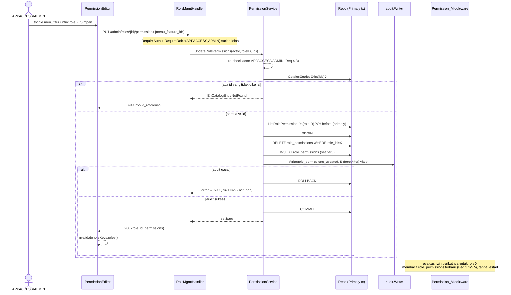

# Design Document — Role Management (Manajemen Peran)

## Overview

Role Management menambahkan lapisan izin **berbasis data** ke backend ATM (`backend/`, port 8080) dan sebuah menu baru di bawah **Pengaturan** pada `CompanyPortal-Vite`. Fitur ini menggantikan izin yang saat ini hardcoded (`RequireRoles(...)` statis) dengan katalog menu/fitur + pemetaan `role_permissions` yang dibaca saat runtime.

Kapabilitas inti (dibatasi ke `APPACCESS`/`ADMIN`):
- Membuat role baru (role baru lahir tanpa akses apa pun).
- Mengatur menu/fitur mana yang dapat diakses tiap role (toggle).
- Melihat katalog dan pemetaan izin saat ini.

Perubahan berlaku **seketika (immediate-apply)** tanpa gerbang maker-checker. Kontrol pengganti adalah audit trail penuh (`audit_logs`: who/what/before/after/when/ip) plus pembatasan otorisasi. Ini adalah penyimpangan sadar dari Golden Rule #3 (lihat bagian "Documented Deviation").

Desain ini mengikuti pola modul yang sudah ada di `backend/internal/` (handler → service → repository, narrow interfaces, flat JSON, audit lewat `internal/audit.Writer`) dan pola frontend `rbac-settings` (RoleBadge, Zod + RHF, TanStack Query hooks, tema Merah Sirih).

### Scope boundaries
- **Bukan** menggantikan `RequireRoles(...)` legacy — route statis yang ada tetap utuh (Req 5.2).
- **Bukan** bagian dari hierarki approval/delegasi/policy `rbac-settings` — konsep akses menu/fitur dipisah bersih dari maker-checker (Req 5.4).
- **Tidak** ada eksekusi apa pun selain baca/tulis katalog + pemetaan (tidak ada payment, tidak ada file ingest).

### Design prerequisite (BLOCKING)
Requirement 1.6 & Golden Rule 7: tabel/kolom baru **harus diusulkan di `project-context.md` Sec 2 dan disetujui sebelum migrasi dibuat**. Dua tabel baru diusulkan di sini (`menu_features`, `role_permissions`). Migrasi **tidak boleh** ditulis sampai kedua tabel masuk ke daftar tabel Core/Auth yang disetujui di Sec 2. Nomor migrasi bebas berikutnya adalah **`040`** (migrasi terakhir yang ada: `039_admin_atm_search_index.sql`).

---

## Architecture

### Backend module

Modul baru: **`backend/internal/rolemgmt/`** (ATM backend, own `go.mod` via workspace). Struktur mengikuti pola `internal/service` + `internal/repository` + handler di `internal/handler`:

```
backend/internal/rolemgmt/
  service.go        # PermissionService — validasi, re-check otorisasi, audit guarantee
  repository.go     # PrimaryRepo (write + read-after-write) / ReplicaRepo (list reads)
  errors.go         # sentinel errors (ErrRoleNameConflict, ErrCatalogEntryNotFound, ErrNotAuthorized, ...)
  evaluator.go      # PermissionEvaluator — runtime permission lookup for Permission_Middleware
backend/internal/handler/
  role_mgmt_handler.go        # HTTP handler (flat JSON), mounted under /api/v1/admin/roles
backend/internal/db/
  role_mgmt.sql.go            # sqlc-style generated queries (hand-written until sqlc unblocked — see note)
```

> **sqlc note:** `sqlc generate` saat ini terblokir oleh bug pre-existing di migration 017 (project-context.md Sec 12). Seperti `internal/db/{audit,approval}.sql.go`, query untuk modul ini ditulis tangan mengikuti konvensi output sqlc persis, lalu diregenerasi begitu 017 diperbaiki.

Layering (identik dengan `VendorAdminService`):
- **Handler** — decode/encode JSON datar, resolve `AuthContext` + IP, map sentinel error → HTTP status. Tidak ada aturan bisnis.
- **Service (`PermissionService`)** — validasi, resolusi keunikan, **re-check otorisasi APPACCESS/ADMIN** (Req 4.3/4.4), dan jaminan audit-write. Bergantung pada narrow interfaces (repo + audit) agar bisa di-fake di unit test tanpa DB.
- **Repository** — `pgxpool`-backed; write → primary, list read → replica, read-after-write → primary (Req 8).

### Middleware

Dua lapisan otorisasi (Req 4, "enforce at middleware AND service"):

1. **Static route guard** (route mount): `RequireAuth(tokenService)` + `RequireRoles("APPACCESS", "ADMIN")`. Ini menjaga endpoint Role Management itu sendiri (self-administration), konsisten dengan mount `admin/users` di `main.go`. Menghasilkan 403 untuk role lain (Req 4.2).

2. **`Permission_Middleware` (dynamic, baru)** — `rolemgmt.RequirePermission(evaluator, "menu.key", "feature.key")`. Untuk **Dynamic_Route** (route yang memilih model izin data-driven), middleware ini membaca `role_permissions` saat runtime lewat `PermissionEvaluator` dan mengizinkan/menolak (403) **hanya** berdasarkan pemetaan DB, tanpa merujuk daftar role hardcoded (Req 5.3). Legacy `RequireRoles(...)` tidak disentuh (Req 5.2).

> Endpoint Role Management sendiri sengaja dijaga guard statis (`RequireRoles("APPACCESS","ADMIN")`), bukan oleh dirinya sendiri secara dinamis — menghindari deadlock bootstrap ("siapa yang memberi APPACCESS izin mengelola izin"). `Permission_Middleware` yang dinamis diperuntukkan bagi route bisnis baru lain yang memilih model data-driven.

#### Caching consideration (tradeoff)
`Permission_Evaluator` membaca `role_permissions` per-evaluasi. Redis tersedia (`pkg/middleware` sudah memakainya untuk rate-limit) dan bisa men-cache pemetaan per-role. **Keputusan desain: mulai tanpa cache** — baca langsung dari **Replica_Pool** pada setiap evaluasi. Alasan: (a) Req 5.5 menuntut perubahan berlaku pada evaluasi berikutnya tanpa restart; cache memunculkan masalah invalidasi (perubahan izin harus segera terlihat), (b) tabel kecil, query berindeks `(role_id)` murah, (c) YAGNI sampai profiling menunjukkan hot path. Tradeoff: satu query replica per request pada Dynamic_Route. Jika nanti perlu, cache Redis per-role dengan TTL pendek + invalidasi eksplisit saat `UpdateRolePermissions` — didokumentasikan sebagai peningkatan opsional, bukan bagian scope awal.

### Frontend feature

Feature baru: **`frontend/CompanyPortal-Vite/src/features/role-management/`**, cermin struktur `rbac-settings/` (`api.ts`, `types.ts`, `hooks/`, `components/`, `index.ts`, `__tests__/`).

Routing (TanStack Router, file-based) — sub-route di bawah `/settings` yang sudah ada:
```
src/routes/settings.roles.tsx        # /settings/roles — daftar role + editor izin
```
Dijaga `requireRoles(["APPACCESS", "ADMIN"])` di `beforeLoad` (pola `settings.tsx`). Nav di `SettingsHubPage` mendapat satu kartu baru "Manajemen Peran" pada tab "Akses & persetujuan". Kartu/entri disembunyikan bila user tidak memiliki izin (Req 4.5, 7.1) — konsisten dengan `filterNavByRoles` di `Sidebar.tsx`.

### Data flow (topology)

```
Write (create role / update permissions)        → Primary_Pool
Read-after-write (return the freshly-written row) → Primary_Pool
List reads (roles + permissions, catalog)        → Replica_Pool
Runtime permission evaluation (middleware)        → Replica_Pool
```

> Catatan implementasi: pool replica (`dbRead`) belum di-wire (Phase 0.1 di development-plan; `main.go` masih pakai `dbPool` tunggal dengan komentar `ponytail:`). Repository ini mengekspos `db` (primary) dan `dbRead` (replica) sebagai konstruktor terpisah; sampai replica di-wire, keduanya menunjuk `dbPool` yang sama, mengikuti konvensi TODO `ponytail:` yang ada di `VendorAdminRepository`.

---

## Data Models

### Proposed tables (pending approval into `project-context.md` Sec 2)

Kedua tabel bergabung ke grup **Auth/Core**. Tidak ada uang → tidak ada `numeric`. Timestamp `timestamptz`, default `now()`. Gaya identik dengan migrasi yang ada (`bigint GENERATED ALWAYS AS IDENTITY` / `bigserial`, FK + index eksplisit).

#### Table 1: `menu_features` (Menu_Feature_Catalog)

Katalog datar-berhierarki: satu baris = satu menu (parent) atau satu fitur (child dari sebuah menu). Hierarki menu→fitur diwakili `parent_id` self-FK (nullable: NULL = entri menu tingkat atas).

| Column | Type | Null | Notes |
|--------|------|------|-------|
| `id` | `bigint IDENTITY` | NO | PK |
| `parent_id` | `bigint` | YES | self-FK → `menu_features(id)`; NULL = menu tingkat atas, non-NULL = fitur milik menu |
| `key` | `text` | NO | stabil, machine-readable, unik global; mis. `settings.roles`, `settings.roles.create` |
| `label` | `text` | NO | label tampilan (Bahasa Indonesia), mis. "Manajemen Peran" |
| `kind` | `text` | NO | `menu` \| `feature` (CHECK); `menu` ⇔ `parent_id IS NULL` |
| `sort_order` | `integer` | NO | urutan render, default 0 |
| `is_active` | `boolean` | NO | default `true`; soft-hide dari katalog tanpa hapus baris |
| `created_at` | `timestamptz` | NO | default `now()` |
| `updated_at` | `timestamptz` | NO | default `now()` |

Constraints/index:
- `menu_features_pkey PRIMARY KEY (id)`
- `menu_features_key_uq UNIQUE (key)`
- `menu_features_parent_fk FOREIGN KEY (parent_id) REFERENCES menu_features(id) ON DELETE RESTRICT`
- `CONSTRAINT menu_features_kind_chk CHECK (kind IN ('menu','feature'))`
- `CONSTRAINT menu_features_hierarchy_chk CHECK ((kind = 'menu' AND parent_id IS NULL) OR (kind = 'feature' AND parent_id IS NOT NULL))`
- `INDEX menu_features_parent_idx ON menu_features(parent_id)`

#### Table 2: `role_permissions` (Role_Permission_Mapping)

Pemetaan many-to-many `roles` ↔ `menu_features`. Kehadiran baris = role diberi entri katalog itu. Tidak ada baris = tidak ada akses (Req 2.2, 5.1 — role baru = nol akses).

| Column | Type | Null | Notes |
|--------|------|------|-------|
| `id` | `bigint IDENTITY` | NO | PK |
| `role_id` | `bigint` | NO | FK → `roles(id) ON DELETE CASCADE` |
| `menu_feature_id` | `bigint` | NO | FK → `menu_features(id) ON DELETE CASCADE` |
| `granted_by` | `bigint` | NO | FK → `users(id)`; aktor yang memberi (jejak, selain `audit_logs`) |
| `created_at` | `timestamptz` | NO | default `now()` |

Constraints/index:
- `role_permissions_pkey PRIMARY KEY (id)`
- `role_permissions_role_feature_uq UNIQUE (role_id, menu_feature_id)` — idempotensi grant, cegah duplikat
- `role_permissions_role_fk FOREIGN KEY (role_id) REFERENCES roles(id) ON DELETE CASCADE`
- `role_permissions_feature_fk FOREIGN KEY (menu_feature_id) REFERENCES menu_features(id) ON DELETE CASCADE`
- `INDEX role_permissions_role_idx ON role_permissions(role_id)` — evaluasi runtime per-role
- `INDEX role_permissions_feature_idx ON role_permissions(menu_feature_id)`

### Migration `040_role_permissions.sql` (structure, after Sec 2 approval)
- `BEGIN; ... COMMIT;` (pola semua migrasi).
- `CREATE TABLE IF NOT EXISTS` untuk kedua tabel + FK/index (pola `002`/`023`).
- Seed katalog (`menu_features`) dengan menu/fitur yang sudah ada saat ini di `NAV_CONFIG` (dashboard, cash-flow, monitoring, forecasting, replenish, invoice, cash-count, settings + sub-fitur create/edit role), `ON CONFLICT (key) DO NOTHING` (pola seed `003`/`027`).
- **Seed pemetaan awal supaya tidak ada yang rusak**: untuk tiap role yang sudah di-seed (`003`, `027`), petakan `role_permissions` yang mencerminkan akses implisit mereka saat ini (diturunkan dari `roles` di `NAV_CONFIG` + gate `RequireRoles` yang ada). Contoh: `ADMIN`/`ADMIN_PARAM`/`APPACCESS` → semua entri katalog; `ATM-USER`/`ATM-SPV` → menu ATM/monitoring/forecasting sesuai `NAV_CONFIG`. `ON CONFLICT (role_id, menu_feature_id) DO NOTHING`. Ini menjaga perilaku eksisting saat lapisan dinamis dinyalakan (Req 5.1 hanya berlaku untuk role **baru**).

### Go structs (mengikuti gaya sqlc `models.go`)

```go
// internal/db/models.go (regenerated by sqlc)
type MenuFeature struct {
    ID        int64
    ParentID  *int64
    Key       string
    Label     string
    Kind      string
    SortOrder int32
    IsActive  bool
    CreatedAt pgtype.Timestamptz
    UpdatedAt pgtype.Timestamptz
}

type RolePermission struct {
    ID            int64
    RoleID        int64
    MenuFeatureID int64
    GrantedBy     int64
    CreatedAt     pgtype.Timestamptz
}
```

---

## Components and Interfaces

### Backend — `PermissionService` (`internal/rolemgmt/service.go`)

Narrow dependency interfaces (pola `VendorAdminService`):

```go
type Repo interface {
    // Roles
    ListRolesWithPermissions(ctx context.Context) ([]db.RoleWithPermissionsRow, error) // replica
    FindRoleByName(ctx context.Context, name string) (*int64, error)                    // replica-ok, unik pre-check
    CreateRole(ctx context.Context, arg db.CreateRoleParams) (db.Role, error)           // primary
    GetRole(ctx context.Context, id int64) (*db.Role, error)                            // primary (read-after-write)
    // Catalog
    ListCatalog(ctx context.Context) ([]db.MenuFeature, error)                          // replica
    CatalogEntriesExist(ctx context.Context, ids []int64) (bool, error)                 // validasi Req 3.3
    // Permissions
    ListRolePermissionIDs(ctx context.Context, roleID int64) ([]int64, error)           // primary (read-after-write)
    ReplaceRolePermissions(ctx context.Context, tx pgx.Tx, roleID int64, featureIDs []int64, grantedBy int64) error
}

type AuditWriter interface {
    Write(ctx context.Context, entry audit.Entry) error
}

type TxRunner interface { // pgxpool.Pool satisfies via Begin
    Begin(ctx context.Context) (pgx.Tx, error)
}
```

Service methods:

| Method | Requirement | Behavior |
|--------|-------------|----------|
| `ListRoles(ctx)` | 3.5 | Replica read: roles + entri katalog termap. Read-only, no audit. |
| `ListCatalog(ctx)` | 1.1 | Replica read: katalog menu/fitur. Read-only, no audit. |
| `CreateRole(ctx, actor, req)` | 2.1–2.5, 4.3 | Re-check actor APPACCESS/ADMIN; validasi nama (non-empty, aturan); pre-check unik (`FindRoleByName`) → `ErrRoleNameConflict` (409); insert di primary; role lahir **tanpa** `role_permissions`; audit `role_created` (After). |
| `UpdateRolePermissions(ctx, actor, roleID, featureIDs)` | 3.1–3.4, 4.3 | Re-check actor; validasi semua `featureIDs` ada (`CatalogEntriesExist`) → `ErrCatalogEntryNotFound` (400); baca `before` (primary); dalam **satu transaksi**: `ReplaceRolePermissions` (delete-then-insert set) **lalu** tulis audit `role_permissions_updated` (Before/After) — commit hanya bila keduanya sukses (lihat "Audit-in-tx"). |

**Re-check otorisasi (Req 4.3/4.4):** service menerima `actorRole string` dari handler (`AuthContext.Role`) dan memverifikasi `APPACCESS`/`ADMIN` (case-insensitive, konvensi `RequireRoles`) sebelum menerapkan perubahan; kalau bukan → `ErrNotAuthorized` (di-map 403). Ini memenuhi "enforce di middleware AND service" — bukan bergantung pada middleware saja.

**Audit-in-tx (Req 6.3):** `UpdateRolePermissions` menjalankan mutasi izin **dan** audit-write dalam satu `pgx.Tx`. `audit.NewWriter(tx)` (Writer menerima `db.DBTX`, dan `pgx.Tx` memenuhinya) memastikan bila audit-write gagal, transaksi di-rollback dan izin tidak berubah — "tidak ada perubahan tanpa jejak audit". `CreateRole` mengikuti pola sama (insert role + audit dalam satu tx). Ini lebih kuat dari pola `VendorAdminService` (yang menulis audit setelah commit dengan `fmt.Errorf` bila gagal); di sini Req 6.3 secara eksplisit menuntut atomicity, jadi kita naikkan ke transaksi tunggal.

### Backend — `PermissionEvaluator` + `Permission_Middleware` (`internal/rolemgmt/evaluator.go`)

```go
type PermissionEvaluator struct { repo ReplicaReader } // reads role_permissions via replica

// HasPermission returns true if the role is mapped to the catalog entry with the given key.
func (e *PermissionEvaluator) HasPermission(ctx context.Context, roleName, featureKey string) (bool, error)

// RequirePermission is chi middleware for Dynamic_Route: 403 unless the
// authenticated user's role maps to featureKey in role_permissions (Req 1.3, 5.3).
func RequirePermission(e *PermissionEvaluator, featureKey string) func(http.Handler) http.Handler
```

`RequirePermission` mengambil `AuthContext` (via `middleware.GetAuthContext`), memanggil `HasPermission(role, featureKey)`, menulis 403 flat JSON (`{"error":"forbidden","message":...}`, pola `writeJSONError`) bila false. Keputusan **hanya** dari `role_permissions` (Req 5.3) — tidak ada daftar role hardcoded.

### Backend — HTTP handler (`internal/handler/role_mgmt_handler.go`)

Mengikuti `RbacListHandler`/`AdminUserHandler`: `Routes() chi.Router`, flat JSON via `writeJSON`/`writeError`, IP via `extractClientIP(r)`, actor via `middleware.GetAuthContext`.

Mount di `main.go`:
```go
roleMgmtRepo := rolemgmt.NewRepository(dbPool /*, dbRead when wired */)
roleMgmtSvc  := rolemgmt.NewPermissionService(roleMgmtRepo, auditWriter, dbPool)
roleMgmtHandler := handler.NewRoleMgmtHandler(roleMgmtSvc)
r.With(
    custommw.RequireAuth(tokenService),
    custommw.RequireRoles("APPACCESS", "ADMIN"),
).Mount("/api/v1/admin/roles", roleMgmtHandler.Routes())
```

#### REST endpoints (flat JSON, Req 7.4)

| Method | Path | Req | Success | Errors |
|--------|------|-----|---------|--------|
| `GET` | `/api/v1/admin/roles` | 3.5 | 200 `{"roles":[{id,role,description,permissions:[{menu_feature_id,key,label,kind,parent_id}]}]}` | 401, 403, 500 |
| `GET` | `/api/v1/admin/roles/catalog` | 1.1 | 200 `{"catalog":[{id,parent_id,key,label,kind,sort_order}]}` | 401, 403, 500 |
| `POST` | `/api/v1/admin/roles` | 2.1–2.5 | 201 `{id,role,description}` | 400 (validasi), 409 (nama dipakai), 401, 403, 500 |
| `PUT` | `/api/v1/admin/roles/{id}/permissions` | 3.1–3.4 | 200 `{role_id, permissions:[menu_feature_id...]}` | 400 (entri katalog tidak ada), 404 (role), 401, 403, 500 |

Request bodies:
```jsonc
// POST /api/v1/admin/roles
{ "role": "AUDITOR-VIEW", "description": "Read-only auditor" }

// PUT /api/v1/admin/roles/{id}/permissions   (full replace of the set)
{ "menu_feature_ids": [12, 13, 20] }
```

Error → HTTP mapping (pola `handleUserAdminError`):

| Sentinel | Status | code |
|----------|--------|------|
| `ValidationError` | 400 | `bad_request` |
| `ErrRoleNameConflict` | 409 | `conflict` |
| `ErrCatalogEntryNotFound` | 400 | `invalid_reference` |
| `ErrRoleNotFound` | 404 | `not_found` |
| `ErrNotAuthorized` | 403 | `forbidden` |
| (lain) | 500 | `internal_error` |

### Frontend — `role-management` feature

`types.ts` — entitas + skema Zod (pola `rbac-settings/types.ts`):
```ts
export interface RoleWithPermissions {
  id: number; role: string; description: string | null;
  permissions: CatalogEntry[];
}
export interface CatalogEntry {
  id: number; parent_id: number | null; key: string; label: string;
  kind: "menu" | "feature"; sort_order: number;
}
export const createRoleSchema = z.object({
  role: z.string().min(1, "Nama peran wajib diisi")
    .regex(/^[A-Z0-9-]+$/, "Gunakan huruf kapital, angka, dan tanda hubung"),
  description: z.string().optional(),
});
export const permissionsSchema = z.object({
  menu_feature_ids: z.array(z.number().int().positive()),
});
```

`api.ts` — typed client di atas `@/lib/api/client` (flat JSON), base `/admin/roles`:
`getRoles()`, `getCatalog()`, `createRole(values)`, `updateRolePermissions(id, ids)`.

`hooks/useRoleQueries.ts` — TanStack Query (pola `useRbacQueries.ts`):
```ts
export const roleKeys = { all:["role-mgmt"], roles:()=>[...roleKeys.all,"roles"], catalog:()=>[...roleKeys.all,"catalog"] };
useRoles(); useCatalog();
useCreateRole();            // invalidates roleKeys.roles()
useUpdateRolePermissions(); // invalidates roleKeys.roles()
```

`components/`:
- `RoleManagementPage.tsx` — layout + header (pola `PageHeader`, tema Merah Sirih), TanStack Table daftar role dengan `RoleBadge` (reuse dari `rbac-settings` — dipindah ke `components/ui` bila perlu di-share; kalau tidak, import lintas-feature seperti pola yang ada).
- `PermissionEditor.tsx` — untuk role terpilih, pohon menu→fitur dengan toggle (checkbox); submit memanggil `useUpdateRolePermissions`. Toggle memakai focus halo merah (`focus-visible:ring-[var(--red-100)]`), badge status pakai token semantik (bukan brand red), tidak ada maker-checker UI.
- `CreateRoleDialog.tsx` — form RHF + `zodResolver(createRoleSchema)`, validasi klien sebelum call backend (Req 7.3), pesan Bahasa Indonesia.

Design tokens (design.md Merah Sirih): merah ≤10% (hanya primary button "Simpan"/"Buat Peran" & focus halo & baris aktif `--red-50`), tabel header uppercase `--n-500`, divider `--n-100`, badge pill icon+label. Tidak ada side-stripe > 1px selain pola featured-card yang sudah ada.

Nav conditional (Req 4.5/7.1): kartu "Manajemen Peran" ditambahkan ke `RBAC_CARDS` di `SettingsHubPage.tsx` (`href:"/settings/roles"`). Route `beforeLoad: requireRoles(["APPACCESS","ADMIN"])`; user tanpa izin melihat `<Forbidden />` (pola `settings.tsx`) dan kartu tidak dirender untuk role di luar daftar.

---

## Sequence Diagrams

### Create role (immediate-apply, audit-in-tx)

```mermaid
sequenceDiagram
    actor U as APPACCESS/ADMIN
    participant FE as CreateRoleDialog (RHF+Zod)
    participant MW as RequireAuth + RequireRoles
    participant H as RoleMgmtHandler
    participant S as PermissionService
    participant DB as Primary_Pool (tx)
    participant A as audit.Writer

    U->>FE: isi nama + deskripsi, submit
    FE->>FE: validasi Zod (klien)
    FE->>MW: POST /api/v1/admin/roles
    MW->>MW: validasi JWT; role ∈ {APPACCESS,ADMIN}?
    alt bukan APPACCESS/ADMIN
        MW-->>FE: 403 forbidden
    else diizinkan
        MW->>H: teruskan (AuthContext)
        H->>S: CreateRole(actor, {role, description})
        S->>S: re-check actor APPACCESS/ADMIN (Req 4.3)
        S->>S: validasi nama non-empty/format
        S->>DB: FindRoleByName(name)
        alt nama sudah ada
            S-->>H: ErrRoleNameConflict
            H-->>FE: 409 conflict
        else unik
            S->>DB: BEGIN
            S->>DB: INSERT roles (tanpa role_permissions)
            S->>A: Write(role_created, After) via tx
            alt audit gagal
                S->>DB: ROLLBACK
                S-->>H: error
                H-->>FE: 500 (perubahan TIDAK diterapkan)
            else audit sukses
                S->>DB: COMMIT
                S-->>H: role baru
                H-->>FE: 201 {id, role, description}
                FE->>FE: invalidate roleKeys.roles()
            end
        end
    end
```

### Edit permissions (full-set replace, audit-in-tx)



---

## Error Handling

- **Validasi input** (nama kosong/format salah, body malformed) → 400 `bad_request` dengan pesan Bahasa Indonesia (`ValidationError`, pola existing).
- **Nama role duplikat** → 409 `conflict` (pre-check `FindRoleByName` + fallback unique-violation dari DB, pola `VendorAdminService.Create`).
- **Entri katalog tidak ada** (Req 3.3) → 400 `invalid_reference`.
- **Role tidak ditemukan** pada update → 404 `not_found`.
- **Otorisasi**: middleware gagal → 403 (route guard); service re-check gagal → `ErrNotAuthorized` → 403.
- **Audit-write gagal** (Req 6.3) → transaksi rollback → 500; perubahan tidak diterapkan (tidak ada state tanpa jejak).
- **Kesalahan tak terduga** → 500 `internal_error` (pesan generik, detail ke `slog`, tidak bocor ke klien).
- **Frontend**: `ApiError` dari client di-surface via `StatusMessage` (pola `rbac-settings`); Zod menahan input tak valid sebelum call.

---

## Documented Deviation — Golden Rule #3 (maker-checker)

Golden Rule #3 mensyaratkan create/update/delete pada data konfigurasi melewati `approval_requests`. Untuk fitur ini, pengguna **secara eksplisit memilih immediate-apply (audit-only)** — Requirement 6. Konsekuensi desain:
- **Tidak** memanggil `approval.Orchestrator`, **tidak** membuat `approval_requests`. Perubahan berlaku seketika (Req 6.1).
- Kontrol pengganti: (a) audit trail lengkap dalam transaksi yang sama dengan perubahan (Req 6.2/6.3), (b) otorisasi ketat APPACCESS/ADMIN di middleware **dan** service.
- Penyimpangan ini dicatat di sini (dokumentasi fitur, Req 6.4) dan wajib dicatat di `project-context.md` saat modul di-land, agar tidak disalahartikan sebagai kelalaian.

---

## Testing Strategy

Target: ≥80% pada paket `internal/*` terkait (Req 8.4, project-context Sec 7).

**Go — service (`rolemgmt/service_test.go`), table-driven + mock repo/audit:**
- `CreateRole`: sukses (role lahir nol izin + audit `role_created` ditulis); nama duplikat → `ErrRoleNameConflict`; nama kosong/format salah → `ValidationError`; actor non-APPACCESS/ADMIN → `ErrNotAuthorized` (Req 4.3/4.4); audit-write gagal → error, insert tidak commit (fake tx).
- `UpdateRolePermissions`: sukses (set diganti + audit Before/After); id katalog tidak dikenal → `ErrCatalogEntryNotFound`; role tidak ada → `ErrRoleNotFound`; actor tidak berwenang → `ErrNotAuthorized`; audit gagal → rollback (izin tak berubah).
- Autorisasi matrix: APPACCESS ✓, ADMIN ✓, ADMIN_PARAM/ATM-USER/VENDOR-USER ✗ (403).

**Go — evaluator (`evaluator_test.go`):** `HasPermission` true bila baris ada, false bila tidak; keputusan murni dari pemetaan (tanpa role hardcoded). Middleware `RequirePermission`: 403 saat tidak termap, pass saat termap.

**Go — handler (`role_mgmt_handler_test.go`), `httptest` + fake service:** status code + bentuk JSON datar untuk tiap endpoint; 403 saat `RequireRoles` menolak (RBAC test terpisah, pola `audit_log_handler_rbac_test.go`); 400/409/404 mapping.

**Go — repository (`repository_integration_test.go`, real Postgres):** unique `(role_id, menu_feature_id)` menegakkan idempotensi; `ReplaceRolePermissions` delete-then-insert benar; read-after-write pakai primary; list pakai replica routing (saat di-wire).

**Frontend (Vitest + RTL, `__tests__/`):** `CreateRoleDialog` validasi Zod (nama kosong/format); `PermissionEditor` toggle → mutation dipanggil dengan set benar; nav card tersembunyi untuk role tanpa izin; hooks meng-invalidate key yang benar. Network di-mock (pola feature `rbac-settings`).

---

## Correctness Properties

*A property is a characteristic or behavior that should hold true across all valid executions of the system — a formal, machine-verifiable statement about what the system should do.*

### Property 1: New role has zero access
For any newly created role, its set of mapped catalog entries in `role_permissions` is empty immediately after creation.

**Validates: Requirements 2.2, 5.1**

### Property 2: Role name uniqueness
For any role-creation request whose name (case-insensitive) already exists, the system rejects the request and creates no new role row.

**Validates: Requirements 2.3**

### Property 3: Authorization is enforced at the service layer
For any create-or-update operation whose actor role is not APPACCESS nor ADMIN, the system rejects the operation and applies no change, regardless of how the request reached the service.

**Validates: Requirements 4.3, 4.4**

### Property 4: Change-without-audit is impossible
For any successful create/update/delete operation on Role Management, an `audit_logs` row with the actor, action, before/after, and IP exists; and for any operation whose audit write fails, no permission or role change is persisted.

**Validates: Requirements 6.2, 6.3**

### Property 5: Permission edit is a full-set replacement reflected on next evaluation
For any role and any set of valid catalog entry ids submitted, after the update the role's mapped entries equal exactly that set, and the next permission evaluation for that role reflects the new set without a service restart.

**Validates: Requirements 3.1, 3.2, 5.5**

### Property 6: Invalid catalog reference is rejected atomically
For any permission-update request referencing at least one catalog entry id that does not exist, the system rejects the request and leaves the role's existing mapping unchanged.

**Validates: Requirements 3.3**

### Property 7: Dynamic evaluation depends only on the mapping
For any role and any catalog feature key, `HasPermission` returns true if and only if a `role_permissions` row links that role to that catalog entry — never consulting a hardcoded role list.

**Validates: Requirements 1.3, 5.3**

### Property 8: Nav renders exactly the mapped menus/features
For any active user, the set of Role Management menus/features rendered under Pengaturan equals the set mapped to that user's role as read from the backend (empty set ⇒ entry hidden).

**Validates: Requirements 1.4, 4.5**

### Property 9: Write/read topology
For any Role Management write, the operation targets the Primary_Pool; for any read-after-write in the same flow, the read targets the Primary_Pool; and for any list/reporting read, the operation targets the Replica_Pool.

**Validates: Requirements 8.1, 8.2, 8.3**

### Property 10: Legacy static guards are untouched
For any existing route guarded by `RequireRoles(...)`, its access decision is unchanged by the introduction of the dynamic permission layer.

**Validates: Requirements 5.2**
