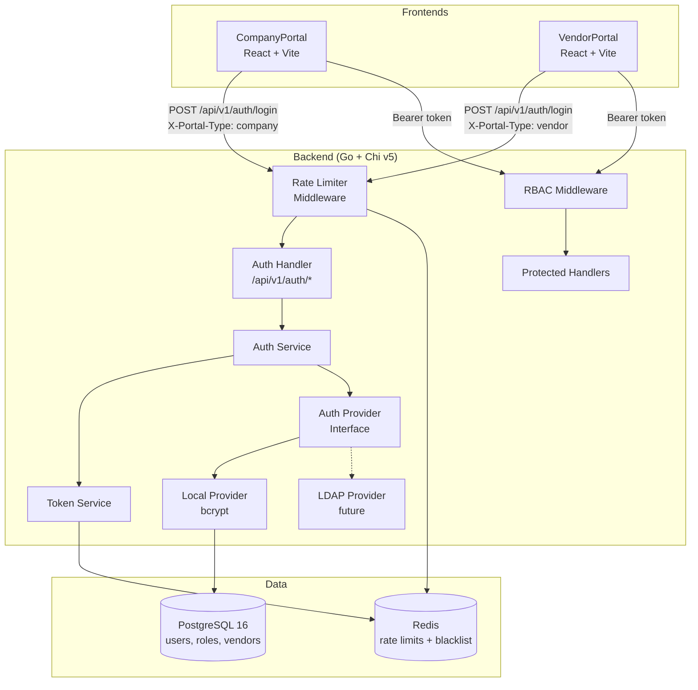
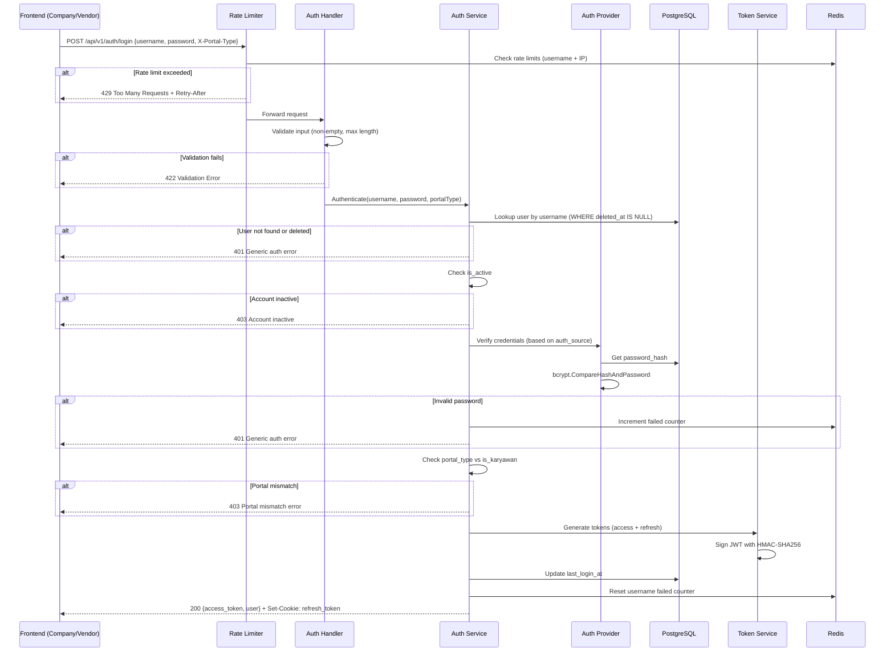
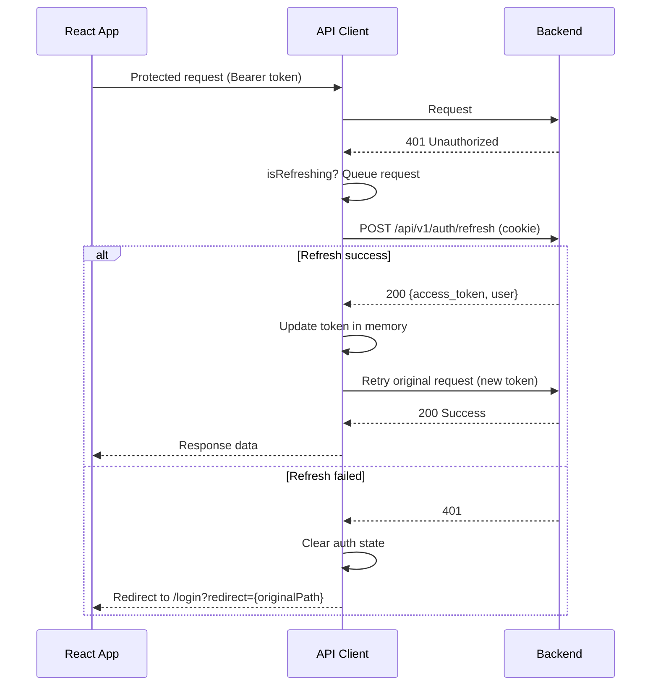

# Design Document: User Login

## Overview

Fitur login CMS mendukung dua tipe user (internal karyawan dan vendor) yang mengakses sistem melalui dua portal terpisah (CompanyPortal dan VendorPortal). Arsitektur dirancang dengan auth provider abstraction sehingga LDAP dapat dipasang di production tanpa mengubah handler/service layer. Saat development, semua user menggunakan local credential (bcrypt).

### Key Design Decisions

1. **Auth Provider Interface** — Abstraksi via Go interface agar LDAP pluggable tanpa ubah service/handler
2. **Dual Portal, Single Backend** — Kedua portal hit endpoint yang sama, dibedakan via `X-Portal-Type` header
3. **JWT Access + Refresh Token** — Access token (15min) di memory, refresh token (7 days) di httpOnly cookie
4. **Redis Rate Limiting** — Fixed window counter per username dan IP, fail-closed jika Redis down
5. **Role Mapping Reconciliation** — Frontend roles di-align ke 9 DB roles, menghapus role mapping lama


## Architecture

### System Architecture Diagram




### Login Flow Sequence




## Components and Interfaces

### Backend Components

#### 1. Auth Provider Interface (`internal/auth/provider.go`)

```go
package auth

import "context"

// AuthIdentity is the result of successful authentication.
type AuthIdentity struct {
    UserID     int64
    Username   string
    Role       string
    IsKaryawan bool
    VendorID   *int64
}

// Provider abstracts credential verification.
// Implementations: LocalProvider (bcrypt), future LDAPProvider.
type Provider interface {
    Authenticate(ctx context.Context, username, password string) (*AuthIdentity, error)
    Supports(authSource string) bool
}
```

#### 2. Local Provider (`internal/auth/local_provider.go`)

```go
package auth

// LocalProvider verifies credentials against bcrypt password_hash in DB.
// Supports auth_source values: "local", "local_dev"
type LocalProvider struct {
    repo UserRepository
}

func (p *LocalProvider) Supports(authSource string) bool {
    return authSource == "local" || authSource == "local_dev"
}

func (p *LocalProvider) Authenticate(ctx context.Context, username, password string) (*AuthIdentity, error) {
    // 1. Fetch user record (password_hash) from repo
    // 2. bcrypt.CompareHashAndPassword (constant-time)
    // 3. Return AuthIdentity or ErrInvalidCredentials
}
```


#### 3. Auth Service (`internal/auth/service.go`)

```go
package auth

// Service orchestrates the login flow.
type Service struct {
    providers    []Provider
    tokenService *TokenService
    userRepo     UserRepository
    rateLimiter  *RateLimiter
}

type LoginRequest struct {
    Username   string `json:"username" validate:"required,min=1,max=255"`
    Password   string `json:"password" validate:"required,min=1,max=255"`
    PortalType string // from X-Portal-Type header: "company" | "vendor"
}

type LoginResponse struct {
    AccessToken string      `json:"access_token"`
    User        UserProfile `json:"user"`
}

type UserProfile struct {
    ID         int64  `json:"id"`
    Username   string `json:"username"`
    FullName   string `json:"full_name"`
    Email      string `json:"email"`
    Role       string `json:"role"`
    IsKaryawan bool   `json:"is_karyawan"`
    VendorID   *int64 `json:"vendor_id,omitempty"`
}

// Login executes the authentication flow in order:
// 1. Input validation
// 2. User lookup (not found / deleted_at → generic error)
// 3. is_active check → inactive error
// 4. Credential verification via Provider
// 5. Portal type restriction check
// 6. Token generation
// 7. Update last_login_at + reset rate limit counter
func (s *Service) Login(ctx context.Context, req LoginRequest) (*LoginResponse, string, error) {
    // Returns: LoginResponse, refreshToken (for cookie), or error
}
```


#### 4. Token Service (`internal/auth/token_service.go`)

```go
package auth

import "time"

type TokenConfig struct {
    SecretKey          []byte        // min 32 bytes, from env
    AccessTokenExpiry  time.Duration // 15 minutes
    RefreshTokenExpiry time.Duration // 7 days
}

type AccessTokenClaims struct {
    UserID     int64  `json:"id"`
    Username   string `json:"username"`
    Role       string `json:"role"`
    IsKaryawan bool   `json:"is_karyawan"`
    VendorID   *int64 `json:"vendor_id,omitempty"`
    IssuedAt   int64  `json:"iat"`
    ExpiresAt  int64  `json:"exp"`
}

type RefreshTokenClaims struct {
    UserID    int64  `json:"id"`
    JTI       string `json:"jti"` // UUID v4
    IssuedAt  int64  `json:"iat"`
    ExpiresAt int64  `json:"exp"`
}

type TokenService struct {
    config    TokenConfig
    blacklist TokenBlacklist // Redis-backed
}

// GenerateTokenPair creates both access and refresh tokens.
func (ts *TokenService) GenerateTokenPair(identity *AuthIdentity) (accessToken, refreshToken string, err error)

// ValidateAccessToken verifies signature, expiry, and required claims.
func (ts *TokenService) ValidateAccessToken(tokenStr string) (*AccessTokenClaims, error)

// RefreshTokens validates refresh token, checks blacklist, rotates JTI.
func (ts *TokenService) RefreshTokens(refreshTokenStr string) (newAccess, newRefresh string, err error)

// BlacklistRefreshToken adds JTI to Redis blacklist with remaining TTL.
func (ts *TokenService) BlacklistRefreshToken(refreshTokenStr string) error
```


#### 5. Rate Limiter (`internal/middleware/rate_limiter.go`)

```go
package middleware

import (
    "time"
    "github.com/redis/go-redis/v9"
)

type RateLimitConfig struct {
    MaxPerUsername int           // 5
    MaxPerIP       int           // 20
    Window         time.Duration // 15 minutes
}

// Redis key schema:
//   rate:login:user:{username}  → counter (TTL 900s)
//   rate:login:ip:{ip}          → counter (TTL 900s)

type RateLimiter struct {
    redis  *redis.Client
    config RateLimitConfig
}

// Check returns nil if allowed, or ErrRateLimited with Retry-After seconds.
func (rl *RateLimiter) Check(ctx context.Context, username, ip string) error

// IncrementFailed increments both username and IP counters.
func (rl *RateLimiter) IncrementFailed(ctx context.Context, username, ip string) error

// ResetUsername resets username counter on successful login (IP unchanged).
func (rl *RateLimiter) ResetUsername(ctx context.Context, username string) error
```

#### 6. RBAC Middleware (`internal/middleware/rbac.go`)

```go
package middleware

import "net/http"

// AuthContext is injected into request context after token validation.
type AuthContext struct {
    UserID     int64
    Username   string
    Role       string
    IsKaryawan bool
    VendorID   *int64
}

// RequireAuth validates the Bearer token and injects AuthContext.
// Returns 401 if token is missing, malformed, expired, or invalid signature.
func RequireAuth(tokenService *auth.TokenService) func(http.Handler) http.Handler

// RequireRoles checks if the authenticated user's role is in the allowed list.
// Returns 403 if role is not permitted. Empty allowedRoles = any authenticated user.
func RequireRoles(allowedRoles ...string) func(http.Handler) http.Handler
```


#### 7. Auth Handler (`internal/handler/auth_handler.go`)

```go
package handler

import "github.com/go-chi/chi/v5"

type AuthHandler struct {
    authService *auth.Service
}

func (h *AuthHandler) Routes() chi.Router {
    r := chi.NewRouter()
    r.Post("/login", h.Login)       // Rate limited
    r.Post("/refresh", h.Refresh)   // Cookie-based
    r.Post("/logout", h.Logout)     // Cookie-based
    r.With(RequireAuth).Get("/me", h.Me) // Protected
    return r
}
```

### API Endpoint Contracts

#### POST /api/v1/auth/login

**Request:**
```json
{
  "username": "john.admin",
  "password": "secret123"
}
```
**Headers:** `X-Portal-Type: company | vendor`

**Success Response (200):**
```json
{
  "access_token": "eyJhbGciOiJIUzI1NiJ9...",
  "user": {
    "id": 1,
    "username": "john.admin",
    "full_name": "John Admin",
    "email": "john.admin@crown.local",
    "role": "ADMIN",
    "is_karyawan": true,
    "vendor_id": null
  }
}
```
**Set-Cookie:** `refresh_token=eyJ...; HttpOnly; Secure; SameSite=Strict; Path=/api/v1/auth; Max-Age=604800`


**Error Responses:**

| Status | Condition | Body |
|--------|-----------|------|
| 401 | Invalid credentials / user not found / deleted | `{"error": "auth_failed", "message": "Username atau password salah"}` |
| 403 | Account inactive | `{"error": "account_inactive", "message": "Akun tidak aktif"}` |
| 403 | Portal mismatch | `{"error": "portal_mismatch", "message": "Akun tidak memiliki akses ke portal ini"}` |
| 422 | Validation error | `{"error": "validation_error", "message": "Validasi gagal", "details": [{"field": "username", "message": "wajib diisi"}]}` |
| 429 | Rate limited | `{"error": "rate_limited", "message": "Terlalu banyak percobaan"}` + `Retry-After: 540` header |
| 503 | Redis unavailable | `{"error": "service_unavailable", "message": "Layanan sedang tidak tersedia"}` |

#### POST /api/v1/auth/refresh

**Request:** No body. Refresh token sent via httpOnly cookie.

**Success Response (200):**
```json
{
  "access_token": "eyJhbGciOiJIUzI1NiJ9...",
  "user": {
    "id": 1,
    "username": "john.admin",
    "full_name": "John Admin",
    "email": "john.admin@crown.local",
    "role": "ADMIN",
    "is_karyawan": true,
    "vendor_id": null
  }
}
```
**Set-Cookie:** New rotated refresh token cookie.

**Error:** 401 if refresh token is expired, blacklisted, or invalid.

#### POST /api/v1/auth/logout

**Request:** No body. Refresh token sent via httpOnly cookie.

**Success Response (200):** Empty body. Clears refresh token cookie.
Idempotent — returns 200 even if cookie is missing/invalid.

#### GET /api/v1/auth/me

**Headers:** `Authorization: Bearer {access_token}`

**Success Response (200):**
```json
{
  "id": 1,
  "username": "john.admin",
  "full_name": "John Admin",
  "email": "john.admin@crown.local",
  "role": "ADMIN",
  "is_karyawan": true,
  "vendor_id": null
}
```

**Error:** 401 if token invalid/expired.


## Data Models

### Database Migration: `003_add_local_dev_auth.up.sql`

```sql
BEGIN;

-- 1) Expand auth_source constraint to include 'local_dev'
ALTER TABLE users DROP CONSTRAINT users_auth_source_chk;
ALTER TABLE users ADD CONSTRAINT users_auth_source_chk
    CHECK (auth_source IN ('ldap', 'local', 'local_dev'));

-- 2) Expand password_hash constraint to allow local_dev
ALTER TABLE users DROP CONSTRAINT users_password_hash_chk;
ALTER TABLE users ADD CONSTRAINT users_password_hash_chk
    CHECK (
        (auth_source = 'local' AND password_hash IS NOT NULL)
        OR (auth_source = 'local_dev' AND password_hash IS NOT NULL)
        OR (auth_source = 'ldap' AND password_hash IS NULL)
    );

-- 3) Expand vendor logic constraint to allow local_dev for internal users
ALTER TABLE users DROP CONSTRAINT users_vendor_logic_chk;
ALTER TABLE users ADD CONSTRAINT users_vendor_logic_chk
    CHECK (
        (is_karyawan = TRUE AND auth_source = 'ldap' AND vendor_id IS NULL)
        OR (is_karyawan = TRUE AND auth_source = 'local_dev' AND vendor_id IS NULL)
        OR (is_karyawan = FALSE AND auth_source = 'local' AND vendor_id IS NOT NULL)
    );

-- 4) Update internal users to local_dev with default dev password
-- bcrypt hash of "Password123!" with cost 12
UPDATE users
SET auth_source = 'local_dev',
    password_hash = '$2a$12$LJ3m4sMKfRzL7P8bN5Q2kuXjVnZ8Y1p6w3dK9RtHmQvWuC0xOyGNi'
WHERE is_karyawan = TRUE AND auth_source = 'ldap';

COMMIT;
```

### Down Migration: `003_add_local_dev_auth.down.sql`

```sql
BEGIN;

-- 1) Revert internal users back to ldap, remove password_hash
UPDATE users
SET auth_source = 'ldap', password_hash = NULL
WHERE is_karyawan = TRUE AND auth_source = 'local_dev';

-- 2) Restore original constraints
ALTER TABLE users DROP CONSTRAINT users_vendor_logic_chk;
ALTER TABLE users ADD CONSTRAINT users_vendor_logic_chk
    CHECK (
        (is_karyawan = TRUE AND auth_source = 'ldap' AND vendor_id IS NULL)
        OR (is_karyawan = FALSE AND auth_source = 'local' AND vendor_id IS NOT NULL)
    );

ALTER TABLE users DROP CONSTRAINT users_password_hash_chk;
ALTER TABLE users ADD CONSTRAINT users_password_hash_chk
    CHECK (
        (auth_source = 'local' AND password_hash IS NOT NULL)
        OR (auth_source = 'ldap' AND password_hash IS NULL)
    );

ALTER TABLE users DROP CONSTRAINT users_auth_source_chk;
ALTER TABLE users ADD CONSTRAINT users_auth_source_chk
    CHECK (auth_source IN ('ldap', 'local'));

COMMIT;
```


### Redis Key Schema

| Key Pattern | Type | TTL | Purpose |
|-------------|------|-----|---------|
| `rate:login:user:{username}` | STRING (counter) | 900s | Failed login attempts per username |
| `rate:login:ip:{ip}` | STRING (counter) | 900s | Failed login attempts per IP |
| `blacklist:jti:{jti}` | STRING ("1") | Remaining token TTL | Revoked refresh token JTIs |

### Role Mapping: DB → Frontend

The existing frontend uses legacy role names that must be reconciled with the 9 DB roles. The new system uses DB roles as the single source of truth.

| DB Role | Portal | Legacy Frontend Role (to remove) |
|---------|--------|----------------------------------|
| ADMIN | Company | Admin |
| ADMIN_PARAM | Company | Admin (partial) |
| ATM-USER | Company | ATM_Support |
| ATM-SPV | Company | ATM_Support / Cash_Management |
| BRANCH-USER | Company | Branch |
| BRANCH-SPV | Company | Branch |
| BRANCH-ATM-USER | Company | ATM_Support + Branch |
| BRANCH-ATM-SPV | Company | ATM_Support + Branch + Cash_Management |
| VENDOR-USER | Vendor | Vendor |

**Migration strategy:** Replace the frontend `Role` type union with the 9 DB role strings. Update `NAV_CONFIG` roles arrays and `filterNavByRoles` to use new role values directly. The backend returns the exact DB role string in the JWT and login response.


### Frontend Auth Architecture

#### CompanyPortal Auth Store (Zustand — refactored)

The existing `useAuthStore` will be refactored to:
- Replace `Role` type with DB role strings
- Remove `roles: Role[]` array, use single `role: string` from backend
- Keep existing patterns: login, logout, refreshToken, initialize
- Add `X-Portal-Type: company` header to login request
- Add rate limit state (lockout countdown)

```typescript
// New Role type aligned with DB
export type DbRole =
  | "ADMIN"
  | "ADMIN_PARAM"
  | "ATM-USER"
  | "ATM-SPV"
  | "BRANCH-USER"
  | "BRANCH-SPV"
  | "BRANCH-ATM-USER"
  | "BRANCH-ATM-SPV"
  | "VENDOR-USER";

export interface AuthUser {
  id: number;
  username: string;
  fullName: string;
  email: string;
  role: DbRole;        // single role from backend
  isKaryawan: boolean;
  vendorId: number | null;
}
```

#### VendorPortal Auth (Context-based — refactored)

The existing `AuthContext.tsx` will be refactored to:
- Remove simulated JWT / local vendor data
- Hit real backend `POST /api/v1/auth/login` with `X-Portal-Type: vendor`
- Store access token in memory (not localStorage)
- Rely on httpOnly cookie for refresh
- Add rate limit handling

#### Token Refresh Flow (Both Portals)




#### Navigation Role Filtering (Updated)

```typescript
// Updated NAV_CONFIG role arrays use DB roles directly
export type DbRole =
  | "ADMIN" | "ADMIN_PARAM"
  | "ATM-USER" | "ATM-SPV"
  | "BRANCH-USER" | "BRANCH-SPV"
  | "BRANCH-ATM-USER" | "BRANCH-ATM-SPV"
  | "VENDOR-USER";

// filterNavByRoles updated logic:
// - ADMIN and ADMIN_PARAM see all items
// - VENDOR-USER sees only vendor-specific items
// - Other roles see only items where their role is in the route's allowed list
export function filterNavByRoles(items: NavItem[], userRole: DbRole): NavItem[] {
  if (userRole === "ADMIN" || userRole === "ADMIN_PARAM") return items;
  return items.filter((item) => {
    if (item.roles.includes("*")) return true;
    return item.roles.includes(userRole);
  });
}
```

### Security Considerations

1. **Password Storage** — bcrypt cost 12, constant-time comparison, 72-byte max (bcrypt limit)
2. **Token Security** — HMAC-SHA256 with 32+ byte secret from env; access token short-lived (15min)
3. **Refresh Token** — httpOnly + Secure + SameSite=Strict cookie; rotated on each refresh; JTI blacklist on logout
4. **Rate Limiting** — Per-username (5/15min) and per-IP (20/15min); fail-closed if Redis down
5. **Information Disclosure** — Generic error for invalid username/password/deleted users; no user enumeration
6. **Portal Isolation** — X-Portal-Type validated server-side; internal users cannot access vendor portal and vice versa
7. **Input Validation** — Server-side validation before any auth logic; max 255 chars prevents DoS via long bcrypt input
8. **XSS Mitigation** — Access token in JS memory only (not localStorage); refresh token inaccessible to JS
9. **CSRF Protection** — SameSite=Strict on refresh cookie; login endpoint requires JSON body (not form-encoded)
10. **Timing Attacks** — bcrypt's built-in constant-time comparison; no early return on username existence check (always run full auth flow for found users)


## Correctness Properties

*A property is a characteristic or behavior that should hold true across all valid executions of a system — essentially, a formal statement about what the system should do. Properties serve as the bridge between human-readable specifications and machine-verifiable correctness guarantees.*

### Property 1: Bcrypt Round-Trip Verification

*For any* password string between 8 and 72 bytes, hashing it with bcrypt cost 12 and then comparing the original password against the resulting hash SHALL succeed, and comparing any different password against the same hash SHALL fail.

**Validates: Requirements 2.2, 6.1, 6.3, 6.4**

### Property 2: Auth Error Uniformity

*For any* authentication failure — whether caused by a non-existent username, a soft-deleted user (deleted_at not null), or an incorrect password for an existing active user — the Auth_Service SHALL return the same generic error response (identical error type and message), making it impossible for a caller to distinguish between these failure modes.

**Validates: Requirements 3.3, 3.4, 3.6**

### Property 3: Access Token Claims Completeness

*For any* AuthIdentity (user id, username, role from the 9 valid roles, is_karyawan, vendor_id), generating an Access_Token and then decoding it SHALL yield claims containing all original identity fields plus a valid iat and exp where exp - iat equals 900 seconds.

**Validates: Requirements 4.1, 4.2, 4.7**

### Property 4: Refresh Token Uniqueness and Rotation

*For any* sequence of N refresh token generations (N ≥ 2), every generated JTI SHALL be unique, and refreshing a valid token SHALL produce a new token pair whose refresh JTI differs from the original, with refresh expiry of 7 days from issuance.

**Validates: Requirements 4.3, 4.4**

### Property 5: Token Signature Integrity

*For any* token signed with secret key A, validation with a different secret key B (where A ≠ B) SHALL fail, and any modification to the token payload or header SHALL cause signature verification to fail.

**Validates: Requirements 4.5, 4.6, 5.1**


### Property 6: RBAC Role Authorization

*For any* valid Access_Token with role R and any endpoint with allowed roles list L, the RBAC_Middleware SHALL grant access if R is in L or L is empty, and SHALL return 403 Forbidden if R is not in L and L is non-empty.

**Validates: Requirements 5.3, 5.6**

### Property 7: Auth Context Injection

*For any* valid Access_Token containing claims (id, username, role, is_karyawan, vendor_id), after RBAC_Middleware validation the injected AuthContext SHALL contain values identical to the token claims.

**Validates: Requirements 5.7**

### Property 8: Username Rate Limit Threshold

*For any* username, the Rate_Limiter SHALL allow the first 5 failed login attempts within a 15-minute window, and SHALL reject the 6th and subsequent attempts with HTTP 429 and a Retry-After header whose value is ≤ 900 seconds.

**Validates: Requirements 7.1, 7.3**

### Property 9: IP Rate Limit Threshold

*For any* IP address, the Rate_Limiter SHALL allow the first 20 failed login attempts within a 15-minute window, and SHALL reject the 21st and subsequent attempts with HTTP 429 and a Retry-After header whose value is ≤ 900 seconds.

**Validates: Requirements 7.2, 7.4**

### Property 10: Rate Limit Reset on Success

*For any* username with N failed attempts (N < 5), a successful login SHALL reset the username counter to 0, while the IP counter SHALL remain unchanged at its current value.

**Validates: Requirements 7.5, 7.8**

### Property 11: Blacklist Prevents Token Reuse

*For any* valid Refresh_Token, after its JTI is added to the blacklist, any subsequent refresh attempt using that token SHALL be rejected with an authentication error identical to an expired token error.

**Validates: Requirements 8.1, 8.3, 8.4**

### Property 12: Idempotent Logout

*For any* logout request — whether the Refresh_Token cookie is valid, expired, malformed, or missing — the Auth_Service SHALL return HTTP 200 and clear the Refresh_Token cookie.

**Validates: Requirements 8.2**


### Property 13: Navigation Filtering by Role

*For any* user role R and navigation configuration, the filterNavByRoles function SHALL return only items where R is in the item's allowed roles list or the item has wildcard "*" access. For ADMIN and ADMIN_PARAM roles, all items SHALL be returned regardless of their allowed roles list.

**Validates: Requirements 11.2, 11.4, 11.5, 11.6**

### Property 14: Portal Type Isolation

*For any* user where is_karyawan=true attempting login with portal_type='vendor', OR any user where is_karyawan=false attempting login with portal_type='company', the Auth_Service SHALL return HTTP 403 with a portal mismatch error — but only after credential verification succeeds (invalid credentials always produce generic auth error regardless of portal type).

**Validates: Requirements 12.4, 12.5, 12.10**

### Property 15: Auth Provider Selection

*For any* user record, the Auth_Service SHALL select LocalProvider when auth_source is 'local' or 'local_dev', and SHALL return an error for auth_source='ldap' when no LDAPProvider is configured. For any unrecognized auth_source value, the Auth_Service SHALL return an unsupported auth source error.

**Validates: Requirements 2.3, 2.4, 2.6**

### Property 16: Input Validation Priority

*For any* login request where both input validation fails AND credentials are invalid, the Auth_Service SHALL return the validation error (not the auth error), confirming that validation is evaluated before authentication logic.

**Validates: Requirements 3.7, 3.8**

### Property 17: Password Length Boundaries

*For any* password shorter than 8 characters or longer than 72 bytes, the Auth_Service SHALL reject it with a validation error. For any password between 8 characters and 72 bytes (inclusive), the Auth_Service SHALL accept it for hashing and verification.

**Validates: Requirements 6.5**

### Property 18: Whitespace-Only Input Rejection

*For any* string composed entirely of whitespace characters (spaces, tabs, newlines), both the frontend form validation and backend input validation SHALL treat it as empty and reject submission.

**Validates: Requirements 9.6, 3.7**

### Property 19: Retry-After Countdown Formatting

*For any* integer value N (representing seconds from the Retry-After header), the frontend lockout display SHALL format it as "M menit S detik" where M = floor(N/60) and S = N mod 60, with correct values for all N in range [1, 900].

**Validates: Requirements 9.8**


## Error Handling

### Error Response Format

All API errors follow a consistent JSON structure:

```json
{
  "error": "error_type_slug",
  "message": "Human-readable message in Bahasa Indonesia",
  "details": []  // optional, for validation errors only
}
```

### Error Types and HTTP Status Codes

| Error Type | HTTP Status | When | User-Facing Message |
|------------|-------------|------|---------------------|
| `auth_failed` | 401 | Invalid credentials, user not found, deleted user | "Username atau password salah" |
| `account_inactive` | 403 | User exists but is_active=false | "Akun tidak aktif. Hubungi administrator." |
| `portal_mismatch` | 403 | User type doesn't match portal | "Akun tidak memiliki akses ke portal ini" |
| `token_expired` | 401 | Access/refresh token expired | "Sesi telah berakhir. Silakan login kembali." |
| `token_invalid` | 401 | Malformed/tampered token | "Token tidak valid" |
| `forbidden` | 403 | Valid token but insufficient role | "Anda tidak memiliki akses ke resource ini" |
| `validation_error` | 422 | Input validation failure | "Validasi gagal" + details array |
| `rate_limited` | 429 | Too many failed attempts | "Terlalu banyak percobaan login" |
| `service_unavailable` | 503 | Redis down (fail-closed) | "Layanan sedang tidak tersedia" |

### Error Handling Strategy

1. **Never expose internal details** — Stack traces, SQL errors, bcrypt internals are logged server-side (slog) but never returned to client
2. **Consistent error shape** — All errors parse to the same TypeScript interface on the frontend
3. **Fail-closed for security** — Redis unavailability blocks login rather than bypassing rate limits
4. **Idempotent operations** — Logout always succeeds (200) regardless of token state
5. **Ordered evaluation** — Errors are returned from the first failing check in the defined order, preventing information leakage from later checks

### Frontend Error Handling

```typescript
// Unified error response type
interface ApiErrorResponse {
  error: string;
  message: string;
  details?: Array<{ field: string; message: string }>;
}

// Error display mapping
const ERROR_DISPLAY: Record<string, string> = {
  auth_failed: "Username atau password salah",
  account_inactive: "Akun tidak aktif. Hubungi administrator.",
  portal_mismatch: "Akun tidak memiliki akses ke portal ini",
  rate_limited: "", // Special handling with countdown
  service_unavailable: "Layanan sedang tidak tersedia. Coba lagi nanti.",
};
```


## Testing Strategy

### Dual Testing Approach

This feature uses both unit/integration tests and property-based tests for comprehensive coverage.

### Property-Based Testing

**Library:** [rapid](https://github.com/flyingmutant/rapid) (Go PBT library)
**Frontend:** [fast-check](https://github.com/dubzzz/fast-check) (TypeScript PBT library)

**Configuration:**
- Minimum 100 iterations per property test
- Each test references its design document property via tag comment

**Tag format:** `// Feature: user-login, Property {N}: {title}`

**Backend Properties (Go + rapid):**
- Property 1: Bcrypt round-trip (hash then compare)
- Property 2: Error uniformity (no user enumeration)
- Property 3: Access token claims completeness
- Property 4: Refresh token JTI uniqueness and rotation
- Property 5: Token signature integrity
- Property 6: RBAC role authorization
- Property 7: Auth context injection
- Property 8: Username rate limit threshold
- Property 9: IP rate limit threshold
- Property 10: Rate limit reset on success
- Property 11: Blacklist prevents token reuse
- Property 12: Idempotent logout
- Property 14: Portal type isolation
- Property 15: Auth provider selection
- Property 16: Input validation priority
- Property 17: Password length boundaries

**Frontend Properties (TypeScript + fast-check):**
- Property 13: Navigation filtering by role
- Property 18: Whitespace-only input rejection
- Property 19: Retry-After countdown formatting

### Unit Tests (Example-Based)

| Component | Test Focus |
|-----------|-----------|
| Auth Handler | HTTP status codes, cookie attributes, header parsing |
| Auth Service | Login flow ordering, inactive account handling |
| Token Service | Expired token rejection, missing claims detection |
| Rate Limiter | Redis key TTL verification, concurrent access |
| RBAC Middleware | All 9 roles recognized, missing auth header |
| Login Page | Form submission, error display, accessibility attributes |
| Auth Store | State transitions, token refresh queueing |

### Integration Tests

| Scope | What's Tested |
|-------|--------------|
| DB Migration | Up/down migration idempotency, constraint enforcement |
| Login E2E | Full flow from HTTP request through DB to response |
| Token Refresh | Cookie-based refresh with Redis blacklist check |
| Rate Limit Redis | Counter increment/reset with real Redis |
| Portal Isolation | Company user blocked from vendor portal and vice versa |

### Test File Organization

```
backend/
  internal/auth/
    service_test.go            # Unit tests for auth service
    service_property_test.go   # Property tests (rapid)
    token_service_test.go      # Unit tests for token service
    token_property_test.go     # Property tests for tokens
    local_provider_test.go     # Bcrypt verification tests
  internal/middleware/
    rbac_test.go               # RBAC middleware tests
    rbac_property_test.go      # RBAC property tests
    rate_limiter_test.go       # Rate limiter tests
    rate_limiter_property_test.go

frontend/CompanyPortal-Vite/
  src/lib/auth/__tests__/
    store.test.ts              # Auth store unit tests
    store.property.test.ts     # Auth store property tests (fast-check)
  src/lib/config/__tests__/
    navigation.test.ts         # Nav filtering unit tests
    navigation.property.test.ts # Nav filtering property tests
  src/routes/__tests__/
    login.test.tsx             # Login page component tests

frontend/VendorPortal-Vite/
  src/features/auth/__tests__/
    LoginPage.test.tsx         # Vendor login page tests
    auth.property.test.ts      # Vendor auth property tests
```

