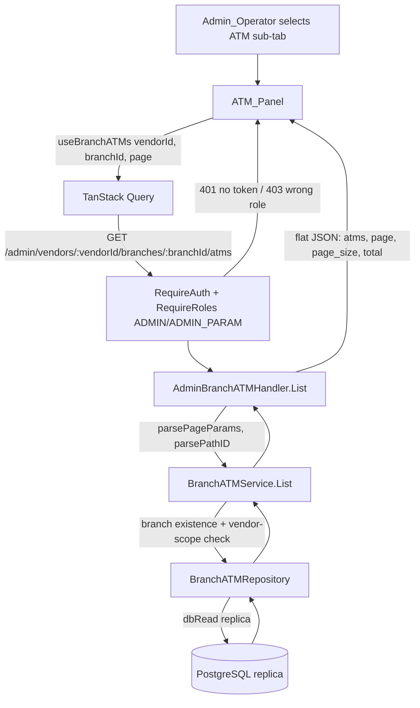

# Design Document

## Overview

This feature adds a read-only "ATM" sub-tab to the existing vendor branch detail page (`/settings/admin/vendors/:vendorId/branches/:branchId`) in the internal CompanyPortal. It lists every ATM managed by that vendor branch — its identifying and status attributes — so an Admin_Operator can confirm which machines fall under a branch's scope without leaving the page.

The feature is purely additive and display-only: no create/update/delete, no maker-checker, no new tables, no migration. It is one new backend read endpoint, one new SQL query pair (list + count), thin service/repository layers, and one new frontend panel wired into the existing sub-tab shell. All reads route to the read replica per DB topology rules (project-context Sec 5). The ATM backend keeps its flat JSON response shape for wire compatibility.

The branch→ATM relationship is not a direct foreign key. It runs through the branch's packages and the per-ATM package assignment:

```
vendor_branches (id)
  └─ vendor_packages (vendor_branch_id)
       └─ atm_vendor_packages (vendor_package_id, atm_id, is_active, effective_start_date, effective_end_date)
            └─ atms (id, terminal_id, location_id, priority_class, is_active, ...)
                 └─ locations (id, name, city_or_regency, province, ...)
```

An ATM is "managed by" a branch when an `atm_vendor_packages` row links that ATM to a `vendor_packages` row belonging to the branch. Because an ATM can hold multiple assignments to packages of the same branch, the query must **deduplicate to one row per ATM** (Requirement 1.2).

### Grounding against the current codebase

Verified against `backend/migrations/001_baseline_schema.sql` and existing code, all facts below hold:

- **Join chain confirmed.** `vendor_packages.vendor_branch_id` → `vendor_branches.id`; `atm_vendor_packages.vendor_package_id` → `vendor_packages.id`, `atm_vendor_packages.atm_id` → `atms.id`; `atms.location_id` → `locations.id`. There is **no** `vendor_assignments` table in the baseline — `atm_vendor_packages` is the real link. Indexes `atm_vendor_packages_vendor_package_idx (vendor_package_id)`, `atm_vendor_packages_atm_idx (atm_id)`, and `vendor_packages_vendor_branch_idx (vendor_branch_id)` already exist and cover this join, so **no new index is needed** (contrast with admin-atm-management, which added a trigram index for a ~1900-row free-text search; this feature has no free-text search and small per-branch counts).
- **`atms.location_id` is `NOT NULL`** in the baseline. Requirements 2.6 and 6.4 nonetheless call for a null-location fallback. The design keeps the fallback: a `LEFT JOIN locations` plus null-safe rendering costs nothing, keeps the endpoint robust if the constraint is ever relaxed, and satisfies the requirement as written. `atms.priority_class` **is** nullable.
- **Column names confirmed:** `atms(id, terminal_id, location_id, priority_class, is_active)`, `locations(id, name, city_or_regency)`, `vendor_packages(id, code, vendor_branch_id)`, `vendor_branches(id, vendor_id)`.
- **Pagination convention confirmed.** `handler.parsePageParams` defaults page=1, page_size=25, and clamps page_size to a max of 100. This directly satisfies Requirements 4.4/4.5/4.6 with no new code.
- **Vendor-scoping pattern confirmed.** `VendorPackageAdminService.Get` and `.load` resolve cross-vendor access by comparing the owning `vendor_id` and returning not-found — the same shape this design uses for Requirement 1.5.
- **Flat JSON confirmed.** `admin_vendor_package_handler.go` returns `writeJSON(w, 200, map[string]any{"packages": ..., "page": ..., "page_size": ..., "total": ...})` — no `pkg/response` envelope. This design mirrors it (`"atms"` key).
- **Route guard already in place.** `routes/settings/admin/vendor-branch-detail.tsx` is `beforeLoad: requireRoles(["ADMIN", "ADMIN_PARAM"])`; the backend mount adds the enforcing guard `RequireAuth + RequireRoles("ADMIN", "ADMIN_PARAM")`.

## Architecture

### Data flow



### Layering (mirrors admin vendor package feature)

| Layer | New artifact | Responsibility |
|-------|--------------|----------------|
| SQL | `backend/queries/vendor_branch_atms.sql` | `ListBranchATMs` (:many) + `CountBranchATMs` (:one) + `GetVendorBranchVendorIDForATMs` (reuse existing `GetVendorBranchVendorID` if present) |
| Generated | `backend/internal/db/vendor_branch_atms.sql.go` | sqlc output (or hand-written to match, per repo caveat below) |
| Repository | `backend/internal/repository/branch_atm_repository.go` | `List`, `Count`, `BranchVendorID`; wraps `db.Queries`, bound to the read-replica pool |
| Service | `backend/internal/service/branch_atm.go` | Branch existence + vendor-scope enforcement (404), row→DTO mapping, no audit (read-only) |
| Handler | `backend/internal/handler/admin_branch_atm_handler.go` | Path/query parsing, flat JSON response, error→HTTP mapping |
| Wiring | `backend/cmd/api/main.go` | Mount at `/api/v1/admin/vendors/{vendorID}/branches/{branchID}/atms` behind `RequireAuth + RequireRoles("ADMIN", "ADMIN_PARAM")` |
| Frontend | `admin-vendors/components/ATMsPanel.tsx`, plus additions to `api.ts`, `hooks.ts`, `types.ts`, and one sub-tab entry in `VendorBranchDetailPage.tsx` | Fetch + render the managed-ATM table |

**sqlc caveat (from steering, project-context Sec 12):** `sqlc generate` may be blocked by a pre-existing bug in an archived migration, and some `internal/db/*.sql.go` files were hand-written to match sqlc's exact output convention. Follow whatever the current convention is: attempt `sqlc generate` first; if it fails, hand-write `vendor_branch_atms.sql.go` to match the exact style of the existing `vendor_branches_admin.sql.go` (same package, `pgtype` imports, `Params`/`Row` structs, `q.db.Query`/`QueryRow` bodies).

### Read-replica routing

The repository is constructed from the read-replica pool. Following the exact convention in `main.go` (where `dbReadPool` falls back to the primary pool when `DATABASE_REPLICA_URL` is unset), the mount passes `dbReadPool` to `NewBranchATMRepository`. This satisfies Requirement 1.3 (read against the replica connection) and matches the `masterDataExportRepo := repository.NewMasterDataExportRepository(dbReadPool)` precedent already in `main.go`. This is a pure read with no read-after-write concern, so replica lag is irrelevant.

## Components and Interfaces

### SQL — `backend/queries/vendor_branch_atms.sql`

The core query joins the four tables, filters to one branch, deduplicates to one ATM per row, and orders by `terminal_id`. Deduplication uses `DISTINCT ON (a.id)` (Postgres) so each ATM appears once even with multiple qualifying assignments; a deterministic tiebreaker picks which assignment's package code is reported.

**Scope decision — active assignments only (see Design Decisions).** The `atm_vendor_packages` filter is `avp.is_active = true AND avp.effective_start_date <= CURRENT_DATE AND (avp.effective_end_date IS NULL OR avp.effective_end_date >= CURRENT_DATE)`.

```sql
-- name: ListBranchATMs :many
-- One row per ATM managed by branch $1 (active assignments only). The branch's
-- vendor is NOT re-checked here -- the service does the existence + vendor-scope
-- check before calling this (Req 1.4/1.5). DISTINCT ON (a.id) dedupes an ATM
-- that has >1 active assignment to this branch's packages (Req 1.2); the inner
-- ORDER BY picks a deterministic package code (latest-starting assignment).
SELECT DISTINCT ON (a.id)
    a.id            AS atm_id,
    a.terminal_id   AS terminal_id,
    a.priority_class AS priority_class,
    a.is_active     AS is_active,
    l.name          AS location_name,
    l.city_or_regency AS location_city_or_regency,
    vp.code         AS package_code
FROM atm_vendor_packages avp
JOIN vendor_packages vp ON vp.id = avp.vendor_package_id
JOIN atms a            ON a.id = avp.atm_id
LEFT JOIN locations l  ON l.id = a.location_id
WHERE vp.vendor_branch_id = sqlc.arg('vendor_branch_id')
  AND avp.is_active = true
  AND avp.effective_start_date <= CURRENT_DATE
  AND (avp.effective_end_date IS NULL OR avp.effective_end_date >= CURRENT_DATE)
ORDER BY a.id, avp.effective_start_date DESC, avp.id DESC
LIMIT sqlc.arg('page_limit')::bigint OFFSET sqlc.arg('page_offset')::bigint;
```

**Ordering caveat (Requirement 4.1 vs. `DISTINCT ON`).** Postgres requires the `DISTINCT ON` expression to lead the `ORDER BY`, but the endpoint must return rows ordered by `terminal_id` ascending. The two are reconciled by wrapping the dedup in a subquery (or CTE) and ordering the outer query by `terminal_id`, with pagination applied to the outer query:

```sql
-- name: ListBranchATMs :many
SELECT atm_id, terminal_id, priority_class, is_active,
       location_name, location_city_or_regency, package_code
FROM (
    SELECT DISTINCT ON (a.id)
        a.id AS atm_id, a.terminal_id AS terminal_id, a.priority_class AS priority_class,
        a.is_active AS is_active, l.name AS location_name,
        l.city_or_regency AS location_city_or_regency, vp.code AS package_code
    FROM atm_vendor_packages avp
    JOIN vendor_packages vp ON vp.id = avp.vendor_package_id
    JOIN atms a            ON a.id = avp.atm_id
    LEFT JOIN locations l  ON l.id = a.location_id
    WHERE vp.vendor_branch_id = sqlc.arg('vendor_branch_id')
      AND avp.is_active = true
      AND avp.effective_start_date <= CURRENT_DATE
      AND (avp.effective_end_date IS NULL OR avp.effective_end_date >= CURRENT_DATE)
    ORDER BY a.id, avp.effective_start_date DESC, avp.id DESC
) dedup
ORDER BY terminal_id ASC
LIMIT sqlc.arg('page_limit')::bigint OFFSET sqlc.arg('page_offset')::bigint;

-- name: CountBranchATMs :one
-- Distinct ATM count for the same branch + active-assignment filter -- the
-- pagination total (Req 4.3). COUNT(DISTINCT a.id) matches ListBranchATMs's
-- dedup so total never exceeds the number of returned rows across all pages.
SELECT COUNT(DISTINCT a.id)
FROM atm_vendor_packages avp
JOIN vendor_packages vp ON vp.id = avp.vendor_package_id
JOIN atms a            ON a.id = avp.atm_id
WHERE vp.vendor_branch_id = sqlc.arg('vendor_branch_id')
  AND avp.is_active = true
  AND avp.effective_start_date <= CURRENT_DATE
  AND (avp.effective_end_date IS NULL OR avp.effective_end_date >= CURRENT_DATE);
```

The branch existence + vendor-scope check reuses a lightweight lookup returning the branch's `vendor_id`. If `GetVendorBranchVendorID` already exists in the generated `db` package (it is referenced by `VendorPackageAdminRepository.BranchVendorID`), reuse it; otherwise add:

```sql
-- name: GetVendorBranchVendorID :one
SELECT vendor_id FROM vendor_branches WHERE id = $1;
```

### Repository — `backend/internal/repository/branch_atm_repository.go`

```go
type BranchATMRepository struct {
    queries *db.Queries
}

// NewBranchATMRepository wraps a read connection (dbRead replica pool).
func NewBranchATMRepository(dbConn db.DBTX) *BranchATMRepository {
    return &BranchATMRepository{queries: db.New(dbConn)}
}

func (r *BranchATMRepository) List(ctx context.Context, arg db.ListBranchATMsParams) ([]db.ListBranchATMsRow, error)
func (r *BranchATMRepository) Count(ctx context.Context, branchID int64) (int64, error)
// BranchVendorID returns the vendor owning branchID; nil, nil if the branch does not exist.
func (r *BranchATMRepository) BranchVendorID(ctx context.Context, branchID int64) (*int64, error)
```

`BranchVendorID` maps `pgx.ErrNoRows` → `(nil, nil)`, exactly as `VendorPackageAdminRepository.BranchVendorID` does.

### Service — `backend/internal/service/branch_atm.go`

```go
var ErrBranchNotFound = errors.New("cabang tidak ditemukan")

type BranchATMRepo interface {
    List(ctx context.Context, arg db.ListBranchATMsParams) ([]db.ListBranchATMsRow, error)
    Count(ctx context.Context, branchID int64) (int64, error)
    BranchVendorID(ctx context.Context, branchID int64) (*int64, error)
}

type BranchATMService struct{ repo BranchATMRepo }

func NewBranchATMService(repo BranchATMRepo) *BranchATMService

// ManagedATM is the read DTO. Pointers model nullable columns; JSON tags
// documented in Data Models.
type ManagedATM struct {
    ATMID              int64
    TerminalID         string
    LocationName       *string
    LocationCityOrRegency *string
    PriorityClass      *string
    IsActive           bool
    PackageCode        string
}

type ListManagedATMsResult struct {
    ATMs  []ManagedATM
    Total int64
}

// List enforces branch existence + vendor scope, then returns the page.
func (s *BranchATMService) List(ctx context.Context, vendorID, branchID int64, pageLimit, pageOffset int64) (ListManagedATMsResult, error)
```

**Authorization at the service layer (Requirement 1.4/1.5, 3 — defense in depth).** Before reading ATMs, `List` calls `repo.BranchVendorID(branchID)`:

- `nil` (branch does not exist) → return `ErrBranchNotFound` → handler maps to 404 (Req 1.4).
- non-nil but `!= vendorID` (branch belongs to another vendor) → return `ErrBranchNotFound` → 404 (Req 1.5). Returning the same not-found (rather than 403) avoids leaking the existence of another vendor's branch.
- `== vendorID` → proceed to `List` + `Count`.

This vendor-scope check lives in the service, not only the SQL, so the rule holds regardless of which query path calls it (project-context Sec 4: "RBAC enforced at middleware AND service layer").

### Handler — `backend/internal/handler/admin_branch_atm_handler.go`

Mirrors `AdminVendorPackageHandler` structurally (a vendor-scoped sub-resource), but read-only (only `List`):

```go
type BranchATMServicer interface {
    List(ctx context.Context, vendorID, branchID, pageLimit, pageOffset int64) (service.ListManagedATMsResult, error)
}

type AdminBranchATMHandler struct{ svc BranchATMServicer }

func (h *AdminBranchATMHandler) Routes() chi.Router {
    r := chi.NewRouter()
    r.Get("/", h.List)
    return r
}
```

`List`:
1. `parsePathID(r, "vendorID")` and `parsePathID(r, "branchID")` → 400 on malformed IDs.
2. `parsePageParams(q)` → page/page_size (default 1/25, clamp 100) → 400 on invalid.
3. Call `svc.List(ctx, vendorID, branchID, pageSize, (page-1)*pageSize)`.
4. Map errors (table below); on success `writeJSON(w, 200, {...})`.

**Mount** (in `main.go`, next to the other `/api/v1/admin/vendors/{vendorID}/branches/...` mounts, under the `masterDataAdmin` router that already applies `RequireAuth + RequireRoles("ADMIN", "ADMIN_PARAM")`):

```go
branchATMRepo := repository.NewBranchATMRepository(dbReadPool) // replica per Req 1.3
branchATMService := service.NewBranchATMService(branchATMRepo)
adminBranchATMHandler := handler.NewAdminBranchATMHandler(branchATMService)
masterDataAdmin.Mount("/api/v1/admin/vendors/{vendorID}/branches/{branchID}/atms", adminBranchATMHandler.Routes())
```

Chi does not conflict with the existing `.../branches` mount because the path is more specific and mounted on the same router group.

### Frontend

**Types** (`admin-vendors/types.ts`, additions):

```ts
export interface ManagedATM {
  atm_id: number;
  terminal_id: string;
  location_name: string | null;
  location_city_or_regency: string | null;
  priority_class: string | null;
  is_active: boolean;
  package_code: string;
}

export interface BranchATMsListParams {
  page: number;
  page_size: number;
}

export interface BranchATMsListResponse {
  atms: ManagedATM[];
  page: number;
  page_size: number;
  total: number;
}
```

**API** (`admin-vendors/api.ts`, one function, mirroring `listVendorPackages`):

```ts
export async function listBranchATMs(
  vendorId: number, branchId: number, params: BranchATMsListParams,
): Promise<BranchATMsListResponse> {
  const q = new URLSearchParams();
  q.set("page", String(params.page));
  q.set("page_size", String(params.page_size));
  const { data } = await api.get<BranchATMsListResponse>(
    `${BASE}/${vendorId}/branches/${branchId}/atms?${q.toString()}`,
  );
  return data;
}
```

**Hook** (`admin-vendors/hooks.ts`, mirroring `useVendorPackages`, query-key under the existing children prefix so it is invalidated by `useInvalidateList`):

```ts
export function useBranchATMs(vendorId: number, branchId: number, params: BranchATMsListParams) {
  return useQuery<BranchATMsListResponse, ApiError>({
    queryKey: ["admin-vendors", "children", vendorId, "branches", branchId, "atms", params],
    queryFn: () => listBranchATMs(vendorId, branchId, params),
    placeholderData: keepPreviousData,
  });
}
```

**Panel** (`admin-vendors/components/ATMsPanel.tsx`) — mirrors `VaultsPanel` but read-only (no create/edit/disable, no confirm dialog). Uses `DataTable` + `Badge` + `lucide-react` icons. Columns: Terminal ID (tabular figures), Lokasi (name + city, with `—` placeholder), Priority_Class, Kode Paket, Status (badge with icon + text). Loading, error, and empty states as in `VaultsPanel`.

**Sub-tab wiring** (`VendorBranchDetailPage.tsx`): append `{ id: "atms", label: "ATM" }` to `BRANCH_SUB_TABS`, and render `{subTab === "atms" && <ATMsPanel vendorId={vendorId} branchId={branchId} />}`.

## Data Models

### Endpoint contract

`GET /api/v1/admin/vendors/{vendorId}/branches/{branchId}/atms?page={n}&page_size={m}`

Success `200` (flat JSON, ATM backend convention):

```json
{
  "atms": [
    {
      "atm_id": 4021,
      "terminal_id": "ATM00412",
      "location_name": "Kantor Cabang Menteng",
      "location_city_or_regency": "Jakarta Pusat",
      "priority_class": "VIP",
      "is_active": true,
      "package_code": "PKG-JKT-01"
    }
  ],
  "page": 1,
  "page_size": 25,
  "total": 1
}
```

Empty result (Requirement 1.6): `200` with `"atms": []` and `"total": 0`.

Errors (flat JSON via `writeError`): `{ "error": { "code": "...", "message": "..." } }` (matching existing `writeError` shape).

### Field mapping

| JSON field | Source column | Nullable | Requirement |
|------------|---------------|----------|-------------|
| `atm_id` | `atms.id` | no | 2.1 |
| `terminal_id` | `atms.terminal_id` | no | 2.1 |
| `location_name` | `locations.name` (LEFT JOIN) | yes → `null` | 2.2, 2.6 |
| `location_city_or_regency` | `locations.city_or_regency` (LEFT JOIN) | yes → `null` | 2.2, 2.6 |
| `priority_class` | `atms.priority_class` | yes → `null` | 2.3 |
| `is_active` | `atms.is_active` | no | 2.4 |
| `package_code` | `vendor_packages.code` (dedup pick) | no | 2.5 |

### Pagination model

| Param | Default | Max | Requirement |
|-------|---------|-----|-------------|
| `page` | 1 | — | 4.4 |
| `page_size` | 25 | 100 (clamped) | 4.5, 4.6 |

`total` = `COUNT(DISTINCT atms.id)` for the branch under the active-assignment filter (4.3). Ordering: `terminal_id ASC` on the deduplicated set (4.1). Pagination via `LIMIT/OFFSET` on the ordered outer query (4.2).

## Correctness Properties

*A property is a characteristic or behavior that should hold true across all valid executions of a system — essentially, a formal statement about what the system should do. Properties serve as the bridge between human-readable specifications and machine-verifiable correctness guarantees.*

The testable core of this feature is the **query/service logic**: deduplication, vendor-scope resolution, and pagination bookkeeping. These have meaningful behavior that varies with input (number of assignments per ATM, branch ownership, page boundaries) and are cost-effective to exercise with generated inputs against a repository fake. UI rendering (Requirements 5–6) is covered by component tests, not properties.

### Property 1: One row per managed ATM (deduplication)

For any vendor branch and any set of active ATM_Assignments — including an ATM linked by multiple active assignments to packages of that same branch — the full (unpaginated) result of `BranchATMService.List` contains each managed ATM's `atm_id` at most once.

**Validates: Requirements 1.1, 1.2**

### Property 2: Total equals the distinct managed-ATM count

For any vendor branch, the `Total` returned by `BranchATMService.List` equals the number of distinct ATMs managed by that branch under the active-assignment filter, and is independent of the requested page and page size.

**Validates: Requirements 4.3, 1.2**

### Property 3: Pagination partitions the ordered result without loss or overlap

For any vendor branch and any page size within limits, concatenating the `atm_id` sequences of successive pages (page 1, 2, …) reproduces the full deduplicated result exactly once each, in `terminal_id` ascending order, and no page returns more rows than the effective page size.

**Validates: Requirements 4.1, 4.2, 4.4, 4.5, 4.6**

### Property 4: Vendor scope is enforced independent of branch existence

For any `(vendorId, branchId)` pair, `BranchATMService.List` returns `ErrBranchNotFound` whenever the branch does not exist, or exists but its `vendor_id` differs from `vendorId`; and returns a (possibly empty) result only when the branch exists and belongs to `vendorId`.

**Validates: Requirements 1.4, 1.5**

### Property 5: Empty branch yields empty page and zero total

For any existing branch owned by the requested vendor that has no active managed ATMs, `BranchATMService.List` returns an empty ATM slice and a `Total` of zero.

**Validates: Requirement 1.6**

## Error Handling

| Condition | Layer | Result | Requirement |
|-----------|-------|--------|-------------|
| No / invalid token | `RequireAuth` middleware | 401 | 3.1 |
| Valid token, role not ADMIN/ADMIN_PARAM | `RequireRoles` middleware | 403 | 3.2 |
| Malformed `vendorId`/`branchId` path segment | handler `parsePathID` | 400 `bad_request` | — |
| Invalid `page`/`page_size` | handler `parsePageParams` | 400 `bad_request` | 4.x |
| Branch does not exist | service → `ErrBranchNotFound` | 404 `not_found` "Cabang tidak ditemukan" | 1.4 |
| Branch exists, belongs to another vendor | service → `ErrBranchNotFound` | 404 `not_found` | 1.5 |
| Branch valid, no managed ATMs | service | 200, `atms: []`, `total: 0` | 1.6 |
| Repository / DB error | handler default | 500 `internal_error` "Terjadi kesalahan internal" | — |

Handler `handleError` uses `errors.Is(err, service.ErrBranchNotFound)` → 404, default → `writeUnexpectedError`, exactly matching the switch style in `admin_vendor_package_handler.go`. Null `location_name`/`location_city_or_regency`/`priority_class` are not errors — they serialize as JSON `null` and the frontend renders a placeholder (Requirement 6.4).

## Testing Strategy

### Property-based tests (service layer, with a repository fake)

Implemented in `backend/internal/service/branch_atm_test.go` using a Go property-based testing library (`pgregory.net/rapid`, or the repo's existing choice if one is already vendored — do not hand-roll). A `fakeBranchATMRepo` holds generated branches, packages, assignments, and ATMs in memory and implements `BranchATMRepo`, applying the same active-assignment filter, dedup, ordering, and pagination the SQL does, so the service logic is tested without a live DB.

- Minimum 100 iterations per property.
- Each test tagged: **Feature: vendor-branch-atms, Property {n}: {property text}**.
- Properties 1–5 above each map to a single property test. Generators produce ATMs with 1..N assignments (to exercise dedup), branches owned by varying vendors (to exercise scope), and varying page sizes including boundaries (1, default 25, >100 to exercise clamping, and past-the-end pages).

### Unit / example tests

- **Service:** cross-vendor branch → `ErrBranchNotFound`; nonexistent branch → `ErrBranchNotFound`; null location and null priority_class map to nil DTO fields (Req 2.6/6.4); package-code tiebreaker is deterministic.
- **Handler (httptest, table-driven):** 401 (no auth context), 403 (wrong role — via the mounted middleware in an integration-style handler test), 400 (bad path id / bad page_size), 404 (service returns `ErrBranchNotFound`), 200 empty (`atms: []`, `total: 0`), 200 with rows (field mapping + flat JSON shape, no envelope), page/page_size echoed and clamped.

### Integration test (repo/API, real Postgres — 1–3 representative cases)

Per project-context Sec 7, DB-backed repo behavior is verified with a real Postgres against seeded fixtures rather than by property tests: seed a branch with two packages, one ATM assigned via both packages (assert dedup → one row, correct `package_code`), one ATM with an ended assignment (assert excluded by the active filter), and one ATM under a *different* vendor's branch (assert not returned / 404 for cross-vendor path). Confirms the join, `DISTINCT ON`, `COUNT(DISTINCT ...)`, and `terminal_id` ordering behave as designed. Not run 100× — behavior does not vary meaningfully with input at the SQL level once the logic-level properties pass.

### Frontend component tests (`ATMsPanel.test.tsx`, RTL + MSW)

- Renders rows on success; terminal_id column uses `tabular-nums` (Req 6.3).
- Active ATM → success badge with icon + label; inactive → danger badge with icon + label (Req 6.1, 6.2) — assert both icon and text present, never color alone.
- Null location → placeholder marker, not an empty cell (Req 6.4).
- Loading state shows the indicator (Req 5.3); zero ATMs shows the empty-state message (Req 5.5); request failure shows an error message (Req 5.6).
- Sub-tab labeled "ATM" appears alongside the existing sub-tabs and, when selected, triggers the fetch (Req 5.1, 5.2, 5.4).

## Design Decisions

### Decision 1: Active assignments only (default; resolves the requirements' open scope question)

The list includes an ATM only when it has an `atm_vendor_packages` row that is `is_active = true` **and** whose effective-date window covers today (`effective_start_date <= CURRENT_DATE AND (effective_end_date IS NULL OR effective_end_date >= CURRENT_DATE)`). Historical/ended assignments are excluded.

**Rationale:** This is a management view answering "which ATMs does this branch manage *now*." Including ended assignments would show machines no longer under the branch, which is misleading for the stated user goal. `atm_vendor_packages` is effective-dated history (same pattern as `vendor_packages` prices), so "currently managed" is the natural default. The tradeoff — a "show historical" toggle — is deliberately out of scope; if operators later need an as-of/history view it can be added as an optional query param without changing the contract. This resolves the requirements' flagged open decision.

### Decision 2: Column set and no search box (resolves the requirements' open column/search question)

Columns: `terminal_id`, location (name + city_or_regency), `priority_class`, `package_code`, `status` — exactly the attributes Requirement 2 enumerates, no more. **No search box.** A vendor branch manages a bounded, typically small set of ATMs, and pagination (page_size default 25, max 100) already keeps the view responsive; a server-side search filter and its trigram index (as admin-atm-management needed for ~1900 rows) are unjustified here. Ordering by `terminal_id` gives a predictable scan order. If a branch ever manages enough ATMs to warrant filtering, a `q` param can be added later mirroring `ListVendorBranchesAdmin`'s ILIKE convention — out of scope now.

### Decision 3: 404 (not 403) for cross-vendor branches

A branch that exists but belongs to another vendor returns 404, identical to a nonexistent branch, matching `VendorPackageAdminService`'s "other vendor → not found" behavior. This avoids leaking the existence of another vendor's branch IDs to an authorized-but-scoped operator and keeps the endpoint's not-found semantics uniform.

## Requirements Coverage Map

| Requirement | Design section |
|-------------|----------------|
| 1.1 managed-ATM resolution via assignment→package→branch | SQL `ListBranchATMs`; Property 1 |
| 1.2 dedup one row per ATM | `DISTINCT ON (a.id)` + `COUNT(DISTINCT a.id)`; Properties 1, 2 |
| 1.3 read on replica | Repository built from `dbReadPool`; Architecture → Read-replica routing |
| 1.4 nonexistent branch → 404 | Service `BranchVendorID` nil → `ErrBranchNotFound`; Error Handling; Property 4 |
| 1.5 cross-vendor branch → 404 | Service vendor-scope check; Decision 3; Property 4 |
| 1.6 no ATMs → 200 empty + total 0 | Service returns empty result; Property 5; Error Handling |
| 2.1–2.5 returned attributes | Field mapping table; Data Models |
| 2.6 null location fallback | `LEFT JOIN locations`, nil DTO fields |
| 3.1 401 | `RequireAuth` middleware |
| 3.2 403 | `RequireRoles("ADMIN","ADMIN_PARAM")` |
| 3.3 authorized proceeds | Mount under `masterDataAdmin` group |
| 4.1 order by terminal_id | Outer `ORDER BY terminal_id ASC`; Property 3 |
| 4.2 page slice | `LIMIT/OFFSET`; Property 3 |
| 4.3 total across pages | `CountBranchATMs`; Property 2 |
| 4.4/4.5/4.6 page/size defaults + clamp | `parsePageParams` (1/25/max 100); Property 3 |
| 5.1–5.6 sub-tab behavior | Frontend → Panel + sub-tab wiring; component tests |
| 6.1–6.4 presentation (badge, tabular, placeholder) | `ATMsPanel` (mirrors `VaultsPanel`); component tests |
