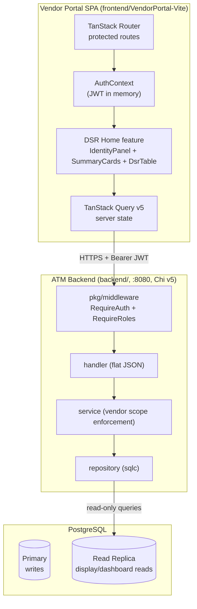
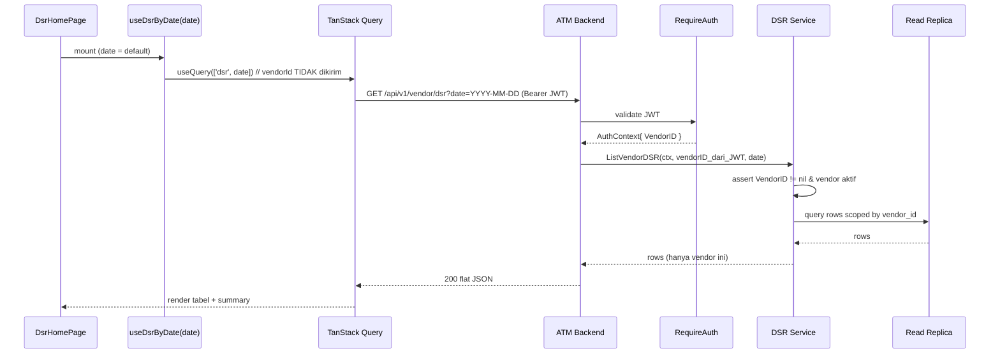

# Design Document: Vendor DSR Home

## Overview

Fitur `vendor-dsr-home` menjadikan menu DSR (Daily Status Report) sebagai landing page Vendor Portal. Setelah login berhasil, `Vendor_User` langsung diarahkan ke `DSR_Home` (bukan lagi ke dashboard CIT Orders). Halaman ini menampilkan tiga blok utama:

1. **Vendor Identity Panel** — nama vendor yang sedang login dan daftar cabang (Assigned_Branch) yang di-assign ke vendor tersebut.
2. **Summary Cards** — ringkasan posisi kas (jumlah ATM dipantau, ATM Kritis, ATM Rendah, total Saldo Akhir) untuk tanggal terpilih.
3. **DSR Table** — tabel posisi kas per ATM/CRM per hari, dengan date selector, sorting per kolom, dan badge Status Saldo.

Seluruh data di-scope keras ke `vendor_id` yang diambil dari klaim JWT, tidak pernah dari parameter klien.

### Hubungan dengan spec `vendor-portal`

Spec ini adalah **penyempurnaan terfokus** dari spec `vendor-portal` yang lebih luas (`.kiro/specs/vendor-portal/`). Perbedaan dan keselarasan:

| Aspek | vendor-portal (spec induk) | vendor-dsr-home (spec ini) |
|-------|----------------------------|----------------------------|
| Landing page | `/orders` (CIT Orders) | `DSR_Home` (menu DSR) |
| Sumber data | Mock JSON statis (`data/*.json`) | **ATM backend nyata** (port 8080), read replica |
| Router | React Router v7 (di spec induk) | **TanStack Router** (sesuai steering `tech.md`) |
| Cakupan | Seluruh portal (orders, invoice, evidence, schedule, dsr, notifications) | Hanya DSR Home + panel identitas vendor |
| Tema | Merah Menyala | Merah Menyala (identik, digunakan ulang) |

Spec ini **mengadopsi** dari spec induk: ambang Status Saldo, kolom DSR, komponen `AppShell`/`Badge`/`DataTable`/`EmptyState`/`DatePicker`, dan token tema Merah Menyala. Spec ini **mengubah**: default landing menjadi DSR Home, dan (keputusan desain, lihat Bagian Design Decisions) mengganti layer mock data DSR/branch menjadi pemanggilan API backend nyata sesuai Requirement 6.

### Batas Cakupan (Scope Boundaries)

Termasuk:
- Redirect pasca-login ke DSR Home, guard route + preserved URL (Req 1).
- Vendor Identity Panel: nama vendor + daftar cabang assigned (Req 2).
- Tabel DSR ter-scope vendor dengan date selector + sorting (Req 3).
- Summary cards ter-scope vendor (Req 4).
- Isolasi data vendor di frontend + backend (Req 5).
- Kontrak API backend untuk identity/branch dan DSR (Req 6).
- Aksesibilitas & tema (Req 7).

Tidak termasuk:
- Upload/ingest DSR (itu domain EOD batch, bukan tampilan vendor).
- Modul lain Vendor Portal (orders, invoice, evidence, schedule, notifications) — tetap milik spec induk.
- Perubahan skema DB di luar penambahan query read-only (lihat Design Decisions untuk gap linkage vendor→ATM→DSR).

## Architecture

### Konteks sistem



Alur: SPA memanggil ATM backend dengan Bearer JWT. Middleware memvalidasi token dan menyuntik `AuthContext` (berisi `VendorID *int64`, `Role`, `IsKaryawan`). Handler mengembalikan JSON datar. Service menegakkan ulang scope vendor. Repository membaca dari **read replica** (`dbRead`) karena ini murni tampilan/dashboard (Req 6.5).

### Struktur route frontend (TanStack Router)

```
src/routes/
├── __root.tsx              # Root: QueryClientProvider + AuthProvider + Outlet
├── login.tsx               # /login  (publik)
├── _authed.tsx             # Layout terproteksi: AppShell + guard (beforeLoad)
├── _authed/index.tsx       # / -> redirect ke /dsr (root = DSR Home)
└── _authed/dsr.tsx         # /dsr  (DSR Home — landing default)
```

Perilaku routing (Req 1):

- **Root `/`** (`_authed/index.tsx`): saat terautentikasi, `redirect` ke `/dsr` (Req 1.2). DSR Home adalah tampilan default.
- **`/login`**: jika sudah terautentikasi, `beforeLoad` melakukan `redirect` ke `/dsr` (Req 1.3), kecuali ada `redirect` search param yang valid.
- **`_authed.tsx` guard**: `beforeLoad` mengecek `isAuthenticated`. Jika belum, `redirect({ to: '/login', search: { redirect: location.href } })` — URL yang diminta disimpan sebagai search param (Req 1.5, Req 1.8).
- **Pasca-login**: `LoginPage` membaca `redirect` search param. Jika ada dan valid → navigate ke sana (Req 1.6). Jika tidak ada/invalid/usang → fallback ke `/dsr` (Req 1.9).
- **Sesi kedaluwarsa** saat di `/dsr`: interseptor 401 memicu logout state; guard menyimpan URL dan mengarahkan ke `/login` (Req 1.8).
- **Nav aktif**: `Sidebar` menandai item DSR aktif memakai gaya aktif Merah Menyala saat pathname `/dsr` (Req 1.4).

Redirect pasca-login dirender dalam target p95 ≤ 3 detik (Req 1.7) — dijaga oleh: JWT di memori (tanpa round-trip refresh untuk render awal), query DSR/identity di-`prefetch` pada `loader` route `_authed/dsr.tsx`.

### Komponen frontend

```
src/features/dsr-home/
├── DsrHomePage.tsx           # Komposisi: <main> IdentityPanel + SummaryCards + DsrTable
├── VendorIdentityPanel.tsx   # Nama vendor + daftar cabang + jumlah (Req 2)
├── DsrSummaryCards.tsx       # 4 kartu ringkasan (Req 4)
├── DsrTable.tsx              # TanStack Table v8 + date selector + sorting (Req 3)
├── DateSelector.tsx          # Pemilih tanggal (bungkus DatePicker bersama)
├── useVendorIdentity.ts      # TanStack Query: GET /vendor/me/branches
├── useDsrByDate.ts           # TanStack Query: GET /vendor/dsr?date=...
└── dsr.logic.ts              # Fungsi murni: getBalanceStatus, formatIDR, summarize, pickDefaultDate, sortRows
```

Komponen bersama yang digunakan ulang dari portal: `AppShell`, `TopBar`, `Sidebar`, `Badge`, `DataTable`, `EmptyState`, `DatePicker`, `Card`, `Button` (lihat `vendor-portal/design.md`).

### Alur data (TanStack Query)



`vendorId` **tidak** dijadikan bagian dari query string ke server (server mengambilnya dari JWT). `vendorId` boleh dipakai di `queryKey` sisi klien hanya sebagai cache key agar cache antar-vendor tidak tercampur bila terjadi pergantian sesi.

## Components and Interfaces

### Kontrak API backend (ATM backend, port 8080, JSON datar)

Semua endpoint di bawah mount di grup terproteksi `RequireAuth` + `RequireRoles("VENDOR-USER")`. Respons memakai **bentuk JSON datar** (bukan envelope `pkg/response`) demi kompatibilitas wire ATM backend (Req 6.4). `vendor_id` selalu dari klaim JWT; parameter `vendor_id` dari klien diabaikan (Req 5.1, Req 6.6).

Status keberadaan: endpoint-endpoint ini **belum ada** di ATM backend saat ini (backend hanya punya auth + atm_portal + dmaa_forecast). Spec induk `vendor-portal` memakai mock JSON. **Keputusan desain**: fitur ini mengkabelkan endpoint backend nyata baru (read-only) di ATM backend, sesuai Req 6.

#### 1. `GET /api/v1/vendor/me/branches` — identitas vendor + cabang assigned

Request: tanpa query param (vendor dari JWT).

Response `200` (JSON datar):

```json
{
  "vendor_id": 3,
  "vendor_name": "Bijak",
  "branch_count": 1,
  "branches": [
    { "branch_id": 26, "branch_code": "BIJAK_001", "branch_name": "Bijak Jakarta" }
  ]
}
```

- `branches` diurutkan `branch_name` ascending (Req 2.2).
- `branch_count` = panjang `branches` (Req 2.3).
- Bila vendor tidak punya cabang: `branches: []`, `branch_count: 0` (Req 2.7 → empty state di UI).

#### 2. `GET /api/v1/vendor/dsr?date=YYYY-MM-DD` — DSR ter-scope vendor per tanggal

Request query: `date` (opsional). Bila `date` kosong, server memilih tanggal DSR terbaru yang tersedia untuk vendor tersebut, atau hari ini (Asia/Jakarta) jika tidak ada data (Req 3.6, Req 4.6). Server mengembalikan `selected_date` yang dipakai agar klien tahu tanggal efektif.

Response `200` (JSON datar):

```json
{
  "vendor_id": 3,
  "selected_date": "2026-07-15",
  "available_dates": ["2026-07-15", "2026-07-14"],
  "currency": "IDR",
  "summary": {
    "atm_count": 12,
    "critical_count": 3,
    "low_count": 4,
    "total_ending_balance": 1875000000
  },
  "rows": [
    {
      "atm_id": "1050",
      "location": "JKT.CIMBN.KELAPA GADING 1",
      "date": "2026-07-15",
      "beginning_balance": 200000000,
      "cash_in": 50000000,
      "cash_out": 90000000,
      "ending_balance": 160000000,
      "balance_status": "Normal"
    }
  ]
}
```

- `rows` default terurut `atm_id` ascending (Req 3.7). Sorting lanjutan dilakukan klien via TanStack Table (Req 3.12) — endpoint tidak wajib menerima param sort untuk MVP.
- Nilai moneter berupa integer IDR penuh (Req 5: numeric, bukan float). `balance_status` sudah dihitung server memakai ambang bersama (Req 3.8) sebagai sumber tunggal; klien juga punya fungsi identik untuk render (defensif).
- `summary` dihitung hanya dari `rows` ter-scope vendor untuk `selected_date` (Req 4.4, Req 4.5). Bila kosong → seluruh metrik nol (Req 4.7).
- `available_dates` mengisi opsi date selector.

#### Perilaku otorisasi & error (semua endpoint)

| Kondisi | HTTP | Body datar | Requirement |
|---------|------|------------|-------------|
| Tanpa/învalid JWT | 401 | `{"error":"unauthorized","message":"Sesi tidak valid"}` | 5.6, 6.3 |
| JWT tanpa `vendor_id` valid / vendor tidak aktif | 403 | `{"error":"invalid_session","message":"Sesi tidak valid"}` | 5.5 |
| Role bukan VENDOR-USER | 403 | `{"error":"forbidden","message":"Akses ditolak"}` | 5.4 |
| Minta resource milik vendor lain | 403 + audit | `{"error":"access_denied","message":"Akses ditolak"}` | 5.4 |
| Sukses | 200 | payload di atas | 6.4 |

Akses ditolak lintas vendor mencatat satu entri audit (`audit_logs`): user id terautentikasi, identifikasi resource yang diminta, timestamp UTC (Req 5.4).

### Kontrak komponen frontend

```typescript
// features/dsr-home/types.ts
interface VendorIdentity {
  readonly vendorId: number;
  readonly vendorName: string;
  readonly branchCount: number;
  readonly branches: readonly AssignedBranch[];
}
interface AssignedBranch {
  readonly branchId: number;
  readonly branchCode: string;
  readonly branchName: string;
}

type BalanceStatus = 'Critical' | 'Low' | 'Normal'; // UI label: Kritis | Rendah | Normal

interface DsrRow {
  readonly atmId: string;
  readonly location: string;
  readonly date: string;              // ISO date (YYYY-MM-DD)
  readonly beginningBalance: number;  // integer IDR
  readonly cashIn: number;
  readonly cashOut: number;
  readonly endingBalance: number;
  readonly balanceStatus: BalanceStatus;
}
interface DsrSummary {
  readonly atmCount: number;
  readonly criticalCount: number;
  readonly lowCount: number;
  readonly totalEndingBalance: number; // integer IDR
}
interface DsrByDateResponse {
  readonly vendorId: number;
  readonly selectedDate: string;
  readonly availableDates: readonly string[];
  readonly currency: 'IDR';
  readonly summary: DsrSummary;
  readonly rows: readonly DsrRow[];
}
```

```typescript
// VendorIdentityPanel
interface VendorIdentityPanelProps {
  query: UseQueryResult<VendorIdentity>; // loading/error/empty di-handle internal
}
// DsrTable
interface DsrTableProps {
  rows: readonly DsrRow[];
  isLoading: boolean;
  error: Error | null;
  onRetry: () => void;
}
// DateSelector
interface DateSelectorProps {
  value: string;                        // ISO date
  availableDates: readonly string[];
  onChange: (date: string) => void;
}
```

## Data Models

### Pemetaan ke skema DB nyata (read-only)

Sumber kebenaran skema: `backend/migrations/002_cms_tables.sql`, `013_dsr.sql`, `008_seed_atms.sql`, `006_seed_vendor_branches_fixed.sql`.

Tabel relevan dan kolom yang benar-benar ada:

- `vendors(id bigserial, code, name, is_active, deleted_at)` — `name` untuk Vendor Identity Panel.
- `vendor_branches(id, vendor_id → vendors.id, branch_code, branch_name, location_id nullable, is_active)` — sumber Assigned_Branch.
- `atms(id, terminal_id UNIQUE, location_id → locations.id, low_threshold_amount, critical_threshold_amount, is_active, deleted_at)`.
- `locations(id, name, ...)` — `name` sebagai Lokasi/Cabang di tabel DSR.
- `users(id, role_id, vendor_id → vendors.id, vendor_branch_id → vendor_branches.id, is_karyawan, auth_source)` — dasar klaim JWT.
- DSR nyata: `atm_dsr_saldo_files(id, report_date, vendor text, currency, saldo_akhir_0000_total_idr, ...)` + `atm_dsr_saldo_rows(file_id, section, flow, line_label, denom_*, line_total_idr, ...)`.

### JWT → scope

Klaim JWT (dari `pkg/auth.Claims`): `vendor_id *int64` (= `vendors.id`), `role`, `is_karyawan`. Middleware `RequireAuth` menyuntik `AuthContext{ UserID, Username, Role, IsKaryawan, VendorID *int64 }`. **Catatan penting**: JWT tidak membawa `vendor_name` maupun `vendor_branch_id`; keduanya diambil dari DB memakai `vendor_id`.

### Pemetaan model DSR ke tampilan (gap terdokumentasi)

Requirement menggambarkan `DSR_Record` sebagai satu baris posisi kas **per ATM per hari** dengan kolom Saldo Awal/Cash In/Cash Out/Saldo Akhir. Skema DSR nyata (`atm_dsr_saldo_*`) adalah **statement per-denominasi per file vendor per tanggal**, dikaitkan ke vendor lewat kolom teks bebas `vendor` (belum FK), dan **tidak** memiliki kolom `terminal_id` per baris. Ini adalah gap nyata antara requirement dan skema saat ini.

Keputusan desain (lihat Bagian Design Decisions untuk rasional dan opsi):
- Kontrak API `GET /vendor/dsr` mengekspos bentuk **per-ATM** sesuai requirement (`DsrRow`).
- Pemetaan dari skema ke bentuk per-ATM dilakukan di **service layer** memakai query read-only. Bila sumber per-ATM belum tersedia untuk periode tertentu, endpoint mengembalikan `rows: []` untuk tanggal itu (empty state, Req 3.9) alih-alih mengarang data.
- Tidak ada tabel/kolom baru yang diperkenalkan oleh spec ini; bila pemetaan andal memerlukan kolom penaut vendor→ATM→DSR, itu diusulkan sebagai item terpisah yang butuh approval skema (sesuai golden rule "propose table/column first").

### Scoping vendor→ATM

Penautan vendor ke ATM di skema saat ini melewati rantai `vendors → vendor_branches → vendor_packages/atm_vendor_packages → atms`. Karena `vendor_branches.location_id` masih NULL pada seed dan rantai package bersifat efektif-tanggal, service layer memusatkan definisi "ATM milik vendor" pada satu query bernama (mis. `ListVendorATMs`) sehingga aturan scoping punya satu sumber kebenaran dan mudah diuji. Semua query DSR/branch memfilter `WHERE vendor_id = $1` dengan `$1` dari JWT.

### Format & ambang (fungsi murni, dipakai bersama)

```typescript
// dsr.logic.ts
function getBalanceStatus(endingBalance: number): BalanceStatus {
  if (endingBalance < 50_000_000) return 'Critical';      // Kritis
  if (endingBalance <= 150_000_000) return 'Low';         // Rendah  (50jt..150jt inklusif)
  return 'Normal';                                        // > 150jt
}

function formatIDR(amount: number): string {
  return `IDR ${amount.toLocaleString('id-ID')}`;         // "IDR 1.875.000.000"
}

function summarize(rows: readonly DsrRow[]): DsrSummary {
  const uniqueAtms = new Set(rows.map(r => r.atmId));
  return {
    atmCount: uniqueAtms.size,
    criticalCount: rows.filter(r => r.balanceStatus === 'Critical').length,
    lowCount: rows.filter(r => r.balanceStatus === 'Low').length,
    totalEndingBalance: rows.reduce((s, r) => s + r.endingBalance, 0),
  };
}
```

Ambang identik dengan `vendor-portal/design.md` (Critical < 50.000.000; Low 50.000.000–150.000.000 inklusif; Normal > 150.000.000), menjaga konsistensi Req 3.8 dan Req 4.2.

## Correctness Properties

*Sebuah property adalah karakteristik atau perilaku yang harus selalu benar di seluruh eksekusi valid sistem — pernyataan formal tentang apa yang seharusnya dilakukan sistem. Property menjadi jembatan antara spesifikasi yang dibaca manusia dan jaminan kebenaran yang dapat diverifikasi mesin.*

Setelah refleksi, property yang redundan digabung: seluruh kriteria isolasi vendor (2.4, 3.2, 4.4, 4.5, 5.1, 5.2, 6.6, 6.7) menjadi satu invariant menyeluruh; format uang (3.3, 4.3) menjadi satu; klasifikasi Status Saldo (3.8, 4.2) menjadi satu; agregasi ringkasan (4.1, 4.7) menjadi satu; default date (3.6, 4.6) menjadi satu; sorting (3.7, 3.12) menjadi satu.

### Property 1: Isolasi data vendor tak tergantung input klien

*For any* kumpulan data (branches dan DSR rows lintas banyak vendor), *for any* `vendorId` dari klaim JWT, dan *for any* nilai `vendor_id` yang dikirim klien melalui parameter (termasuk nilai yang bertentangan, kosong, atau milik vendor lain), hasil yang dikembalikan hanya berisi record yang tertaut ke `vendorId` dari JWT dan tidak pernah menyertakan record vendor lain; keluaran identik apa pun nilai `vendor_id` klien.

**Validates: Requirements 2.4, 3.2, 4.4, 4.5, 5.1, 5.2, 6.6, 6.7**

### Property 2: Klasifikasi Status Saldo dengan batas yang benar

*For any* bilangan bulat non-negatif `endingBalance`: jika `endingBalance` strictly < 50.000.000 maka statusnya "Critical" (Kritis); jika 50.000.000 ≤ `endingBalance` ≤ 150.000.000 maka "Low" (Rendah); jika `endingBalance` strictly > 150.000.000 maka "Normal". Ketiga rentang bersifat menyeluruh (exhaustive) dan saling lepas (mutually exclusive).

**Validates: Requirements 3.8, 4.2**

### Property 3: Format mata uang IDR (format + round-trip)

*For any* bilangan bulat non-negatif `amount`, `formatIDR(amount)` menghasilkan string berpola `"IDR "` diikuti angka dengan pemisah ribuan berupa titik dan tanpa desimal (locale id-ID); dan mem-parsing kembali bagian numerik (menghapus titik) menghasilkan `amount` semula.

**Validates: Requirements 3.3, 4.3**

### Property 4: Agregasi ringkasan DSR

*For any* kumpulan `DsrRow` ter-scope vendor, `summarize(rows)` menghasilkan: `atmCount` = jumlah `atmId` unik; `criticalCount` = banyak baris berstatus Critical; `lowCount` = banyak baris berstatus Low; `totalEndingBalance` = jumlah seluruh `endingBalance`. Untuk masukan kosong, seluruh metrik bernilai nol.

**Validates: Requirements 4.1, 4.7**

### Property 5: Pemilihan tanggal default

*For any* himpunan tanggal DSR yang tersedia bagi vendor: jika himpunan tidak kosong, `pickDefaultDate` mengembalikan tanggal maksimum (terbaru); jika himpunan kosong, mengembalikan tanggal hari ini dalam zona waktu Asia/Jakarta.

**Validates: Requirements 3.6, 4.6**

### Property 6: Kebenaran sorting kolom

*For any* array `DsrRow` dan *for any* kolom yang dapat diurutkan: sort ascending menghasilkan urutan non-menurun berdasarkan nilai kolom itu, sort descending menghasilkan urutan non-menaik; urutan default adalah ascending berdasarkan `atmId`; dan keluaran selalu merupakan permutasi dari masukan (tidak ada elemen ditambah/hilang).

**Validates: Requirements 3.7, 3.12**

### Property 7: Daftar cabang — urutan dan jumlah

*For any* daftar `AssignedBranch` milik vendor, daftar yang ditampilkan terurut non-menurun berdasarkan `branchName`, `branchCount` sama dengan panjang daftar, dan keluaran adalah permutasi dari masukan.

**Validates: Requirements 2.2, 2.3**

### Property 8: Pemotongan nama vendor

*For any* string `name` dan *for any* `maxLength` positif: jika panjang `name` ≤ `maxLength`, keluaran sama persis dengan masukan; jika lebih panjang, keluaran adalah `maxLength` karakter pertama diikuti elipsis, dan teks lengkap tetap tersedia (atribut title) sehingga tidak ada informasi yang hilang.

**Validates: Requirements 2.8**

### Property 9: Round-trip guard route dengan preserved URL

*For any* path DSR terproteksi, ketika pengguna belum terautentikasi mengaksesnya: sistem redirect ke `/login` dan menyimpan path asal; setelah login sukses dengan preserved path yang valid, sistem menavigasi tepat ke path tersimpan itu (bukan default); jika preserved path invalid/usang, sistem fallback ke root DSR Home `/dsr`.

**Validates: Requirements 1.5, 1.6, 1.9**

## Error Handling

### Frontend (SPA)

| Skenario | Perilaku UI | Requirement |
|----------|-------------|-------------|
| Gagal ambil identitas/cabang (jaringan/server) | Error inline di panel + tombol coba lagi (retry) | 2.6 |
| Vendor tanpa cabang | Empty state "belum ada cabang yang di-assign" | 2.7 |
| Gagal muat DSR rows | Error inline + retry, tanggal terpilih dipertahankan | 3.11 |
| Timeout > 10s / gagal jaringan/server | Error inline "gagal mengambil data" + retry, tanggal dipertahankan | 6.9 |
| Tidak ada record untuk tanggal | Empty state "tidak ada data DSR untuk tanggal ini", menggantikan tabel | 3.9 |
| Tidak ada ATM assigned | Empty state "tidak ada ATM yang di-assign" | 3.10 |
| Ringkasan tanpa data | Kartu ringkasan bernilai nol semua | 4.7 |
| Sesi kedaluwarsa (401) | Bersihkan state auth + query cache, simpan URL, redirect `/login` | 1.8 |
| `redirect` search param invalid | Fallback `/dsr` | 1.9 |

TanStack Query: `retry` manual via tombol (`refetch`), `staleTime` wajar untuk data harian, timeout 10s pada fetcher untuk memicu Req 6.9. Loading state memakai skeleton/placeholder pada panel, kartu, dan tabel.

### Backend (ATM backend)

| Skenario | HTTP | Body datar | Requirement |
|----------|------|------------|-------------|
| Token hilang/invalid | 401 | `{"error":"unauthorized","message":"Sesi tidak valid"}` | 5.6, 6.3 |
| `vendor_id` klaim nil/tidak merujuk vendor aktif | 403 | `{"error":"invalid_session","message":"Sesi tidak valid"}` | 5.5 |
| Role bukan VENDOR-USER | 403 | `{"error":"forbidden","message":"Akses ditolak"}` | 5.4 |
| Akses resource vendor lain | 403 + tulis `audit_logs` (user, resource, UTC ts) | `{"error":"access_denied","message":"Akses ditolak"}` | 5.4 |
| Kegagalan DB replica | 503 | `{"error":"service_unavailable","message":"Layanan sedang tidak tersedia"}` | 6.9 |

Penegakan berlapis: `RequireAuth` + `RequireRoles("VENDOR-USER")` di middleware, lalu service memeriksa ulang bahwa resource yang diakses tertaut ke `vendorID` dari `AuthContext` (Req 5.2). Permintaan yang lolos middleware namun scope-nya salah tetap ditolak di service.

## Testing Strategy

### Kerangka & alat

| Alat | Tujuan |
|------|--------|
| Vitest | Unit + property test (frontend) |
| fast-check | Property-based testing (frontend, konsisten dengan portal) |
| @testing-library/react + user-event | Render & interaksi komponen |
| jsdom | Lingkungan browser untuk unit test |
| axe-core | Cek aksesibilitas/kontras (Req 7.4) |
| Go testing + pgxmock/pgxpool | Unit service (mock repo) + integration repo (Postgres nyata) |
| rapid (Go) | Property test sisi backend untuk invariant scoping |

### Pendekatan ganda

Unit/contoh (example) menutup: konfigurasi route (1.1–1.4, 1.8), render kolom tabel (3.1), empty/error states (2.6, 2.7, 3.9, 3.10, 3.11, 6.9), badge tiga-elemen warna+ikon+teks (7.1), landmark semantik (7.2), scroll responsif <1024px (7.3), fokus keyboard & tab order (7.5, 7.6), header Authorization (6.2), bentuk JSON datar (6.4), routing DB replica (6.5), audit lintas vendor (5.4), sesi invalid (5.5, 5.6), tidak ada kontrol pemilih vendor (5.3), aksesibilitas kontras via axe (7.4).

Property test (min. 100 iterasi, `fast-check` default) mengimplementasikan satu test per property di Bagian Correctness Properties. Setiap test diberi tag:
`Feature: vendor-dsr-home, Property {N}: {judul}`.

### Pemetaan property → berkas test

```
frontend/VendorPortal-Vite/src/features/dsr-home/__tests__/
├── dsrLogic.property.test.ts     # Property 2, 3, 4, 5, 6, 7, 8
├── vendorScope.property.test.ts  # Property 1  (filter murni sisi klien)
├── routeGuard.property.test.ts   # Property 9
├── DsrHomePage.test.tsx          # render kolom, empty/error/loading states
├── VendorIdentityPanel.test.tsx  # nama vendor, jumlah cabang, empty/error, elipsis+title
├── DsrTable.test.tsx             # interaksi sorting header, badge 3-elemen
└── a11y.test.tsx                 # landmark, axe kontras, fokus, tab order
```

```
backend/internal/service/  (co-located *_test.go)
├── vendor_dsr_service_test.go            # unit (mock repo): scope, sesi invalid, audit
└── vendor_dsr_scope_property_test.go     # Property 1 (rapid): client vendor_id diabaikan
backend/internal/handler/
└── vendor_dsr_integration_test.go        # integration: flat JSON, 401/403, replica reads
```

### Konfigurasi property test

- Minimum 100 iterasi per property.
- Generator angka mencakup batas ambang (49.999.999, 50.000.000, 150.000.000, 150.000.001) untuk Property 2, dan `amount = 0` untuk Property 3/4.
- Property 1 (backend) memakai `rapid` untuk mengacak `vendorId` JWT dan `vendor_id` klien yang bertentangan, memastikan keluaran hanya bergantung pada klaim JWT.

### Target coverage

- Fungsi murni `dsr.logic.ts` (klasifikasi, format, summarize, sort, pickDefaultDate, truncate): 95%+ via property test.
- Hooks `useVendorIdentity`/`useDsrByDate`: 80%+ via unit test.
- Komponen UI: 70%+ via render + interaksi.
- Service backend `internal/*`: ≥ 80% (sesuai steering testing).

### Yang TIDAK di-property-test

- Rendering/tema Merah Menyala (2.9): snapshot/example.
- NFR performa p95 ≤3s (1.7, 2.5, 4.8, 6.8): pengukuran perf/integration, bukan PBT.
- Wiring backend :8080 dan pembacaan read replica (6.1, 6.5): integration test.
- Kontras WCAG (7.4): axe/tooling, bukan PBT.

## Design Decisions and Tradeoffs

1. **TanStack Router, bukan React Router.** Steering `tech.md` menetapkan TanStack Router untuk kedua frontend. Spec induk `vendor-portal` sempat menyebut React Router v7; spec ini menyelaraskan ke TanStack Router. Tradeoff: sedikit divergensi dari draf induk, tetapi patuh pada sumber kebenaran steering dan mendapat route guard `beforeLoad` yang rapi untuk preserved-URL.

2. **API backend nyata menggantikan mock DSR.** Spec induk memakai mock JSON; Requirement 6 fitur ini secara eksplisit meminta pengambilan via ATM backend :8080. Keputusan: definisikan dua endpoint read-only baru (`/vendor/me/branches`, `/vendor/dsr`) dengan JSON datar. Tradeoff: menambah kerja backend, tetapi menghilangkan risiko kebocoran scope sisi klien dan memenuhi Req 5/6.

3. **`vendor_id` dari JWT sebagai `*int64`.** Klaim JWT nyata (`pkg/auth.Claims.VendorID *int64`) merujuk `vendors.id`, bukan `vendor_branch_id` dan tidak membawa `vendor_name`. Maka nama vendor dan daftar cabang diambil dari DB memakai klaim tersebut. Ini menjaga JWT tetap kecil dan menjadikan DB sumber kebenaran identitas.

4. **Gap model DSR (per-denominasi vs per-ATM).** Skema DSR nyata (`atm_dsr_saldo_files`/`atm_dsr_saldo_rows`) adalah statement per-denominasi per file vendor per tanggal, ditaut vendor via kolom teks bebas `vendor`, tanpa `terminal_id` per baris. Requirement menuntut baris per-ATM. Keputusan untuk spec ini: kontrak API tetap per-ATM; pemetaan dilakukan di service; bila data per-ATM belum tersedia untuk tanggal tertentu, kembalikan `rows: []` (empty state) alih-alih mengarang data. Menambah kolom/tabel penaut vendor→ATM→DSR yang andal adalah perubahan skema yang **harus diajukan dan disetujui terpisah** (golden rule "propose table/column first") dan berada di luar cakupan spec ini.

5. **Scoping vendor→ATM dipusatkan di satu query service.** Rantai `vendors → vendor_branches → (vendor_packages/atm_vendor_packages) → atms` bersifat efektif-tanggal dan sebagian seed `location_id`-nya NULL. Memusatkan definisi "ATM milik vendor" pada satu query bernama memberi satu sumber kebenaran untuk aturan scope dan memudahkan pengujian Property 1.

6. **Status Saldo dihitung di server sebagai sumber tunggal, direplikasi di klien.** Server menyertakan `balance_status` agar summary konsisten; klien punya `getBalanceStatus` identik untuk render defensif dan pengujian property. Ambang identik dengan spec induk untuk mencegah divergensi.

7. **Reads ke read replica.** Karena murni tampilan/dashboard, repository memakai pool `dbRead` (Req 6.5). Read-after-write tidak relevan di sini (tidak ada tulis pada alur ini), sehingga lag replika dapat diterima.

## Requirements Traceability

| Requirement | Elemen desain yang memenuhi |
|-------------|------------------------------|
| 1.1–1.4, 1.8 | Struktur route TanStack Router, guard `_authed.beforeLoad`, redirect root→/dsr, nav aktif Sidebar |
| 1.5, 1.6, 1.9 | Preserved-URL via `redirect` search param + fallback; Property 9 |
| 1.7 | JWT in-memory + prefetch loader route /dsr (NFR, uji integration) |
| 2.1, 2.9 | `VendorIdentityPanel` (nama dari `/vendor/me/branches`), tema Merah Menyala |
| 2.2, 2.3 | Urutan branch_name asc + branch_count; Property 7 |
| 2.4 | Scope by JWT vendor_id di service; Property 1 |
| 2.5, 4.8, 6.8 | Prefetch + replica reads (NFR, uji perf) |
| 2.6, 2.7 | Error inline + retry; empty state panel |
| 2.8 | `truncate` + atribut title; Property 8 |
| 3.1, 3.4 | `DsrTable` kolom + render tanggal Asia/Jakarta |
| 3.2 | Endpoint `/vendor/dsr` scoped; Property 1 |
| 3.3, 4.3 | `formatIDR` + tabular-nums rata kanan; Property 3 |
| 3.5, 3.7, 3.12 | `DateSelector` + default sort atm_id asc + toggle sort; Property 6 |
| 3.6, 4.6 | `pickDefaultDate` / `selected_date` server; Property 5 |
| 3.8, 4.2 | `getBalanceStatus` + Badge variant; Property 2 |
| 3.9, 3.10, 3.11 | Empty states + error inline/retry pertahankan tanggal |
| 4.1, 4.7 | `summarize` + kartu ringkasan (nol saat kosong); Property 4 |
| 4.4, 4.5 | Ringkasan dari rows ter-scope; Property 1 |
| 5.1, 5.2, 6.6, 6.7 | Scope JWT di middleware + service, abaikan vendor_id klien; Property 1 |
| 5.3 | Tidak ada kontrol pemilih vendor di UI (uji render) |
| 5.4 | 403 + audit_logs (user, resource, UTC) |
| 5.5, 5.6, 6.3 | 403 invalid_session / 401 unauthorized |
| 6.1, 6.5 | ATM backend :8080, repository pakai `dbRead` |
| 6.2, 6.4 | Bearer JWT + JSON datar |
| 6.9 | Timeout 10s + error inline/retry pertahankan tanggal |
| 7.1 | Badge: warna + ikon unik + label teks bersamaan |
| 7.2, 7.3 | `<main>` + `<table>` semantik; wrapper scroll horizontal <1024px |
| 7.4, 7.5, 7.6 | Kontras WCAG AA (axe), indikator fokus, tab order tanpa keyboard trap |
