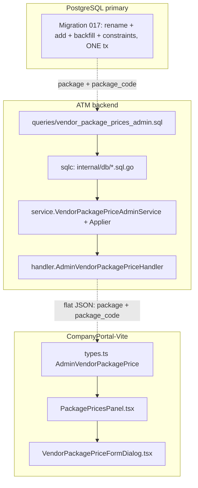

# Design Document

## Overview

This feature splits the single identifier on `public.vendor_package_prices` into two concepts so the Harga Paket screen can show two columns exactly as drawn in the crown-vendor-detail design:

- a shared, human-readable package **label** ("PAKET 3") that **groups** the tiers, machine groups, price classes, and override levels of one commercial package, and
- a per-row **unique machine code** ("PKG3_ABA_001") that identifies each individual price row.

Today `vendor_package_prices.package_code` holds the **label** and is the grouping key in every constraint and index that references it. The change therefore does two things in one migration (`017`):

1. **Rename** the existing column `package_code` → `package`. The column keeps its data, its `NOT NULL` constraint, and its grouping role in `vpp_no_overlap` and `vpp_lookup_idx`.
2. **Add** a new `package_code text` column holding the per-row unique code, backfilled deterministically as `PKG<digits-of-package>_<vendor.code>_<3-digit per-vendor sequence ordered by id>`, then made `NOT NULL` with a **global** `UNIQUE(package_code)` constraint.

The ripple beyond the migration is narrow and mechanical: the sqlc queries select/insert both columns and filter the list by the label; the service DTO and payloads carry both fields; the applier **generates** the per-row `package_code` at apply-on-approve time; the handler emits both fields; and the frontend renders a "Kode Paket" column (the real per-row code) and a "Paket" column (the label). Everything else — money-as-decimal-string, maker-checker staging, the overlap 409, the ADMIN/ADMIN_PARAM guard, primary-write/replica-read routing, flat JSON — is preserved unchanged.

This feature feeds the separately-planned `vendor-detail-revamp`: it supplies the two fields that spec's Harga Paket revamp consumes. The revamp's current reconciliation caveat ("render `package_code` verbatim, do **not** synthesize codes") is resolved by this feature — after `017`, `package_code` **is** the real persisted per-row code and `package` is the label the panel groups and filters by.

### Grounding against the current codebase

Verified against `backend/migrations/009_vendor_package_prices.sql` (structure), `012_drop_vendor_package_price_addons.sql` (addon columns dropped), and the live code:

- **Current column is the label.** `vendor_package_prices.package_code text NOT NULL` holds "PAKET 3"-style values and is the grouping key. There is **no** unique constraint on it today; the only referencing objects are `vpp_no_overlap` (GiST EXCLUDE) and `vpp_lookup_idx`. The two partial indexes `vpp_branch_idx`/`vpp_atm_idx` do **not** reference it and are left untouched.
- **`add_cr_price`/`add_flm_price` are already gone.** Migration 009 created them; `012` dropped them. The current admin queries (`vendor_package_prices_admin.sql`) select only `base_price` among the money columns. This design touches neither.
- **`btree_gist` is installed since baseline** (009's comment confirms), so rebuilding `vpp_no_overlap` needs no new extension.
- **`package_frequencies` PK is `(package_code, machine_group)` and its `package_code` is the label** ("PAKET 3" — seeded verbatim in 009). After the rename, any join from a price row to its frequency matches `vendor_package_prices.package = package_frequencies.package_code`. This feature does **not** alter `package_frequencies`; it only documents the new join key (Req 10.2). There is no current code joining the two, so nothing breaks today.
- **`vendors.code` exists** ("ABA", "ROH", ...) and is the `<Vendor_Code>` embedded in the generated code (009 sets `code = 'ROH'` for the internal vendor). INTERNAL (ROH) vendors never get a price row, so they never get a `package_code`.
- **Mutations run through the applier inside one transaction.** `VendorPackagePriceApplier.Apply` (`masterdata_applier_vendor_package_price.go`) is invoked by the maker-checker engine inside the apply-on-approve transaction (`pgx.Tx`), and `vpp_no_overlap` is re-checked there — this is exactly the seam where per-row `package_code` generation belongs (Req 5.4).
- **Overlap already maps to 409.** `mapPriceDBError` translates SQLSTATE `23P01` (exclusion violation) to `ErrVendorPackagePriceOverlap`; the handler's `handleError` maps that to `409`. Preserved.
- **Flat JSON, no envelope.** `packagePriceToResponse` returns a `map[string]any`; List returns `{package_prices, page, page_size, total}`. This is the ATM backend's flat-JSON convention (project-context Sec 4) — kept.
- **sqlc-generated structs** in `internal/db/vendor_package_prices_admin.sql.go` currently expose `PackageCode string`. After the query change they gain a `Package string` field alongside; the generated `*Params`/`*Row` structs regenerate accordingly.
- **Frontend** `AdminVendorPackagePrice` (types.ts) currently has `package_code`; `PackagePricesPanel.tsx` binds a single "Paket" column to it and `VendorPackagePriceFormDialog` collects it. Both change per Req 8.

## Architecture

### Change surface



### Apply-on-approve flow (create), showing where the code is generated

```mermaid
sequenceDiagram
    participant Op as Admin_Operator
    participant HD as Handler (POST /package-prices)
    participant SV as VendorPackagePriceAdminService
    participant MC as MasterData_MakerChecker
    participant AP as VendorPackagePriceApplier (in apply tx)
    participant DB as PostgreSQL primary

    Op->>HD: create {package label, grain, base_price}  (no package_code)
    HD->>SV: Create(makerID, vendorID, payload)
    SV->>SV: validate grain(package) + content; ignore any client package_code
    SV->>MC: Submit(op=create, payload{vendor_id, package, grain})
    MC-->>HD: 202 pending change request
    Note over MC: ...later, on approval...
    MC->>AP: Apply(tx, change)
    AP->>DB: SELECT next per-vendor seq (in tx, serialized)
    AP->>DB: INSERT (package, package_code=generated) 
    alt UNIQUE(package_code) violation (23505)
        DB-->>AP: 23505
        AP-->>MC: retryable conflict
    else exclusion violation (23P01)
        DB-->>AP: 23P01
        AP-->>MC: ErrVendorPackagePriceOverlap -> 409
    else ok
        DB-->>AP: row
        AP->>DB: audit_log (actor, action, row) [maker-checker engine]
    end
```

### Layering (all artifacts already exist; this feature edits them)

| Layer | Artifact | Change |
|-------|----------|--------|
| Migration | `backend/migrations/017_vendor_package_code_split.sql` (new) | rename → add → backfill → validate → NOT NULL + UNIQUE → rebuild overlap + lookup, one tx |
| SQL | `backend/queries/vendor_package_prices_admin.sql` | select/insert both `package` and `package_code`; list filter by `package` label |
| Generated | `backend/internal/db/vendor_package_prices_admin.sql.go` | regenerate (or hand-write per caveat) — structs gain `Package` |
| Service | `backend/internal/service/vendor_package_price_admin.go` | DTO + create payload gain `Package`; create payload drops `package_code` |
| Applier | `backend/internal/service/masterdata_applier_vendor_package_price.go` | generate `package_code` in-tx before insert |
| Handler | `backend/internal/handler/admin_vendor_package_price_handler.go` | response emits both fields; list filter param decision |
| Frontend | `admin-vendors/types.ts`, `components/PackagePricesPanel.tsx`, `components/VendorPackagePriceFormDialog.tsx` | two columns; create form collects label only |
| Steering | `.kiro/steering/project-context.md` Sec 2 | record applied schema change (Req 10) |

**sqlc caveat (project-context Sec 12).** `sqlc generate` may be blocked by a pre-existing bug in an archived migration. Attempt `sqlc generate` first; if it fails, hand-write `vendor_package_prices_admin.sql.go` to match the existing struct/field style (same `pgtype` imports, `Params`/`Row` structs, `q.db.Query`/`QueryRow` bodies, ordinal scan order) — adding the `Package` field in the position matching the SELECT column order.

### Read/write topology (Req 9.2/9.3, unchanged)

Reads (List/Get) route through the read replica; the write (the applier's INSERT/UPDATE) runs on the primary inside the maker-checker apply transaction. The per-vendor sequence SELECT that computes the next code runs on the **same primary transaction** as the INSERT (never the replica) — reading the sequence off a lagging replica could hand out a stale number, so it must be primary + in-tx.

## Components and Interfaces

### Migration — `backend/migrations/017_vendor_package_code_split.sql`

One transaction, in this order (Req 4.1):

```sql
BEGIN;

-- 1. Rename the grouping column. Data, NOT NULL, and grouping role preserved (Req 1.1-1.3).
ALTER TABLE public.vendor_package_prices RENAME COLUMN package_code TO package;

-- 2. Add the new per-row code column, nullable during backfill (Req 2.1).
ALTER TABLE public.vendor_package_prices ADD COLUMN package_code text;

-- 3. Backfill deterministically (Req 2.2/2.3).
--    <digits> = numeric chars of the label, or the fallback token '0' when the
--    label is digitless (see Design Decision 1). <vendor.code> from vendors.
--    <seq> = 3-digit per-vendor running number ordered by id.
WITH numbered AS (
    SELECT vpp.id,
           v.code AS vendor_code,
           COALESCE(NULLIF(regexp_replace(vpp.package, '\D', '', 'g'), ''), '0') AS digits,
           lpad(ROW_NUMBER() OVER (PARTITION BY vpp.vendor_id ORDER BY vpp.id)::text, 3, '0') AS seq
    FROM public.vendor_package_prices vpp
    JOIN public.vendors v ON v.id = vpp.vendor_id
)
UPDATE public.vendor_package_prices vpp
SET package_code = 'PKG' || n.digits || '_' || n.vendor_code || '_' || n.seq
FROM numbered n
WHERE n.id = vpp.id;

-- 4. Pre-commit validation (Req 4.3/4.4/4.5). Any failure raises -> aborts the tx.
DO $$
DECLARE dup int; null_pkg int; null_code int;
BEGIN
    SELECT count(*) INTO dup FROM (
        SELECT package_code FROM public.vendor_package_prices
        GROUP BY package_code HAVING count(*) > 1
    ) d;
    IF dup > 0 THEN RAISE EXCEPTION '017: % duplicate package_code values', dup; END IF;

    SELECT count(*) INTO null_pkg  FROM public.vendor_package_prices WHERE package IS NULL;
    IF null_pkg > 0 THEN RAISE EXCEPTION '017: % null package values', null_pkg; END IF;

    SELECT count(*) INTO null_code FROM public.vendor_package_prices WHERE package_code IS NULL;
    IF null_code > 0 THEN RAISE EXCEPTION '017: % null package_code values', null_code; END IF;
END $$;

-- 5. Lock down the new column (Req 2.6).
ALTER TABLE public.vendor_package_prices ALTER COLUMN package_code SET NOT NULL;
ALTER TABLE public.vendor_package_prices
    ADD CONSTRAINT vendor_package_prices_package_code_key UNIQUE (package_code);

-- 6. Rebuild overlap + lookup with `package` substituted for the old package_code column.
--    EVERYTHING ELSE identical to 009 (Req 1.4/1.5, 3.x).
ALTER TABLE public.vendor_package_prices DROP CONSTRAINT vpp_no_overlap;
ALTER TABLE public.vendor_package_prices
    ADD CONSTRAINT vpp_no_overlap EXCLUDE USING gist (
        vendor_id                     WITH =,
        package                       WITH =,
        machine_group                 WITH =,
        price_class                   WITH =,
        COALESCE(vendor_branch_id, 0) WITH =,
        COALESCE(atm_id, 0)           WITH =,
        int4range(tier_min, COALESCE(tier_max, 999999999), '[]') WITH &&,
        daterange(effective_start_date, effective_end_date, '[]') WITH &&
    );

DROP INDEX IF EXISTS vpp_lookup_idx;
CREATE INDEX vpp_lookup_idx
    ON public.vendor_package_prices (vendor_id, package, machine_group, price_class);

COMMIT;
```

**Reverse-migration reasoning (Req 4.6), documented in the file header, not executed as a `down`:** to reverse `017` one would (a) `DROP CONSTRAINT vendor_package_prices_package_code_key`, (b) `DROP CONSTRAINT vpp_no_overlap` and `DROP INDEX vpp_lookup_idx`, (c) `ALTER TABLE ... DROP COLUMN package_code` (the generated per-row column — its data is derivable, so losing it is safe), (d) `ALTER TABLE ... RENAME COLUMN package TO package_code` (restoring the original label column name and its data unchanged), then (e) recreate `vpp_no_overlap`/`vpp_lookup_idx` referencing `package_code` exactly as 009 defined them. The rename is lossless in both directions because the grouping column's data never moves; only the per-row column is created/dropped. The migration is additive-and-numbered per steering; the "down" is described for operators, matching the repo's forward-only migration convention.

**Fallback token.** The digitless-label fallback is `'0'` (Design Decision 1); it is deterministic so re-running the backfill produces identical codes. Flagged confirmable in requirements Open Q1.

### SQL — `backend/queries/vendor_package_prices_admin.sql`

All five queries change to carry both columns. The list/count filter changes from `package_code` (which was the label) to `package` (still the label), per the param-name decision (Design Decision 2, requirements Open Q2).

```sql
-- name: ListVendorPackagePricesAdmin :many
SELECT id, vendor_id, package, package_code, machine_group, price_class, tier_min, tier_max,
       base_price, vendor_branch_id, atm_id, sla_note, currency,
       effective_start_date, effective_end_date
FROM vendor_package_prices
WHERE vendor_id = sqlc.arg('vendor_id')
  AND (sqlc.narg('package')::text IS NULL OR package = sqlc.narg('package')::text)   -- filter by LABEL
  AND (sqlc.narg('machine_group')::text IS NULL OR machine_group = sqlc.narg('machine_group')::text)
  AND (sqlc.narg('price_class')::text IS NULL OR price_class = sqlc.narg('price_class')::text)
  AND ( sqlc.arg('status')::text = 'all'
     OR (sqlc.arg('status')::text = 'active'   AND (effective_end_date IS NULL OR effective_end_date >= CURRENT_DATE))
     OR (sqlc.arg('status')::text = 'disabled' AND effective_end_date < CURRENT_DATE) )
ORDER BY package ASC, machine_group ASC, price_class ASC, tier_min ASC, id ASC
LIMIT sqlc.arg('page_limit')::bigint OFFSET sqlc.arg('page_offset')::bigint;
```

`CountVendorPackagePricesAdmin` mirrors the same `WHERE` with the `package` filter. `GetVendorPackagePriceAdminByID` adds `package` and `package_code` to its SELECT list. `CreateVendorPackagePriceAdmin` inserts **both** `package` (the label, from payload) and `package_code` (the server-generated code, a new bound arg), and `RETURNING` both. `UpdateVendorPackagePriceAdmin` and `DisableVendorPackagePriceAdmin` are unchanged in their SET lists (grain + code immutable) but their `RETURNING`/SELECT projections add both columns so the DTO round-trips.

The `ORDER BY` leads with `package` (was `package_code` — same values, same label ordering), so list ordering is behaviorally identical.

### Generated db package — `internal/db/vendor_package_prices_admin.sql.go`

Regenerated: `CreateVendorPackagePriceAdminParams` gains `Package string` and keeps `PackageCode string` (now the generated per-row code). All `*Row` structs (`ListVendorPackagePricesAdminRow`, `GetVendorPackagePriceAdminByIDRow`, create/update `RETURNING` rows) gain `Package string`. The list/count `*Params` filter field is renamed `PackageCode *string` → `Package *string`.

### Service — `backend/internal/service/vendor_package_price_admin.go`

The read DTO and the create payload split the two concepts:

```go
// VendorPackagePrice read DTO gains Package (label) alongside PackageCode (per-row code).
type VendorPackagePrice struct {
    ID                 int64
    VendorID           int64
    Package            string   // label, grouping key ("PAKET 3")
    PackageCode        string   // per-row unique code ("PKG3_ABA_001")
    MachineGroup       string
    PriceClass         string
    TierMin            int64
    TierMax            *int64
    BasePrice          *string  // decimal string, never float
    VendorBranchID     *int64
    AtmID              *int64
    SlaNote            *string
    Currency           string
    EffectiveStartDate string
    EffectiveEndDate   *string
}

// Create payload carries the label; it does NOT accept package_code (Req 5.2, 6.3).
type VendorPackagePriceCreatePayload struct {
    Package            string `json:"package"`        // was PackageCode `json:"package_code"`
    MachineGroup       string `json:"machine_group"`
    PriceClass         string `json:"price_class"`
    TierMin            int64  `json:"tier_min"`
    TierMax            *int64 `json:"tier_max"`
    VendorBranchID     *int64 `json:"vendor_branch_id"`
    AtmID              *int64 `json:"atm_id"`
    Currency           string `json:"currency"`
    EffectiveStartDate string `json:"effective_start_date"`
    VendorPackagePriceContentPayload
}
```

- `validatePriceGrain` validates `Package` (trim, required) in place of the old `PackageCode` — same rule, renamed field. A `package_code` key in the request body has no matching struct field, so `encoding/json` silently ignores it; the service never persists a client-supplied code (Req 5.2, 6.3). The `newVendorPackagePrice`/`fromListRow`/`fromGetRow` mappers gain the `Package` argument.
- `VendorPackagePriceContentPayload` (update path) is **unchanged**: `base_price`, `sla_note`, `effective_end_date` only. Both `package` and `package_code` are immutable on update (Req 6.4, 7.4) because neither is a field of that payload and the `UpdateVendorPackagePriceAdmin` SET list omits them.

### Applier — code generation (Req 5, the careful part)

`package_code` is generated inside `VendorPackagePriceApplier.Apply`'s `create` branch, on the same `pgx.Tx` as the INSERT, so a rejected or still-pending change request never consumes a sequence value (Req 5.4). A new helper computes the next per-vendor sequence from existing codes:

```go
// nextPackageCode derives the next per-vendor code IN THE SAME TX as the insert.
// Format: PKG<digits(package)>_<vendor.code>_<seq3>. seq = max existing trailing
// 3-digit seq for this vendor + 1 (covers both backfilled and previously-generated
// codes, since both share the format). The global UNIQUE(package_code) is the final
// collision backstop (Req 5.3/5.5).
func nextPackageCode(ctx context.Context, tx pgx.Tx, vendorID int64, label string) (string, error) {
    // 1. Serialize concurrent applies for the SAME vendor so two in-flight
    //    approvals cannot read the same max seq. Advisory xact lock keyed on vendorID.
    if _, err := tx.Exec(ctx, `SELECT pg_advisory_xact_lock($1)`, vendorID); err != nil {
        return "", err
    }
    // 2. vendor.code
    var vendorCode string
    if err := tx.QueryRow(ctx, `SELECT code FROM vendors WHERE id = $1`, vendorID).Scan(&vendorCode); err != nil {
        return "", err
    }
    // 3. max trailing 3-digit seq across this vendor's existing package_codes.
    var maxSeq int
    err := tx.QueryRow(ctx, `
        SELECT COALESCE(MAX((regexp_replace(package_code, '^.*_', ''))::int), 0)
        FROM vendor_package_prices WHERE vendor_id = $1`, vendorID).Scan(&maxSeq)
    if err != nil {
        return "", err
    }
    digits := digitsOrFallback(label) // numeric chars of label, or "0"
    return fmt.Sprintf("PKG%s_%s_%03d", digits, vendorCode, maxSeq+1), nil
}
```

The generated code is passed as the new `PackageCode` arg to `CreateVendorPackagePriceAdmin`, while `Package` receives the payload label. `mapPriceDBError` gains handling for SQLSTATE `23505` (unique violation on `vendor_package_prices_package_code_key`): surface it as a distinct retryable/conflict error rather than the generic wrap, so the maker-checker layer can retry or report a code collision. The `23P01` (overlap → 409) path is unchanged.

**Concurrency tradeoff (discussed explicitly).** Two approvals for the *same vendor* applied concurrently could both read the same `MAX(seq)` and generate the same code. Two defenses, layered:

1. **Serialize per vendor with `pg_advisory_xact_lock(vendorID)`** at the top of `nextPackageCode`. The lock is held to end-of-transaction, so the second applier blocks until the first commits/rolls back, then reads the updated max. This makes the common case correct without contention across *different* vendors (the lock key is the vendor id).
2. **Global `UNIQUE(package_code)` as the final backstop.** If serialization is ever bypassed (e.g. a future code path forgets the lock), the unique constraint rejects the duplicate with `23505`; the applier surfaces a retryable conflict rather than committing a collision. Committed state therefore never contains two equal codes.

Approvals are low-frequency (human maker-checker), so the advisory-lock serialization cost is negligible; the design keeps it simple — compute-in-tx + unique-backstop — rather than a dedicated sequence table. Because backfilled codes share the exact `PKG…_<code>_<seq3>` format, the `MAX(seq)` derivation continues the sequence past them without collision (Req 2 note).

### Handler — `admin_vendor_package_price_handler.go`

`packagePriceToResponse` emits both fields:

```go
func packagePriceToResponse(p service.VendorPackagePrice) map[string]any {
    return map[string]any{
        "id": p.ID, "vendor_id": p.VendorID,
        "package": p.Package, "package_code": p.PackageCode,   // label + per-row code
        "machine_group": p.MachineGroup, "price_class": p.PriceClass,
        "tier_min": p.TierMin, "tier_max": p.TierMax,
        "base_price": p.BasePrice,
        "vendor_branch_id": p.VendorBranchID, "atm_id": p.AtmID,
        "sla_note": p.SlaNote, "currency": p.Currency,
        "effective_start_date": p.EffectiveStartDate, "effective_end_date": p.EffectiveEndDate,
    }
}
```

The `List` handler's filter loop reads query param `package` (the label) instead of `package_code`, binding it to the renamed `Package *string` params field. Create still returns `202`; overlap still maps to `409` via `ErrVendorPackagePriceOverlap`; the `RequireRoles("ADMIN","ADMIN_PARAM")` guard and flat-JSON envelope are unchanged.

### Frontend

**Types** (`admin-vendors/types.ts`): `AdminVendorPackagePrice` gains `package: string` alongside the existing `package_code: string`. The list params type's filter field becomes `package?: string`.

```ts
export interface AdminVendorPackagePrice {
  id: number;
  vendor_id: number;
  package: string;        // label, groups rows ("PAKET 3")
  package_code: string;   // per-row code ("PKG3_ABA_001")
  // ...machine_group, price_class, tier_min/max, base_price (string), etc. unchanged
}
```

**Panel** (`PackagePricesPanel.tsx`): the single "Paket" column that today binds to `package_code` splits into two:

- **Kode Paket** — bound to `package_code`, rendered per-row, `font-mono tabular-nums` (it is a machine code).
- **Paket** — bound to `package` (the label); grouping/sorting/filter use `package`.

The `useMemo` sort and any label filter key on `package`. The disable-confirm dialog message references `pendingDisable?.package` (the human label) rather than the code.

**Form** (`VendorPackagePriceFormDialog.tsx`): the create form collects the `package` **label** and sends it as `package`. It does **not** collect or send `package_code` (Req 8.4) — the code is server-generated. Update mode still edits only content fields.

**Money** stays a decimal string end to end: `base_price` is rendered from the API string, never `Number()`-ed (Req 6.6, 8.5).

## Data Models

### Endpoint contract (flat JSON, unchanged shape + two fields)

`GET /api/v1/admin/vendors/{vendorId}/package-prices?page&page_size&status&package&machine_group&price_class`

```json
{
  "package_prices": [
    {
      "id": 512,
      "vendor_id": 7,
      "package": "PAKET 3",
      "package_code": "PKG3_ABA_001",
      "machine_group": "ATM",
      "price_class": "REGULAR",
      "tier_min": 1,
      "tier_max": null,
      "base_price": "2003100.00",
      "vendor_branch_id": null,
      "atm_id": null,
      "sla_note": null,
      "currency": "IDR",
      "effective_start_date": "2026-01-01",
      "effective_end_date": null
    }
  ],
  "page": 1,
  "page_size": 25,
  "total": 1
}
```

`POST` body accepts `package` (label) + grain + content; a `package_code` key in the body is ignored. `POST`/`PUT`/`disable` return `202` with the pending change-request shape.

### Field mapping

| JSON field | Column (after 017) | Notes |
|------------|--------------------|-------|
| `package` | `vendor_package_prices.package` | renamed from `package_code`; label, grouping key |
| `package_code` | `vendor_package_prices.package_code` | new; per-row unique code, server-generated |
| `base_price` | `base_price numeric(20,2)` | decimal string over the wire, nullable |
| grain fields | `machine_group`, `price_class`, `tier_min/max`, `vendor_branch_id`, `atm_id`, `effective_start_date` | immutable after create |

### Package_Code format

`PKG<digits>_<vendor.code>_<seq3>`, e.g. `PKG3_ABA_001`. `<digits>` = numeric chars of the label, or `0` when digitless. `<seq3>` = zero-padded per-vendor running number. Global uniqueness enforced by `vendor_package_prices_package_code_key`.

## Correctness Properties

*A property is a characteristic or behavior that should hold true across all valid executions of a system — essentially, a formal statement about what the system should do. Properties serve as the bridge between human-readable specifications and machine-verifiable correctness guarantees.*

The testable core is the **migration backfill logic**, the **overlap equivalence** of the rename, and the **code generator**. These vary meaningfully with input (label shapes, per-vendor row sets, concurrent applies) and reward generated-input coverage. Migration behavior is proven on real Postgres (see Testing Strategy); the code generator and format are proven with property tests against a repository per the repo's convention.

### Property 1: Backfill uniqueness, totality, and label preservation

For any set of pre-migration `vendor_package_prices` rows, after Migration_017 every row has a non-null `package_code`, all `package_code` values are globally distinct, and each row's `package` value equals that row's pre-migration `package_code` value verbatim (grouping preserved).

**Validates: Requirements 1.1, 1.3, 2.4, 2.5, 4.3, 4.4**

### Property 2: Overlap invariance across the rename

For any two candidate price rows, they conflict under the new `vpp_no_overlap` (with `package` as the package partition) if and only if they would have conflicted under the old constraint (with the old `package_code` label in that role), given identical values in every other grain field and identical null-coalescing on branch/ATM overrides. The rename changes which column name carries the partition, never which pairs conflict.

**Validates: Requirements 1.4, 3.1, 3.2, 3.3, 3.4**

### Property 3: Code-generation uniqueness under concurrency

For any sequence of create-applies — including two applies for the same vendor executed concurrently — every committed `package_code` is globally distinct, the global `UNIQUE(package_code)` is never violated in committed state, and a change request that is rejected or still pending consumes no sequence value (the next committed code for that vendor is unaffected by rejected/pending requests).

**Validates: Requirements 5.3, 5.4, 5.5**

### Property 4: Code format and per-vendor monotonicity

For any label and vendor, a generated or backfilled `package_code` matches `^PKG.+_<vendor.code>_\d{3}$`, and within a single vendor the trailing 3-digit sequence is strictly increasing in the order rows are created (generated codes continue past the migration's backfilled codes without collision).

**Validates: Requirements 2.2, 2.3, 5.1**

### Property 5: API round-trip contract

For any price row, a List or Get response exposes both `package` and `package_code`; a Create request accepts `package` (label) and ignores any client-supplied `package_code`, persisting only the server-generated code; and an Update request mutates neither `package` nor `package_code`.

**Validates: Requirements 5.2, 6.1, 6.3, 6.4, 7.4**

## Error Handling

| Condition | Layer | Result | Requirement |
|-----------|-------|--------|-------------|
| Pre-commit validation fails (dup code / null package / null code) | Migration `DO` block `RAISE` | transaction aborts, nothing persisted | 4.5 |
| Missing/blank `package` on create | service `validatePriceGrain` | 400 validation error | 6.3 |
| Client sends `package_code` on create | service (field absent) | ignored; server generates | 5.2, 6.3 |
| Generated code collides (concurrent apply) | applier maps `23505` | retryable conflict surfaced to maker-checker | 5.5 |
| Applied change overlaps existing period | applier maps `23P01` → `ErrVendorPackagePriceOverlap` | 409 conflict | 3.1, 7.5 |
| Update targets grain/code field | service (not in content payload) + SET list omits it | change silently not applied to those fields | 6.4, 7.4 |
| Token role not ADMIN/ADMIN_PARAM | `RequireRoles` middleware | 403 | 9.1 |
| Disable on a price row | applier ends period, no hard-delete/re-enable | 202 → period closed | 7.3 |
| INTERNAL (ROH) vendor | service `checkVendor` | 409 conflict | — |

Money is `numeric(20,2)` in the DB, a decimal string over the wire, and never a JS number (Req 6.6). Every applied change writes an `audit_log` via the maker-checker engine (Req 7.2), unchanged by this feature.

## Testing Strategy

### Migration / integration test on real Postgres (the primary safeguard)

Per project-context Sec 7, migration behavior is proven against a real Postgres, not a fake. In `backend/internal/repository` (or the repo's migration-test harness), seed pre-migration-shape rows (label in `package_code`, no per-row column), run `017`, then assert:

- `package` holds the old `package_code` values verbatim; `NOT NULL` still enforced (Property 1).
- `package_code` is non-null, globally unique, and every value matches `^PKG.+_.+_\d{3}$`; per-vendor sequences are `001, 002, …` in `id` order (Properties 1, 4).
- A digitless label (e.g. seed a `"PAKET"` row) backfills to `PKG0_<code>_NNN` (fallback token).
- Inserting a second row on the same grain (`vendor_id`, `package`, `machine_group`, `price_class`, level, overlapping tier + period) still raises `23P01` — overlap fires post-rename (Property 2).
- `vpp_lookup_idx` exists on `(vendor_id, package, machine_group, price_class)`; `vpp_branch_idx`/`vpp_atm_idx` untouched.
- The whole thing is one transaction: a forced validation failure (e.g. inject a duplicate) leaves the table in its pre-migration shape (Req 4.5).

One or two representative fixtures suffice — SQL behavior does not vary meaningfully once the logic-level properties pass.

### Service property tests for the code generator

In `backend/internal/service/...` using the repo's PBT library (`pgregory.net/rapid` or the existing vendored choice — do not hand-roll), min 100 iterations, each tagged **Feature: vendor-package-code-split, Property {n}: {property text}**:

- **Property 3/4** — generate sequences of create-applies over varied vendors/labels; assert generated codes are distinct per committed state, per-vendor seq is monotonic, format matches, and simulated concurrent applies for one vendor (two goroutines / interleaved calls against a real or fake repo that honors the advisory lock + unique constraint) never both commit the same code; a "rejected" apply leaves the next seq unchanged.
- Backfilled-code continuation: seed codes at seq `005`, assert the next generated code is `006`.

### Handler httptest (table-driven)

- List/Get responses include both `package` and `package_code` (Property 5, Req 6.1).
- Create with a body carrying `package_code` → the value is ignored, response 202, and the persisted row (via the fake applier) has a server-generated code, not the client's (Req 5.2).
- Update body attempting `package`/`package_code`/grain change → those fields unchanged (Req 6.4/7.4).
- Overlap error → 409 (Req 7.5); wrong role → 403 (Req 9.1); flat JSON shape (no envelope).
- List `package` filter narrows by label; legacy behavior per Design Decision 2.

### Frontend component tests (`PackagePricesPanel.test.tsx`, RTL)

- Both "Kode Paket" (`package_code`, mono/tabular) and "Paket" (`package`) columns render.
- Grouping/sorting/filtering keys on the `package` label.
- Create form (`VendorPackagePriceFormDialog`) has **no** code input and submits `package` only (Req 8.4).
- `base_price` renders from the decimal string, never `Number()`-ed (Req 8.5).

## Design Decisions

### Decision 1: Digitless-label fallback token is `'0'`

When a label contains no digits, `<digits>` becomes `'0'`, yielding e.g. `PKG0_ABA_001`. It is deterministic (re-running the backfill produces identical codes, Req 2.3), keeps the code non-null and globally unique (the `_<vendor>_<seq>` suffix still distinguishes rows), and reads sensibly. This resolves requirements Open Q1; the exact token is confirmable with business but `'0'` is the safe default and the design is written against it.

### Decision 2: List filter parameter is renamed `package_code` → `package`

The list endpoint historically exposed a `package_code` query param that matched the label. Since the label now lives in the `package` column, the filter is renamed to `package` and filters by the label grouping value (Req 6.5). This is the clean, self-consistent choice: the param name matches the field it filters and the column it targets. **Backward-compat consideration:** the only consumer is the internal `PackagePricesPanel`, which this feature updates in lockstep, so no external client depends on the old name; a legacy `package_code` alias is therefore **not** retained (keeping one would mean a param named for the per-row code but filtering by the label — misleading). This resolves requirements Open Q2. If an external consumer surfaces later, an alias can be added without contract change.

### Decision 3: Generate the code at apply-on-approve, not at staging

The definitive `package_code` is assigned inside the applier's transaction on approval (Req 5.4), not when the maker submits. This means a pending or rejected change request burns no sequence value, so codes stay dense and gap-free per vendor, and two makers staging concurrently cannot both reserve `001`. The tradeoff — a staged request does not display its final code until approved — is acceptable because the code is a machine identifier the operator never types or references pre-approval (Open Q3 assumption, confirmable).

### Decision 4: Advisory lock + unique backstop over a sequence table

Per-vendor sequencing uses `pg_advisory_xact_lock(vendorID)` to serialize same-vendor applies plus the global `UNIQUE(package_code)` as the final guard, rather than a dedicated per-vendor sequence table. Approvals are low-frequency and human-gated, so lock contention is negligible and a sequence table would be extra schema and drift risk for no throughput benefit. The unique constraint guarantees correctness even if the lock is ever bypassed.

## Out of Scope

- No change to money semantics (`numeric(20,2)` in DB, decimal string over the wire, never float in JS).
- No change to the maker-checker engine internals — this feature only *uses* the existing applier seam.
- No change to any other master-data table.
- No change to the `package_frequencies` **schema** — only the documented join key it is matched on (`vendor_package_prices.package = package_frequencies.package_code`, Req 10.2).
- No visual/layout work on the `vendor-detail-revamp` beyond supplying the two fields it consumes.
- No new endpoint; no hard delete; no re-enable of a price row.

## Requirements Coverage Map

| Requirement | Design section |
|-------------|----------------|
| 1.1–1.3 rename, preserve NOT NULL + grouping | Migration step 1; Property 1 |
| 1.4/1.5 rebuild overlap + lookup on `package` | Migration step 6; Property 2 |
| 2.1 add column | Migration step 2 |
| 2.2/2.3 backfill format + fallback | Migration step 3; Decision 1; Property 4 |
| 2.4/2.5/2.6 non-null, unique, constraints | Migration steps 4–5; Property 1 |
| 3.1–3.4 overlap integrity | Migration step 6; Property 2; Error Handling |
| 4.1 one transaction | Migration `BEGIN…COMMIT` |
| 4.2 numbered 017 | file name |
| 4.3–4.5 pre-commit validation + abort | Migration step 4; Error Handling |
| 4.6 reverse reasoning | Migration reverse-migration note |
| 5.1–5.5 server-side generation, timing, concurrency | Applier `nextPackageCode`; Decisions 3–4; Properties 3, 4 |
| 6.1/6.2 both fields, flat JSON | Handler `packagePriceToResponse`; Data Models |
| 6.3 create accepts label, not code | Service payload; Property 5 |
| 6.4 update immutability | Service content payload; Property 5 |
| 6.5 filter by label | SQL list; Decision 2 |
| 6.6 decimal string | Data Models; Testing (frontend) |
| 7.1 202 pending | Handler (unchanged) |
| 7.2 audit on apply | maker-checker engine (unchanged) |
| 7.3 disable ends period | Applier disable branch |
| 7.4 grain + code immutable | Service; Property 5 |
| 7.5 overlap → 409 | `mapPriceDBError` → handler |
| 8.1–8.5 two columns, group by label, form collects label, money string | Frontend Panel + Form |
| 9.1 403 wrong role | `RequireRoles` |
| 9.2/9.3 write primary / read replica | Architecture → topology |
| 10.1/10.2 record schema + join key | Steering update |
