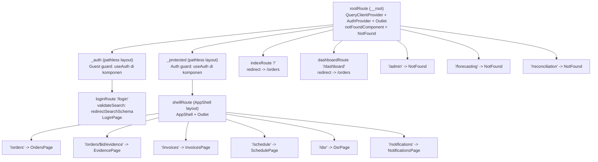
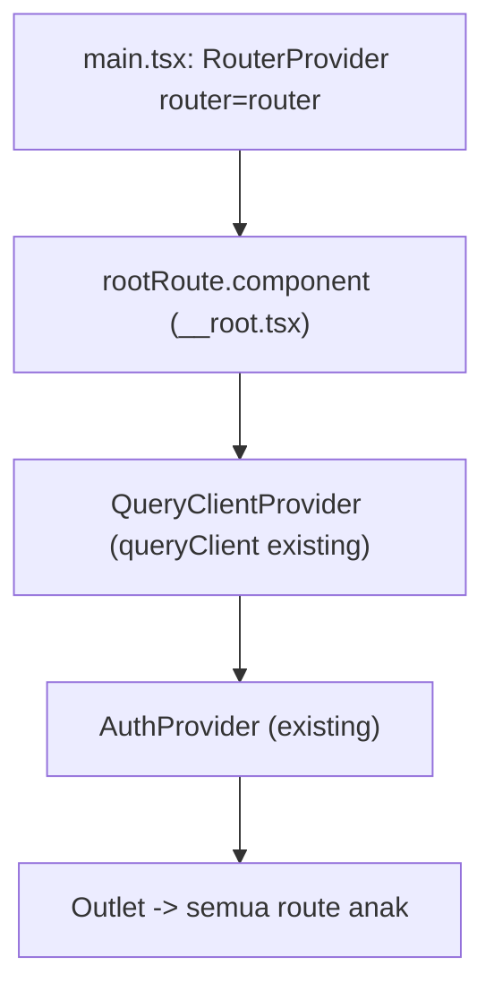

# Design Document

## Overview

Dokumen ini merancang migrasi library routing Vendor Portal (`frontend/VendorPortal-Vite/`) dari `react-router` (`^8.3.0`) ke `@tanstack/react-router`, mengikuti konvensi yang sudah dipakai CompanyPortal (`frontend/CompanyPortal-Vite/`). Migrasi ini bersifat **behavior-preserving**: tidak satu pun path route, redirect, perilaku guard autentikasi, integrasi `AuthContext`/`useAuth`, integrasi TanStack Query, aksesibilitas, maupun kontrak API (`X-Portal-Type: vendor`) yang berubah. Yang berubah hanyalah mekanisme routing dan bentuk deklarasi route.

### Sasaran Migrasi

- Mengganti pola `createBrowserRouter` + array konfigurasi (`src/app/routes.tsx`) dengan route programatik TanStack Router (`createRootRoute`/`createRoute`), meniru CompanyPortal (Requirement 1.1, 1.2).
- Membangun `Router_Instance` via `createRouter({ routeTree })` dan mendaftarkan tipe via `declare module` untuk keamanan tipe compile-time (Requirement 1.3, 1.4, 8.1).
- Memasang `RouterProvider` TanStack Router di titik masuk aplikasi (Requirement 1.5).
- Menghapus total dependensi dan impor `react-router` di akhir migrasi (Requirement 7.4, 7.5).

### Kendala Kritis: Auth berbasis React Context, bukan Zustand Store

CompanyPortal membaca status auth **secara sinkron** di dalam `beforeLoad` melalui Zustand store (`useAuthStore.getState()`). Vendor Portal berbeda: auth-nya adalah **React Context** (`AuthContext` + `useAuth()`), yang state-nya **tidak bisa dibaca sinkron** dari dalam `beforeLoad` TanStack Router (hook context hanya hidup di dalam render tree React, bukan di fungsi loader router). Requirement 4.1 juga melarang mendefinisikan ulang atau memodifikasi logika autentikasi (jadi mengonversi `AuthContext` ke Zustand tidak diperbolehkan).

Konsekuensinya, guard tidak diletakkan di `beforeLoad` (seperti CompanyPortal) melainkan di **komponen layout pathless-route** yang memanggil `useAuth()` dan melakukan `<Navigate>`/`redirect`. Rasional dan tradeoff dibahas di bagian [Design Decisions](#design-decisions--tradeoffs).

### Strategi

Migrasi dilakukan bertahap dan menjaga baseline perilaku observable saat ini:

1. Tambah dependensi `@tanstack/react-router`, biarkan `react-router` sementara agar test lama tetap hijau selama transisi.
2. Bangun pohon route TanStack Router baru di `src/routes/*` (meniru struktur folder CompanyPortal).
3. Tulis ulang dua guard (`ProtectedRoute`/`GuestRoute`) menjadi komponen layout TanStack Router yang tetap memakai `useAuth()`.
4. Sesuaikan `LoginPage` agar membaca search param via `useSearch`/`useNavigate` TanStack Router.
5. Ganti wiring `main.tsx`, hapus `src/app/routes.tsx` dan `src/app/App.tsx`.
6. Adaptasi test guard properti dari `MemoryRouter` react-router ke setup TanStack Router.
7. Hapus `react-router` dari `package.json` dan seluruh impor.

---

## Architecture

### Struktur Route Tree Target

Meniru CompanyPortal: satu `rootRoute` sebagai akar, dua pathless layout route (`_auth` untuk guest, `_protected` untuk terproteksi), dan `AppShell` sebagai layout child di bawah `_protected`. Redirect `/` dan `/dashboard` diwujudkan sebagai route dengan `beforeLoad` yang melempar `redirect({ to: '/orders' })`. Route internal-masking dan catch-all ditangani `notFoundComponent`.



### Pemetaan Route: React Router (saat ini) → TanStack Router (target)

| Path saat ini (react-router) | Elemen saat ini | Route TanStack target | Guard/mekanisme | Requirement |
|---|---|---|---|---|
| `/login` | `GuestRoute` > `LoginPage` | `loginRoute` di bawah `_auth` | Guest guard (komponen) | 2.1, 3.5 |
| `/` | `ProtectedRoute` > `<Navigate to="/orders" replace/>` | `indexRoute`, `beforeLoad` → `redirect('/orders')` | redirect | 2.3 |
| `/dashboard` | `ProtectedRoute` > `<Navigate to="/orders" replace/>` | `dashboardRoute`, `beforeLoad` → `redirect('/orders')` | redirect | 2.4 |
| `/orders` | `AppShell` > `OrdersPage` | di bawah `_protected` > `shellRoute` | Auth guard (komponen) | 2.2 |
| `/orders/:id/evidence` | `AppShell` > `EvidencePage` | `/orders/$id/evidence` di `shellRoute` | Auth guard | 2.2 |
| `/invoices` | `AppShell` > `InvoicesPage` | di `shellRoute` | Auth guard | 2.2 |
| `/schedule` | `AppShell` > `SchedulePage` | di `shellRoute` | Auth guard | 2.2 |
| `/dsr` | `AppShell` > `DsrPage` | di `shellRoute` | Auth guard | 2.2 |
| `/notifications` | `AppShell` > `NotificationsPage` | di `shellRoute` | Auth guard | 2.2 |
| `/admin` | `NotFound` | route `/admin` dengan komponen `NotFound` | Internal masking | 2.5 |
| `/forecasting` | `NotFound` | route `/forecasting` dengan komponen `NotFound` | Internal masking | 2.5 |
| `/reconciliation` | `NotFound` | route `/reconciliation` dengan komponen `NotFound` | Internal masking | 2.5 |
| `*` | `NotFound` | `rootRoute.notFoundComponent = NotFound` | catch-all | 2.6, 6.5 |

Catatan konversi parameter dinamis: react-router memakai `:id` (`/orders/:id/evidence`); TanStack Router memakai `$id` (`/orders/$id/evidence`). Path yang diobservasi pengguna tetap identik (Requirement 1.2, 2.2).

### Penempatan Provider

Saat ini `App.tsx` menempatkan `QueryClientProvider` > `AuthProvider` > `RouterProvider`. Karena guard Vendor Portal memakai `useAuth()` di komponen layout (bukan `beforeLoad`), `AuthProvider` **harus berada di atas** komponen route yang memanggil `useAuth()`. Ada dua opsi:

- **Opsi terpilih:** Letakkan `QueryClientProvider` + `AuthProvider` di dalam **komponen `rootRoute`** (`__root.tsx`), membungkus `<Outlet/>`. Ini persis pola CompanyPortal (`__root.tsx` memegang `QueryClientProvider` + `<Outlet/>`) dan memenuhi Requirement 5.1 (Query provider sebagai penyedia terluar) serta Requirement 4.1 (memakai `AuthProvider` yang ada tanpa modifikasi).
- Opsi ditolak: tetap membungkus `RouterProvider` dengan provider di `main.tsx`. Ditolak karena membuat penempatan berbeda dari CompanyPortal dan menyulitkan komponen route mengakses context secara idiomatik lewat root.

Dengan opsi terpilih, `main.tsx` cukup merender `<RouterProvider router={router} />`, dan seluruh context hidup di komponen `rootRoute`.



---

## Components and Interfaces

### 1. `rootRoute` (`src/routes/__root.tsx`) — baru

`createRootRoute` yang komponennya membungkus `QueryClientProvider` (memakai `queryClient` yang sudah ada dari `@/lib/queryClient`, Requirement 5.2) dan `AuthProvider` (dari `@/features/auth/AuthContext`, Requirement 4.1) mengelilingi `<Outlet/>`. Mendefinisikan `notFoundComponent: NotFound` untuk catch-all (Requirement 2.6, 6.5).

```tsx
export const rootRoute = createRootRoute({
  component: RootComponent,
  notFoundComponent: NotFound,
});

function RootComponent() {
  return (
    <QueryClientProvider client={queryClient}>
      <AuthProvider>
        <Outlet />
      </AuthProvider>
    </QueryClientProvider>
  );
}
```

### 2. `_auth` layout + `loginRoute` (`src/routes/_auth.tsx`, `src/routes/login.tsx`) — baru

`_auth` adalah pathless layout (`id: "_auth"`) yang komponennya menerapkan **Guest guard** (padanan `GuestRoute` saat ini) memakai `useAuth()`:

- Jika `state.isAuthLoading` true → tampilkan spinner `Loader2` identik dengan yang ada di `ProtectedRoute.tsx` saat ini (Requirement 3.6, 4.4).
- Jika `state.isAuthenticated` true → `<Navigate to="/orders" replace />` (Requirement 3.5, 4.6). Catatan: perilaku saat ini mengarah ke `/dashboard`, tetapi `/dashboard` sendiri me-redirect ke `/orders`, sehingga tujuan akhir identik. Untuk menghindari double-redirect, guest guard mengarah langsung ke `/orders` (tujuan default per Requirement 3.5) — observable sama.
- Selain itu render `<Outlet/>`.

`loginRoute` adalah child `_auth` dengan `path: "/login"`, `validateSearch: redirectSearchSchema` (lihat Data Models), dan `component: LoginPage`.

### 3. `_protected` layout + `shellRoute` (`src/routes/_protected.tsx`) — baru

`_protected` adalah pathless layout (`id: "_protected"`) yang komponennya menerapkan **Auth guard** (padanan `ProtectedRoute` saat ini) memakai `useAuth()`:

- Jika `state.isAuthLoading` true → spinner `Loader2` (Requirement 3.6, 4.4) dengan timeout 10 detik (Requirement 3.7, lihat Error Handling).
- Jika `!state.isAuthenticated` → `<Navigate to="/login" search={{ redirect: currentPath }} replace />`, dengan `currentPath = location.pathname + location.search` (Requirement 3.1, 4.5). Diperoleh via `useRouterState`/`useLocation` TanStack Router.
- Selain itu render `<Outlet/>`.

`shellRoute` adalah child `_protected` (pathless, `id: "_shell"`) yang komponennya merender `<AppShell>` membungkus `<Outlet/>` (Requirement 2.7). `AppShell` yang ada memakai `NavLink`/`Outlet` react-router — perlu diadaptasi ke TanStack Router `Link`/`Outlet` (lihat Files to Change).

Vendor Portal tidak punya role, jadi helper `requireRoles()` milik CompanyPortal **tidak diadopsi** (N/A).

### 4. Route redirect & masking (`src/routes/index.tsx`, `src/routes/dashboard.tsx`, `src/routes/admin.tsx`, dll.) — baru

- `indexRoute` `/`: `beforeLoad: () => { throw redirect({ to: '/orders' }) }` (Requirement 2.3). Karena redirect ini tidak bergantung pada auth (react-router saat ini menempatkannya di dalam `ProtectedRoute`, tetapi observable-nya adalah "ke `/orders`"), redirect murni sudah cukup dan tetap akan melewati auth guard di `/orders`.
- `dashboardRoute` `/dashboard`: idem → `/orders` (Requirement 2.4).
- `/admin`, `/forecasting`, `/reconciliation`: route terdaftar dengan `component: NotFound`, menghasilkan tampilan identik dengan path tak dikenal (Requirement 2.5, Internal_Route_Masking).

### 5. `LoginPage` (`src/features/auth/LoginPage.tsx`) — diubah

Saat ini memakai `useLocation` + `URLSearchParams` + `useNavigate` react-router. Diadaptasi:

- `redirectTo` dibaca via `useSearch({ from: loginRoute.id })` yang sudah tervalidasi Zod dan tersanitasi, default `/orders` (bukan `/dashboard`) sesuai Requirement 3.3.
- `navigate(...)` diganti `useNavigate()` TanStack Router (`navigate({ to: redirectTo, replace: true })`).
- Efek "sudah authenticated → redirect" diarahkan ke `/orders` (Requirement 3.5), menggantikan `/dashboard` lama (observable identik karena `/dashboard`→`/orders`).
- Seluruh markup, atribut aksesibilitas (`aria-live`, `role="alert"`, `aria-invalid`, label form), token warna, dan logika rate-limit tetap sama persis (Requirement 6.1, 6.2, 6.4).

### 6. `main.tsx` (`src/main.tsx`) — diubah

```tsx
const routeTree = rootRoute.addChildren([
  authRoute.addChildren([loginRoute]),
  protectedRoute.addChildren([
    shellRoute.addChildren([ordersRoute, evidenceRoute, invoicesRoute, scheduleRoute, dsrRoute, notificationsRoute]),
  ]),
  indexRoute,
  dashboardRoute,
  adminRoute,
  forecastingRoute,
  reconciliationRoute,
]);

const router = createRouter({ routeTree });

declare module "@tanstack/react-router" {
  interface Register { router: typeof router; }
}

createRoot(document.getElementById("root")!).render(
  <StrictMode>
    <RouterProvider router={router} />
  </StrictMode>,
);
```

(Requirement 1.3, 1.4, 1.5, 8.1)

---

## Data Models

### Skema search param `redirect` (`src/routes/login.tsx`)

Search param bertipe, divalidasi Zod, konsisten dengan konvensi CompanyPortal (Requirement 3.8). Menyertakan sanitasi yang menolak URL eksternal (Requirement 3.4).

```ts
import { z } from 'zod';

// Menolak nilai bukan-path-internal: absolute URL atau protocol-relative.
function isSafeInternalPath(value: string): boolean {
  return value.startsWith('/') && !value.startsWith('//');
  // menolak '//evil.com', 'http://', 'https://' (tidak diawali '/')
}

export const redirectSearchSchema = z.object({
  redirect: z
    .string()
    .optional()
    .transform((v) => (v && isSafeInternalPath(v) ? v : undefined)),
});

export type RedirectSearch = z.infer<typeof redirectSearchSchema>;
```

- Nama param tetap `redirect` dan semantiknya tetap `pathname + search` yang di-URL-encode (Requirement 3.1). TanStack Router menangani encode/decode search secara internal.
- Jika `redirect` gagal validasi atau bukan path internal → `undefined`, dan `LoginPage` jatuh ke default `/orders` (Requirement 3.4, 3.3).

### Tipe registrasi router

```ts
declare module "@tanstack/react-router" {
  interface Register { router: typeof router; }
}
```

(Requirement 1.4, 8.1)

### Signature guard/helper

```ts
// _protected.tsx
function ProtectedLayout(): JSX.Element;   // memakai useAuth() + useNavigate/Navigate
// _auth.tsx
function AuthLayout(): JSX.Element;         // guest guard, memakai useAuth()
// shellRoute component
function ShellLayout(): JSX.Element;        // <AppShell><Outlet/></AppShell>
```

---

## Correctness Properties

*Sebuah property adalah karakteristik atau perilaku yang harus berlaku benar di seluruh eksekusi valid sistem — pernyataan formal tentang apa yang harus dilakukan sistem. Property menjembatani spesifikasi yang dapat dibaca manusia dengan jaminan kebenaran yang dapat diverifikasi mesin.*

Berdasarkan analisis prework, kriteria yang bersifat konfigurasi/setup (Requirement 1.3–1.5, 8.x), rendering UI/visual/a11y (Requirement 6.1–6.4), dan integrasi Query caching (Requirement 5.x, sudah teruji oleh TanStack Query sendiri) tidak diubah menjadi property PBT. Property difokuskan pada logika routing/guard yang bervariasi terhadap input (path, nilai redirect param) — di sinilah 100+ iterasi menemukan lebih banyak bug daripada 2–3 contoh.

### Property 1: Route-Guard Round-Trip

*Untuk setiap* path terproteksi (`/orders`, `/orders/$id/evidence`, `/invoices`, `/schedule`, `/dsr`, `/notifications`) beserta query string opsionalnya, ketika pengguna tak terautentikasi mengaksesnya lalu berhasil login, sistem harus mengalihkan ke `/login?redirect={path}` (path awal terpreservasi termasuk query string), dan setelah login sukses mengembalikan pengguna ke path awal identik tersebut.

**Validates: Requirements 3.1, 3.2, 7.1, 7.2, 7.3**

### Property 2: Sanitasi Redirect Param

*Untuk setiap* nilai `redirect` yang bukan path internal aman (mis. diawali `http://`, `https://`, atau `//`, atau gagal validasi skema), setelah login sukses pengguna dialihkan ke `/orders` (default), bukan ke nilai `redirect` tersebut.

**Validates: Requirements 3.4, 3.3**

### Property 3: Preservasi Pemetaan Path Route

*Untuk setiap* path yang dapat diakses pada React Router sebelum migrasi, meresolusi path itu pada TanStack Router menghasilkan halaman atau redirect yang sama (`/` dan `/dashboard` → `/orders`; setiap path terproteksi → halaman yang sama di dalam `AppShell`; `/login` → `LoginPage`).

**Validates: Requirements 1.2, 2.2, 2.3, 2.4**

### Property 4: Internal-Route Masking Tak Terbedakan

*Untuk setiap* path pada himpunan internal-only (`/admin`, `/forecasting`, `/reconciliation`) dan setiap path acak tak dikenal, keluaran yang ter-render sistem identik (sama-sama halaman NotFound) tanpa perbedaan yang dapat diobservasi pengguna yang mengungkap keberadaan route internal.

**Validates: Requirements 2.5, 2.6**

---

## Error Handling

- **Not-found / catch-all (Requirement 2.6, 6.5):** ditangani `rootRoute.notFoundComponent = NotFound`. Untuk path internal-masking (Requirement 2.5), route eksplisit dengan `component: NotFound` menghasilkan output identik. Komponen `NotFound` yang ada menyertakan teks "Halaman tidak ditemukan" (indikasi tekstual, Requirement 6.5) dan tautan "Kembali ke beranda" (`Link` diadaptasi ke TanStack Router).
- **Redirect param invalid (Requirement 3.4):** ditangani `validateSearch` + transform Zod yang memetakan nilai tak-aman ke `undefined`; `LoginPage` jatuh ke `/orders`. Tidak melempar error yang mengganggu render — sanitasi bersifat silent fallback.
- **Auth-init timeout 10 detik (Requirement 3.7):** guard `_protected` memasang timer di komponen; jika `isAuthLoading` masih true setelah 10 detik, guard berhenti menampilkan spinner dan `<Navigate to="/login" .../>`. Timer dibersihkan saat unmount atau saat `isAuthLoading` menjadi false. `AuthContext` tidak diubah (Requirement 4.1) — timeout ini murni di lapisan guard.
- **Guest guard saat authenticated (Requirement 3.5, 4.6):** `_auth` mengalihkan ke `/orders`.

---

## Testing Strategy

Pendekatan ganda: property-based test untuk logika guard/routing yang bervariasi terhadap input, dan unit/integration test untuk contoh spesifik, edge case, serta parity visual/a11y.

### Property-Based Tests (fast-check, min. 100 iterasi)

Library: `fast-check` (sudah terpasang). Setiap test diberi tag komentar berformat **Feature: vendor-portal-tanstack-router-migration, Property {n}: {teks}** dan mereferensikan property desain. Setup diadaptasi dari `MemoryRouter` react-router ke TanStack Router: buat `createRouter({ routeTree, history: createMemoryHistory({ initialEntries: [path] }) })` lalu render `<RouterProvider router={testRouter} />` di dalam `AuthProvider` (via komponen root atau wrapper test), dengan `fetch` di-mock seperti test saat ini.

- **Property 1 (Route-Guard Round-Trip):** adaptasi `features/auth/__tests__/routeGuard.property.test.tsx` (Property 12 lama) ke TanStack Router. Generator `protectedPathArb` dipertahankan (termasuk `/orders/$id/evidence` dinamis) dan diperluas dengan query string acak untuk memverifikasi preservasi `pathname + search`. **Validates: Requirements 3.1, 3.2, 7.1–7.3.**
- **Property 2 (Sanitasi Redirect Param):** generator string berbahaya (`http://…`, `https://…`, `//…`, string acak non-path) → assert target akhir `/orders`. **Validates: Requirements 3.3, 3.4.**
- **Property 3 (Preservasi Pemetaan Path):** generator seluruh path lama → assert komponen/redirect target sama. **Validates: Requirements 1.2, 2.2–2.4.**
- **Property 4 (Internal-Route Masking):** generator dari himpunan internal + path acak → assert output ter-render sama-sama `NotFound`. **Validates: Requirements 2.5, 2.6.**

### Unit / Integration Tests

- Pertahankan `features/auth/__tests__/AuthContext.test.tsx` tanpa perubahan logika (Requirement 4.1) — mungkin hanya penyesuaian import bila menyentuh router.
- Tambah unit test sanitasi `redirectSearchSchema` (contoh eksplisit: `/orders` lolos, `//evil.com` ditolak, `https://x` ditolak, `undefined` → default).
- Tambah test pemetaan route (setiap path lama meresolusi ke route yang benar).
- Test spinner + timeout 10 detik guard (`isAuthLoading` menetap → redirect ke `/login`, Requirement 3.7).
- Parity a11y/visual: verifikasi atribut `aria-live`, `role="alert"`, `aria-invalid`, label form pada `LoginPage` tetap ada (Requirement 6.2); snapshot untuk memastikan tidak ada regresi markup (Requirement 6.1).

### Gerbang Kualitas (Requirement 8)

- `pnpm build` exit 0 tanpa error TypeScript/build (Requirement 8.2, 8.3), termasuk keamanan tipe dari `declare module` (Requirement 8.1).
- `oxlint` exit 0, 0 error (Requirement 8.4).
- `vitest --run` exit 0, 0 gagal, 0 skipped (Requirement 8.5).
- Verifikasi akhir: 0 impor `react-router` (Requirement 7.5) dan tidak ada entri `react-router` di `package.json` (Requirement 7.4).

---

## Files to Add / Change / Remove

### Ditambah

- `src/routes/__root.tsx` — `rootRoute` + `QueryClientProvider` + `AuthProvider` + `notFoundComponent`.
- `src/routes/_auth.tsx` — pathless layout + guest guard.
- `src/routes/_protected.tsx` — pathless layout + auth guard + timeout 10 detik; serta `shellRoute` (AppShell layout) — dapat dipisah ke `src/routes/_protected/_shell.tsx` bila perlu.
- `src/routes/login.tsx` — `loginRoute` + `redirectSearchSchema` (`validateSearch`).
- `src/routes/index.tsx` — `/` redirect → `/orders`.
- `src/routes/dashboard.tsx` — `/dashboard` redirect → `/orders`.
- `src/routes/orders.tsx`, `orders.$id.evidence.tsx`, `invoices.tsx`, `schedule.tsx`, `dsr.tsx`, `notifications.tsx` — route halaman di bawah `shellRoute`.
- `src/routes/admin.tsx`, `forecasting.tsx`, `reconciliation.tsx` — internal-masking → `NotFound`.

### Diubah

- `src/main.tsx` — bangun `routeTree`, `createRouter`, `declare module`, render `RouterProvider`.
- `src/features/auth/LoginPage.tsx` — ganti `useLocation`/`URLSearchParams`/`useNavigate` react-router → `useSearch`/`useNavigate` TanStack Router; default redirect `/orders`.
- `src/features/auth/ProtectedRoute.tsx` — tulis ulang `ProtectedRoute`/`GuestRoute` menjadi komponen layout TanStack Router (atau pindahkan ke `src/routes/_protected.tsx` dan `_auth.tsx`).
- `src/app/AppShell.tsx` — ganti `NavLink`/`Outlet` react-router → `Link`/`Outlet` TanStack Router (styling `isActive` via render prop TanStack Router). Pertahankan seluruh markup, a11y, token.
- `src/components/NotFound.tsx` — ganti `Link` react-router → TanStack Router `Link`.
- `src/features/auth/useAuth.ts` (`useAuthRefresh`) — memakai `window.location.href = '/login?redirect=...'` (bukan hook router), aman dipertahankan; verifikasi tetap konsisten dengan skema param.
- `src/features/auth/__tests__/routeGuard.property.test.tsx` — adaptasi ke TanStack Router (`createMemoryHistory` + `RouterProvider`).
- `package.json` — tambah `@tanstack/react-router`, hapus `react-router` (Requirement 7.4).

### Dihapus

- `src/app/routes.tsx` — digantikan pohon route `src/routes/*`.
- `src/app/App.tsx` — diserap; provider pindah ke `rootRoute`, `main.tsx` merender `RouterProvider` langsung.

---

## Design Decisions & Tradeoffs

1. **Guard di komponen layout, bukan `beforeLoad` (context-vs-store).** Karena auth Vendor Portal adalah React Context yang tak bisa dibaca sinkron di `beforeLoad`, dan Requirement 4.1 melarang menulis ulang auth, guard diletakkan di komponen pathless-layout memakai `useAuth()` + `<Navigate>`. Ini adalah pilihan paling minim risiko dan behavior-preserving. Tradeoff: berbeda dari `beforeLoad` CompanyPortal (redirect terjadi saat render, bukan sebelum load), tetapi observable-nya identik dengan `ProtectedRoute`/`GuestRoute` react-router saat ini. Alternatif — mengekspos snapshot auth sinkron (module-level getter/ref yang di-update `AuthContext`) — ditolak karena menambah permukaan perubahan pada modul auth dan berisiko regresi tanpa manfaat perilaku.
2. **Provider di `rootRoute`.** Menempatkan `QueryClientProvider` + `AuthProvider` di komponen `rootRoute` menyelaraskan dengan CompanyPortal dan memenuhi Requirement 5.1 (Query provider terluar) dan 4.1 (pakai `AuthProvider` apa adanya).
3. **Pertahankan nama & semantik param `redirect`.** Nama `redirect` dan isi `pathname + search` dipertahankan agar tautan/logika lama (`useAuthRefresh`) tetap kompatibel (Requirement 3.1, 3.8).
4. **Guest guard & default redirect langsung ke `/orders`.** Perilaku lama mengarah ke `/dashboard` yang lalu me-redirect ke `/orders`; guard baru menuju `/orders` langsung untuk menghindari double-redirect. Observable akhir identik (Requirement 3.3, 3.5).

## Requirements Traceability

| Elemen desain | Requirement |
|---|---|
| Route programatik `createRootRoute`/`createRoute`, hapus react-router | 1.1, 1.2, 7.4, 7.5 |
| `createRouter` + `declare module` (tipe aman) | 1.3, 1.4, 8.1 |
| `RouterProvider` di `main.tsx` | 1.5 |
| `notFoundComponent` + internal masking | 1.6, 2.5, 2.6, 6.5 |
| Route `/login`, path terproteksi, `AppShell` | 2.1, 2.2, 2.7 |
| Redirect `/`, `/dashboard` → `/orders` | 2.3, 2.4 |
| Redirect unauth → `/login` | 2.8, 3.1 |
| Auth guard komponen + return URL + post-login | 3.1, 3.2, 3.3, 4.5 |
| Sanitasi redirect param (Zod) | 3.4, 3.8 |
| Guest guard | 3.5, 4.6 |
| Spinner saat `isAuthLoading` | 3.6, 4.4 |
| Timeout auth-init 10 detik | 3.7 |
| Pakai `AuthContext`/`useAuth` & klien API tanpa modifikasi | 4.1, 4.2 |
| Header `X-Portal-Type: vendor` (di `AuthContext`, tak diubah) | 4.3 |
| `QueryClientProvider` terluar + konfigurasi `queryClient` dipertahankan | 5.1, 5.2, 5.3, 5.4 |
| Parity visual, a11y, fokus, NotFound | 6.1, 6.2, 6.3, 6.4, 6.5 |
| Property round-trip guard lulus di TanStack Router | 7.1, 7.2, 7.3 |
| Build/lint/test hijau | 8.2, 8.3, 8.4, 8.5 |
