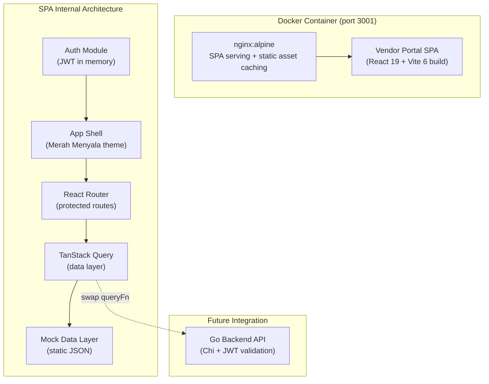
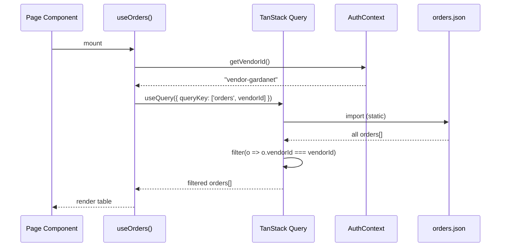
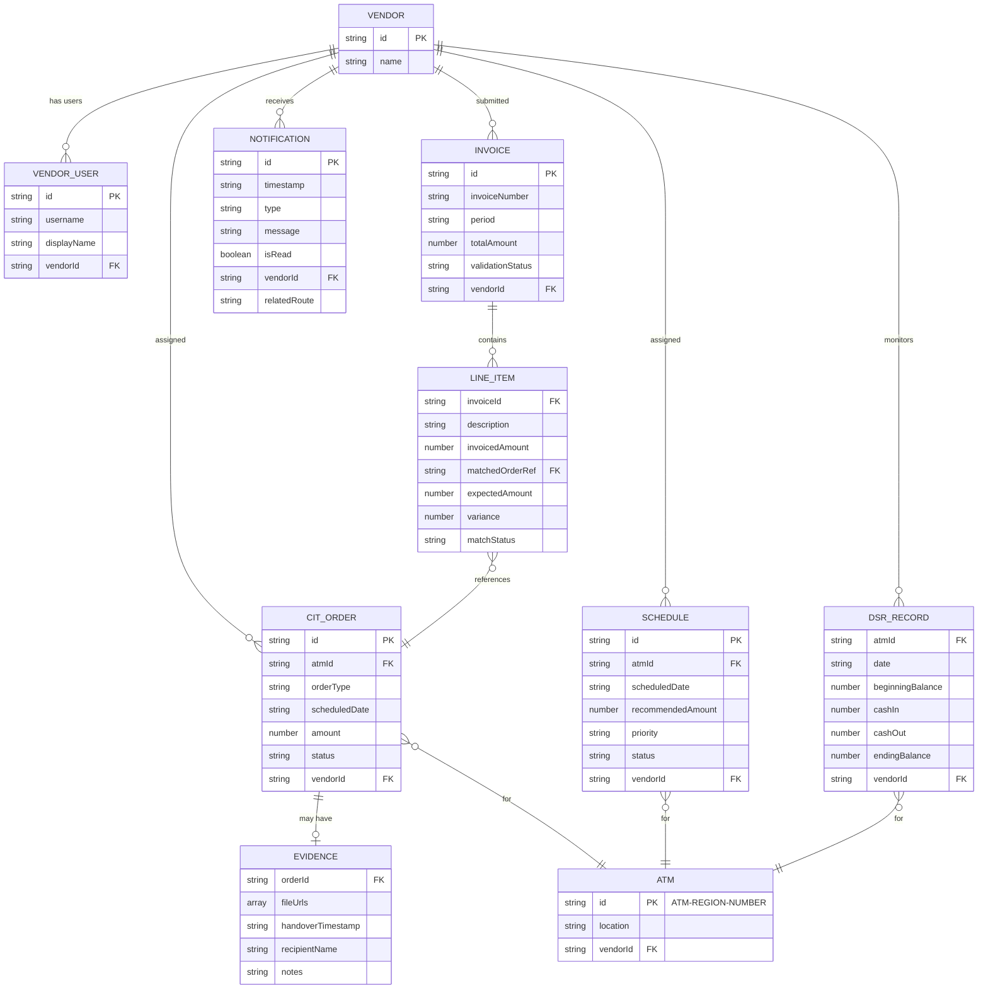

# Design Document: Vendor Portal

## Overview

The Vendor Portal is a standalone React SPA that provides CIT vendor personnel (PT Gardanet, PT SSI, PT G4S) with a scoped view into the CIMB Niaga Cash Management System. It runs independently from the internal CROWN app in its own Docker container, with a separate codebase at `frontend/VendorPortal-Vite/`.

Key design goals:
- **Complete isolation** from the internal frontend — no shared code, dependencies, or build artifacts
- **Vendor data scoping** — every query filters by `vendor_id` from the JWT, enforced at both mock layer and future API layer
- **Prototype-first** — static JSON mock data consumed via TanStack Query hooks, structured for seamless API swap
- **"Merah Menyala" brand theme** — bold maroon-red top bar and full-red active sidebar, distinct from the internal app's restrained CMS design system

### Tech Stack

| Layer | Technology | Version | Rationale |
|-------|-----------|---------|-----------|
| Framework | React | 19 | Same ecosystem as internal app, team familiarity |
| Language | TypeScript | 5.x | Type safety |
| Build | Vite | 6 | Fast dev server, optimized production builds |
| Styling | Tailwind CSS | 4 | OKLCH-native, design token consistency |
| Router | React Router | v7 | Simpler setup for this smaller app |
| Server State | TanStack Query | v5 | Consistent data fetching, easy mock-to-API swap |
| Tables | TanStack Table | v8 | Headless table logic for all data screens |
| Forms | React Hook Form + Zod | latest | Evidence upload form validation |
| Icons | Lucide React | latest | Consistent with internal app icon set |
| Container | Docker (nginx:alpine) | latest | Production serving, independent deployment |
| Package Manager | pnpm | latest | Workspace consistency |

## Architecture



### Architectural Decisions

1. **React Router over TanStack Router**: The internal app uses TanStack Router for type-safe file-based routing. The vendor portal uses React Router because it is a smaller, simpler app with fewer routes and no deeply nested layouts. React Router v7's simplicity reduces bundle size and configuration overhead for this use case.

2. **JWT stored in memory (not localStorage)**: The JWT is stored in a React ref/state variable. This prevents XSS from accessing tokens in storage. On page refresh, the user must re-authenticate — acceptable for a vendor-facing ops tool.

3. **Mock data via static JSON imports**: The prototype uses `import` of JSON files inside `queryFn` callbacks. This produces zero-latency responses, makes the prototype fully self-contained (no backend needed), and the swap path to real API is: change `queryFn` to a `fetch` call.

4. **Separate container on port 3001**: Completely independent from internal app (port 3000). No shared reverse proxy in prototype phase. Future deployment can front both with Caddy.

5. **"Merah Menyala" theme vs internal design system**: The vendor portal uses a bolder, brand-forward color palette compared to the restrained internal CMS design system. The top bar is `oklch(40% 0.155 26)` (maroon-red) and the sidebar uses `oklch(30% 0.11 25)` (maroon-deep) with `oklch(54% 0.233 27)` (full-red) for active items. This creates an unmistakable visual distinction between internal and vendor experiences.

## Components and Interfaces

### Directory Structure

```
frontend/VendorPortal-Vite/
├── src/
│   ├── app/
│   │   ├── App.tsx                  # Root: providers + router
│   │   ├── AppShell.tsx             # Layout: top bar + sidebar + main
│   │   └── routes.tsx               # Route definitions
│   ├── components/
│   │   ├── layout/
│   │   │   ├── TopBar.tsx           # Maroon-red branded top bar
│   │   │   ├── Sidebar.tsx          # Full-red active sidebar
│   │   │   └── NotificationBadge.tsx
│   │   └── ui/
│   │       ├── Badge.tsx            # Semantic status badges
│   │       ├── Button.tsx           # Primary/secondary/ghost
│   │       ├── Card.tsx             # Summary cards
│   │       ├── DataTable.tsx        # TanStack Table wrapper
│   │       ├── DatePicker.tsx       # Date range selector
│   │       ├── EmptyState.tsx       # Empty state placeholder
│   │       ├── FileUpload.tsx       # Drag-drop file input
│   │       └── FilterTabs.tsx       # Status filter tabs
│   ├── features/
│   │   ├── auth/
│   │   │   ├── LoginPage.tsx
│   │   │   ├── AuthContext.tsx      # JWT state, vendor info
│   │   │   ├── ProtectedRoute.tsx   # Route guard component
│   │   │   └── useAuth.ts          # Auth hook
│   │   ├── orders/
│   │   │   ├── OrdersPage.tsx       # CIT order dashboard
│   │   │   ├── OrderSummaryBar.tsx  # Status count cards
│   │   │   └── useOrders.ts        # TanStack Query hook
│   │   ├── evidence/
│   │   │   ├── EvidencePage.tsx     # Upload form for order
│   │   │   ├── EvidenceForm.tsx     # React Hook Form + Zod
│   │   │   └── useEvidence.ts      # Upload mutation hook
│   │   ├── invoices/
│   │   │   ├── InvoicesPage.tsx     # Invoice list + detail
│   │   │   ├── InvoiceDetail.tsx    # Line items expandable
│   │   │   └── useInvoices.ts      # TanStack Query hook
│   │   ├── schedule/
│   │   │   ├── SchedulePage.tsx     # Grouped by date
│   │   │   └── useSchedule.ts      # TanStack Query hook
│   │   ├── dsr/
│   │   │   ├── DsrPage.tsx         # DSR monitor table
│   │   │   ├── DsrSummaryCard.tsx  # ATM count + status
│   │   │   └── useDsr.ts           # TanStack Query hook
│   │   └── notifications/
│   │       ├── NotificationsPage.tsx
│   │       └── useNotifications.ts  # Query + mutation hooks
│   ├── data/
│   │   ├── vendors.json             # 3 vendors, 6+ users
│   │   ├── orders.json              # 20+ CIT orders
│   │   ├── evidence.json            # Evidence metadata
│   │   ├── invoices.json            # 10+ invoices with line items
│   │   ├── schedules.json           # 15+ replenishment schedules
│   │   ├── dsr.json                 # 280+ DSR records (20 ATMs x 14 days)
│   │   └── notifications.json      # 10+ notification records
│   ├── lib/
│   │   ├── queryClient.ts          # TanStack Query instance
│   │   ├── formatters.ts           # IDR formatting, date, truncation
│   │   ├── constants.ts            # Nav items, routes, thresholds
│   │   └── types.ts                # Shared TypeScript interfaces
│   └── styles/
│       └── index.css               # Tailwind imports + Merah Menyala tokens
├── public/
│   └── favicon.svg
├── index.html
├── package.json
├── vite.config.ts
├── tsconfig.json
├── tsconfig.app.json
├── tsconfig.node.json
├── Dockerfile
├── docker-compose.yml
├── nginx.conf
├── .dockerignore
└── vitest.config.ts
```

### Key Interfaces

```typescript
// lib/types.ts

interface VendorUser {
  readonly id: string;
  readonly username: string;
  readonly displayName: string;
  readonly vendorId: string;
  readonly vendorName: string;
  readonly role: 'Vendor';
}

interface AuthState {
  readonly token: string | null;
  readonly user: VendorUser | null;
  readonly isAuthenticated: boolean;
}

interface JwtPayload {
  readonly sub: string;
  readonly auth_source: 'local';
  readonly role: 'Vendor';
  readonly vendor_id: string;
  readonly vendor_name: string;
  readonly display_name: string;
  readonly exp: number;
  readonly iat: number;
}

interface CITOrder {
  readonly id: string;
  readonly atmId: string;
  readonly location: string;
  readonly orderType: 'Pickup' | 'Delivery';
  readonly scheduledDate: string; // ISO date
  readonly amount: number; // IDR integer
  readonly status: 'Scheduled' | 'In Transit' | 'Completed' | 'Failed';
  readonly vendorId: string;
  readonly hasEvidence: boolean;
}

interface HandoverEvidence {
  readonly orderId: string;
  readonly files: readonly EvidenceFile[];
  readonly handoverTimestamp: string; // ISO datetime
  readonly recipientName: string;
  readonly notes?: string;
  readonly uploadedAt: string; // ISO datetime
}

interface EvidenceFile {
  readonly name: string;
  readonly url: string;
  readonly type: 'image/jpeg' | 'image/png' | 'application/pdf';
  readonly size: number; // bytes
}

interface Invoice {
  readonly id: string;
  readonly invoiceNumber: string;
  readonly period: string;
  readonly totalAmount: number; // IDR integer
  readonly lineItemsCount: number;
  readonly validationStatus: 'Uploaded' | 'Validated' | 'Mismatch Detected' | 'Approved';
  readonly vendorId: string;
  readonly lineItems: readonly InvoiceLineItem[];
}

interface InvoiceLineItem {
  readonly description: string;
  readonly invoicedAmount: number;
  readonly matchedOrderRef: string;
  readonly expectedAmount: number;
  readonly variance: number;
  readonly matchStatus: 'Match' | 'Mismatch' | 'Pending';
}

interface ReplenishmentSchedule {
  readonly id: string;
  readonly atmId: string;
  readonly location: string;
  readonly scheduledDate: string; // ISO date
  readonly recommendedAmount: number; // IDR integer
  readonly priority: 'High' | 'Medium' | 'Low';
  readonly status: 'Pending' | 'Confirmed' | 'Executed' | 'Cancelled';
  readonly vendorId: string;
}

interface DsrRecord {
  readonly atmId: string;
  readonly location: string;
  readonly date: string; // ISO date
  readonly beginningBalance: number; // IDR integer
  readonly cashIn: number;
  readonly cashOut: number;
  readonly endingBalance: number;
  readonly vendorId: string;
}

type BalanceStatus = 'Critical' | 'Low' | 'Normal';

interface Notification {
  readonly id: string;
  readonly timestamp: string; // ISO datetime
  readonly type: 'New Assignment' | 'Order Status Changed' | 'Invoice Status Updated' | 'Schedule Updated';
  readonly message: string;
  readonly isRead: boolean;
  readonly vendorId: string;
  readonly relatedRoute: string;
}
```

### Component Contracts

```typescript
// Auth Context
interface AuthContextValue {
  readonly state: AuthState;
  login(username: string, password: string): Promise<void>;
  logout(): void;
}

// Protected Route — redirects to /login if not authenticated, preserving intended URL

// DataTable (TanStack Table wrapper)
interface DataTableProps<T> {
  data: readonly T[];
  columns: ColumnDef<T>[];
  sorting?: SortingState;
  onSortingChange?: (sorting: SortingState) => void;
  emptyMessage?: string;
}

// Badge
interface BadgeProps {
  variant: 'info' | 'warning' | 'success' | 'danger' | 'neutral';
  icon?: LucideIcon;
  children: React.ReactNode;
}

// FileUpload
interface FileUploadProps {
  maxFiles: number; // 5
  maxSizeBytes: number; // 10MB
  acceptedTypes: string[]; // ['image/jpeg', 'image/png', 'application/pdf']
  files: File[];
  onFilesChange: (files: File[]) => void;
  errors?: string[];
}

// FilterTabs
interface FilterTabsProps<T extends string> {
  options: readonly { value: T; label: string; count?: number }[];
  selected: T;
  onChange: (value: T) => void;
}
```

## Data Models

### Mock Data Schema

The mock data layer uses static JSON files imported at build time. Each file contains an array of records with a `vendorId` field enabling client-side filtering.

#### Vendor Scoping Flow



#### Data Relationships



#### IDR Currency Formatting

All monetary values are stored as integers (no decimals) and formatted for display:
- Display format: `"IDR 250.000.000"` (CIT orders, DSR, invoices)
- Schedule format: `"Rp 150.000.000"` (replenishment schedules use Rp prefix)
- Alignment: right-aligned with `tabular-nums` font variant
- Thousands separator: dot (Indonesian locale)

```typescript
// lib/formatters.ts
function formatIDR(amount: number): string {
  return `IDR ${amount.toLocaleString('id-ID')}`;
}

function formatRp(amount: number): string {
  return `Rp ${amount.toLocaleString('id-ID')}`;
}

function formatBadgeCount(count: number): string | null {
  if (count <= 0) return null;
  if (count > 99) return '99+';
  return String(count);
}

function truncate(text: string, maxLength: number): string {
  if (text.length <= maxLength) return text;
  return text.slice(0, maxLength) + '...';
}
```

#### Balance Status Thresholds

```typescript
function getBalanceStatus(endingBalance: number): BalanceStatus {
  if (endingBalance < 50_000_000) return 'Critical';
  if (endingBalance <= 150_000_000) return 'Low';
  return 'Normal';
}
```

### Merah Menyala Color Tokens

The vendor portal defines its own color palette distinct from the internal CMS design system:

```css
/* styles/index.css — Merah Menyala theme tokens */
:root {
  /* Top bar — maroon red */
  --vp-topbar: oklch(40% 0.155 26);
  --vp-topbar-text: oklch(98% 0.01 26);

  /* Sidebar — maroon deep background */
  --vp-sidebar: oklch(30% 0.11 25);
  --vp-sidebar-text: oklch(75% 0.03 25);
  --vp-sidebar-text-muted: oklch(60% 0.03 25);

  /* Sidebar active — full red */
  --vp-sidebar-active: oklch(54% 0.233 27);
  --vp-sidebar-active-text: oklch(99% 0.005 27);

  /* Content surface */
  --vp-surface: oklch(99.5% 0.003 40);
  --vp-text: oklch(25% 0.02 28);

  /* Semantic colors (shared with CMS design system) */
  --vp-success-bg: oklch(0.955 0.03 155);
  --vp-success-fg: oklch(0.480 0.115 155);
  --vp-warning-bg: oklch(0.960 0.055 78);
  --vp-warning-fg: oklch(0.520 0.115 78);
  --vp-danger-bg: oklch(0.955 0.035 12);
  --vp-danger-fg: oklch(0.500 0.195 12);
  --vp-info-bg: oklch(0.955 0.03 245);
  --vp-info-fg: oklch(0.480 0.110 245);
}
```


## Correctness Properties

*A property is a characteristic or behavior that should hold true across all valid executions of a system — essentially, a formal statement about what the system should do. Properties serve as the bridge between human-readable specifications and machine-verifiable correctness guarantees.*

### Property 1: Vendor Data Isolation

*For any* vendor_id and any data collection (orders, invoices, schedules, DSR records, notifications), filtering by that vendor_id should return only records whose vendorId field exactly matches the parameter, and should never include records belonging to a different vendor.

**Validates: Requirements 3.2, 5.2, 6.2, 7.2, 9.3, 9.9, 12.1, 12.2**

### Property 2: IDR Currency Formatting

*For any* non-negative integer amount, `formatIDR(amount)` should produce a string matching the pattern `"IDR "` followed by the amount with dot-separated thousands and no decimal places (Indonesian locale), and `formatRp(amount)` should produce `"Rp "` followed by the same dot-separated format. Additionally, parsing the numeric portion back (replacing dots) should yield the original integer.

**Validates: Requirements 3.7, 5.5, 6.7, 7.8**

### Property 3: Badge Count Formatting

*For any* non-negative integer count: if count is 0 the result should be null (badge hidden); if count is between 1 and 99 inclusive the result should be the string representation of that number; if count exceeds 99 the result should be "99+".

**Validates: Requirements 2.7, 8.5**

### Property 4: String Truncation

*For any* string and any positive maxLength: if the string length is less than or equal to maxLength, the output should equal the input unchanged; if the string length exceeds maxLength, the output should be the first maxLength characters followed by "..." and the total output length should be maxLength + 3.

**Validates: Requirements 2.2**

### Property 5: Balance Status Classification

*For any* non-negative integer endingBalance: if endingBalance is strictly less than 50,000,000 the status should be "Critical"; if endingBalance is greater than or equal to 50,000,000 and less than or equal to 150,000,000 the status should be "Low"; if endingBalance is strictly greater than 150,000,000 the status should be "Normal". The three ranges should be exhaustive and mutually exclusive.

**Validates: Requirements 7.3**

### Property 6: Date Range Filtering

*For any* collection of dated records and any date range filter (start date, end date, or both): the filtered results should contain exactly those records whose date field falls within the specified bounds (inclusive). If only start is provided, all records from start onward are included. If only end is provided, all records up to and including end are included. The result should be a subset of the input.

**Validates: Requirements 3.5, 6.8, 6.9**

### Property 7: Status Filter with AND Composition

*For any* collection of orders, any status filter value, and any date range filter: applying both filters should produce results where every record satisfies both the status condition AND the date range condition. The result should equal the intersection of applying each filter independently.

**Validates: Requirements 3.4**

### Property 8: Column Sorting Correctness

*For any* array of records and any sortable column: sorting in ascending order should produce elements in non-decreasing order by that column's value; sorting in descending order should produce elements in non-increasing order. Sorting should be stable (preserve relative order of equal elements). The sorted output should be a permutation of the input (no elements added or removed).

**Validates: Requirements 3.9, 7.9**

### Property 9: File Upload Validation

*For any* file metadata (type and size): if the file type is one of [image/jpeg, image/png, application/pdf] AND file size is less than or equal to 10,485,760 bytes (10MB), validation should pass. For any file with type not in the accepted list OR size exceeding 10MB, validation should fail with a specific error message identifying the constraint violated.

**Validates: Requirements 4.2**

### Property 10: Schedule Date Grouping Aggregation

*For any* set of replenishment schedules, grouping by scheduledDate should produce groups where: each group's computed total equals the sum of recommendedAmount for all schedules in that date, each group's count equals the number of schedules for that date, and the union of all groups equals the original set (no records lost or duplicated).

**Validates: Requirements 6.5**

### Property 11: Schedule Multi-Level Sort

*For any* set of replenishment schedules, after applying the default sort: dates across groups should be in strictly non-decreasing order (ascending), and within each date group, priorities should be in non-increasing order where High > Medium > Low. The sorted output should be a permutation of the input.

**Validates: Requirements 6.6**

### Property 12: Authentication Route Guard Round-Trip

*For any* protected route path, when an unauthenticated user attempts to access it: the system should redirect to /login AND preserve the original path. After successful authentication, the system should redirect to that preserved path (not the default /orders). The round-trip should restore the user's intended destination.

**Validates: Requirements 11.3, 11.4**

### Property 13: Notification Type Routing

*For any* notification with a type field, the mapped navigation target should be deterministic: "New Assignment" maps to "/orders", "Order Status Changed" maps to "/orders", "Invoice Status Updated" maps to "/invoices", "Schedule Updated" maps to "/schedule". No notification type should map to an undefined route.

**Validates: Requirements 8.4**


## Error Handling

### Authentication Errors

| Scenario | User-Facing Message | Behavior |
|----------|-------------------|----------|
| Invalid credentials | "Username atau password salah" | Generic message, no field-specific hints. Form retains username. |
| Network error during login | "Gagal terhubung ke server. Silakan coba lagi." | Retains username field. Submit button re-enabled. |
| Expired JWT | Silent redirect to /login | Clears all cached data (query cache, auth state). Preserves intended URL for post-login redirect. |
| Missing/invalid vendor_id in JWT | "Sesi tidak valid. Silakan login kembali." | Denies all data access. Clears session. |
| Logout session clear failure | Redirect to /login regardless | Shows subtle error toast that session could not be fully cleared. |

### Data Layer Errors

| Scenario | Behavior |
|----------|----------|
| Mock data import fails | TanStack Query returns error state. Page shows inline error with retry button. |
| Empty data for vendor | Empty state component with contextual message (no orders, no invoices, etc.) |
| Malformed mock data | TypeScript compilation catches at build time (JSON imports are typed). |

### Upload Errors

| Scenario | User-Facing Message | Behavior |
|----------|-------------------|----------|
| File exceeds 10MB | "File {filename} melebihi batas 10MB" | File rejected immediately on selection. Other valid files retained. |
| Invalid file type | "File {filename} tidak didukung. Gunakan JPEG, PNG, atau PDF." | File rejected. Valid files retained. |
| More than 5 files | "Maksimal 5 file per pengiriman" | Additional files rejected beyond 5th. |
| Upload network failure | "Gagal mengunggah. Silakan coba lagi." | All form values and files retained. Submit re-enabled for retry. |
| Handover timestamp in future | "Waktu serah terima tidak boleh di masa depan" | Form-level validation, prevents submission. |
| Handover timestamp > 72h ago | "Waktu serah terima tidak boleh lebih dari 72 jam yang lalu" | Form-level validation, prevents submission. |

### Navigation Errors

| Scenario | Behavior |
|----------|----------|
| Unknown route | NotFound page with "Halaman tidak ditemukan" text, icon, and link to /orders |
| Internal-only route (admin, forecasting, etc.) | Same NotFound page — does not reveal that the route exists internally |
| Accessing another vendor's resource | "Akses ditolak" message. Access attempt logged (user ID, resource ID, timestamp). |

### Error Boundary Strategy

A React error boundary wraps the main content area (inside AppShell, around `<Outlet />`). If an unhandled error occurs in any feature page, the boundary catches it and displays a fallback UI with:
- An error icon and "Terjadi kesalahan" message
- A "Muat ulang" (reload) button that resets the error boundary
- The sidebar and top bar remain functional for navigation


## Testing Strategy

### Test Framework and Tools

| Tool | Purpose |
|------|---------|
| Vitest | Unit and property-based tests |
| fast-check | Property-based testing library (already used in internal app) |
| @testing-library/react | Component rendering and interaction |
| @testing-library/user-event | User interaction simulation |
| jsdom | Browser environment for unit tests |
| Playwright | E2E tests (future, not in prototype scope) |

### Dual Testing Approach

**Unit tests** verify specific examples, edge cases, and integration points:
- Login form renders correct fields and validates inputs
- Badge component renders correct variant per status
- Empty state components display correct messages
- Navigation routes resolve to correct pages
- Error boundary catches and displays fallback

**Property-based tests** verify universal properties across all inputs:
- Each property test implements one correctness property from the section above
- Minimum 100 iterations per property (fast-check default: 100)
- Each test tagged with: `Feature: vendor-portal, Property {N}: {title}`

### Property Test Configuration

```typescript
// vitest.config.ts
export default defineConfig({
  test: {
    environment: 'jsdom',
    globals: true,
    setupFiles: ['./src/test-setup.ts'],
  },
});
```

### Test File Organization

```
src/
├── lib/__tests__/
│   ├── formatters.property.test.ts    # Properties 2, 3, 4
│   ├── dataFilters.property.test.ts   # Properties 1, 6, 7
│   ├── sorting.property.test.ts       # Properties 8, 11
│   ├── validation.property.test.ts    # Property 9
│   └── formatters.test.ts            # Unit tests for edge cases
├── features/
│   ├── auth/__tests__/
│   │   ├── AuthContext.test.tsx       # Login/logout unit tests
│   │   └── routeGuard.property.test.ts # Property 12
│   ├── orders/__tests__/
│   │   └── OrdersPage.test.tsx        # Rendering, filter interactions
│   ├── schedule/__tests__/
│   │   └── grouping.property.test.ts  # Property 10
│   ├── dsr/__tests__/
│   │   └── balanceStatus.property.test.ts # Property 5
│   └── notifications/__tests__/
│       └── routing.property.test.ts   # Property 13
└── components/ui/__tests__/
    ├── Badge.test.tsx                 # Status-to-variant mapping
    ├── DataTable.test.tsx             # Sorting interaction
    └── FileUpload.test.tsx            # Validation feedback
```

### Coverage Targets

- **Lib functions** (formatters, filters, validators): 95%+ via property tests
- **Feature hooks** (useOrders, useDsr, etc.): 80%+ via unit tests
- **UI components**: 70%+ via rendering + interaction tests
- **Overall**: 80%+ line coverage

### What is NOT Property-Tested

- **UI rendering**: Use snapshot/example tests. Not a pure function.
- **Docker/Nginx config**: Smoke tests for file structure.
- **Mock data completeness**: Build-time validation via typed JSON imports.
- **Async UI states**: Example-based interaction tests.
