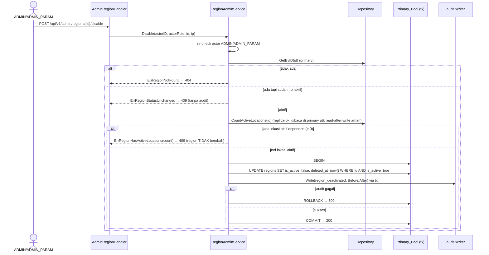

# Design Document — Region Management (Manajemen Region)

## Overview

Region Management menambahkan CRUD terkontrol untuk tabel master-data **`regions`** pada backend ATM (`backend/`, port 8080) dan sebuah kartu baru **"Manajemen Region"** di tab **"Data master"** halaman Pengaturan (`/settings`) pada `CompanyPortal-Vite`. Region adalah entitas master yang sudah ada (13 baris ter-seed) dan menjadi acuan `locations.region_id`, yang mengalir ke filter ATM portal, pilihan lokasi pada Manajemen ATM, serta konteks region cabang vendor. Saat ini region hanya bisa diubah lewat akses DB langsung; fitur ini memberi tim `ADMIN`/`ADMIN_PARAM` antarmuka daftar + buat + ubah nama + nonaktif/aktif dengan penjagaan RBAC, audit, dan integritas referensial.

Fitur ini adalah kembaran struktural dari `admin-atm-management` / `admin-user-vendor-management` / `role-management`. Ia **menggunakan ulang** yang sudah ada dan tidak menyentuh stack lokasi/ATM/vendor:

- **Layering** handler → service → repository dengan narrow interface (pola `VendorAdminService` / `PermissionService`).
- **Audit** lewat `internal/audit.Writer`, ditulis **di dalam transaksi yang sama** dengan mutasi (`audit.NewWriter(tx)`), persis pola `rolemgmt.PermissionService`.
- **Flat JSON** lewat helper `writeJSON`/`writeError`/`writeValidationError`/`writeForbidden`/`writeUnauthorized`/`extractClientIP`/`parsePathID` di `internal/handler/error_response.go` (backend ATM tidak memakai envelope `pkg/response`).
- **Topologi DB** primary untuk tulis + read-after-write, replica (`dbReadPool`) untuk list/laporan — sudah di-wire di `cmd/api/main.go`.
- **Frontend** memakai `protectedRoute` + `requireRoles`, TanStack Query/Table, React Hook Form + Zod, tema Merah Sirih, ikon Lucide, dan pola kartu Settings hub (`SettingsHubPage.tsx`).

Pendekatan **backend-first**: query → repository → service → handler → wiring rute, verifikasi terhadap kontrak flat-JSON, lalu bangun layar.

### Kontrol perubahan: immediate-apply-with-audit (bukan maker-checker)

Sesuai Requirement (Asumsi A5, dikonfirmasi), perubahan region **langsung berlaku** tanpa gerbang maker-checker. Kontrol pengganti — sama seperti `role-management` — adalah **audit trail wajib dalam transaksi yang sama** dengan mutasi (kegagalan tulis audit me-rollback perubahan) plus otorisasi `ADMIN`/`ADMIN_PARAM` yang **dicek ulang di middleware DAN service layer**. Ini adalah penyimpangan sadar dari Golden Rule #3, didokumentasikan pada bagian "Documented Deviation" di bawah dan wajib dicatat di `project-context.md` saat modul di-land.

> **Catatan: `admin-atm-management` memakai maker-checker (MasterDataChangeService), region TIDAK.** Meski struktur handler/service mirip ATM, region mengikuti keputusan immediate-apply-with-audit `role-management`, karena Requirement A5 secara eksplisit meminta demikian. Konsekuensinya service region **membuka transaksinya sendiri** dan menulis lewat repository (bukan menstaging perubahan ke `MasterDataChangeService`).

### Scope boundaries

- **Termasuk:** daftar, buat, ubah nama tampilan, nonaktif/aktif region; RBAC; audit; integritas referensial terhadap `locations`; validasi; kartu + rute frontend.
- **Bukan:** perubahan `locations`/ATM/vendor; pemindahan lokasi antar-region massal; impor/ekspor CSV region (ikut "Ekspor & Impor CSV" yang ada bila diperlukan, di luar spec ini); maker-checker penuh (A5); hard-delete (A6, tidak pernah diizinkan).

### Prasyarat desain (BLOCKING) — perubahan skema

Requirement 4 (nonaktif/aktif) memerlukan kolom soft-delete yang **belum ada**. Golden Rule #7: perubahan tabel/kolom harus dicatat di `project-context.md` Sec 2 dan diterapkan, lalu dicatat kembali. Migrasi menambahkan `is_active` + `deleted_at` ke `regions`.

> **Koreksi terhadap Requirement (nomor migrasi).** Requirement (A1/A3) mengasumsikan baseline squash 2026-09-18 sehingga migrasi bebas berikutnya `003_` dan `UNIQUE(code)` belum ada. Repo **aktual** tidak dalam keadaan itu: migrasi terakhir adalah `017_vendor_package_code_split.sql`, jadi **nomor bebas berikutnya adalah `018_`**. Dan `001_baseline_schema.sql` **sudah** memiliki `ALTER TABLE regions ADD CONSTRAINT uq_regions_code UNIQUE (code)` serta trigger `trg_regions_set_updated_at` (set `updated_at` otomatis pada UPDATE). Desain ini menyelaraskan diri dengan skema aktual, bukan asumsi. Poin A2/A4/A5/A6 tetap berlaku apa adanya.

---

## Architecture

### Backend module

Mengikuti layout `internal/service` + `internal/repository` + handler di `internal/handler` (bukan modul folder-per-fitur — struktur repo aktual berlapis, seperti `atm_admin`/`vendor_admin`):

```
backend/internal/service/
  region_admin.go            # RegionAdminService — validasi, normalisasi code, re-check RBAC, audit-in-tx
backend/internal/repository/
  region_admin_repository.go # RegionAdminRepository — primary (write + read-after-write) / replica (list)
backend/internal/handler/
  admin_region_handler.go    # HTTP handler (flat JSON), mount di /api/v1/admin/regions
backend/internal/db/
  region_admin.sql.go        # query bergaya sqlc (hand-written sampai sqlc unblocked — lihat catatan)
backend/queries/
  regions_admin.sql          # sumber query sqlc
backend/migrations/
  018_regions_soft_delete.sql
```

Layering identik `PermissionService`:
- **Handler** — hanya HTTP: decode/encode flat JSON, parse path/query, resolve `AuthContext` (`middleware.GetAuthContext`) + IP (`extractClientIP`), map sentinel error → status. Tanpa logika bisnis.
- **Service (`RegionAdminService`)** — validasi (code + nama tampilan), normalisasi code (trim + uppercase), pre-check keunikan, **re-check otorisasi `ADMIN`/`ADMIN_PARAM`**, cek integritas referensial (hitung lokasi aktif dependen), dan jaminan audit-in-tx. Bergantung pada narrow interface (repo + pool) agar bisa di-fake di unit test tanpa DB.
- **Repository** — `pgxpool`-backed; write + read-after-write → primary, list → replica (`dbReadPool`).

### Middleware & RBAC (dua lapis)

1. **Route guard statis** (saat mount): `RequireAuth(tokenService)` + `RequireRoles("ADMIN", "ADMIN_PARAM")` — menolak role lain 403 (Req 5.1) dan request tanpa/berkedaluwarsa token 401 (Req 5.4) sebelum handler jalan.
2. **Re-check di service** (Req 5.2): `RegionAdminService` menerima `actorRole` dari `AuthContext.Role` dan memverifikasi `ADMIN`/`ADMIN_PARAM` (case-insensitive, konvensi `RequireRoles`) sebelum operasi tulis. Jika tidak memenuhi → `ErrNotAuthorized` (403), transaksi tidak pernah dibuka (rollback penuh secara vacuous).

Frontend (Req 5.3): kartu "Manajemen Region" disembunyikan untuk role di luar `ADMIN`/`ADMIN_PARAM`; rute `/settings/admin/regions` `beforeLoad: requireRoles(["ADMIN","ADMIN_PARAM"])` → `<Forbidden />` untuk yang tak berwenang.

### Data flow (topologi)

```
Tulis (create / update nama / disable / enable)     → Primary_Pool (dbPool), dalam satu tx
Read-after-write (kembalikan baris yang baru ditulis) → Primary_Pool
List + hitung lokasi dependen (laporan)             → Replica_Pool (dbReadPool)
Pre-check keunikan code (FindByCode)                → Primary_Pool (read-after-write-safe)
```

> `dbReadPool` sudah di-wire di `main.go` (default menunjuk `dbPool` bila `DATABASE_REPLICA_URL` kosong). Repository mengekspos konstruktor `NewRegionAdminRepository(primary, replica db.DBTX)` — pola `rolemgmt.NewRepository`.

### Request flow (create region, representatif)

```mermaid
sequenceDiagram
    actor U as ADMIN/ADMIN_PARAM
    participant FE as RegionFormDialog (RHF+Zod)
    participant MW as RequireAuth + RequireRoles
    participant H as AdminRegionHandler
    participant S as RegionAdminService
    participant DB as Primary_Pool (tx)
    participant A as audit.Writer

    U->>FE: isi code + nama, submit
    FE->>FE: validasi Zod (klien)
    FE->>MW: POST /api/v1/admin/regions
    MW->>MW: validasi JWT; role ∈ {ADMIN,ADMIN_PARAM}?
    alt bukan ADMIN/ADMIN_PARAM
        MW-->>FE: 403 forbidden (handler tidak jalan)
    else diizinkan
        MW->>H: teruskan (AuthContext)
        H->>S: Create(actorID, actorRole, {code, region}, ip)
        S->>S: re-check actor ADMIN/ADMIN_PARAM (Req 5.2)
        S->>S: normalisasi code (trim+UPPER); validasi code & nama
        S->>DB: FindByCode(codeNorm)
        alt code sudah dipakai (belum dihapus)
            S-->>H: ErrRegionCodeConflict
            H-->>FE: 409 conflict (menyebut code)
        else unik
            S->>DB: BEGIN
            S->>DB: INSERT regions (is_active=true)
            S->>A: Write(region_created, After) via tx
            alt audit gagal
                S->>DB: ROLLBACK
                S-->>H: error → 500 (region TIDAK tersimpan)
            else audit sukses
                S->>DB: COMMIT
                S-->>H: region baru
                H-->>FE: 201 {id, code, region, is_active, ...}
            end
        end
    end
```

Update-nama, disable, dan enable identik secara struktural (buka tx → mutasi via repository → `audit.NewWriter(tx).Write` → commit; audit gagal ⇒ rollback).

### Disable region (integritas referensial, representatif)



### Frontend feature

Feature baru: **`frontend/CompanyPortal-Vite/src/features/admin-regions/`**, cermin `admin-atms/`:

```
src/features/admin-regions/
  types.ts                    # AdminRegion, ListParams, ListResponse, CreateRegionPayload, UpdateRegionPayload + skema Zod
  api.ts                      # wrapper tipis di atas lib/api/client (flat JSON), base /admin/regions
  hooks.ts                    # useRegionsList, useRegion, useCreateRegion, useUpdateRegion, useDisableRegion, useEnableRegion
  useAdminRegionsUrlState.ts  # ADMIN_REGIONS_SEARCH_SCHEMA (q, page, page_size, status) — pola useAdminATMsUrlState
  index.ts                    # export AdminRegionsPage
  components/
    AdminRegionsPage.tsx
    RegionFilterBar.tsx
    RegionsTable.tsx
    RegionFormDialog.tsx
  __tests__/
src/routes/settings/admin/
  regions.tsx                 # /settings/admin/regions, requireRoles(["ADMIN","ADMIN_PARAM"]) di bawah protectedRoute
```

---

## Components and Interfaces

### Backend — `RegionAdminService` (`internal/service/region_admin.go`)

Sentinel error (di-map handler → HTTP):

```go
var (
    ErrRegionNotFound         = errors.New("region not found")            // 404
    ErrRegionCodeConflict     = errors.New("region code already exists")  // 409
    ErrRegionCodeImmutable    = errors.New("region code cannot be changed")// 400
    ErrRegionHasActiveLocations = errors.New("region still has active locations") // 409 (pesan menyertakan count)
    ErrRegionStatusUnchanged  = errors.New("region status unchanged")     // 409 (disable saat sudah nonaktif / enable saat sudah aktif)
    ErrRegionHardDeleteForbidden = errors.New("region hard delete not allowed") // 409/400 — tidak ada endpoint delete
    ErrNotAuthorized          = errors.New("actor not authorized")        // 403
)
```
> `ValidationError` (field + message, 422) sudah ada di `internal/service/atm_portal.go` — dipakai ulang untuk validasi code/nama.

Narrow interface (pola `VendorAdminRepo` + `rolemgmt.Pool`):

```go
type RegionAdminRepo interface {
    List(ctx context.Context, arg db.ListRegionsAdminParams) ([]db.ListRegionsAdminRow, error) // replica
    Count(ctx context.Context, arg db.CountRegionsAdminParams) (int64, error)                   // replica
    GetByID(ctx context.Context, id int64) (*db.GetRegionAdminByIDRow, error)                   // primary (read-after-write)
    FindByCode(ctx context.Context, code string) (*int64, error)                                // primary, pre-check unik (termasuk soft-deleted)
    CountActiveLocations(ctx context.Context, regionID int64) (int64, error)                    // integritas referensial (Req 4.2/7.2)
    // Mutasi menerima pgx.Tx agar audit ikut dalam transaksi yang sama:
    CreateTx(ctx context.Context, tx pgx.Tx, arg db.CreateRegionAdminParams) (db.Region, error)
    UpdateNameTx(ctx context.Context, tx pgx.Tx, id int64, region string) (db.Region, error)
    SetActiveTx(ctx context.Context, tx pgx.Tx, id int64, active bool) (db.Region, error)        // disable: false+deleted_at; enable: true+deleted_at NULL
}

type Pool interface { Begin(ctx context.Context) (pgx.Tx, error) } // *pgxpool.Pool
```

`RegionAdminService` struct { repo RegionAdminRepo; pool Pool }.

Metode:

| Metode | Requirement | Perilaku |
|--------|-------------|----------|
| `List(ctx, params)` | 1.1–1.8 | Replica read, paginasi + filter `q` (ILIKE code/region) + status; setiap baris membawa `is_active` (bool) + `location_count`. Read-only, no audit. |
| `Count(ctx, params)` | 1.2, 1.5 | Total hasil (0 bila tak cocok). Read-only. |
| `Get(ctx, id)` | 8.4 | Baca satu region (primary), `ErrRegionNotFound` bila absen. |
| `Create(ctx, actorID, actorRole, req, ip)` | 2.x, 5.2, 6.x | Re-check RBAC; validasi + normalisasi code; validasi nama; `FindByCode` → `ErrRegionCodeConflict`; **tx**: insert + audit `region_created` (After); commit hanya bila keduanya sukses. |
| `UpdateName(ctx, actorID, actorRole, id, req, ip)` | 3.x, 6.x | Re-check RBAC; load `before` (404 bila absen); tolak jika `code` berbeda (`ErrRegionCodeImmutable`); validasi nama; **tx**: update nama + audit `region_updated` (Before/After nama). `updated_at` di-set trigger DB. |
| `Disable(ctx, actorID, actorRole, id, ip)` | 4.1/4.2/4.5/4.7, 7.x | Re-check RBAC; load (404); jika sudah nonaktif → `ErrRegionStatusUnchanged` (tanpa audit, Req 4.7); `CountActiveLocations>0` → `ErrRegionHasActiveLocations` (Req 4.2/7.2, region tak berubah); **tx**: set `is_active=false, deleted_at=now()` + audit `region_deactivated` (Before/After status). |
| `Enable(ctx, actorID, actorRole, id, ip)` | 4.3/4.5/4.7 | Re-check RBAC; load (404); jika sudah aktif → `ErrRegionStatusUnchanged` (tanpa audit); **tx**: set `is_active=true, deleted_at=NULL` + audit `region_reactivated` (Before/After status). |

**Tidak ada** metode/endpoint delete (Req 4.4/7.1). "Hard delete tidak diizinkan" ditegakkan struktural: tidak ada rute `DELETE`, tidak ada query `DELETE FROM regions`, dan dijaga `no_hard_delete_test.go` (diperluas ke `regions`).

**Normalisasi & validasi code (Req 2.4/2.7, A2/A3):**
```go
var regionCodeRe = regexp.MustCompile(`^[A-Za-z0-9]+$`) // huruf & angka saja
func normalizeCode(raw string) string { return strings.ToUpper(strings.TrimSpace(raw)) }
```
- `code`: setelah trim, 1–20 karakter, alfanumerik; disimpan uppercase; keunikan dicek atas bentuk ternormalisasi (Req 2.2/2.4/2.7). DB `uq_regions_code` adalah sumber kebenaran akhir; pre-check `FindByCode(codeNorm)` memberi pesan per-field lebih jelas, dan unique-violation (`23505`, constraint `uq_regions_code`) di-map ke 409 untuk aman terhadap race.
- `region` (nama tampilan): wajib, 1–100 karakter setelah trim (Req 2.3/3.3). Kolom tetap `nullable` di DB (A4) — validasi wajib hanya di service, tidak mengubah nullability agar tidak bentrok baris lama.

**Audit-in-tx (Req 6.1–6.5):** setiap mutasi membuka `pgx.Tx` sendiri lalu memanggil `audit.NewWriter(tx).Write(...)` **di dalam** tx yang sama. Bila audit gagal → `tx.Rollback` → mutasi batal (tidak ada perubahan tanpa jejak). Ini pola `rolemgmt.PermissionService`, lebih kuat dari `VendorAdminService` (yang menstaging via maker-checker). Persis satu entri audit per aksi sukses (Req 6.1).

### Backend — Repository (`internal/repository/region_admin_repository.go`)

Membungkus `*db.Queries` (pola `ATMAdminRepository` + `rolemgmt.Repository`). Konstruktor `NewRegionAdminRepository(primary, replica db.DBTX)`; `db` (primary) untuk write/read-after-write/FindByCode, `dbRead` (replica) untuk `List`/`Count`. Mutasi (`*Tx`) memakai `db.New(tx)` agar berbagi transaksi dengan audit writer. `GetByID`/`FindByCode` memetakan `pgx.ErrNoRows` → `(nil, nil)`. Timestamp (`created_at/updated_at/deleted_at`) dikonversi ke `*time.Time` via `timestamptzToPtr` di boundary service, sama seperti `atm_admin`.

> `CountActiveLocations` dibaca lewat primary saat berada dalam alur disable (read-after-write-safe terhadap perubahan lokasi lain di sesi yang sama); untuk kolom `location_count` di List, dihitung lewat query list di replica (LEFT JOIN + COUNT dengan filter `locations.is_active`).

### Backend — sqlc queries (`backend/queries/regions_admin.sql`)

File query baru, gaya sqlc. Set representatif:

- `ListRegionsAdmin` — filter `q` (`ILIKE '%'||q||'%'` pada `code` OR `region`, case-insensitive), status via `sqlc.narg('status')` (`all`/`active`/`inactive` → `is_active` toggle), `LIMIT`/`OFFSET`; `LEFT JOIN locations l ON l.region_id = r.id AND l.is_active` dengan `COUNT(l.id)` sebagai `location_count` (Req 1.6), `GROUP BY r.id`. Order `code ASC, id ASC`.
- `CountRegionsAdmin` — filter sama tanpa limit/agregasi lokasi.
- `GetRegionAdminByID` — baris penuh + `location_count`.
- `CreateRegionAdmin` — INSERT `(code, region)` returning baris (`is_active` default true).
- `UpdateRegionName` — `UPDATE regions SET region=$2 WHERE id=$1` returning baris (`updated_at` di-set trigger `trg_regions_set_updated_at`).
- `SetRegionActive` — dua varian: disable `SET is_active=false, deleted_at=now() WHERE id=$1 AND is_active=true`; enable `SET is_active=true, deleted_at=NULL WHERE id=$1 AND is_active=false` — guard di WHERE menjadikan toggle idempotent-safe (0 baris kena bila status tak berubah, dicek juga di service untuk pesan 409).
- `FindRegionByCode` — `SELECT id FROM regions WHERE code=$1` (termasuk soft-deleted) untuk pre-check 409.
- `CountActiveLocationsByRegion` — `SELECT COUNT(*) FROM locations WHERE region_id=$1 AND is_active=true` (Req 4.2/7.2).

> **Catatan sqlc (preseden mapan).** `sqlc generate` terblokir bug pre-existing di migration `017` (project-context Sec 12). Ikuti preseden `internal/db/{audit,approval,role_mgmt}.sql.go`: tulis `.sql`, jalankan generate, simpan **hanya** `region_admin.sql.go` baru dan kembalikan drift file lain; bila generate tak bisa jalan, tulis tangan `internal/db/region_admin.sql.go` mengikuti gaya output sqlc persis. Follow-up memperbaiki `017` sudah dilacak spec lain.

### Backend — HTTP handler (`internal/handler/admin_region_handler.go`)

Mengikuti `AdminATMHandler`/`RoleMgmtHandler`: `Routes() chi.Router`, flat JSON, actor via `middleware.GetAuthContext`, IP via `extractClientIP`, id via `parsePathID(r,"id")`.

```
r.Get("/", h.List)                    // GET  /api/v1/admin/regions
r.Post("/", h.Create)                 // POST /api/v1/admin/regions
r.Get("/{id}", h.Get)                 // GET  /api/v1/admin/regions/{id}
r.Put("/{id}", h.UpdateName)          // PUT  /api/v1/admin/regions/{id}
r.Post("/{id}/disable", h.Disable)    // POST .../disable
r.Post("/{id}/enable", h.Enable)      // POST .../enable
```

Request body:
```jsonc
// POST /api/v1/admin/regions
{ "code": "JKT_CENTRAL", "region": "JKT-Central" }
// PUT /api/v1/admin/regions/{id}   (code opsional; jika beda dari tersimpan -> 400 immutable)
{ "code": "JKT_CENTRAL", "region": "Jakarta Pusat" }
```
> Seperti `UpdateATMRequest.TerminalID`, `code` pada PUT diterima **hanya** agar upaya mengubahnya bisa dideteksi & ditolak (Req 3.2); `nil`/tidak dikirim = perlakukan sama dengan mengirim ulang nilai sekarang.

Respons list (flat JSON, Req 8.5):
```jsonc
{
  "regions": [
    { "id": 1, "code": "JKT_CENTRAL", "region": "JKT-Central",
      "is_active": true, "location_count": 12,
      "created_at": "2026-01-02T03:04:05Z", "updated_at": "...", "deleted_at": null }
  ],
  "page": 1, "page_size": 20, "total": 13
}
```

#### Error → HTTP mapping (flat JSON, pola `handleATMAdminError`)

| Kondisi | Status | Helper / code |
|---|---|---|
| Token hilang/invalid/kedaluwarsa (Req 5.4) | 401 | middleware / `writeUnauthorized` |
| Role bukan ADMIN/ADMIN_PARAM (Req 5.1) | 403 | middleware / `writeForbidden` |
| Re-check RBAC service gagal (Req 5.2) → `ErrNotAuthorized` | 403 | `writeForbidden` |
| Validasi field (code/nama: kosong/format/panjang) → `ValidationError` | 422 | `writeValidationError` (menyebut field) |
| Query/path param buruk; ubah `code` (`ErrRegionCodeImmutable`) | 400 | `writeError(...,"bad_request",...)` |
| `code` duplikat (`ErrRegionCodeConflict`) | 409 | `writeError(...,"conflict",...)` (menyebut code) |
| Region punya lokasi aktif (`ErrRegionHasActiveLocations`) | 409 | `writeError(...,"conflict",...)` (menyebut jumlah) |
| Status tak berubah (`ErrRegionStatusUnchanged`) | 409 | `writeError(...,"conflict",...)` |
| Region tak ditemukan (`ErrRegionNotFound`) | 404 | `writeError(...,"not_found",...)` |
| Kegagalan DB/audit | 500 | `writeError(...,"internal_error",...)` |

> Requirement 8.2/8.3 menyebut "bad request" untuk nama kosong/kelebihan; codebase memakai **422** (`writeValidationError`) untuk validasi field dan **400** (`bad_request`) untuk param/immutable. Desain memakai konvensi codebase yang ada (422 untuk field, 400 untuk immutable/param) demi konsistensi dengan handler admin lain; keduanya sama-sama "penolakan sebelum mutasi" yang dimaksud requirement.

### Route wiring — `cmd/api/main.go`

Disandingkan dengan blok master-data admin (`ADMIN`/`ADMIN_PARAM`), memakai `masterDataAdmin` group yang sudah ada:
```go
regionAdminRepo := repository.NewRegionAdminRepository(dbPool, dbReadPool)
regionAdminSvc  := service.NewRegionAdminService(regionAdminRepo, dbPool)
adminRegionHandler := handler.NewAdminRegionHandler(regionAdminSvc)
masterDataAdmin.Mount("/api/v1/admin/regions", adminRegionHandler.Routes())
```
(`masterDataAdmin` = grup ber-`RequireAuth(tokenService)` + `RequireRoles("ADMIN","ADMIN_PARAM")`, sama seperti mount `admin/vendors` & `admin/atms`.)

### Frontend — feature `admin-regions`

`types.ts` — entitas + Zod (pola `admin-atms`):
```ts
export interface AdminRegion {
  id: number; code: string; region: string;
  is_active: boolean; location_count: number;
  created_at: string; updated_at: string; deleted_at: string | null;
}
export const createRegionSchema = z.object({
  code: z.string().trim().min(1, "Kode wajib diisi").max(20, "Maksimal 20 karakter")
    .regex(/^[A-Za-z0-9]+$/, "Hanya huruf dan angka"),
  region: z.string().trim().min(1, "Nama wajib diisi").max(100, "Maksimal 100 karakter"),
});
export const updateRegionSchema = z.object({
  region: z.string().trim().min(1, "Nama wajib diisi").max(100, "Maksimal 100 karakter"),
}); // code disabled di mode edit (immutable, Req 3.2)
```

`api.ts` — client tipis flat JSON, base `/admin/regions`: `list(params)`, `get(id)`, `create(payload)`, `updateName(id, payload)`, `disable(id)`, `enable(id)`.

`hooks.ts` — TanStack Query v5 (pola `admin-atms`): `useRegionsList` dengan `placeholderData: keepPreviousData`; mutasi meng-invalidate key list dan memunculkan `Toast`. Key ternamespace: `adminRegionsKeys.list(params)`, `.detail(id)`.

`useAdminRegionsUrlState.ts` — `ADMIN_REGIONS_SEARCH_SCHEMA` (Zod) untuk `q`, `page`, `page_size`, `status`; setiap perubahan filter mereset `page` ke 1 dan round-trip lewat URL search params (pola `useAdminATMsUrlState`).

`components/`:
- `AdminRegionsPage.tsx` — `PageHeader` (eyebrow "Pengaturan", title "Manajemen Region", satu aksi primer "Tambah Region") + `RegionFilterBar` + `RegionsTable` + `RegionFormDialog`.
- `RegionFilterBar.tsx` — input pencarian (1–100 char) + filter status (Semua/Aktif/Nonaktif).
- `RegionsTable.tsx` — TanStack Table: kolom Code (`tabular-nums`/mono), Nama, Jumlah Lokasi (`tabular-nums`, kanan), Status (Badge ikon+label — CheckCircle "Aktif" / Ban "Nonaktif", bukan warna saja), aksi (Ubah, Nonaktif/Aktif). Row hover `--red-50`.
- `RegionFormDialog.tsx` — RHF + `zodResolver`; create pakai `createRegionSchema`, edit pakai `updateRegionSchema` dengan field Code disabled. Server 409/422/400 di-map ke error field via `setError` (409 → `code`, immutable → `code`, validasi → field terkait), dialog tetap terbuka. Konfirmasi disable menampilkan pesan bila diblokir lokasi aktif (dari body error 409).

Routing (`src/routes/settings/admin/regions.tsx`, pola `atms.tsx`):
```tsx
export const adminRegionsRoute = createRoute({
  path: "/settings/admin/regions",
  getParentRoute: () => protectedRoute,
  validateSearch: ADMIN_REGIONS_SEARCH_SCHEMA,
  beforeLoad: requireRoles(["ADMIN", "ADMIN_PARAM"]),
  component: AdminRegionsRouteComponent,
});
// forbidden -> <Forbidden />
```

Menu placement — kartu di **Settings hub** (`SettingsHubPage.tsx`, tab "Data master"), bukan `NAV_CONFIG` top-level (pola "Manajemen ATM"):
```ts
{ id: "admin-regions", title: "Manajemen Region",
  description: "Kelola region dan status aktifnya.",
  href: "/settings/admin/regions", icon: Map, category: "master" }
```
Kartu tampil hanya saat `showMaster` (role master-data) — konsisten dengan filter `MASTER_DATA_CARDS`.

### Design tokens (Merah Sirih, internal)

Merah ≤10%: hanya tombol primer ("Tambah Region"/"Simpan"), focus halo (`box-shadow 0 0 0 3px var(--red-100)`, border `--red-400`), dan row hover `--red-50`. Header tabel uppercase `--n-500`, divider `--n-100`. Status & error **selalu ikon + teks** (Req 1.8/8.7), tak pernah warna saja. Kolom Code & Jumlah Lokasi `tabular-nums`. Tanpa side-stripe border > 1px, tanpa gradient text (design.md Sec 10 bans).

---

## Data Models

### Perubahan tabel `regions` (migrasi `018_regions_soft_delete.sql`)

Skema `regions` **saat ini** (`001_baseline_schema.sql`): `id bigint IDENTITY PK`, `code text NOT NULL` + `uq_regions_code UNIQUE (code)`, `region text` (nullable), `created_at timestamptz NOT NULL default now()`, `updated_at timestamptz NOT NULL default now()`, trigger `trg_regions_set_updated_at` (auto-set `updated_at` saat UPDATE). FK dependen: `locations.region_id → regions(id)` (`fk_locations_region`).

Migrasi aditif menambahkan dua kolom soft-delete (pola `004_vendor_packages_soft_disable.sql`):

```sql
-- 018_regions_soft_delete.sql
-- regions: add soft-disable columns so a region can be deactivated through
-- the immediate-apply-with-audit admin flow (Region Management, Req 4), same
-- convention as vendor_packages/vendor_branches (is_active + deleted_at,
-- never a hard DELETE). uq_regions_code + trg_regions_set_updated_at already
-- exist in the baseline.
--
-- SAFETY:
--   * Additive. is_active NOT NULL DEFAULT true backfills all 13 existing
--     regions as active; deleted_at is nullable.
--   * Forward-only: no down migration (project convention).
BEGIN;

ALTER TABLE public.regions
    ADD COLUMN is_active boolean NOT NULL DEFAULT true,
    ADD COLUMN deleted_at timestamp with time zone;

COMMENT ON COLUMN public.regions.deleted_at IS
  'Soft-disable timestamp (set with is_active=false). Never hard-delete: locations.region_id references this table.';

COMMIT;
```

> `uq_regions_code` (A3) dan trigger `updated_at` sudah ada — **tidak** perlu ditambah. Keunikan bersifat exact-match di DB; normalisasi case-insensitive (uppercase) dilakukan di service sebelum insert/pre-check, sehingga `jkt_central` dan `JKT_CENTRAL` berbenturan lewat penyimpanan-uppercase (bukan lewat index fungsional). Ini menghindari migrasi index tambahan dan cukup untuk 13 baris.

Catatan `project-context.md` Sec 2 (Master group): `regions` mendapat `+ is_active boolean NOT NULL DEFAULT true, + deleted_at timestamptz NULL` (migrasi 018) — dicatat setelah diterapkan (development stage schema-mutable, Sec 0a).

### Go structs (gaya sqlc `models.go`)

```go
// internal/db/models.go — kolom baru ditambahkan ke Region
type Region struct {
    ID        int64
    Code      string
    Region    *string            // nullable (A4)
    CreatedAt pgtype.Timestamptz
    UpdatedAt pgtype.Timestamptz
    IsActive  bool               // 018
    DeletedAt pgtype.Timestamptz // 018
}
```

Domain struct service (money-free; timestamp sebagai `*time.Time` via `timestamptzToPtr`):
```go
type Region struct {
    ID           int64
    Code         string
    RegionName   string   // nama tampilan; kosong dianggap invalid di validasi
    IsActive     bool
    LocationCount int64
    CreatedAt, UpdatedAt, DeletedAt *time.Time
}
```

---

## Correctness Properties

*A property is a characteristic or behavior that should hold true across all valid executions of the system — a formal, machine-verifiable statement about what the system should do.*

### Property 1: Code disimpan ternormalisasi dan unik
For any region-creation request with a valid code, the persisted `code` equals the uppercase, edge-trimmed form of the submitted code; and for any create whose normalized code already belongs to an existing (non-hard-deleted) region, the system rejects the request and creates no new row.

**Validates: Requirements 2.1, 2.2, 2.7**

### Property 2: Validasi code dan nama menolak input tak valid tanpa mutasi
For any create-or-update request whose display name is empty/whitespace-only or exceeds 100 characters, or whose code (on create) is empty/whitespace-only, exceeds 20 characters, or contains a non-alphanumeric character, the system rejects the request and persists no change.

**Validates: Requirements 2.3, 2.4, 3.3, 8.2, 8.3**

### Property 3: Code immutable pada update
For any update request whose supplied code differs from the stored region's code, the system rejects the request and leaves the stored region unchanged; a name-only update never alters `code`.

**Validates: Requirements 3.1, 3.2**

### Property 4: Setiap mutasi punya tepat satu jejak audit, atau tidak terjadi
For any successful create/update-name/deactivate/reactivate on a region, exactly one `audit_logs` row exists recording actor, action, before, after, UTC time, and IP; and for any such operation whose audit write fails, the region mutation is rolled back so no state change persists.

**Validates: Requirements 2.5, 2.6, 3.5, 3.6, 4.5, 4.6, 6.1, 6.2, 6.3, 6.4, 6.5**

### Property 5: Nonaktif diblokir saat ada lokasi aktif dependen
For any active region referenced by at least one active location, a deactivation request is rejected with a count of dependent active locations, and the region remains active (`is_active=true`, `deleted_at` null) with all `locations.region_id` values unchanged.

**Validates: Requirements 4.2, 7.2, 7.3**

### Property 6: Disable/enable adalah round-trip soft-delete yang idempotent-guarded
For any active region with no active dependent locations, deactivating then reactivating it returns it to `is_active=true` with `deleted_at` null; deactivating an already-inactive region (or activating an already-active one) is rejected as a no-op conflict and writes no audit entry.

**Validates: Requirements 4.1, 4.3, 4.7**

### Property 7: Hard-delete tidak pernah mungkin
For any region, there exists no request path that physically removes its row; every deletion attempt is rejected and the row is preserved, and no query defines `DELETE FROM regions`.

**Validates: Requirements 4.4, 7.1**

### Property 8: Otorisasi ditegakkan di service, bukan hanya middleware
For any create/update/disable/enable whose actor role is neither ADMIN nor ADMIN_PARAM, the system rejects the operation and applies no change, regardless of how the request reached the service layer.

**Validates: Requirements 5.1, 5.2, 5.4**

### Property 9: Pencarian mengembalikan hanya yang cocok, case-insensitive
For any search keyword of length 1–100, the returned regions are exactly those whose code or display name contains the keyword ignoring case, and a keyword matching nothing yields an empty list with total 0.

**Validates: Requirements 1.4, 1.5**

### Property 10: Topologi tulis/baca
For any region write (create/update/disable/enable) the operation targets the primary pool; for any read-after-write within the same flow the read targets the primary pool; and for any list/report read the operation targets the replica pool.

**Validates: Requirements 9.1, 9.2, 9.3**

---

## Error Handling

- **Validasi input** (code/nama kosong/format/panjang, body malformed) → 422 `validation_error` (field-level) atau 400 `bad_request` (param/body), pesan Bahasa Indonesia via `ValidationError`.
- **Code duplikat** → 409 `conflict` (pre-check `FindByCode` + fallback unique-violation `23505` pada `uq_regions_code`), pesan menyebut nilai code.
- **Code diubah saat update** → 400 `bad_request` (`ErrRegionCodeImmutable`).
- **Region tak ditemukan** → 404 `not_found`.
- **Lokasi aktif dependen** (disable) → 409 `conflict` (`ErrRegionHasActiveLocations`), pesan menyertakan jumlah.
- **Status tak berubah** (disable saat sudah nonaktif / enable saat sudah aktif) → 409 `conflict` (`ErrRegionStatusUnchanged`), tanpa menulis audit.
- **Otorisasi**: route guard gagal → 403/401 (middleware); re-check service gagal → `ErrNotAuthorized` → 403.
- **Audit-write gagal** (Req 6.5) → transaksi rollback → 500; region tidak berubah (tidak ada state tanpa jejak).
- **Kegagalan tak terduga** → 500 `internal_error` (pesan generik, detail ke `slog`, tidak bocor ke klien).
- **Atomicity** (Req 8.6/9.5): setiap operasi berjalan dalam satu transaksi; galat validasi/konflik/not-found menolak sebelum tx dibuka; galat di dalam tx me-rollback penuh — tidak ada penulisan parsial.
- **Frontend**: `ApiError` di-surface via `Toast`/`StatusMessage` + `setError` per field (Req 8.7 — ikon + teks di dekat field, bukan warna saja); Zod menahan input tak valid sebelum call backend.

---

## Documented Deviation — Golden Rule #3 (maker-checker)

Golden Rule #3 mensyaratkan create/update/delete pada master data melewati `approval_requests`. Untuk fitur ini pengguna **secara eksplisit memilih immediate-apply (audit-only)** — Requirement (Asumsi A5), sama seperti `role-management`. Konsekuensi desain:
- **Tidak** memanggil `approval.Orchestrator`/`MasterDataChangeService`, **tidak** membuat `approval_requests`. Perubahan berlaku seketika.
- Kontrol pengganti: (a) audit trail lengkap **dalam transaksi yang sama** dengan perubahan (Req 6), (b) otorisasi ketat `ADMIN`/`ADMIN_PARAM` di middleware **dan** service (Req 5).
- Penyimpangan ini dicatat di sini (Req 5/6) dan wajib dicatat di `project-context.md` saat modul di-land, agar tidak disalahartikan sebagai kelalaian.

---

## Testing Strategy

Target: ≥80% pada paket `internal/*` terkait (project-context Sec 7). PBT dipakai untuk logika murni yang bervariasi dengan input (normalisasi/validasi code, invarian audit-or-rollback, round-trip disable/enable, filter pencarian) dan integration/example untuk I/O DB + routing RBAC.

**Go — service (`region_admin_test.go`), table-driven + fake repo + fake pool/tx:**
- `Create`: sukses (code ternormalisasi uppercase + audit `region_created` ditulis); code duplikat → `ErrRegionCodeConflict`; code kosong/format/panjang & nama kosong/panjang → `ValidationError`; actor bukan ADMIN/ADMIN_PARAM → `ErrNotAuthorized`; **audit gagal → error, insert tidak commit** (fake tx yang menandai commit/rollback).
- `UpdateName`: sukses (audit before/after nama); code berbeda → `ErrRegionCodeImmutable`; nama invalid → `ValidationError`; id absen → `ErrRegionNotFound`; audit gagal → rollback.
- `Disable`: sukses saat 0 lokasi aktif; `CountActiveLocations>0` → `ErrRegionHasActiveLocations` (region tak berubah, tanpa audit); sudah nonaktif → `ErrRegionStatusUnchanged` (tanpa audit); audit gagal → rollback.
- `Enable`: sukses; sudah aktif → `ErrRegionStatusUnchanged`; audit gagal → rollback.
- Matriks otorisasi: ADMIN ✓, ADMIN_PARAM ✓, APPACCESS/ATM-USER/VENDOR ✗ (403).

**Go — property-based (`region_admin_property_test.go`), pakai library PBT Go yang ada di repo (mis. `pgregory.net/rapid` bila sudah dipakai; jika tidak, `testing/quick`), min. 100 iterasi/property, tag `Feature: region-management, Property N: ...`:**
- Property 1 — untuk sembarang code valid acak, `normalizeCode` menghasilkan uppercase+trim; dan code yang benturan (beda kapitalisasi/spasi tepi) selalu ditolak pre-check.
- Property 2 — untuk sembarang nama/kode acak, validasi menolak tepat saat melanggar batasan panjang/format.
- Property 4 — untuk sembarang urutan mutasi sukses/gagal-audit terhadap fake tx, jumlah baris audit = jumlah mutasi sukses, dan setiap kegagalan audit meninggalkan state tak berubah (rollback dipanggil, commit tidak).
- Property 6 — untuk sembarang region aktif tanpa lokasi aktif, disable→enable mengembalikan `is_active=true, deleted_at=null` (round-trip).
- Property 9 — untuk sembarang dataset + keyword, hasil filter = subset yang mengandung keyword case-insensitive pada code/nama (model-based lawan filter naif Go).

**Go — repository (`region_admin_repository_test.go`, real Postgres, `//go:build integration`):** create→get roundtrip; matriks filter list (`q`, status) + `location_count` benar; paginasi count vs jumlah per-halaman; `uq_regions_code` violation muncul; `SetRegionActive` men-toggle `is_active`+`deleted_at`; `CountActiveLocationsByRegion` menghitung hanya lokasi aktif; read-after-write pakai primary, list pakai replica (saat replica di-wire). Digerbang seperti `audit_log_repository_test.go` (mungkin tak jalan bila `DATABASE_URL` tak terjangkau — dicatat).

**Go — handler (`admin_region_handler_test.go`, `httptest` + real `RequireAuth`/`RequireRoles` + fake service):** 200/201 happy path + bentuk flat JSON (termasuk `is_active` bool + `location_count`); mapping 400/404/409/422; 401 tanpa token, 403 role salah (pola `admin_approval_handler_test.go`/`audit_log_handler_rbac_test.go`).

**Go — `no_hard_delete_test.go`:** perluas daftar `tables` untuk menyertakan `regions` (Req 4.4/7.1) — memastikan tak ada `DELETE FROM regions` di `queries/*.sql`.

**Frontend (Vitest + RTL, `__tests__/`):** `requireRoles` allow/deny/redirect (pola `atms`); skema Zod (code required+format+max20 immutable-in-edit, nama required+max100); form memetakan 409/422/400 server ke error field & dialog tetap terbuka; perubahan filter mereset ke page 1 dan round-trip via URL; tabel merender Status sebagai badge ikon+label; kolom Code & Jumlah Lokasi `tabular-nums`; kartu "Manajemen Region" tampil untuk ADMIN/ADMIN_PARAM dan tersembunyi untuk role lain (`SettingsHubPage.test.tsx` diperluas). Network di-mock.

---

## Definition of Done (project-context Sec 11)

- [ ] Sesuai peta modul/tabel — `regions` kanonik; migrasi `018` aditif (`is_active`+`deleted_at`) dicatat di `project-context.md` Sec 2
- [ ] Auth path benar + RBAC ter-scope di middleware **dan** service (`ADMIN`/`ADMIN_PARAM`)
- [ ] Audit ditulis untuk setiap create/update/disable/enable, **dalam transaksi yang sama**; tidak ada maker-checker (deviasi terdokumentasi, A5)
- [ ] Tulis di primary; read-after-write di primary; list di replica (`dbReadPool`)
- [ ] Tidak ada uang; timestamp `timestamptz` UTC, ditampilkan Asia/Jakarta
- [ ] Tidak ada hard delete region (guard `no_hard_delete_test.go` diperluas ke `regions`)
- [ ] Integritas referensial: disable diblokir saat ada lokasi aktif; FK `locations.region_id` tak tersentuh
- [ ] Tes hijau termasuk penolakan RBAC (401/403), validasi, konflik code (409), blok lokasi aktif (409), audit-once/rollback, property tests
- [ ] Tidak ada rahasia/config hardcoded; `.env.example` tak berubah (tak ada config baru)
- [ ] Backend ATM tetap flat JSON
- [ ] Build bersih (`go build ./...`, `sqlc generate` atau ekuivalen hand-written, `pnpm build`)
