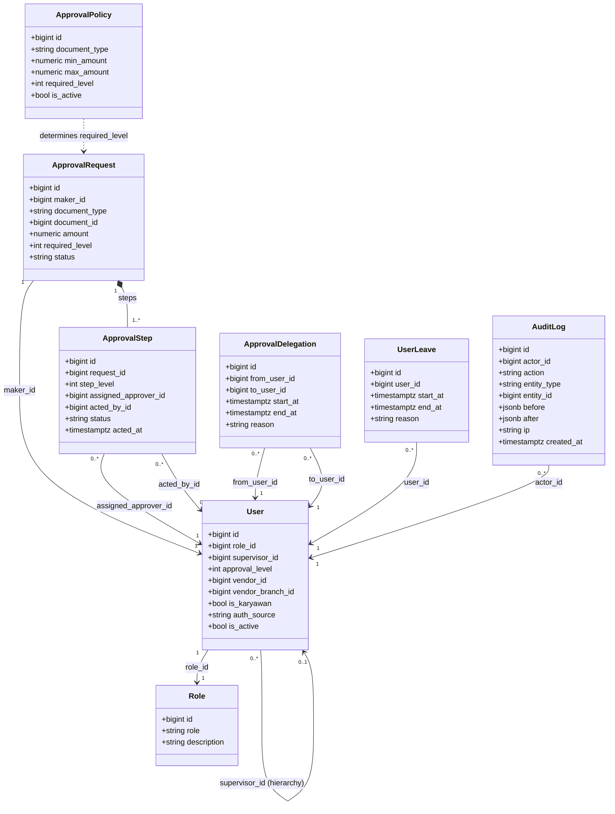
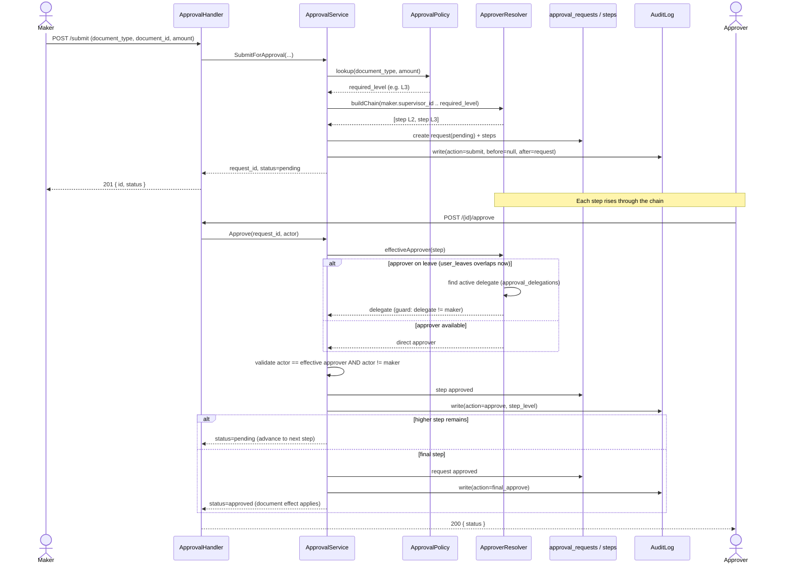
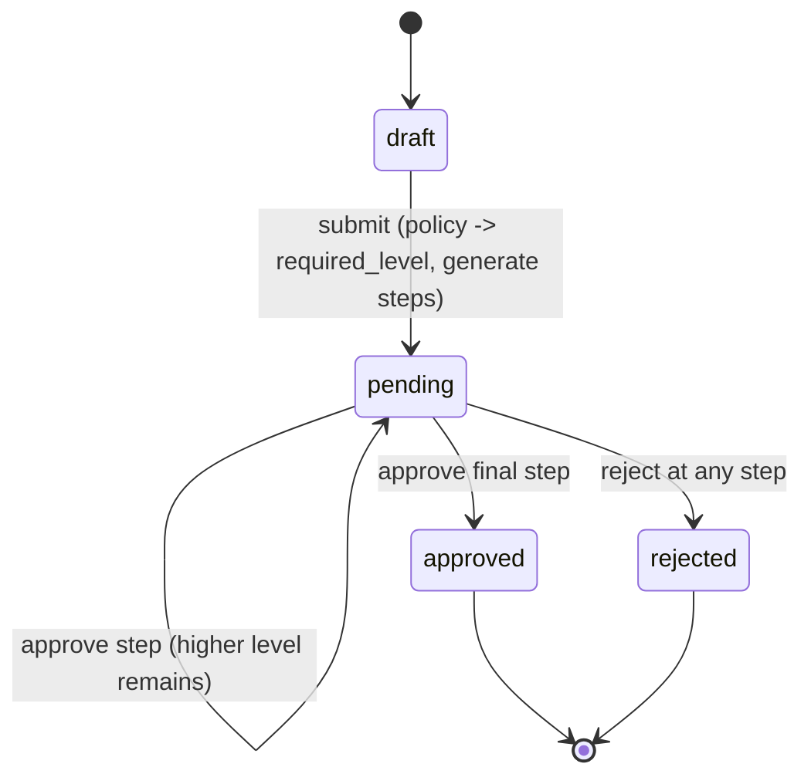

# RBAC Design — Hierarki & Multi-Layer Approval (Internal)

> UML diagrams (Mermaid, mermaid.live compatible) for the RBAC + hierarchy + maker-checker approval design.
> Source spec: `.kiro/specs/RBAC-Setup/task.md`. Scope: internal CIMB first (vendor later).

## Design Principles

- **Role vs Hierarchy are separate concerns.** `Role` = capability (what a user may do). `supervisor_id` + `approval_level` = reporting structure (who reports to whom).
- **Pure tree hierarchy.** Each user has at most one direct supervisor (`supervisor_id`). Multi-supervisor (matrix) is out of scope.
- **Threshold-driven levels.** `approval_policies` maps `(document_type, amount range) -> required_level`, admin-configurable.
- **Block-leave fallback.** An approver on leave (`user_leaves` overlapping now) is routed to an active delegate (`approval_delegations`), guarded by `delegate != maker`.
- **Non-negotiable.** maker != checker, every transition writes `audit_logs` (who/what/before/after/ip), writes go to primary, idempotent per `(document_type, document_id)`.

---

## 1. Class Diagram — RBAC, Hierarchy & Approval

---

## 2. Sequence Diagram — Multi-Layer Approval (with leave fallback)

---

## 3. State Diagram — ApprovalRequest Lifecycle

